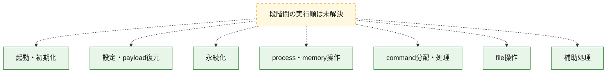
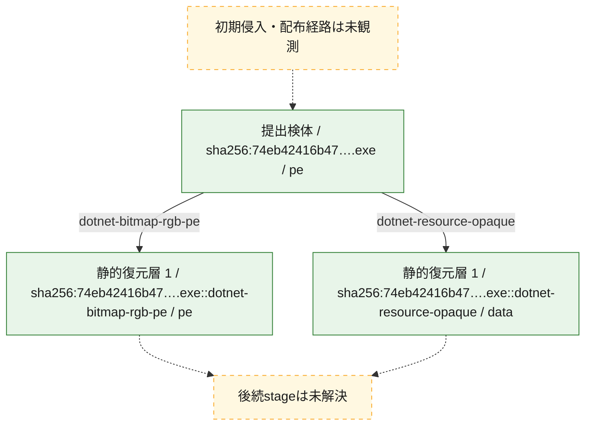
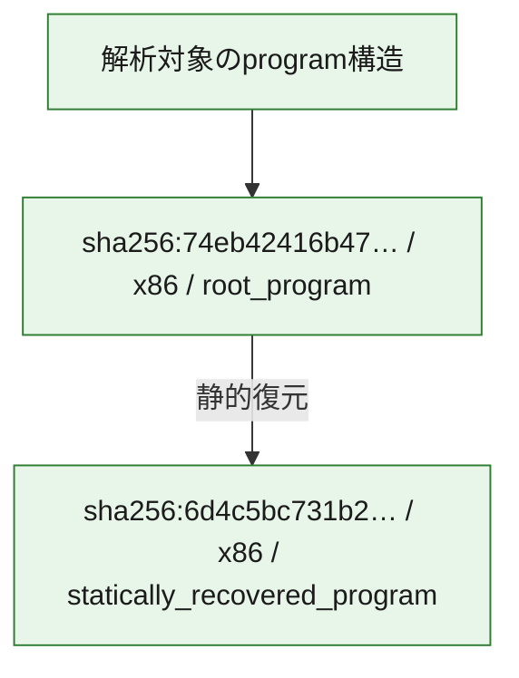

# 全体ロジック：74eb42416b47c082fc867764b577ceac6f1bd68e192695d79a9e48a7bd3fdd69

代表関数の静的証跡から、起動・初期化、設定・payload復元、永続化、process・memory操作、command分配・処理、file操作の処理群を確認しました。

## 読み方

- phaseの掲載順は解析上の整理順です。observed_call_edgesがない段階間の実行順を断定しません。
- 図の実線は静的に観測した関係、点線と黄色のノードは未観測・未解決の関係を示します。
- 図は静的な要約であり、動的実行を再現するものではありません。
- 詳細な関数解説とfingerprintは[STATIC-LOGIC.md](STATIC-LOGIC.md)を参照してください。

## 静的可視化

### 実行フロー

### 感染チェーン

### モジュール関係

## 処理段階

### 1. 起動・初期化

entry pointから初期化と後続処理への移行を確認します。
確度: `confirmed_static_function_evidence`

- `74eb42416b47c082fc867764b577ceac6f1bd68e192695d79a9e48a7bd3fdd69:cil:0x06000001` — 初期化と主要処理への分岐を行う入口関数です。 状態: `succeeded`、選定理由: `entry_point`, `reviewed_call_centrality:8`

### 2. 設定・payload復元

設定、resource、payload、暗号化データの復元・変換を確認します。
確度: `confirmed_static_function_evidence`

- `6d4c5bc731b2e23fa90f0d8e916c17f57c4bf3d38278b1d02bb560cb19b85091:cil:0x0600000e` — 暗号、hash、encoding、または復号処理に関係する関数です。 状態: `succeeded`、選定理由: `large_function:instructions=125`, `reviewed_call_centrality:6`, `role:cryptographic_transform`
- `6d4c5bc731b2e23fa90f0d8e916c17f57c4bf3d38278b1d02bb560cb19b85091:cil:0x06000010` — 設定、resource、payloadなどの解析・変換を行う関数です。 状態: `succeeded`、選定理由: `reviewed_call_centrality:10`, `role:config_or_data_transform`
- `6d4c5bc731b2e23fa90f0d8e916c17f57c4bf3d38278b1d02bb560cb19b85091:cil:0x06000013` — 暗号、hash、encoding、または復号処理に関係する関数です。 状態: `succeeded`、選定理由: `large_function:instructions=133`, `reviewed_call_centrality:10`, `role:cryptographic_transform`
- `6d4c5bc731b2e23fa90f0d8e916c17f57c4bf3d38278b1d02bb560cb19b85091:cil:0x06000023` — 暗号、hash、encoding、または復号処理に関係する関数です。 状態: `succeeded`、選定理由: `large_function:instructions=137`, `reviewed_call_centrality:18`, `role:cryptographic_transform`
- `6d4c5bc731b2e23fa90f0d8e916c17f57c4bf3d38278b1d02bb560cb19b85091:cil:0x06000025` — 暗号、hash、encoding、または復号処理に関係する関数です。 状態: `succeeded`、選定理由: `large_function:instructions=101`, `reviewed_call_centrality:16`, `role:cryptographic_transform`
- `6d4c5bc731b2e23fa90f0d8e916c17f57c4bf3d38278b1d02bb560cb19b85091:cil:0x06000026` — 暗号、hash、encoding、または復号処理に関係する関数です。 状態: `succeeded`、選定理由: `large_function:instructions=173`, `reviewed_call_centrality:12`, `role:cryptographic_transform`
- `6d4c5bc731b2e23fa90f0d8e916c17f57c4bf3d38278b1d02bb560cb19b85091:cil:0x06000050` — 暗号、hash、encoding、または復号処理に関係する関数です。 状態: `succeeded`、選定理由: `large_function:instructions=96`, `reviewed_call_centrality:4`, `role:cryptographic_transform`
- `6d4c5bc731b2e23fa90f0d8e916c17f57c4bf3d38278b1d02bb560cb19b85091:cil:0x06000054` — 暗号、hash、encoding、または復号処理に関係する関数です。 状態: `succeeded`、選定理由: `large_function:instructions=117`, `reviewed_call_centrality:4`, `role:cryptographic_transform`
- `6d4c5bc731b2e23fa90f0d8e916c17f57c4bf3d38278b1d02bb560cb19b85091:cil:0x0600005d` — 暗号、hash、encoding、または復号処理に関係する関数です。 状態: `succeeded`、選定理由: `large_function:instructions=85`, `reviewed_call_centrality:4`, `role:cryptographic_transform`
- `6d4c5bc731b2e23fa90f0d8e916c17f57c4bf3d38278b1d02bb560cb19b85091:cil:0x06000065` — 暗号、hash、encoding、または復号処理に関係する関数です。 状態: `succeeded`、選定理由: `large_function:instructions=95`, `reviewed_call_centrality:4`, `role:cryptographic_transform`
- `6d4c5bc731b2e23fa90f0d8e916c17f57c4bf3d38278b1d02bb560cb19b85091:cil:0x06000070` — 暗号、hash、encoding、または復号処理に関係する関数です。 状態: `succeeded`、選定理由: `large_function:instructions=108`, `reviewed_call_centrality:4`, `role:cryptographic_transform`
- `6d4c5bc731b2e23fa90f0d8e916c17f57c4bf3d38278b1d02bb560cb19b85091:cil:0x06000071` — 暗号、hash、encoding、または復号処理に関係する関数です。 状態: `succeeded`、選定理由: `large_function:instructions=97`, `reviewed_call_centrality:4`, `role:cryptographic_transform`
- `6d4c5bc731b2e23fa90f0d8e916c17f57c4bf3d38278b1d02bb560cb19b85091:cil:0x06000072` — 暗号、hash、encoding、または復号処理に関係する関数です。 状態: `succeeded`、選定理由: `large_function:instructions=83`, `reviewed_call_centrality:4`, `role:cryptographic_transform`
- `6d4c5bc731b2e23fa90f0d8e916c17f57c4bf3d38278b1d02bb560cb19b85091:cil:0x0600007a` — 暗号、hash、encoding、または復号処理に関係する関数です。 状態: `succeeded`、選定理由: `large_function:instructions=131`, `reviewed_call_centrality:8`, `role:cryptographic_transform`
- `6d4c5bc731b2e23fa90f0d8e916c17f57c4bf3d38278b1d02bb560cb19b85091:cil:0x0600007b` — 暗号、hash、encoding、または復号処理に関係する関数です。 状態: `succeeded`、選定理由: `large_function:instructions=109`, `reviewed_call_centrality:2`, `role:cryptographic_transform`
- `6d4c5bc731b2e23fa90f0d8e916c17f57c4bf3d38278b1d02bb560cb19b85091:cil:0x06000082` — 暗号、hash、encoding、または復号処理に関係する関数です。 状態: `succeeded`、選定理由: `large_function:instructions=219`, `reviewed_call_centrality:6`, `role:cryptographic_transform`
- `6d4c5bc731b2e23fa90f0d8e916c17f57c4bf3d38278b1d02bb560cb19b85091:cil:0x06000086` — 暗号、hash、encoding、または復号処理に関係する関数です。 状態: `succeeded`、選定理由: `large_function:instructions=88`, `reviewed_call_centrality:4`, `role:cryptographic_transform`
- `6d4c5bc731b2e23fa90f0d8e916c17f57c4bf3d38278b1d02bb560cb19b85091:cil:0x0600008e` — 暗号、hash、encoding、または復号処理に関係する関数です。 状態: `succeeded`、選定理由: `large_function:instructions=87`, `reviewed_call_centrality:4`, `role:cryptographic_transform`
- `6d4c5bc731b2e23fa90f0d8e916c17f57c4bf3d38278b1d02bb560cb19b85091:cil:0x06000094` — 暗号、hash、encoding、または復号処理に関係する関数です。 状態: `succeeded`、選定理由: `large_function:instructions=103`, `reviewed_call_centrality:4`, `role:cryptographic_transform`
- `6d4c5bc731b2e23fa90f0d8e916c17f57c4bf3d38278b1d02bb560cb19b85091:cil:0x0600009b` — 暗号、hash、encoding、または復号処理に関係する関数です。 状態: `succeeded`、選定理由: `large_function:instructions=87`, `reviewed_call_centrality:4`, `role:cryptographic_transform`
- `6d4c5bc731b2e23fa90f0d8e916c17f57c4bf3d38278b1d02bb560cb19b85091:cil:0x0600009d` — 暗号、hash、encoding、または復号処理に関係する関数です。 状態: `succeeded`、選定理由: `large_function:instructions=108`, `reviewed_call_centrality:6`, `role:cryptographic_transform`
- `6d4c5bc731b2e23fa90f0d8e916c17f57c4bf3d38278b1d02bb560cb19b85091:cil:0x060000a2` — 暗号、hash、encoding、または復号処理に関係する関数です。 状態: `succeeded`、選定理由: `large_function:instructions=89`, `reviewed_call_centrality:4`, `role:cryptographic_transform`
- `74eb42416b47c082fc867764b577ceac6f1bd68e192695d79a9e48a7bd3fdd69:cil:0x0600004e` — 設定、resource、payloadなどの解析・変換を行う関数です。 状態: `succeeded`、選定理由: `reviewed_call_centrality:2`, `role:config_or_data_transform`
- `74eb42416b47c082fc867764b577ceac6f1bd68e192695d79a9e48a7bd3fdd69:cil:0x0600004f` — 設定、resource、payloadなどの解析・変換を行う関数です。 状態: `succeeded`、選定理由: `reviewed_call_centrality:6`, `role:config_or_data_transform`
- `74eb42416b47c082fc867764b577ceac6f1bd68e192695d79a9e48a7bd3fdd69:cil:0x06000050` — 設定、resource、payloadなどの解析・変換を行う関数です。 状態: `succeeded`、選定理由: `role:config_or_data_transform`
- `74eb42416b47c082fc867764b577ceac6f1bd68e192695d79a9e48a7bd3fdd69:cil:0x06000051` — 設定、resource、payloadなどの解析・変換を行う関数です。 状態: `succeeded`、選定理由: `role:config_or_data_transform`
- `74eb42416b47c082fc867764b577ceac6f1bd68e192695d79a9e48a7bd3fdd69:cil:0x06000052` — 設定、resource、payloadなどの解析・変換を行う関数です。 状態: `succeeded`、選定理由: `reviewed_call_centrality:4`, `role:config_or_data_transform`
- `74eb42416b47c082fc867764b577ceac6f1bd68e192695d79a9e48a7bd3fdd69:cil:0x06000053` — 設定、resource、payloadなどの解析・変換を行う関数です。 状態: `succeeded`、選定理由: `reviewed_call_centrality:4`, `role:config_or_data_transform`

### 3. 永続化

自動起動や永続化に関係する設定変更を確認します。
確度: `confirmed_static_function_evidence`

- `6d4c5bc731b2e23fa90f0d8e916c17f57c4bf3d38278b1d02bb560cb19b85091:cil:0x0600000d` — 自動起動または永続化に関係する処理を含む関数です。 状態: `succeeded`、選定理由: `reviewed_call_centrality:8`, `role:persistence`

### 4. process・memory操作

process、thread、module、memory操作と実行移行を確認します。
確度: `confirmed_static_function_evidence`

- `6d4c5bc731b2e23fa90f0d8e916c17f57c4bf3d38278b1d02bb560cb19b85091:cil:0x06000032` — process、thread、module、またはmemory操作に関係する関数です。 状態: `succeeded`、選定理由: `large_function:instructions=170`, `reviewed_call_centrality:8`, `role:process_or_memory_operation`
- `74eb42416b47c082fc867764b577ceac6f1bd68e192695d79a9e48a7bd3fdd69:cil:0x06000011` — process、thread、module、またはmemory操作に関係する関数です。 状態: `succeeded`、選定理由: `reviewed_call_centrality:6`, `role:process_or_memory_operation`
- `74eb42416b47c082fc867764b577ceac6f1bd68e192695d79a9e48a7bd3fdd69:cil:0x0600001e` — process、thread、module、またはmemory操作に関係する関数です。 状態: `succeeded`、選定理由: `reviewed_call_centrality:8`, `role:process_or_memory_operation`
- `74eb42416b47c082fc867764b577ceac6f1bd68e192695d79a9e48a7bd3fdd69:cil:0x0600002e` — process、thread、module、またはmemory操作に関係する関数です。 状態: `succeeded`、選定理由: `reviewed_call_centrality:6`, `role:process_or_memory_operation`
- `74eb42416b47c082fc867764b577ceac6f1bd68e192695d79a9e48a7bd3fdd69:cil:0x06000030` — process、thread、module、またはmemory操作に関係する関数です。 状態: `succeeded`、選定理由: `large_function:instructions=116`, `reviewed_call_centrality:10`, `role:process_or_memory_operation`
- `74eb42416b47c082fc867764b577ceac6f1bd68e192695d79a9e48a7bd3fdd69:cil:0x06000036` — process、thread、module、またはmemory操作に関係する関数です。 状態: `succeeded`、選定理由: `reviewed_call_centrality:4`, `role:process_or_memory_operation`

### 5. command分配・処理

受信commandやtaskの解釈、分配、個別handlerへの移行を確認します。
確度: `confirmed_static_function_evidence`

- `6d4c5bc731b2e23fa90f0d8e916c17f57c4bf3d38278b1d02bb560cb19b85091:cil:0x06000015` — commandの解釈、分配、または個別処理を担当する関数です。 状態: `succeeded`、選定理由: `large_function:instructions=303`, `reviewed_call_centrality:58`, `role:command_dispatch_or_handler`
- `6d4c5bc731b2e23fa90f0d8e916c17f57c4bf3d38278b1d02bb560cb19b85091:cil:0x06000035` — commandの解釈、分配、または個別処理を担当する関数です。 状態: `succeeded`、選定理由: `large_function:instructions=2760`, `reviewed_call_centrality:142`, `role:command_dispatch_or_handler`
- `6d4c5bc731b2e23fa90f0d8e916c17f57c4bf3d38278b1d02bb560cb19b85091:cil:0x06000047` — commandの解釈、分配、または個別処理を担当する関数です。 状態: `succeeded`、選定理由: `large_function:instructions=3353`, `reviewed_call_centrality:118`, `role:command_dispatch_or_handler`
- `74eb42416b47c082fc867764b577ceac6f1bd68e192695d79a9e48a7bd3fdd69:cil:0x0600000c` — commandの解釈、分配、または個別処理を担当する関数です。 状態: `succeeded`、選定理由: `large_function:instructions=677`, `reviewed_call_centrality:96`, `role:command_dispatch_or_handler`
- `74eb42416b47c082fc867764b577ceac6f1bd68e192695d79a9e48a7bd3fdd69:cil:0x06000017` — commandの解釈、分配、または個別処理を担当する関数です。 状態: `succeeded`、選定理由: `large_function:instructions=424`, `reviewed_call_centrality:114`, `role:command_dispatch_or_handler`
- `74eb42416b47c082fc867764b577ceac6f1bd68e192695d79a9e48a7bd3fdd69:cil:0x06000023` — commandの解釈、分配、または個別処理を担当する関数です。 状態: `succeeded`、選定理由: `large_function:instructions=69`, `reviewed_call_centrality:22`, `role:command_dispatch_or_handler`
- `74eb42416b47c082fc867764b577ceac6f1bd68e192695d79a9e48a7bd3fdd69:cil:0x06000028` — commandの解釈、分配、または個別処理を担当する関数です。 状態: `succeeded`、選定理由: `large_function:instructions=962`, `reviewed_call_centrality:114`, `role:command_dispatch_or_handler`
- `74eb42416b47c082fc867764b577ceac6f1bd68e192695d79a9e48a7bd3fdd69:cil:0x06000034` — commandの解釈、分配、または個別処理を担当する関数です。 状態: `succeeded`、選定理由: `large_function:instructions=577`, `reviewed_call_centrality:100`, `role:command_dispatch_or_handler`
- `74eb42416b47c082fc867764b577ceac6f1bd68e192695d79a9e48a7bd3fdd69:cil:0x0600004d` — commandの解釈、分配、または個別処理を担当する関数です。 状態: `succeeded`、選定理由: `large_function:instructions=1402`, `reviewed_call_centrality:104`, `role:command_dispatch_or_handler`

### 6. file操作

fileやdirectoryの作成、読書き、削除を確認します。
確度: `confirmed_static_function_evidence`

- `6d4c5bc731b2e23fa90f0d8e916c17f57c4bf3d38278b1d02bb560cb19b85091:cil:0x0600002f` — fileまたはdirectoryの読書き・管理に関係する関数です。 状態: `succeeded`、選定理由: `large_function:instructions=215`, `reviewed_call_centrality:16`, `role:file_operation`
- `6d4c5bc731b2e23fa90f0d8e916c17f57c4bf3d38278b1d02bb560cb19b85091:cil:0x06000030` — fileまたはdirectoryの読書き・管理に関係する関数です。 状態: `succeeded`、選定理由: `large_function:instructions=125`, `reviewed_call_centrality:18`, `role:file_operation`
- `6d4c5bc731b2e23fa90f0d8e916c17f57c4bf3d38278b1d02bb560cb19b85091:cil:0x06000039` — fileまたはdirectoryの読書き・管理に関係する関数です。 状態: `succeeded`、選定理由: `reviewed_call_centrality:12`, `role:file_operation`
- `6d4c5bc731b2e23fa90f0d8e916c17f57c4bf3d38278b1d02bb560cb19b85091:cil:0x0600003a` — fileまたはdirectoryの読書き・管理に関係する関数です。 状態: `succeeded`、選定理由: `large_function:instructions=69`, `reviewed_call_centrality:12`, `role:file_operation`
- `74eb42416b47c082fc867764b577ceac6f1bd68e192695d79a9e48a7bd3fdd69:cil:0x06000022` — fileまたはdirectoryの読書き・管理に関係する関数です。 状態: `succeeded`、選定理由: `large_function:instructions=236`, `reviewed_call_centrality:44`, `role:file_operation`
- `74eb42416b47c082fc867764b577ceac6f1bd68e192695d79a9e48a7bd3fdd69:cil:0x06000024` — fileまたはdirectoryの読書き・管理に関係する関数です。 状態: `succeeded`、選定理由: `large_function:instructions=134`, `reviewed_call_centrality:28`, `role:file_operation`

### 7. 補助処理

主要処理を支える一般内部関数またはlibrary処理を確認します。
確度: `confirmed_static_function_evidence`

- `6d4c5bc731b2e23fa90f0d8e916c17f57c4bf3d38278b1d02bb560cb19b85091:cil:0x06000021` — 検体内部の一般処理を実装する関数です。 状態: `succeeded`、選定理由: `large_function:instructions=181`, `reviewed_call_centrality:24`
- `74eb42416b47c082fc867764b577ceac6f1bd68e192695d79a9e48a7bd3fdd69:cil:0x06000005` — 検体内部の一般処理を実装する関数です。 状態: `succeeded`、選定理由: `reviewed_call_centrality:22`
- `74eb42416b47c082fc867764b577ceac6f1bd68e192695d79a9e48a7bd3fdd69:cil:0x06000015` — 検体内部の一般処理を実装する関数です。 状態: `succeeded`、選定理由: `large_function:instructions=200`, `reviewed_call_centrality:24`
- `74eb42416b47c082fc867764b577ceac6f1bd68e192695d79a9e48a7bd3fdd69:cil:0x0600001c` — 検体内部の一般処理を実装する関数です。 状態: `succeeded`、選定理由: `reviewed_call_centrality:14`
- `74eb42416b47c082fc867764b577ceac6f1bd68e192695d79a9e48a7bd3fdd69:cil:0x06000026` — 検体内部の一般処理を実装する関数です。 状態: `succeeded`、選定理由: `large_function:instructions=201`, `reviewed_call_centrality:26`
- `74eb42416b47c082fc867764b577ceac6f1bd68e192695d79a9e48a7bd3fdd69:cil:0x0600002d` — 検体内部の一般処理を実装する関数です。 状態: `succeeded`、選定理由: `large_function:instructions=86`, `reviewed_call_centrality:16`
- `74eb42416b47c082fc867764b577ceac6f1bd68e192695d79a9e48a7bd3fdd69:cil:0x06000031` — 検体内部の一般処理を実装する関数です。 状態: `succeeded`、選定理由: `large_function:instructions=183`, `reviewed_call_centrality:20`
- `74eb42416b47c082fc867764b577ceac6f1bd68e192695d79a9e48a7bd3fdd69:cil:0x06000032` — 検体内部の一般処理を実装する関数です。 状態: `succeeded`、選定理由: `large_function:instructions=168`, `reviewed_call_centrality:16`
- `74eb42416b47c082fc867764b577ceac6f1bd68e192695d79a9e48a7bd3fdd69:cil:0x0600003f` — 検体内部の一般処理を実装する関数です。 状態: `succeeded`、選定理由: `large_function:instructions=143`, `reviewed_call_centrality:24`
- `74eb42416b47c082fc867764b577ceac6f1bd68e192695d79a9e48a7bd3fdd69:cil:0x06000045` — 検体内部の一般処理を実装する関数です。 状態: `succeeded`、選定理由: `large_function:instructions=148`, `reviewed_call_centrality:30`
- `74eb42416b47c082fc867764b577ceac6f1bd68e192695d79a9e48a7bd3fdd69:cil:0x06000046` — 検体内部の一般処理を実装する関数です。 状態: `succeeded`、選定理由: `large_function:instructions=123`, `reviewed_call_centrality:22`
- `74eb42416b47c082fc867764b577ceac6f1bd68e192695d79a9e48a7bd3fdd69:cil:0x0600004a` — 検体内部の一般処理を実装する関数です。 状態: `succeeded`、選定理由: `large_function:instructions=212`, `reviewed_call_centrality:28`
- `74eb42416b47c082fc867764b577ceac6f1bd68e192695d79a9e48a7bd3fdd69:cil:0x0600005e` — 検体内部の一般処理を実装する関数です。 状態: `succeeded`、選定理由: `large_function:instructions=87`, `reviewed_call_centrality:16`

## 観測したcall関係

- 代表関数間で直接解決できた呼出関係はありません。

## 解析範囲と制約

- 選定外関数は全体inventoryへ残しますが、関数本体の個別解説対象にはしていません。
- indirect call、難読化、packer、VM、壊れたcontrol flowによりcall関係が欠落する場合があります。
- 文書は静的解析に基づき、検体実行や外部通信による動的確認は行っていません。
