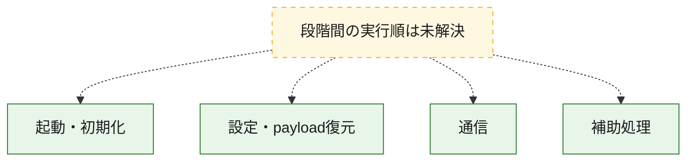
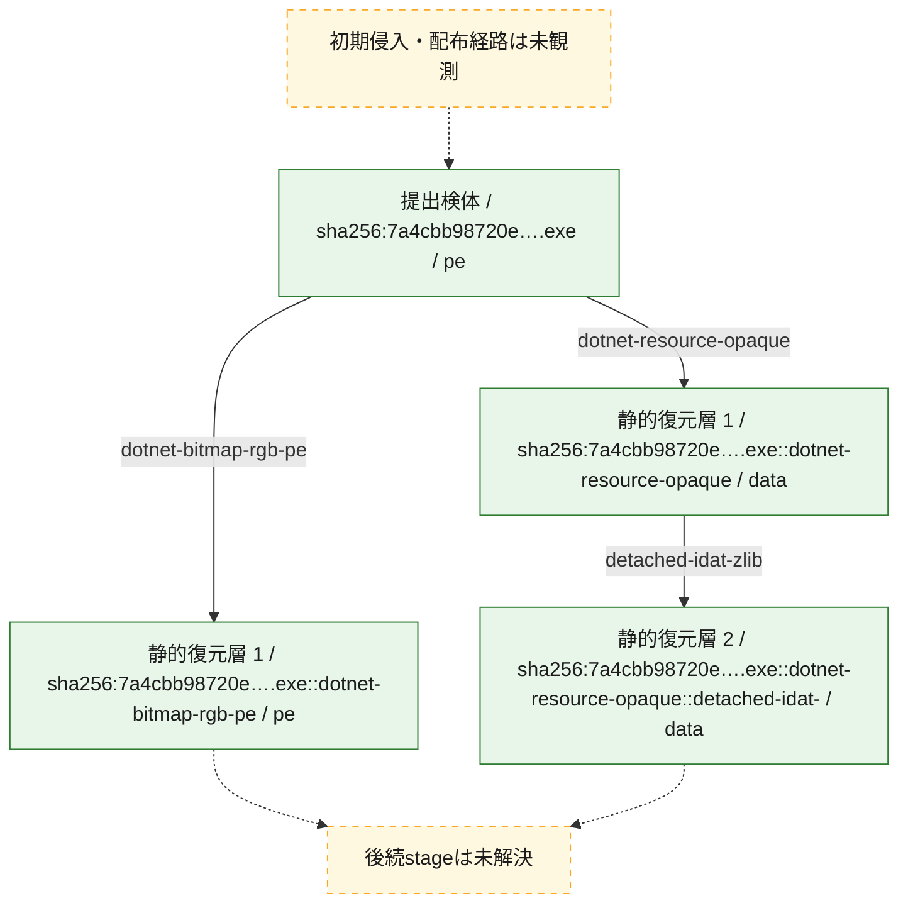
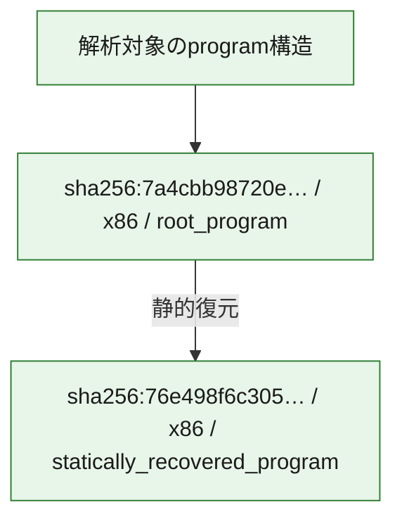

# 全体ロジック：7a4cbb98720e06eeb402f7f66229cadce7ae3173a85772adf4e0ee93ac3822eb

代表関数の静的証跡から、起動・初期化、設定・payload復元、通信の処理群を確認しました。

## 読み方

- phaseの掲載順は解析上の整理順です。observed_call_edgesがない段階間の実行順を断定しません。
- 図の実線は静的に観測した関係、点線と黄色のノードは未観測・未解決の関係を示します。
- 図は静的な要約であり、動的実行を再現するものではありません。
- 詳細な関数解説とfingerprintは[STATIC-LOGIC.md](STATIC-LOGIC.md)を参照してください。

## 静的可視化

### 実行フロー

### 感染チェーン

### モジュール関係

## 処理段階

### 1. 起動・初期化

entry pointから初期化と後続処理への移行を確認します。
確度: `confirmed_static_function_evidence`

- `7a4cbb98720e06eeb402f7f66229cadce7ae3173a85772adf4e0ee93ac3822eb:cil:0x0600000b` — 初期化と主要処理への分岐を行う入口関数です。 状態: `succeeded`、選定理由: `entry_point`, `reviewed_call_centrality:8`

### 2. 設定・payload復元

設定、resource、payload、暗号化データの復元・変換を確認します。
確度: `confirmed_static_function_evidence`

- `7a4cbb98720e06eeb402f7f66229cadce7ae3173a85772adf4e0ee93ac3822eb:cil:0x06000009` — 暗号、hash、encoding、または復号処理に関係する関数です。 状態: `succeeded`、選定理由: `reviewed_call_centrality:4`, `role:cryptographic_transform`
- `7a4cbb98720e06eeb402f7f66229cadce7ae3173a85772adf4e0ee93ac3822eb:cil:0x06000012` — 設定、resource、payloadなどの解析・変換を行う関数です。 状態: `succeeded`、選定理由: `reviewed_call_centrality:10`, `role:config_or_data_transform`
- `7a4cbb98720e06eeb402f7f66229cadce7ae3173a85772adf4e0ee93ac3822eb:cil:0x0600001b` — 設定、resource、payloadなどの解析・変換を行う関数です。 状態: `succeeded`、選定理由: `reviewed_call_centrality:22`, `role:config_or_data_transform`
- `7a4cbb98720e06eeb402f7f66229cadce7ae3173a85772adf4e0ee93ac3822eb:cil:0x06000026` — 設定、resource、payloadなどの解析・変換を行う関数です。 状態: `succeeded`、選定理由: `reviewed_call_centrality:10`, `role:config_or_data_transform`
- `7a4cbb98720e06eeb402f7f66229cadce7ae3173a85772adf4e0ee93ac3822eb:cil:0x06000029` — 暗号、hash、encoding、または復号処理に関係する関数です。 状態: `succeeded`、選定理由: `role:cryptographic_transform`
- `7a4cbb98720e06eeb402f7f66229cadce7ae3173a85772adf4e0ee93ac3822eb:cil:0x0600002a` — 暗号、hash、encoding、または復号処理に関係する関数です。 状態: `succeeded`、選定理由: `role:cryptographic_transform`
- `7a4cbb98720e06eeb402f7f66229cadce7ae3173a85772adf4e0ee93ac3822eb:cil:0x0600004f` — 設定、resource、payloadなどの解析・変換を行う関数です。 状態: `succeeded`、選定理由: `reviewed_call_centrality:6`, `role:config_or_data_transform`
- `7a4cbb98720e06eeb402f7f66229cadce7ae3173a85772adf4e0ee93ac3822eb:cil:0x0600006d` — 設定、resource、payloadなどの解析・変換を行う関数です。 状態: `succeeded`、選定理由: `large_function:instructions=302`, `reviewed_call_centrality:46`, `role:config_or_data_transform`
- `7a4cbb98720e06eeb402f7f66229cadce7ae3173a85772adf4e0ee93ac3822eb:cil:0x0600007f` — 設定、resource、payloadなどの解析・変換を行う関数です。 状態: `succeeded`、選定理由: `role:config_or_data_transform`
- `7a4cbb98720e06eeb402f7f66229cadce7ae3173a85772adf4e0ee93ac3822eb:cil:0x06000080` — 設定、resource、payloadなどの解析・変換を行う関数です。 状態: `succeeded`、選定理由: `reviewed_call_centrality:2`, `role:config_or_data_transform`
- `7a4cbb98720e06eeb402f7f66229cadce7ae3173a85772adf4e0ee93ac3822eb:cil:0x06000081` — 設定、resource、payloadなどの解析・変換を行う関数です。 状態: `succeeded`、選定理由: `reviewed_call_centrality:2`, `role:config_or_data_transform`
- `7a4cbb98720e06eeb402f7f66229cadce7ae3173a85772adf4e0ee93ac3822eb:cil:0x06000082` — 設定、resource、payloadなどの解析・変換を行う関数です。 状態: `succeeded`、選定理由: `reviewed_call_centrality:2`, `role:config_or_data_transform`
- `7a4cbb98720e06eeb402f7f66229cadce7ae3173a85772adf4e0ee93ac3822eb:cil:0x06000083` — 設定、resource、payloadなどの解析・変換を行う関数です。 状態: `succeeded`、選定理由: `reviewed_call_centrality:2`, `role:config_or_data_transform`
- `7a4cbb98720e06eeb402f7f66229cadce7ae3173a85772adf4e0ee93ac3822eb:cil:0x06000084` — 設定、resource、payloadなどの解析・変換を行う関数です。 状態: `succeeded`、選定理由: `reviewed_call_centrality:2`, `role:config_or_data_transform`
- `7a4cbb98720e06eeb402f7f66229cadce7ae3173a85772adf4e0ee93ac3822eb:cil:0x06000085` — 設定、resource、payloadなどの解析・変換を行う関数です。 状態: `succeeded`、選定理由: `large_function:instructions=106`, `reviewed_call_centrality:8`, `role:config_or_data_transform`
- `7a4cbb98720e06eeb402f7f66229cadce7ae3173a85772adf4e0ee93ac3822eb:cil:0x06000086` — 設定、resource、payloadなどの解析・変換を行う関数です。 状態: `succeeded`、選定理由: `reviewed_call_centrality:6`, `role:config_or_data_transform`
- `7a4cbb98720e06eeb402f7f66229cadce7ae3173a85772adf4e0ee93ac3822eb:cil:0x06000087` — 設定、resource、payloadなどの解析・変換を行う関数です。 状態: `succeeded`、選定理由: `reviewed_call_centrality:6`, `role:config_or_data_transform`
- `7a4cbb98720e06eeb402f7f66229cadce7ae3173a85772adf4e0ee93ac3822eb:cil:0x06000088` — 設定、resource、payloadなどの解析・変換を行う関数です。 状態: `succeeded`、選定理由: `reviewed_call_centrality:4`, `role:config_or_data_transform`

### 3. 通信

通信初期化、endpoint処理、送受信の役割を確認します。
確度: `confirmed_static_function_evidence`

- `7a4cbb98720e06eeb402f7f66229cadce7ae3173a85772adf4e0ee93ac3822eb:cil:0x06000031` — 通信初期化、送受信、またはendpoint処理に関係する関数です。 状態: `succeeded`、選定理由: `reviewed_call_centrality:8`, `role:network_communication`
- `7a4cbb98720e06eeb402f7f66229cadce7ae3173a85772adf4e0ee93ac3822eb:cil:0x06000032` — 通信初期化、送受信、またはendpoint処理に関係する関数です。 状態: `succeeded`、選定理由: `reviewed_call_centrality:8`, `role:network_communication`
- `7a4cbb98720e06eeb402f7f66229cadce7ae3173a85772adf4e0ee93ac3822eb:cil:0x06000033` — 通信初期化、送受信、またはendpoint処理に関係する関数です。 状態: `succeeded`、選定理由: `reviewed_call_centrality:8`, `role:network_communication`
- `7a4cbb98720e06eeb402f7f66229cadce7ae3173a85772adf4e0ee93ac3822eb:cil:0x06000036` — 通信初期化、送受信、またはendpoint処理に関係する関数です。 状態: `succeeded`、選定理由: `reviewed_call_centrality:2`, `role:network_communication`

### 4. 補助処理

主要処理を支える一般内部関数またはlibrary処理を確認します。
確度: `confirmed_static_function_evidence`

- `76e498f6c3056812a6aa5dab98d61ce4f38fb688de62766a3d6b233f68a51f0b:cil:0x06000003` — compiler生成処理または汎用library処理とみられる関数です。 状態: `succeeded`、選定理由: `large_function:instructions=111`, `reviewed_call_centrality:10`
- `76e498f6c3056812a6aa5dab98d61ce4f38fb688de62766a3d6b233f68a51f0b:cil:0x06000016` — 検体内部の一般処理を実装する関数です。 状態: `succeeded`、選定理由: `large_function:instructions=287`, `reviewed_call_centrality:12`
- `76e498f6c3056812a6aa5dab98d61ce4f38fb688de62766a3d6b233f68a51f0b:cil:0x06000017` — 検体内部の一般処理を実装する関数です。 状態: `succeeded`、選定理由: `large_function:instructions=224`, `reviewed_call_centrality:4`
- `76e498f6c3056812a6aa5dab98d61ce4f38fb688de62766a3d6b233f68a51f0b:cil:0x06000018` — 検体内部の一般処理を実装する関数です。 状態: `succeeded`、選定理由: `large_function:instructions=149`, `reviewed_call_centrality:6`
- `76e498f6c3056812a6aa5dab98d61ce4f38fb688de62766a3d6b233f68a51f0b:cil:0x0600001a` — 検体内部の一般処理を実装する関数です。 状態: `succeeded`、選定理由: `large_function:instructions=176`, `reviewed_call_centrality:10`
- `76e498f6c3056812a6aa5dab98d61ce4f38fb688de62766a3d6b233f68a51f0b:cil:0x0600001c` — 検体内部の一般処理を実装する関数です。 状態: `succeeded`、選定理由: `large_function:instructions=141`, `reviewed_call_centrality:6`
- `76e498f6c3056812a6aa5dab98d61ce4f38fb688de62766a3d6b233f68a51f0b:cil:0x06000020` — 検体内部の一般処理を実装する関数です。 状態: `succeeded`、選定理由: `large_function:instructions=266`, `reviewed_call_centrality:4`
- `76e498f6c3056812a6aa5dab98d61ce4f38fb688de62766a3d6b233f68a51f0b:cil:0x06000024` — 検体内部の一般処理を実装する関数です。 状態: `succeeded`、選定理由: `large_function:instructions=139`, `reviewed_call_centrality:6`
- `76e498f6c3056812a6aa5dab98d61ce4f38fb688de62766a3d6b233f68a51f0b:cil:0x06000025` — 検体内部の一般処理を実装する関数です。 状態: `succeeded`、選定理由: `large_function:instructions=156`, `reviewed_call_centrality:8`
- `76e498f6c3056812a6aa5dab98d61ce4f38fb688de62766a3d6b233f68a51f0b:cil:0x06000027` — 検体内部の一般処理を実装する関数です。 状態: `succeeded`、選定理由: `large_function:instructions=198`, `reviewed_call_centrality:10`
- `76e498f6c3056812a6aa5dab98d61ce4f38fb688de62766a3d6b233f68a51f0b:cil:0x0600002e` — 検体内部の一般処理を実装する関数です。 状態: `succeeded`、選定理由: `large_function:instructions=115`, `reviewed_call_centrality:10`
- `76e498f6c3056812a6aa5dab98d61ce4f38fb688de62766a3d6b233f68a51f0b:cil:0x06000030` — 検体内部の一般処理を実装する関数です。 状態: `succeeded`、選定理由: `large_function:instructions=276`, `reviewed_call_centrality:10`
- `76e498f6c3056812a6aa5dab98d61ce4f38fb688de62766a3d6b233f68a51f0b:cil:0x06000031` — 検体内部の一般処理を実装する関数です。 状態: `succeeded`、選定理由: `large_function:instructions=177`, `reviewed_call_centrality:8`
- `76e498f6c3056812a6aa5dab98d61ce4f38fb688de62766a3d6b233f68a51f0b:cil:0x06000033` — 検体内部の一般処理を実装する関数です。 状態: `succeeded`、選定理由: `large_function:instructions=240`, `reviewed_call_centrality:4`
- `76e498f6c3056812a6aa5dab98d61ce4f38fb688de62766a3d6b233f68a51f0b:cil:0x06000036` — 検体内部の一般処理を実装する関数です。 状態: `succeeded`、選定理由: `large_function:instructions=2405`, `reviewed_call_centrality:32`
- `76e498f6c3056812a6aa5dab98d61ce4f38fb688de62766a3d6b233f68a51f0b:cil:0x0600003c` — 検体内部の一般処理を実装する関数です。 状態: `succeeded`、選定理由: `large_function:instructions=83`, `reviewed_call_centrality:8`
- `76e498f6c3056812a6aa5dab98d61ce4f38fb688de62766a3d6b233f68a51f0b:cil:0x06000045` — compiler生成処理または汎用library処理とみられる関数です。 状態: `succeeded`、選定理由: `large_function:instructions=96`, `reviewed_call_centrality:14`
- `76e498f6c3056812a6aa5dab98d61ce4f38fb688de62766a3d6b233f68a51f0b:cil:0x06000047` — 検体内部の一般処理を実装する関数です。 状態: `succeeded`、選定理由: `large_function:instructions=821`, `reviewed_call_centrality:12`
- `76e498f6c3056812a6aa5dab98d61ce4f38fb688de62766a3d6b233f68a51f0b:cil:0x06000050` — 検体内部の一般処理を実装する関数です。 状態: `succeeded`、選定理由: `reviewed_call_centrality:8`
- `76e498f6c3056812a6aa5dab98d61ce4f38fb688de62766a3d6b233f68a51f0b:cil:0x06000056` — 検体内部の一般処理を実装する関数です。 状態: `succeeded`、選定理由: `large_function:instructions=601`, `reviewed_call_centrality:72`
- `76e498f6c3056812a6aa5dab98d61ce4f38fb688de62766a3d6b233f68a51f0b:cil:0x0600005a` — 検体内部の一般処理を実装する関数です。 状態: `succeeded`、選定理由: `large_function:instructions=148`, `reviewed_call_centrality:44`
- `76e498f6c3056812a6aa5dab98d61ce4f38fb688de62766a3d6b233f68a51f0b:cil:0x0600005f` — 検体内部の一般処理を実装する関数です。 状態: `succeeded`、選定理由: `large_function:instructions=67`, `reviewed_call_centrality:18`
- `76e498f6c3056812a6aa5dab98d61ce4f38fb688de62766a3d6b233f68a51f0b:cil:0x06000062` — 検体内部の一般処理を実装する関数です。 状態: `succeeded`、選定理由: `reviewed_call_centrality:14`
- `76e498f6c3056812a6aa5dab98d61ce4f38fb688de62766a3d6b233f68a51f0b:cil:0x06000063` — 検体内部の一般処理を実装する関数です。 状態: `succeeded`、選定理由: `reviewed_call_centrality:14`
- `76e498f6c3056812a6aa5dab98d61ce4f38fb688de62766a3d6b233f68a51f0b:cil:0x06000064` — 検体内部の一般処理を実装する関数です。 状態: `succeeded`、選定理由: `reviewed_call_centrality:14`
- `76e498f6c3056812a6aa5dab98d61ce4f38fb688de62766a3d6b233f68a51f0b:cil:0x06000065` — 検体内部の一般処理を実装する関数です。 状態: `succeeded`、選定理由: `reviewed_call_centrality:14`
- `76e498f6c3056812a6aa5dab98d61ce4f38fb688de62766a3d6b233f68a51f0b:cil:0x06000066` — 検体内部の一般処理を実装する関数です。 状態: `succeeded`、選定理由: `reviewed_call_centrality:14`
- `76e498f6c3056812a6aa5dab98d61ce4f38fb688de62766a3d6b233f68a51f0b:cil:0x06000067` — 検体内部の一般処理を実装する関数です。 状態: `succeeded`、選定理由: `reviewed_call_centrality:14`
- `76e498f6c3056812a6aa5dab98d61ce4f38fb688de62766a3d6b233f68a51f0b:cil:0x06000069` — 検体内部の一般処理を実装する関数です。 状態: `succeeded`、選定理由: `reviewed_call_centrality:8`
- `76e498f6c3056812a6aa5dab98d61ce4f38fb688de62766a3d6b233f68a51f0b:cil:0x0600006c` — 検体内部の一般処理を実装する関数です。 状態: `succeeded`、選定理由: `reviewed_call_centrality:22`
- `76e498f6c3056812a6aa5dab98d61ce4f38fb688de62766a3d6b233f68a51f0b:cil:0x0600007f` — 検体内部の一般処理を実装する関数です。 状態: `succeeded`、選定理由: `reviewed_call_centrality:30`
- `76e498f6c3056812a6aa5dab98d61ce4f38fb688de62766a3d6b233f68a51f0b:cil:0x060000ab` — 検体内部の一般処理を実装する関数です。 状態: `succeeded`、選定理由: `large_function:instructions=1063`, `reviewed_call_centrality:8`
- `7a4cbb98720e06eeb402f7f66229cadce7ae3173a85772adf4e0ee93ac3822eb:cil:0x06000027` — 検体内部の一般処理を実装する関数です。 状態: `succeeded`、選定理由: `large_function:instructions=165`, `reviewed_call_centrality:28`
- `7a4cbb98720e06eeb402f7f66229cadce7ae3173a85772adf4e0ee93ac3822eb:cil:0x06000040` — compiler生成処理または汎用library処理とみられる関数です。 状態: `succeeded`、選定理由: `large_function:instructions=310`, `reviewed_call_centrality:78`
- `7a4cbb98720e06eeb402f7f66229cadce7ae3173a85772adf4e0ee93ac3822eb:cil:0x0600004a` — compiler生成処理または汎用library処理とみられる関数です。 状態: `succeeded`、選定理由: `large_function:instructions=83`, `reviewed_call_centrality:30`
- `7a4cbb98720e06eeb402f7f66229cadce7ae3173a85772adf4e0ee93ac3822eb:cil:0x0600004b` — compiler生成処理または汎用library処理とみられる関数です。 状態: `succeeded`、選定理由: `large_function:instructions=197`, `reviewed_call_centrality:30`
- `7a4cbb98720e06eeb402f7f66229cadce7ae3173a85772adf4e0ee93ac3822eb:cil:0x0600004c` — compiler生成処理または汎用library処理とみられる関数です。 状態: `succeeded`、選定理由: `reviewed_call_centrality:38`
- `7a4cbb98720e06eeb402f7f66229cadce7ae3173a85772adf4e0ee93ac3822eb:cil:0x06000058` — 検体内部の一般処理を実装する関数です。 状態: `succeeded`、選定理由: `large_function:instructions=168`, `reviewed_call_centrality:32`
- `7a4cbb98720e06eeb402f7f66229cadce7ae3173a85772adf4e0ee93ac3822eb:cil:0x0600005b` — 検体内部の一般処理を実装する関数です。 状態: `succeeded`、選定理由: `large_function:instructions=261`, `reviewed_call_centrality:40`
- `7a4cbb98720e06eeb402f7f66229cadce7ae3173a85772adf4e0ee93ac3822eb:cil:0x0600005e` — 検体内部の一般処理を実装する関数です。 状態: `succeeded`、選定理由: `large_function:instructions=128`, `reviewed_call_centrality:30`
- `7a4cbb98720e06eeb402f7f66229cadce7ae3173a85772adf4e0ee93ac3822eb:cil:0x06000070` — 検体内部の一般処理を実装する関数です。 状態: `succeeded`、選定理由: `large_function:instructions=100`, `reviewed_call_centrality:24`

## 観測したcall関係

- 代表関数間で直接解決できた呼出関係はありません。

## 解析範囲と制約

- 選定外関数は全体inventoryへ残しますが、関数本体の個別解説対象にはしていません。
- indirect call、難読化、packer、VM、壊れたcontrol flowによりcall関係が欠落する場合があります。
- 文書は静的解析に基づき、検体実行や外部通信による動的確認は行っていません。
