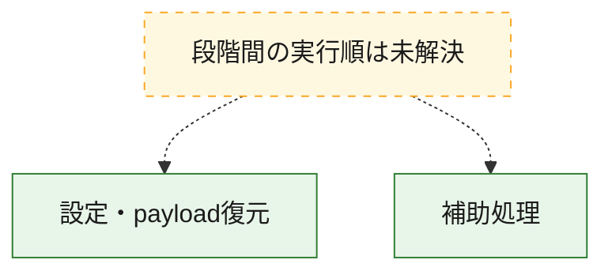
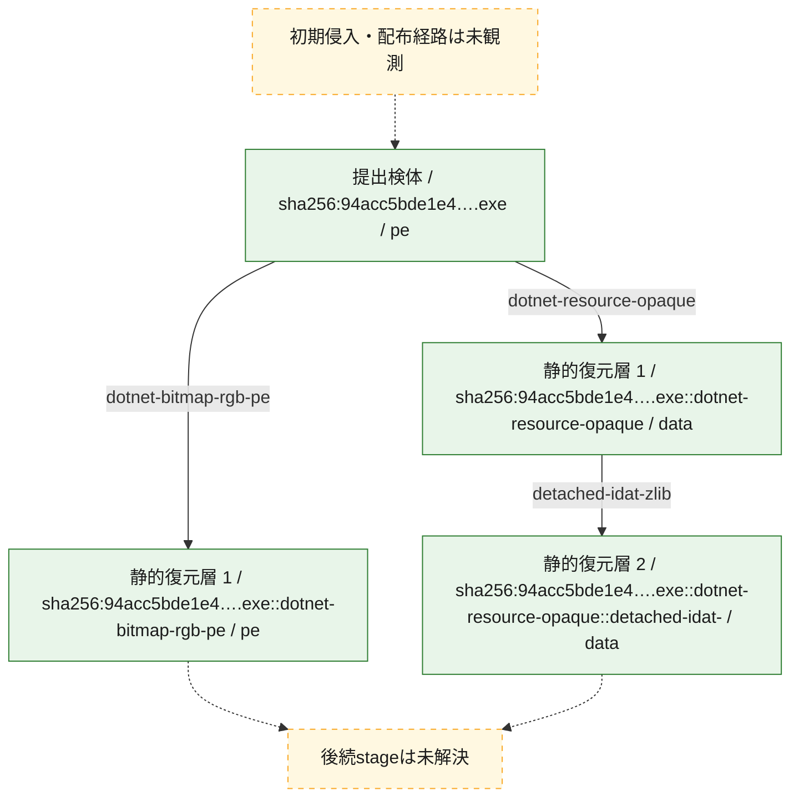
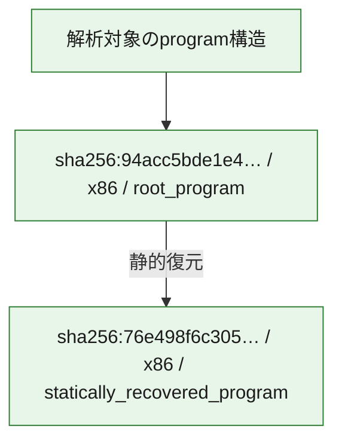

# 全体ロジック：94acc5bde1e48ce426bc61ea90a8780cf2be98795aaba7d946d5fe9d43b3203d

代表関数の静的証跡から、設定・payload復元の処理群を確認しました。

## 読み方

- phaseの掲載順は解析上の整理順です。observed_call_edgesがない段階間の実行順を断定しません。
- 図の実線は静的に観測した関係、点線と黄色のノードは未観測・未解決の関係を示します。
- 図は静的な要約であり、動的実行を再現するものではありません。
- 詳細な関数解説とfingerprintは[STATIC-LOGIC.md](STATIC-LOGIC.md)を参照してください。

## 静的可視化

### 実行フロー

### 感染チェーン

### モジュール関係

## 処理段階

### 1. 設定・payload復元

設定、resource、payload、暗号化データの復元・変換を確認します。
確度: `confirmed_static_function_evidence`

- `94acc5bde1e48ce426bc61ea90a8780cf2be98795aaba7d946d5fe9d43b3203d:cil:0x06000007` — 暗号、hash、encoding、または復号処理に関係する関数です。 状態: `succeeded`、選定理由: `reviewed_call_centrality:4`, `role:cryptographic_transform`
- `94acc5bde1e48ce426bc61ea90a8780cf2be98795aaba7d946d5fe9d43b3203d:cil:0x0600000e` — 暗号、hash、encoding、または復号処理に関係する関数です。 状態: `succeeded`、選定理由: `reviewed_call_centrality:4`, `role:cryptographic_transform`
- `94acc5bde1e48ce426bc61ea90a8780cf2be98795aaba7d946d5fe9d43b3203d:cil:0x06000016` — 暗号、hash、encoding、または復号処理に関係する関数です。 状態: `succeeded`、選定理由: `reviewed_call_centrality:4`, `role:cryptographic_transform`
- `94acc5bde1e48ce426bc61ea90a8780cf2be98795aaba7d946d5fe9d43b3203d:cil:0x06000088` — 設定、resource、payloadなどの解析・変換を行う関数です。 状態: `succeeded`、選定理由: `reviewed_call_centrality:6`, `role:config_or_data_transform`

### 2. 補助処理

主要処理を支える一般内部関数またはlibrary処理を確認します。
確度: `confirmed_static_function_evidence`

- `76e498f6c3056812a6aa5dab98d61ce4f38fb688de62766a3d6b233f68a51f0b:cil:0x06000003` — compiler生成処理または汎用library処理とみられる関数です。 状態: `succeeded`、選定理由: `large_function:instructions=111`, `reviewed_call_centrality:10`
- `76e498f6c3056812a6aa5dab98d61ce4f38fb688de62766a3d6b233f68a51f0b:cil:0x06000016` — 検体内部の一般処理を実装する関数です。 状態: `succeeded`、選定理由: `large_function:instructions=287`, `reviewed_call_centrality:12`
- `76e498f6c3056812a6aa5dab98d61ce4f38fb688de62766a3d6b233f68a51f0b:cil:0x06000017` — 検体内部の一般処理を実装する関数です。 状態: `succeeded`、選定理由: `large_function:instructions=224`, `reviewed_call_centrality:4`
- `76e498f6c3056812a6aa5dab98d61ce4f38fb688de62766a3d6b233f68a51f0b:cil:0x06000018` — 検体内部の一般処理を実装する関数です。 状態: `succeeded`、選定理由: `large_function:instructions=149`, `reviewed_call_centrality:6`
- `76e498f6c3056812a6aa5dab98d61ce4f38fb688de62766a3d6b233f68a51f0b:cil:0x0600001a` — 検体内部の一般処理を実装する関数です。 状態: `succeeded`、選定理由: `large_function:instructions=176`, `reviewed_call_centrality:10`
- `76e498f6c3056812a6aa5dab98d61ce4f38fb688de62766a3d6b233f68a51f0b:cil:0x0600001c` — 検体内部の一般処理を実装する関数です。 状態: `succeeded`、選定理由: `large_function:instructions=141`, `reviewed_call_centrality:6`
- `76e498f6c3056812a6aa5dab98d61ce4f38fb688de62766a3d6b233f68a51f0b:cil:0x06000020` — 検体内部の一般処理を実装する関数です。 状態: `succeeded`、選定理由: `large_function:instructions=266`, `reviewed_call_centrality:4`
- `76e498f6c3056812a6aa5dab98d61ce4f38fb688de62766a3d6b233f68a51f0b:cil:0x06000024` — 検体内部の一般処理を実装する関数です。 状態: `succeeded`、選定理由: `large_function:instructions=139`, `reviewed_call_centrality:6`
- `76e498f6c3056812a6aa5dab98d61ce4f38fb688de62766a3d6b233f68a51f0b:cil:0x06000025` — 検体内部の一般処理を実装する関数です。 状態: `succeeded`、選定理由: `large_function:instructions=156`, `reviewed_call_centrality:8`
- `76e498f6c3056812a6aa5dab98d61ce4f38fb688de62766a3d6b233f68a51f0b:cil:0x06000027` — 検体内部の一般処理を実装する関数です。 状態: `succeeded`、選定理由: `large_function:instructions=198`, `reviewed_call_centrality:10`
- `76e498f6c3056812a6aa5dab98d61ce4f38fb688de62766a3d6b233f68a51f0b:cil:0x0600002e` — 検体内部の一般処理を実装する関数です。 状態: `succeeded`、選定理由: `large_function:instructions=115`, `reviewed_call_centrality:10`
- `76e498f6c3056812a6aa5dab98d61ce4f38fb688de62766a3d6b233f68a51f0b:cil:0x06000030` — 検体内部の一般処理を実装する関数です。 状態: `succeeded`、選定理由: `large_function:instructions=276`, `reviewed_call_centrality:10`
- `76e498f6c3056812a6aa5dab98d61ce4f38fb688de62766a3d6b233f68a51f0b:cil:0x06000031` — 検体内部の一般処理を実装する関数です。 状態: `succeeded`、選定理由: `large_function:instructions=177`, `reviewed_call_centrality:8`
- `76e498f6c3056812a6aa5dab98d61ce4f38fb688de62766a3d6b233f68a51f0b:cil:0x06000033` — 検体内部の一般処理を実装する関数です。 状態: `succeeded`、選定理由: `large_function:instructions=240`, `reviewed_call_centrality:4`
- `76e498f6c3056812a6aa5dab98d61ce4f38fb688de62766a3d6b233f68a51f0b:cil:0x06000036` — 検体内部の一般処理を実装する関数です。 状態: `succeeded`、選定理由: `large_function:instructions=2405`, `reviewed_call_centrality:32`
- `76e498f6c3056812a6aa5dab98d61ce4f38fb688de62766a3d6b233f68a51f0b:cil:0x0600003c` — 検体内部の一般処理を実装する関数です。 状態: `succeeded`、選定理由: `large_function:instructions=83`, `reviewed_call_centrality:8`
- `76e498f6c3056812a6aa5dab98d61ce4f38fb688de62766a3d6b233f68a51f0b:cil:0x06000045` — compiler生成処理または汎用library処理とみられる関数です。 状態: `succeeded`、選定理由: `large_function:instructions=96`, `reviewed_call_centrality:14`
- `76e498f6c3056812a6aa5dab98d61ce4f38fb688de62766a3d6b233f68a51f0b:cil:0x06000047` — 検体内部の一般処理を実装する関数です。 状態: `succeeded`、選定理由: `large_function:instructions=821`, `reviewed_call_centrality:12`
- `76e498f6c3056812a6aa5dab98d61ce4f38fb688de62766a3d6b233f68a51f0b:cil:0x06000050` — 検体内部の一般処理を実装する関数です。 状態: `succeeded`、選定理由: `reviewed_call_centrality:8`
- `76e498f6c3056812a6aa5dab98d61ce4f38fb688de62766a3d6b233f68a51f0b:cil:0x06000056` — 検体内部の一般処理を実装する関数です。 状態: `succeeded`、選定理由: `large_function:instructions=601`, `reviewed_call_centrality:72`
- `76e498f6c3056812a6aa5dab98d61ce4f38fb688de62766a3d6b233f68a51f0b:cil:0x0600005a` — 検体内部の一般処理を実装する関数です。 状態: `succeeded`、選定理由: `large_function:instructions=148`, `reviewed_call_centrality:44`
- `76e498f6c3056812a6aa5dab98d61ce4f38fb688de62766a3d6b233f68a51f0b:cil:0x0600005f` — 検体内部の一般処理を実装する関数です。 状態: `succeeded`、選定理由: `large_function:instructions=67`, `reviewed_call_centrality:18`
- `76e498f6c3056812a6aa5dab98d61ce4f38fb688de62766a3d6b233f68a51f0b:cil:0x06000062` — 検体内部の一般処理を実装する関数です。 状態: `succeeded`、選定理由: `reviewed_call_centrality:14`
- `76e498f6c3056812a6aa5dab98d61ce4f38fb688de62766a3d6b233f68a51f0b:cil:0x06000063` — 検体内部の一般処理を実装する関数です。 状態: `succeeded`、選定理由: `reviewed_call_centrality:14`
- `76e498f6c3056812a6aa5dab98d61ce4f38fb688de62766a3d6b233f68a51f0b:cil:0x06000064` — 検体内部の一般処理を実装する関数です。 状態: `succeeded`、選定理由: `reviewed_call_centrality:14`
- `76e498f6c3056812a6aa5dab98d61ce4f38fb688de62766a3d6b233f68a51f0b:cil:0x06000065` — 検体内部の一般処理を実装する関数です。 状態: `succeeded`、選定理由: `reviewed_call_centrality:14`
- `76e498f6c3056812a6aa5dab98d61ce4f38fb688de62766a3d6b233f68a51f0b:cil:0x06000066` — 検体内部の一般処理を実装する関数です。 状態: `succeeded`、選定理由: `reviewed_call_centrality:14`
- `76e498f6c3056812a6aa5dab98d61ce4f38fb688de62766a3d6b233f68a51f0b:cil:0x06000067` — 検体内部の一般処理を実装する関数です。 状態: `succeeded`、選定理由: `reviewed_call_centrality:14`
- `76e498f6c3056812a6aa5dab98d61ce4f38fb688de62766a3d6b233f68a51f0b:cil:0x06000069` — 検体内部の一般処理を実装する関数です。 状態: `succeeded`、選定理由: `reviewed_call_centrality:8`
- `76e498f6c3056812a6aa5dab98d61ce4f38fb688de62766a3d6b233f68a51f0b:cil:0x0600006c` — 検体内部の一般処理を実装する関数です。 状態: `succeeded`、選定理由: `reviewed_call_centrality:22`
- `76e498f6c3056812a6aa5dab98d61ce4f38fb688de62766a3d6b233f68a51f0b:cil:0x0600007f` — 検体内部の一般処理を実装する関数です。 状態: `succeeded`、選定理由: `reviewed_call_centrality:30`
- `76e498f6c3056812a6aa5dab98d61ce4f38fb688de62766a3d6b233f68a51f0b:cil:0x060000ab` — 検体内部の一般処理を実装する関数です。 状態: `succeeded`、選定理由: `large_function:instructions=1063`, `reviewed_call_centrality:8`
- `94acc5bde1e48ce426bc61ea90a8780cf2be98795aaba7d946d5fe9d43b3203d:cil:0x06000025` — compiler生成処理または汎用library処理とみられる関数です。 状態: `succeeded`、選定理由: `large_function:instructions=75`, `reviewed_call_centrality:30`
- `94acc5bde1e48ce426bc61ea90a8780cf2be98795aaba7d946d5fe9d43b3203d:cil:0x06000026` — 検体内部の一般処理を実装する関数です。 状態: `succeeded`、選定理由: `large_function:instructions=179`, `reviewed_call_centrality:16`
- `94acc5bde1e48ce426bc61ea90a8780cf2be98795aaba7d946d5fe9d43b3203d:cil:0x06000027` — 検体内部の一般処理を実装する関数です。 状態: `succeeded`、選定理由: `reviewed_call_centrality:10`
- `94acc5bde1e48ce426bc61ea90a8780cf2be98795aaba7d946d5fe9d43b3203d:cil:0x06000030` — compiler生成処理または汎用library処理とみられる関数です。 状態: `succeeded`、選定理由: `reviewed_call_centrality:10`
- `94acc5bde1e48ce426bc61ea90a8780cf2be98795aaba7d946d5fe9d43b3203d:cil:0x06000036` — 検体内部の一般処理を実装する関数です。 状態: `succeeded`、選定理由: `large_function:instructions=197`, `reviewed_call_centrality:52`
- `94acc5bde1e48ce426bc61ea90a8780cf2be98795aaba7d946d5fe9d43b3203d:cil:0x0600003e` — 検体内部の一般処理を実装する関数です。 状態: `succeeded`、選定理由: `large_function:instructions=167`, `reviewed_call_centrality:22`
- `94acc5bde1e48ce426bc61ea90a8780cf2be98795aaba7d946d5fe9d43b3203d:cil:0x0600003f` — 検体内部の一般処理を実装する関数です。 状態: `succeeded`、選定理由: `large_function:instructions=105`, `reviewed_call_centrality:18`
- `94acc5bde1e48ce426bc61ea90a8780cf2be98795aaba7d946d5fe9d43b3203d:cil:0x06000041` — 検体内部の一般処理を実装する関数です。 状態: `succeeded`、選定理由: `large_function:instructions=112`, `reviewed_call_centrality:14`
- `94acc5bde1e48ce426bc61ea90a8780cf2be98795aaba7d946d5fe9d43b3203d:cil:0x06000043` — 検体内部の一般処理を実装する関数です。 状態: `succeeded`、選定理由: `large_function:instructions=117`, `reviewed_call_centrality:14`
- `94acc5bde1e48ce426bc61ea90a8780cf2be98795aaba7d946d5fe9d43b3203d:cil:0x06000044` — 検体内部の一般処理を実装する関数です。 状態: `succeeded`、選定理由: `large_function:instructions=186`, `reviewed_call_centrality:22`
- `94acc5bde1e48ce426bc61ea90a8780cf2be98795aaba7d946d5fe9d43b3203d:cil:0x06000045` — 検体内部の一般処理を実装する関数です。 状態: `succeeded`、選定理由: `large_function:instructions=885`, `reviewed_call_centrality:74`
- `94acc5bde1e48ce426bc61ea90a8780cf2be98795aaba7d946d5fe9d43b3203d:cil:0x06000047` — 検体内部の一般処理を実装する関数です。 状態: `succeeded`、選定理由: `large_function:instructions=854`, `reviewed_call_centrality:104`
- `94acc5bde1e48ce426bc61ea90a8780cf2be98795aaba7d946d5fe9d43b3203d:cil:0x06000063` — 検体内部の一般処理を実装する関数です。 状態: `succeeded`、選定理由: `large_function:instructions=197`, `reviewed_call_centrality:36`
- `94acc5bde1e48ce426bc61ea90a8780cf2be98795aaba7d946d5fe9d43b3203d:cil:0x06000065` — 検体内部の一般処理を実装する関数です。 状態: `succeeded`、選定理由: `large_function:instructions=78`, `reviewed_call_centrality:16`
- `94acc5bde1e48ce426bc61ea90a8780cf2be98795aaba7d946d5fe9d43b3203d:cil:0x06000066` — 検体内部の一般処理を実装する関数です。 状態: `succeeded`、選定理由: `large_function:instructions=136`, `reviewed_call_centrality:36`
- `94acc5bde1e48ce426bc61ea90a8780cf2be98795aaba7d946d5fe9d43b3203d:cil:0x06000067` — 検体内部の一般処理を実装する関数です。 状態: `succeeded`、選定理由: `large_function:instructions=270`, `reviewed_call_centrality:24`
- `94acc5bde1e48ce426bc61ea90a8780cf2be98795aaba7d946d5fe9d43b3203d:cil:0x06000069` — 検体内部の一般処理を実装する関数です。 状態: `succeeded`、選定理由: `large_function:instructions=1120`, `reviewed_call_centrality:138`
- `94acc5bde1e48ce426bc61ea90a8780cf2be98795aaba7d946d5fe9d43b3203d:cil:0x0600006d` — 検体内部の一般処理を実装する関数です。 状態: `succeeded`、選定理由: `large_function:instructions=67`, `reviewed_call_centrality:18`
- `94acc5bde1e48ce426bc61ea90a8780cf2be98795aaba7d946d5fe9d43b3203d:cil:0x06000073` — 検体内部の一般処理を実装する関数です。 状態: `succeeded`、選定理由: `large_function:instructions=266`, `reviewed_call_centrality:28`
- `94acc5bde1e48ce426bc61ea90a8780cf2be98795aaba7d946d5fe9d43b3203d:cil:0x06000075` — 検体内部の一般処理を実装する関数です。 状態: `succeeded`、選定理由: `reviewed_call_centrality:14`
- `94acc5bde1e48ce426bc61ea90a8780cf2be98795aaba7d946d5fe9d43b3203d:cil:0x06000077` — 検体内部の一般処理を実装する関数です。 状態: `succeeded`、選定理由: `large_function:instructions=452`, `reviewed_call_centrality:40`
- `94acc5bde1e48ce426bc61ea90a8780cf2be98795aaba7d946d5fe9d43b3203d:cil:0x06000079` — 検体内部の一般処理を実装する関数です。 状態: `succeeded`、選定理由: `large_function:instructions=255`, `reviewed_call_centrality:46`
- `94acc5bde1e48ce426bc61ea90a8780cf2be98795aaba7d946d5fe9d43b3203d:cil:0x0600007a` — 検体内部の一般処理を実装する関数です。 状態: `succeeded`、選定理由: `large_function:instructions=156`, `reviewed_call_centrality:30`
- `94acc5bde1e48ce426bc61ea90a8780cf2be98795aaba7d946d5fe9d43b3203d:cil:0x0600007c` — 検体内部の一般処理を実装する関数です。 状態: `succeeded`、選定理由: `large_function:instructions=1115`, `reviewed_call_centrality:86`
- `94acc5bde1e48ce426bc61ea90a8780cf2be98795aaba7d946d5fe9d43b3203d:cil:0x06000082` — 検体内部の一般処理を実装する関数です。 状態: `succeeded`、選定理由: `large_function:instructions=301`, `reviewed_call_centrality:30`
- `94acc5bde1e48ce426bc61ea90a8780cf2be98795aaba7d946d5fe9d43b3203d:cil:0x06000084` — 検体内部の一般処理を実装する関数です。 状態: `succeeded`、選定理由: `large_function:instructions=1540`, `reviewed_call_centrality:80`
- `94acc5bde1e48ce426bc61ea90a8780cf2be98795aaba7d946d5fe9d43b3203d:cil:0x0600008f` — 検体内部の一般処理を実装する関数です。 状態: `succeeded`、選定理由: `reviewed_call_centrality:14`
- `94acc5bde1e48ce426bc61ea90a8780cf2be98795aaba7d946d5fe9d43b3203d:cil:0x0600009c` — 検体内部の一般処理を実装する関数です。 状態: `succeeded`、選定理由: `large_function:instructions=974`, `reviewed_call_centrality:6`

## 観測したcall関係

- 代表関数間で直接解決できた呼出関係はありません。

## 解析範囲と制約

- 選定外関数は全体inventoryへ残しますが、関数本体の個別解説対象にはしていません。
- indirect call、難読化、packer、VM、壊れたcontrol flowによりcall関係が欠落する場合があります。
- 文書は静的解析に基づき、検体実行や外部通信による動的確認は行っていません。
