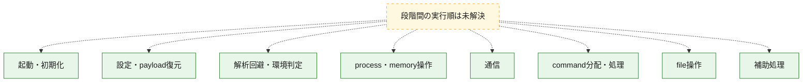
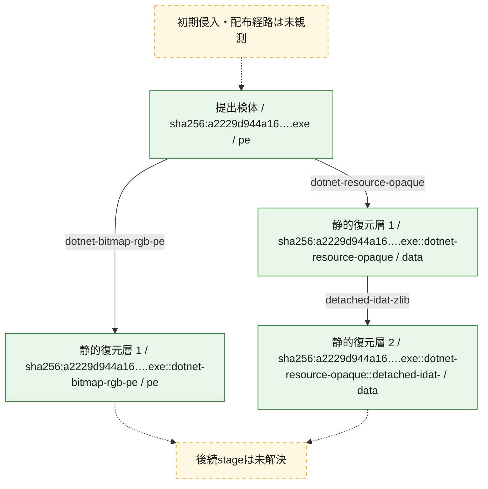
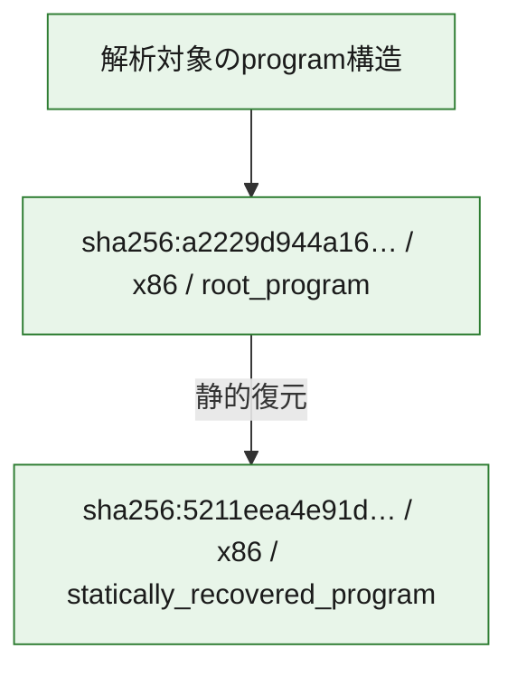

# 全体ロジック：a2229d944a164ef74389757ff84f6ec5572db1be83d53399638c4efa6503a436

代表関数の静的証跡から、起動・初期化、設定・payload復元、解析回避・環境判定、process・memory操作、通信、command分配・処理、file操作の処理群を確認しました。

## 読み方

- phaseの掲載順は解析上の整理順です。observed_call_edgesがない段階間の実行順を断定しません。
- 図の実線は静的に観測した関係、点線と黄色のノードは未観測・未解決の関係を示します。
- 図は静的な要約であり、動的実行を再現するものではありません。
- 詳細な関数解説とfingerprintは[STATIC-LOGIC.md](STATIC-LOGIC.md)を参照してください。

## 静的可視化

### 実行フロー

### 感染チェーン

### モジュール関係

## 処理段階

### 1. 起動・初期化

entry pointから初期化と後続処理への移行を確認します。
確度: `confirmed_static_function_evidence`

- `a2229d944a164ef74389757ff84f6ec5572db1be83d53399638c4efa6503a436:cil:0x0600000d` — 初期化と主要処理への分岐を行う入口関数です。 状態: `succeeded`、選定理由: `entry_point`, `reviewed_call_centrality:8`

### 2. 設定・payload復元

設定、resource、payload、暗号化データの復元・変換を確認します。
確度: `confirmed_static_function_evidence`

- `5211eea4e91d9fbec6c16f88f934feae8b5c659acbe8007683987a4633725d02:cil:0x06000003` — 暗号、hash、encoding、または復号処理に関係する関数です。 状態: `succeeded`、選定理由: `large_function:instructions=105`, `reviewed_call_centrality:18`, `role:cryptographic_transform`
- `5211eea4e91d9fbec6c16f88f934feae8b5c659acbe8007683987a4633725d02:cil:0x06000015` — 設定、resource、payloadなどの解析・変換を行う関数です。 状態: `succeeded`、選定理由: `reviewed_call_centrality:6`, `role:config_or_data_transform`
- `5211eea4e91d9fbec6c16f88f934feae8b5c659acbe8007683987a4633725d02:cil:0x06000016` — 設定、resource、payloadなどの解析・変換を行う関数です。 状態: `succeeded`、選定理由: `large_function:instructions=248`, `reviewed_call_centrality:12`, `role:config_or_data_transform`
- `5211eea4e91d9fbec6c16f88f934feae8b5c659acbe8007683987a4633725d02:cil:0x0600002e` — 設定、resource、payloadなどの解析・変換を行う関数です。 状態: `succeeded`、選定理由: `large_function:instructions=101`, `reviewed_call_centrality:8`, `role:config_or_data_transform`
- `5211eea4e91d9fbec6c16f88f934feae8b5c659acbe8007683987a4633725d02:cil:0x06000031` — 設定、resource、payloadなどの解析・変換を行う関数です。 状態: `succeeded`、選定理由: `large_function:instructions=134`, `reviewed_call_centrality:6`, `role:config_or_data_transform`
- `5211eea4e91d9fbec6c16f88f934feae8b5c659acbe8007683987a4633725d02:cil:0x06000039` — 暗号、hash、encoding、または復号処理に関係する関数です。 状態: `succeeded`、選定理由: `reviewed_call_centrality:6`, `role:cryptographic_transform`
- `5211eea4e91d9fbec6c16f88f934feae8b5c659acbe8007683987a4633725d02:cil:0x0600003d` — 暗号、hash、encoding、または復号処理に関係する関数です。 状態: `succeeded`、選定理由: `reviewed_call_centrality:6`, `role:cryptographic_transform`
- `5211eea4e91d9fbec6c16f88f934feae8b5c659acbe8007683987a4633725d02:cil:0x0600003e` — 暗号、hash、encoding、または復号処理に関係する関数です。 状態: `succeeded`、選定理由: `reviewed_call_centrality:6`, `role:cryptographic_transform`
- `5211eea4e91d9fbec6c16f88f934feae8b5c659acbe8007683987a4633725d02:cil:0x06000045` — 暗号、hash、encoding、または復号処理に関係する関数です。 状態: `succeeded`、選定理由: `large_function:instructions=96`, `reviewed_call_centrality:14`, `role:cryptographic_transform`
- `5211eea4e91d9fbec6c16f88f934feae8b5c659acbe8007683987a4633725d02:cil:0x0600004f` — 暗号、hash、encoding、または復号処理に関係する関数です。 状態: `succeeded`、選定理由: `large_function:instructions=271`, `reviewed_call_centrality:2`, `role:cryptographic_transform`
- `5211eea4e91d9fbec6c16f88f934feae8b5c659acbe8007683987a4633725d02:cil:0x06000050` — 暗号、hash、encoding、または復号処理に関係する関数です。 状態: `succeeded`、選定理由: `reviewed_call_centrality:8`, `role:cryptographic_transform`
- `5211eea4e91d9fbec6c16f88f934feae8b5c659acbe8007683987a4633725d02:cil:0x06000052` — 暗号、hash、encoding、または復号処理に関係する関数です。 状態: `succeeded`、選定理由: `reviewed_call_centrality:8`, `role:cryptographic_transform`
- `5211eea4e91d9fbec6c16f88f934feae8b5c659acbe8007683987a4633725d02:cil:0x06000055` — 暗号、hash、encoding、または復号処理に関係する関数です。 状態: `succeeded`、選定理由: `reviewed_call_centrality:6`, `role:cryptographic_transform`
- `5211eea4e91d9fbec6c16f88f934feae8b5c659acbe8007683987a4633725d02:cil:0x06000056` — 設定、resource、payloadなどの解析・変換を行う関数です。 状態: `succeeded`、選定理由: `large_function:instructions=601`, `reviewed_call_centrality:72`, `role:config_or_data_transform`
- `5211eea4e91d9fbec6c16f88f934feae8b5c659acbe8007683987a4633725d02:cil:0x0600005b` — 暗号、hash、encoding、または復号処理に関係する関数です。 状態: `succeeded`、選定理由: `reviewed_call_centrality:8`, `role:cryptographic_transform`
- `5211eea4e91d9fbec6c16f88f934feae8b5c659acbe8007683987a4633725d02:cil:0x06000062` — 暗号、hash、encoding、または復号処理に関係する関数です。 状態: `succeeded`、選定理由: `reviewed_call_centrality:14`, `role:cryptographic_transform`
- `5211eea4e91d9fbec6c16f88f934feae8b5c659acbe8007683987a4633725d02:cil:0x06000063` — 暗号、hash、encoding、または復号処理に関係する関数です。 状態: `succeeded`、選定理由: `reviewed_call_centrality:14`, `role:cryptographic_transform`
- `5211eea4e91d9fbec6c16f88f934feae8b5c659acbe8007683987a4633725d02:cil:0x06000064` — 暗号、hash、encoding、または復号処理に関係する関数です。 状態: `succeeded`、選定理由: `reviewed_call_centrality:14`, `role:cryptographic_transform`
- `5211eea4e91d9fbec6c16f88f934feae8b5c659acbe8007683987a4633725d02:cil:0x06000065` — 暗号、hash、encoding、または復号処理に関係する関数です。 状態: `succeeded`、選定理由: `reviewed_call_centrality:14`, `role:cryptographic_transform`
- `5211eea4e91d9fbec6c16f88f934feae8b5c659acbe8007683987a4633725d02:cil:0x06000066` — 暗号、hash、encoding、または復号処理に関係する関数です。 状態: `succeeded`、選定理由: `reviewed_call_centrality:14`, `role:cryptographic_transform`
- `5211eea4e91d9fbec6c16f88f934feae8b5c659acbe8007683987a4633725d02:cil:0x0600006c` — 設定、resource、payloadなどの解析・変換を行う関数です。 状態: `succeeded`、選定理由: `reviewed_call_centrality:22`, `role:config_or_data_transform`
- `5211eea4e91d9fbec6c16f88f934feae8b5c659acbe8007683987a4633725d02:cil:0x0600007f` — 暗号、hash、encoding、または復号処理に関係する関数です。 状態: `succeeded`、選定理由: `reviewed_call_centrality:28`, `role:cryptographic_transform`
- `5211eea4e91d9fbec6c16f88f934feae8b5c659acbe8007683987a4633725d02:cil:0x060000ab` — 暗号、hash、encoding、または復号処理に関係する関数です。 状態: `succeeded`、選定理由: `large_function:instructions=1205`, `reviewed_call_centrality:6`, `role:cryptographic_transform`
- `a2229d944a164ef74389757ff84f6ec5572db1be83d53399638c4efa6503a436:cil:0x06000005` — 暗号、hash、encoding、または復号処理に関係する関数です。 状態: `succeeded`、選定理由: `reviewed_call_centrality:4`, `role:cryptographic_transform`
- `a2229d944a164ef74389757ff84f6ec5572db1be83d53399638c4efa6503a436:cil:0x0600000b` — 暗号、hash、encoding、または復号処理に関係する関数です。 状態: `succeeded`、選定理由: `reviewed_call_centrality:4`, `role:cryptographic_transform`
- `a2229d944a164ef74389757ff84f6ec5572db1be83d53399638c4efa6503a436:cil:0x06000014` — 設定、resource、payloadなどの解析・変換を行う関数です。 状態: `succeeded`、選定理由: `large_function:instructions=409`, `reviewed_call_centrality:28`, `role:config_or_data_transform`
- `a2229d944a164ef74389757ff84f6ec5572db1be83d53399638c4efa6503a436:cil:0x06000017` — 設定、resource、payloadなどの解析・変換を行う関数です。 状態: `succeeded`、選定理由: `large_function:instructions=795`, `reviewed_call_centrality:54`, `role:config_or_data_transform`
- `a2229d944a164ef74389757ff84f6ec5572db1be83d53399638c4efa6503a436:cil:0x0600001c` — 設定、resource、payloadなどの解析・変換を行う関数です。 状態: `succeeded`、選定理由: `large_function:instructions=190`, `reviewed_call_centrality:56`, `role:config_or_data_transform`
- `a2229d944a164ef74389757ff84f6ec5572db1be83d53399638c4efa6503a436:cil:0x0600001e` — 設定、resource、payloadなどの解析・変換を行う関数です。 状態: `succeeded`、選定理由: `large_function:instructions=82`, `reviewed_call_centrality:26`, `role:config_or_data_transform`
- `a2229d944a164ef74389757ff84f6ec5572db1be83d53399638c4efa6503a436:cil:0x06000024` — 設定、resource、payloadなどの解析・変換を行う関数です。 状態: `succeeded`、選定理由: `large_function:instructions=291`, `reviewed_call_centrality:34`, `role:config_or_data_transform`
- `a2229d944a164ef74389757ff84f6ec5572db1be83d53399638c4efa6503a436:cil:0x0600002f` — 設定、resource、payloadなどの解析・変換を行う関数です。 状態: `succeeded`、選定理由: `role:config_or_data_transform`
- `a2229d944a164ef74389757ff84f6ec5572db1be83d53399638c4efa6503a436:cil:0x06000030` — 設定、resource、payloadなどの解析・変換を行う関数です。 状態: `succeeded`、選定理由: `role:config_or_data_transform`
- `a2229d944a164ef74389757ff84f6ec5572db1be83d53399638c4efa6503a436:cil:0x06000033` — 設定、resource、payloadなどの解析・変換を行う関数です。 状態: `succeeded`、選定理由: `large_function:instructions=179`, `reviewed_call_centrality:34`, `role:config_or_data_transform`
- `a2229d944a164ef74389757ff84f6ec5572db1be83d53399638c4efa6503a436:cil:0x06000035` — 設定、resource、payloadなどの解析・変換を行う関数です。 状態: `succeeded`、選定理由: `reviewed_call_centrality:2`, `role:config_or_data_transform`
- `a2229d944a164ef74389757ff84f6ec5572db1be83d53399638c4efa6503a436:cil:0x06000036` — 設定、resource、payloadなどの解析・変換を行う関数です。 状態: `succeeded`、選定理由: `reviewed_call_centrality:6`, `role:config_or_data_transform`
- `a2229d944a164ef74389757ff84f6ec5572db1be83d53399638c4efa6503a436:cil:0x06000037` — 設定、resource、payloadなどの解析・変換を行う関数です。 状態: `succeeded`、選定理由: `role:config_or_data_transform`
- `a2229d944a164ef74389757ff84f6ec5572db1be83d53399638c4efa6503a436:cil:0x06000038` — 設定、resource、payloadなどの解析・変換を行う関数です。 状態: `succeeded`、選定理由: `role:config_or_data_transform`
- `a2229d944a164ef74389757ff84f6ec5572db1be83d53399638c4efa6503a436:cil:0x06000039` — 設定、resource、payloadなどの解析・変換を行う関数です。 状態: `succeeded`、選定理由: `reviewed_call_centrality:4`, `role:config_or_data_transform`
- `a2229d944a164ef74389757ff84f6ec5572db1be83d53399638c4efa6503a436:cil:0x0600003a` — 設定、resource、payloadなどの解析・変換を行う関数です。 状態: `succeeded`、選定理由: `reviewed_call_centrality:4`, `role:config_or_data_transform`
- `a2229d944a164ef74389757ff84f6ec5572db1be83d53399638c4efa6503a436:cil:0x06000046` — 暗号、hash、encoding、または復号処理に関係する関数です。 状態: `succeeded`、選定理由: `reviewed_call_centrality:4`, `role:cryptographic_transform`

### 3. 解析回避・環境判定

debugger、sandbox、仮想環境、時間差などの判定を確認します。
確度: `confirmed_static_function_evidence`

- `5211eea4e91d9fbec6c16f88f934feae8b5c659acbe8007683987a4633725d02:cil:0x06000059` — debugger、仮想環境、sandbox、または時間差の確認に関係する関数です。 状態: `succeeded`、選定理由: `reviewed_call_centrality:4`, `role:anti_analysis`

### 4. process・memory操作

process、thread、module、memory操作と実行移行を確認します。
確度: `confirmed_static_function_evidence`

- `5211eea4e91d9fbec6c16f88f934feae8b5c659acbe8007683987a4633725d02:cil:0x06000033` — process、thread、module、またはmemory操作に関係する関数です。 状態: `succeeded`、選定理由: `large_function:instructions=190`, `reviewed_call_centrality:4`, `role:process_or_memory_operation`
- `5211eea4e91d9fbec6c16f88f934feae8b5c659acbe8007683987a4633725d02:cil:0x06000067` — process、thread、module、またはmemory操作に関係する関数です。 状態: `succeeded`、選定理由: `reviewed_call_centrality:14`, `role:process_or_memory_operation`

### 5. 通信

通信初期化、endpoint処理、送受信の役割を確認します。
確度: `confirmed_static_function_evidence`

- `5211eea4e91d9fbec6c16f88f934feae8b5c659acbe8007683987a4633725d02:cil:0x0600005a` — 通信初期化、送受信、またはendpoint処理に関係する関数です。 状態: `succeeded`、選定理由: `large_function:instructions=148`, `reviewed_call_centrality:44`, `role:network_communication`

### 6. command分配・処理

受信commandやtaskの解釈、分配、個別handlerへの移行を確認します。
確度: `confirmed_static_function_evidence`

- `5211eea4e91d9fbec6c16f88f934feae8b5c659acbe8007683987a4633725d02:cil:0x06000036` — commandの解釈、分配、または個別処理を担当する関数です。 状態: `succeeded`、選定理由: `large_function:instructions=2203`, `reviewed_call_centrality:30`, `role:command_dispatch_or_handler`
- `a2229d944a164ef74389757ff84f6ec5572db1be83d53399638c4efa6503a436:cil:0x06000019` — commandの解釈、分配、または個別処理を担当する関数です。 状態: `succeeded`、選定理由: `large_function:instructions=617`, `reviewed_call_centrality:106`, `role:command_dispatch_or_handler`
- `a2229d944a164ef74389757ff84f6ec5572db1be83d53399638c4efa6503a436:cil:0x06000020` — commandの解釈、分配、または個別処理を担当する関数です。 状態: `succeeded`、選定理由: `large_function:instructions=892`, `reviewed_call_centrality:116`, `role:command_dispatch_or_handler`
- `a2229d944a164ef74389757ff84f6ec5572db1be83d53399638c4efa6503a436:cil:0x06000027` — commandの解釈、分配、または個別処理を担当する関数です。 状態: `succeeded`、選定理由: `large_function:instructions=710`, `reviewed_call_centrality:84`, `role:command_dispatch_or_handler`
- `a2229d944a164ef74389757ff84f6ec5572db1be83d53399638c4efa6503a436:cil:0x0600002e` — commandの解釈、分配、または個別処理を担当する関数です。 状態: `succeeded`、選定理由: `large_function:instructions=955`, `reviewed_call_centrality:72`, `role:command_dispatch_or_handler`

### 7. file操作

fileやdirectoryの作成、読書き、削除を確認します。
確度: `confirmed_static_function_evidence`

- `5211eea4e91d9fbec6c16f88f934feae8b5c659acbe8007683987a4633725d02:cil:0x06000030` — fileまたはdirectoryの読書き・管理に関係する関数です。 状態: `succeeded`、選定理由: `large_function:instructions=194`, `reviewed_call_centrality:8`, `role:file_operation`
- `5211eea4e91d9fbec6c16f88f934feae8b5c659acbe8007683987a4633725d02:cil:0x0600005f` — fileまたはdirectoryの読書き・管理に関係する関数です。 状態: `succeeded`、選定理由: `large_function:instructions=67`, `reviewed_call_centrality:18`, `role:file_operation`
- `5211eea4e91d9fbec6c16f88f934feae8b5c659acbe8007683987a4633725d02:cil:0x06000069` — fileまたはdirectoryの読書き・管理に関係する関数です。 状態: `succeeded`、選定理由: `reviewed_call_centrality:8`, `role:file_operation`

### 8. 補助処理

主要処理を支える一般内部関数またはlibrary処理を確認します。
確度: `confirmed_static_function_evidence`

- `5211eea4e91d9fbec6c16f88f934feae8b5c659acbe8007683987a4633725d02:cil:0x06000047` — 検体内部の一般処理を実装する関数です。 状態: `succeeded`、選定理由: `large_function:instructions=821`, `reviewed_call_centrality:12`
- `a2229d944a164ef74389757ff84f6ec5572db1be83d53399638c4efa6503a436:cil:0x06000010` — 検体内部の一般処理を実装する関数です。 状態: `succeeded`、選定理由: `reviewed_call_centrality:10`
- `a2229d944a164ef74389757ff84f6ec5572db1be83d53399638c4efa6503a436:cil:0x06000011` — 検体内部の一般処理を実装する関数です。 状態: `succeeded`、選定理由: `reviewed_call_centrality:10`
- `a2229d944a164ef74389757ff84f6ec5572db1be83d53399638c4efa6503a436:cil:0x06000013` — 検体内部の一般処理を実装する関数です。 状態: `succeeded`、選定理由: `reviewed_call_centrality:12`
- `a2229d944a164ef74389757ff84f6ec5572db1be83d53399638c4efa6503a436:cil:0x06000015` — 検体内部の一般処理を実装する関数です。 状態: `succeeded`、選定理由: `reviewed_call_centrality:20`
- `a2229d944a164ef74389757ff84f6ec5572db1be83d53399638c4efa6503a436:cil:0x06000023` — 検体内部の一般処理を実装する関数です。 状態: `succeeded`、選定理由: `reviewed_call_centrality:12`
- `a2229d944a164ef74389757ff84f6ec5572db1be83d53399638c4efa6503a436:cil:0x06000025` — 検体内部の一般処理を実装する関数です。 状態: `succeeded`、選定理由: `large_function:instructions=74`, `reviewed_call_centrality:8`
- `a2229d944a164ef74389757ff84f6ec5572db1be83d53399638c4efa6503a436:cil:0x0600002a` — 検体内部の一般処理を実装する関数です。 状態: `succeeded`、選定理由: `large_function:instructions=78`, `reviewed_call_centrality:18`
- `a2229d944a164ef74389757ff84f6ec5572db1be83d53399638c4efa6503a436:cil:0x0600002b` — 検体内部の一般処理を実装する関数です。 状態: `succeeded`、選定理由: `reviewed_call_centrality:14`
- `a2229d944a164ef74389757ff84f6ec5572db1be83d53399638c4efa6503a436:cil:0x0600003b` — 検体内部の一般処理を実装する関数です。 状態: `succeeded`、選定理由: `large_function:instructions=108`, `reviewed_call_centrality:32`
- `a2229d944a164ef74389757ff84f6ec5572db1be83d53399638c4efa6503a436:cil:0x06000049` — 検体内部の一般処理を実装する関数です。 状態: `succeeded`、選定理由: `reviewed_call_centrality:8`

## 観測したcall関係

- 代表関数間で直接解決できた呼出関係はありません。

## 解析範囲と制約

- 選定外関数は全体inventoryへ残しますが、関数本体の個別解説対象にはしていません。
- indirect call、難読化、packer、VM、壊れたcontrol flowによりcall関係が欠落する場合があります。
- 文書は静的解析に基づき、検体実行や外部通信による動的確認は行っていません。
