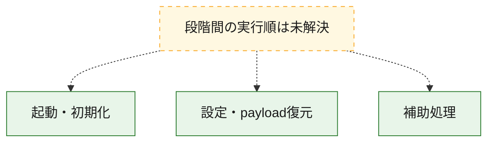
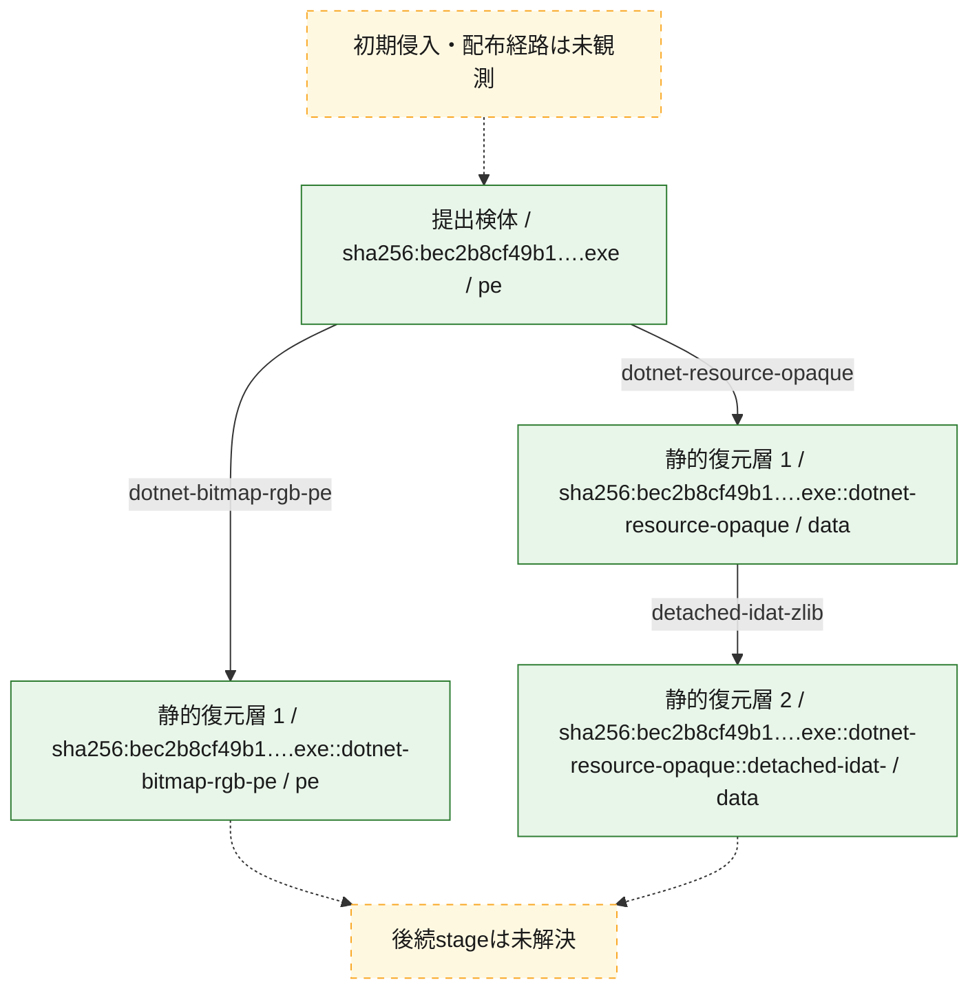
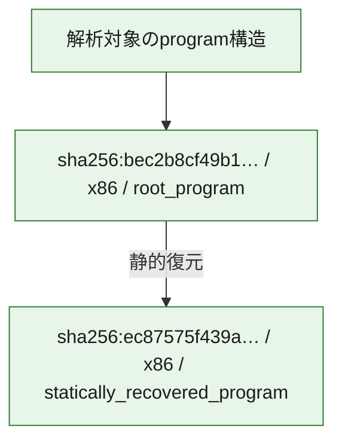

# 全体ロジック：bec2b8cf49b15d40abc3d0f8d36ee3a2282928f36250278b1f27d9236e0d90db

代表関数の静的証跡から、起動・初期化、設定・payload復元の処理群を確認しました。

## 読み方

- phaseの掲載順は解析上の整理順です。observed_call_edgesがない段階間の実行順を断定しません。
- 図の実線は静的に観測した関係、点線と黄色のノードは未観測・未解決の関係を示します。
- 図は静的な要約であり、動的実行を再現するものではありません。
- 詳細な関数解説とfingerprintは[STATIC-LOGIC.md](STATIC-LOGIC.md)を参照してください。

## 静的可視化

### 実行フロー

### 感染チェーン

### モジュール関係

## 処理段階

### 1. 起動・初期化

entry pointから初期化と後続処理への移行を確認します。
確度: `confirmed_static_function_evidence`

- `bec2b8cf49b15d40abc3d0f8d36ee3a2282928f36250278b1f27d9236e0d90db:cil:0x06000001` — 初期化と主要処理への分岐を行う入口関数です。 状態: `succeeded`、選定理由: `entry_point`, `reviewed_call_centrality:8`

### 2. 設定・payload復元

設定、resource、payload、暗号化データの復元・変換を確認します。
確度: `confirmed_static_function_evidence`

- `bec2b8cf49b15d40abc3d0f8d36ee3a2282928f36250278b1f27d9236e0d90db:cil:0x0600002d` — 設定、resource、payloadなどの解析・変換を行う関数です。 状態: `succeeded`、選定理由: `reviewed_call_centrality:6`, `role:config_or_data_transform`

### 3. 補助処理

主要処理を支える一般内部関数またはlibrary処理を確認します。
確度: `confirmed_static_function_evidence`

- `ec87575f439a41adac809624949bc16b13dbbb8a6afd8010a77fa04293ae4cc7:cil:0x06000001` — compiler生成処理または汎用library処理とみられる関数です。 状態: `succeeded`、選定理由: `large_function:instructions=77`, `reviewed_call_centrality:22`
- `ec87575f439a41adac809624949bc16b13dbbb8a6afd8010a77fa04293ae4cc7:cil:0x06000002` — 検体内部の一般処理を実装する関数です。 状態: `succeeded`、選定理由: `reviewed_call_centrality:18`
- `ec87575f439a41adac809624949bc16b13dbbb8a6afd8010a77fa04293ae4cc7:cil:0x0600000b` — 検体内部の一般処理を実装する関数です。 状態: `succeeded`、選定理由: `reviewed_call_centrality:8`
- `ec87575f439a41adac809624949bc16b13dbbb8a6afd8010a77fa04293ae4cc7:cil:0x0600000c` — 検体内部の一般処理を実装する関数です。 状態: `succeeded`、選定理由: `reviewed_call_centrality:8`
- `ec87575f439a41adac809624949bc16b13dbbb8a6afd8010a77fa04293ae4cc7:cil:0x0600000e` — 検体内部の一般処理を実装する関数です。 状態: `succeeded`、選定理由: `reviewed_call_centrality:12`
- `ec87575f439a41adac809624949bc16b13dbbb8a6afd8010a77fa04293ae4cc7:cil:0x06000010` — 検体内部の一般処理を実装する関数です。 状態: `succeeded`、選定理由: `large_function:instructions=103`, `reviewed_call_centrality:12`
- `ec87575f439a41adac809624949bc16b13dbbb8a6afd8010a77fa04293ae4cc7:cil:0x06000011` — 検体内部の一般処理を実装する関数です。 状態: `succeeded`、選定理由: `large_function:instructions=80`, `reviewed_call_centrality:10`
- `ec87575f439a41adac809624949bc16b13dbbb8a6afd8010a77fa04293ae4cc7:cil:0x06000012` — 検体内部の一般処理を実装する関数です。 状態: `succeeded`、選定理由: `large_function:instructions=67`, `reviewed_call_centrality:8`
- `ec87575f439a41adac809624949bc16b13dbbb8a6afd8010a77fa04293ae4cc7:cil:0x06000014` — 検体内部の一般処理を実装する関数です。 状態: `succeeded`、選定理由: `large_function:instructions=174`, `reviewed_call_centrality:54`
- `ec87575f439a41adac809624949bc16b13dbbb8a6afd8010a77fa04293ae4cc7:cil:0x06000015` — 検体内部の一般処理を実装する関数です。 状態: `succeeded`、選定理由: `large_function:instructions=159`, `reviewed_call_centrality:10`
- `ec87575f439a41adac809624949bc16b13dbbb8a6afd8010a77fa04293ae4cc7:cil:0x06000016` — 検体内部の一般処理を実装する関数です。 状態: `succeeded`、選定理由: `large_function:instructions=96`, `reviewed_call_centrality:20`
- `ec87575f439a41adac809624949bc16b13dbbb8a6afd8010a77fa04293ae4cc7:cil:0x06000018` — 検体内部の一般処理を実装する関数です。 状態: `succeeded`、選定理由: `large_function:instructions=116`, `reviewed_call_centrality:14`
- `ec87575f439a41adac809624949bc16b13dbbb8a6afd8010a77fa04293ae4cc7:cil:0x0600001a` — 検体内部の一般処理を実装する関数です。 状態: `succeeded`、選定理由: `large_function:instructions=95`, `reviewed_call_centrality:16`
- `ec87575f439a41adac809624949bc16b13dbbb8a6afd8010a77fa04293ae4cc7:cil:0x0600001e` — 検体内部の一般処理を実装する関数です。 状態: `succeeded`、選定理由: `large_function:instructions=161`, `reviewed_call_centrality:16`
- `ec87575f439a41adac809624949bc16b13dbbb8a6afd8010a77fa04293ae4cc7:cil:0x06000020` — 検体内部の一般処理を実装する関数です。 状態: `succeeded`、選定理由: `large_function:instructions=118`, `reviewed_call_centrality:20`
- `ec87575f439a41adac809624949bc16b13dbbb8a6afd8010a77fa04293ae4cc7:cil:0x06000022` — 検体内部の一般処理を実装する関数です。 状態: `succeeded`、選定理由: `large_function:instructions=92`, `reviewed_call_centrality:14`
- `ec87575f439a41adac809624949bc16b13dbbb8a6afd8010a77fa04293ae4cc7:cil:0x06000023` — 検体内部の一般処理を実装する関数です。 状態: `succeeded`、選定理由: `large_function:instructions=101`, `reviewed_call_centrality:10`
- `ec87575f439a41adac809624949bc16b13dbbb8a6afd8010a77fa04293ae4cc7:cil:0x06000024` — 検体内部の一般処理を実装する関数です。 状態: `succeeded`、選定理由: `large_function:instructions=74`, `reviewed_call_centrality:14`
- `ec87575f439a41adac809624949bc16b13dbbb8a6afd8010a77fa04293ae4cc7:cil:0x06000025` — 検体内部の一般処理を実装する関数です。 状態: `succeeded`、選定理由: `large_function:instructions=119`, `reviewed_call_centrality:12`
- `ec87575f439a41adac809624949bc16b13dbbb8a6afd8010a77fa04293ae4cc7:cil:0x06000027` — 検体内部の一般処理を実装する関数です。 状態: `succeeded`、選定理由: `large_function:instructions=82`, `reviewed_call_centrality:8`
- `ec87575f439a41adac809624949bc16b13dbbb8a6afd8010a77fa04293ae4cc7:cil:0x0600002c` — 検体内部の一般処理を実装する関数です。 状態: `succeeded`、選定理由: `large_function:instructions=83`, `reviewed_call_centrality:8`
- `ec87575f439a41adac809624949bc16b13dbbb8a6afd8010a77fa04293ae4cc7:cil:0x0600002d` — 検体内部の一般処理を実装する関数です。 状態: `succeeded`、選定理由: `reviewed_call_centrality:10`
- `ec87575f439a41adac809624949bc16b13dbbb8a6afd8010a77fa04293ae4cc7:cil:0x0600002e` — 検体内部の一般処理を実装する関数です。 状態: `succeeded`、選定理由: `large_function:instructions=141`, `reviewed_call_centrality:16`
- `ec87575f439a41adac809624949bc16b13dbbb8a6afd8010a77fa04293ae4cc7:cil:0x0600002f` — 検体内部の一般処理を実装する関数です。 状態: `succeeded`、選定理由: `large_function:instructions=109`, `reviewed_call_centrality:16`
- `ec87575f439a41adac809624949bc16b13dbbb8a6afd8010a77fa04293ae4cc7:cil:0x06000031` — 検体内部の一般処理を実装する関数です。 状態: `succeeded`、選定理由: `large_function:instructions=132`, `reviewed_call_centrality:8`
- `ec87575f439a41adac809624949bc16b13dbbb8a6afd8010a77fa04293ae4cc7:cil:0x06000034` — 検体内部の一般処理を実装する関数です。 状態: `succeeded`、選定理由: `large_function:instructions=1495`, `reviewed_call_centrality:110`
- `ec87575f439a41adac809624949bc16b13dbbb8a6afd8010a77fa04293ae4cc7:cil:0x06000036` — compiler生成処理または汎用library処理とみられる関数です。 状態: `succeeded`、選定理由: `large_function:instructions=1031`, `reviewed_call_centrality:2`
- `ec87575f439a41adac809624949bc16b13dbbb8a6afd8010a77fa04293ae4cc7:cil:0x06000038` — 検体内部の一般処理を実装する関数です。 状態: `succeeded`、選定理由: `large_function:instructions=115`, `reviewed_call_centrality:16`
- `ec87575f439a41adac809624949bc16b13dbbb8a6afd8010a77fa04293ae4cc7:cil:0x0600003b` — 検体内部の一般処理を実装する関数です。 状態: `succeeded`、選定理由: `reviewed_call_centrality:12`
- `ec87575f439a41adac809624949bc16b13dbbb8a6afd8010a77fa04293ae4cc7:cil:0x0600003c` — 検体内部の一般処理を実装する関数です。 状態: `succeeded`、選定理由: `reviewed_call_centrality:12`
- `ec87575f439a41adac809624949bc16b13dbbb8a6afd8010a77fa04293ae4cc7:cil:0x0600003d` — 検体内部の一般処理を実装する関数です。 状態: `succeeded`、選定理由: `reviewed_call_centrality:12`
- `ec87575f439a41adac809624949bc16b13dbbb8a6afd8010a77fa04293ae4cc7:cil:0x0600004a` — 検体内部の一般処理を実装する関数です。 状態: `succeeded`、選定理由: `large_function:instructions=1594`, `reviewed_call_centrality:96`
- `bec2b8cf49b15d40abc3d0f8d36ee3a2282928f36250278b1f27d9236e0d90db:cil:0x06000002` — compiler生成処理または汎用library処理とみられる関数です。 状態: `succeeded`、選定理由: `reviewed_call_centrality:6`
- `bec2b8cf49b15d40abc3d0f8d36ee3a2282928f36250278b1f27d9236e0d90db:cil:0x06000003` — 検体内部の一般処理を実装する関数です。 状態: `succeeded`、選定理由: `large_function:instructions=287`, `reviewed_call_centrality:34`
- `bec2b8cf49b15d40abc3d0f8d36ee3a2282928f36250278b1f27d9236e0d90db:cil:0x06000009` — 検体内部の一般処理を実装する関数です。 状態: `succeeded`、選定理由: `reviewed_call_centrality:4`
- `bec2b8cf49b15d40abc3d0f8d36ee3a2282928f36250278b1f27d9236e0d90db:cil:0x0600000a` — 検体内部の一般処理を実装する関数です。 状態: `succeeded`、選定理由: `large_function:instructions=1149`, `reviewed_call_centrality:116`
- `bec2b8cf49b15d40abc3d0f8d36ee3a2282928f36250278b1f27d9236e0d90db:cil:0x0600000c` — compiler生成処理または汎用library処理とみられる関数です。 状態: `succeeded`、選定理由: `reviewed_call_centrality:8`
- `bec2b8cf49b15d40abc3d0f8d36ee3a2282928f36250278b1f27d9236e0d90db:cil:0x06000011` — 検体内部の一般処理を実装する関数です。 状態: `succeeded`、選定理由: `large_function:instructions=154`, `reviewed_call_centrality:4`
- `bec2b8cf49b15d40abc3d0f8d36ee3a2282928f36250278b1f27d9236e0d90db:cil:0x06000012` — 検体内部の一般処理を実装する関数です。 状態: `succeeded`、選定理由: `reviewed_call_centrality:4`
- `bec2b8cf49b15d40abc3d0f8d36ee3a2282928f36250278b1f27d9236e0d90db:cil:0x06000013` — 検体内部の一般処理を実装する関数です。 状態: `succeeded`、選定理由: `large_function:instructions=1027`, `reviewed_call_centrality:64`
- `bec2b8cf49b15d40abc3d0f8d36ee3a2282928f36250278b1f27d9236e0d90db:cil:0x06000014` — 検体内部の一般処理を実装する関数です。 状態: `succeeded`、選定理由: `reviewed_call_centrality:4`
- `bec2b8cf49b15d40abc3d0f8d36ee3a2282928f36250278b1f27d9236e0d90db:cil:0x06000015` — 検体内部の一般処理を実装する関数です。 状態: `succeeded`、選定理由: `large_function:instructions=760`, `reviewed_call_centrality:106`
- `bec2b8cf49b15d40abc3d0f8d36ee3a2282928f36250278b1f27d9236e0d90db:cil:0x06000016` — compiler生成処理または汎用library処理とみられる関数です。 状態: `succeeded`、選定理由: `reviewed_call_centrality:6`
- `bec2b8cf49b15d40abc3d0f8d36ee3a2282928f36250278b1f27d9236e0d90db:cil:0x06000017` — 検体内部の一般処理を実装する関数です。 状態: `succeeded`、選定理由: `large_function:instructions=96`, `reviewed_call_centrality:26`
- `bec2b8cf49b15d40abc3d0f8d36ee3a2282928f36250278b1f27d9236e0d90db:cil:0x06000018` — 検体内部の一般処理を実装する関数です。 状態: `succeeded`、選定理由: `large_function:instructions=111`, `reviewed_call_centrality:30`
- `bec2b8cf49b15d40abc3d0f8d36ee3a2282928f36250278b1f27d9236e0d90db:cil:0x06000019` — 検体内部の一般処理を実装する関数です。 状態: `succeeded`、選定理由: `reviewed_call_centrality:8`
- `bec2b8cf49b15d40abc3d0f8d36ee3a2282928f36250278b1f27d9236e0d90db:cil:0x0600001c` — 検体内部の一般処理を実装する関数です。 状態: `succeeded`、選定理由: `large_function:instructions=1501`, `reviewed_call_centrality:100`
- `bec2b8cf49b15d40abc3d0f8d36ee3a2282928f36250278b1f27d9236e0d90db:cil:0x0600001d` — compiler生成処理または汎用library処理とみられる関数です。 状態: `succeeded`、選定理由: `reviewed_call_centrality:8`
- `bec2b8cf49b15d40abc3d0f8d36ee3a2282928f36250278b1f27d9236e0d90db:cil:0x0600001e` — 検体内部の一般処理を実装する関数です。 状態: `succeeded`、選定理由: `reviewed_call_centrality:8`
- `bec2b8cf49b15d40abc3d0f8d36ee3a2282928f36250278b1f27d9236e0d90db:cil:0x0600001f` — 検体内部の一般処理を実装する関数です。 状態: `succeeded`、選定理由: `reviewed_call_centrality:10`
- `bec2b8cf49b15d40abc3d0f8d36ee3a2282928f36250278b1f27d9236e0d90db:cil:0x06000020` — 検体内部の一般処理を実装する関数です。 状態: `succeeded`、選定理由: `reviewed_call_centrality:8`
- `bec2b8cf49b15d40abc3d0f8d36ee3a2282928f36250278b1f27d9236e0d90db:cil:0x06000021` — 検体内部の一般処理を実装する関数です。 状態: `succeeded`、選定理由: `large_function:instructions=110`, `reviewed_call_centrality:24`
- `bec2b8cf49b15d40abc3d0f8d36ee3a2282928f36250278b1f27d9236e0d90db:cil:0x06000022` — 検体内部の一般処理を実装する関数です。 状態: `succeeded`、選定理由: `reviewed_call_centrality:8`
- `bec2b8cf49b15d40abc3d0f8d36ee3a2282928f36250278b1f27d9236e0d90db:cil:0x06000023` — 検体内部の一般処理を実装する関数です。 状態: `succeeded`、選定理由: `large_function:instructions=257`, `reviewed_call_centrality:30`
- `bec2b8cf49b15d40abc3d0f8d36ee3a2282928f36250278b1f27d9236e0d90db:cil:0x06000025` — 検体内部の一般処理を実装する関数です。 状態: `succeeded`、選定理由: `large_function:instructions=1306`, `reviewed_call_centrality:146`
- `bec2b8cf49b15d40abc3d0f8d36ee3a2282928f36250278b1f27d9236e0d90db:cil:0x06000026` — compiler生成処理または汎用library処理とみられる関数です。 状態: `succeeded`、選定理由: `reviewed_call_centrality:6`
- `bec2b8cf49b15d40abc3d0f8d36ee3a2282928f36250278b1f27d9236e0d90db:cil:0x06000027` — 検体内部の一般処理を実装する関数です。 状態: `succeeded`、選定理由: `large_function:instructions=336`, `reviewed_call_centrality:46`
- `bec2b8cf49b15d40abc3d0f8d36ee3a2282928f36250278b1f27d9236e0d90db:cil:0x0600002b` — 検体内部の一般処理を実装する関数です。 状態: `succeeded`、選定理由: `large_function:instructions=1224`, `reviewed_call_centrality:74`
- `bec2b8cf49b15d40abc3d0f8d36ee3a2282928f36250278b1f27d9236e0d90db:cil:0x0600003c` — 検体内部の一般処理を実装する関数です。 状態: `succeeded`、選定理由: `large_function:instructions=96`, `reviewed_call_centrality:12`
- `bec2b8cf49b15d40abc3d0f8d36ee3a2282928f36250278b1f27d9236e0d90db:cil:0x0600003f` — 検体内部の一般処理を実装する関数です。 状態: `succeeded`、選定理由: `reviewed_call_centrality:6`
- `bec2b8cf49b15d40abc3d0f8d36ee3a2282928f36250278b1f27d9236e0d90db:cil:0x06000040` — 検体内部の一般処理を実装する関数です。 状態: `succeeded`、選定理由: `reviewed_call_centrality:8`
- `bec2b8cf49b15d40abc3d0f8d36ee3a2282928f36250278b1f27d9236e0d90db:cil:0x06000041` — 検体内部の一般処理を実装する関数です。 状態: `succeeded`、選定理由: `large_function:instructions=336`, `reviewed_call_centrality:42`

## 観測したcall関係

- 代表関数間で直接解決できた呼出関係はありません。

## 解析範囲と制約

- 選定外関数は全体inventoryへ残しますが、関数本体の個別解説対象にはしていません。
- indirect call、難読化、packer、VM、壊れたcontrol flowによりcall関係が欠落する場合があります。
- 文書は静的解析に基づき、検体実行や外部通信による動的確認は行っていません。
