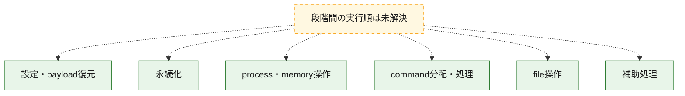
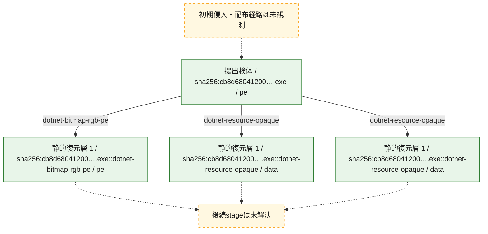
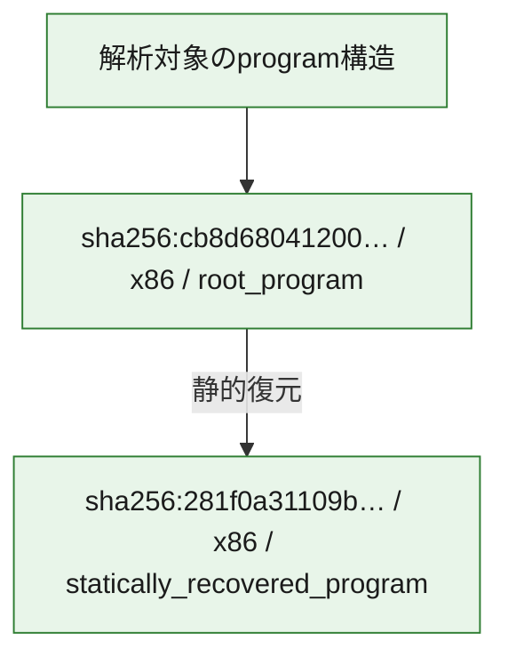

# 全体ロジック：cb8d68041200958ef7c8b1c5d5cb82c2545f2d89b67dd49c564242f2f009362c

代表関数の静的証跡から、設定・payload復元、永続化、process・memory操作、command分配・処理、file操作の処理群を確認しました。

## 読み方

- phaseの掲載順は解析上の整理順です。observed_call_edgesがない段階間の実行順を断定しません。
- 図の実線は静的に観測した関係、点線と黄色のノードは未観測・未解決の関係を示します。
- 図は静的な要約であり、動的実行を再現するものではありません。
- 詳細な関数解説とfingerprintは[STATIC-LOGIC.md](STATIC-LOGIC.md)を参照してください。

## 静的可視化

### 実行フロー

### 感染チェーン

### モジュール関係

## 処理段階

### 1. 設定・payload復元

設定、resource、payload、暗号化データの復元・変換を確認します。
確度: `confirmed_static_function_evidence`

- `281f0a31109ba3566ae24aad9d51a96464ffc1d21e36b6b6772663df2f0faac0:cil:0x06000003` — 暗号、hash、encoding、または復号処理に関係する関数です。 状態: `succeeded`、選定理由: `large_function:instructions=95`, `reviewed_call_centrality:2`, `role:cryptographic_transform`
- `281f0a31109ba3566ae24aad9d51a96464ffc1d21e36b6b6772663df2f0faac0:cil:0x06000005` — 設定、resource、payloadなどの解析・変換を行う関数です。 状態: `succeeded`、選定理由: `reviewed_call_centrality:6`, `role:config_or_data_transform`
- `281f0a31109ba3566ae24aad9d51a96464ffc1d21e36b6b6772663df2f0faac0:cil:0x06000049` — 暗号、hash、encoding、または復号処理に関係する関数です。 状態: `succeeded`、選定理由: `reviewed_call_centrality:4`, `role:cryptographic_transform`
- `cb8d68041200958ef7c8b1c5d5cb82c2545f2d89b67dd49c564242f2f009362c:cil:0x0600007f` — 設定、resource、payloadなどの解析・変換を行う関数です。 状態: `succeeded`、選定理由: `reviewed_call_centrality:8`, `role:config_or_data_transform`
- `cb8d68041200958ef7c8b1c5d5cb82c2545f2d89b67dd49c564242f2f009362c:cil:0x060000eb` — 暗号、hash、encoding、または復号処理に関係する関数です。 状態: `succeeded`、選定理由: `role:cryptographic_transform`
- `cb8d68041200958ef7c8b1c5d5cb82c2545f2d89b67dd49c564242f2f009362c:cil:0x06000114` — 設定、resource、payloadなどの解析・変換を行う関数です。 状態: `succeeded`、選定理由: `reviewed_call_centrality:4`, `role:config_or_data_transform`
- `cb8d68041200958ef7c8b1c5d5cb82c2545f2d89b67dd49c564242f2f009362c:cil:0x06000115` — 設定、resource、payloadなどの解析・変換を行う関数です。 状態: `succeeded`、選定理由: `reviewed_call_centrality:6`, `role:config_or_data_transform`
- `cb8d68041200958ef7c8b1c5d5cb82c2545f2d89b67dd49c564242f2f009362c:cil:0x06000116` — 設定、resource、payloadなどの解析・変換を行う関数です。 状態: `succeeded`、選定理由: `role:config_or_data_transform`
- `cb8d68041200958ef7c8b1c5d5cb82c2545f2d89b67dd49c564242f2f009362c:cil:0x06000117` — 設定、resource、payloadなどの解析・変換を行う関数です。 状態: `succeeded`、選定理由: `role:config_or_data_transform`
- `cb8d68041200958ef7c8b1c5d5cb82c2545f2d89b67dd49c564242f2f009362c:cil:0x06000118` — 設定、resource、payloadなどの解析・変換を行う関数です。 状態: `succeeded`、選定理由: `reviewed_call_centrality:4`, `role:config_or_data_transform`
- `cb8d68041200958ef7c8b1c5d5cb82c2545f2d89b67dd49c564242f2f009362c:cil:0x06000119` — 設定、resource、payloadなどの解析・変換を行う関数です。 状態: `succeeded`、選定理由: `role:config_or_data_transform`
- `cb8d68041200958ef7c8b1c5d5cb82c2545f2d89b67dd49c564242f2f009362c:cil:0x0600011a` — 設定、resource、payloadなどの解析・変換を行う関数です。 状態: `succeeded`、選定理由: `role:config_or_data_transform`
- `cb8d68041200958ef7c8b1c5d5cb82c2545f2d89b67dd49c564242f2f009362c:cil:0x06000128` — 暗号、hash、encoding、または復号処理に関係する関数です。 状態: `succeeded`、選定理由: `large_function:instructions=1040`, `reviewed_call_centrality:6`, `role:cryptographic_transform`

### 2. 永続化

自動起動や永続化に関係する設定変更を確認します。
確度: `confirmed_static_function_evidence`

- `281f0a31109ba3566ae24aad9d51a96464ffc1d21e36b6b6772663df2f0faac0:cil:0x0600001b` — 自動起動または永続化に関係する処理を含む関数です。 状態: `succeeded`、選定理由: `reviewed_call_centrality:10`, `role:persistence`
- `281f0a31109ba3566ae24aad9d51a96464ffc1d21e36b6b6772663df2f0faac0:cil:0x06000037` — 自動起動または永続化に関係する処理を含む関数です。 状態: `succeeded`、選定理由: `reviewed_call_centrality:6`, `role:persistence`
- `cb8d68041200958ef7c8b1c5d5cb82c2545f2d89b67dd49c564242f2f009362c:cil:0x060000a8` — 自動起動または永続化に関係する処理を含む関数です。 状態: `succeeded`、選定理由: `reviewed_call_centrality:6`, `role:persistence`

### 3. process・memory操作

process、thread、module、memory操作と実行移行を確認します。
確度: `confirmed_static_function_evidence`

- `281f0a31109ba3566ae24aad9d51a96464ffc1d21e36b6b6772663df2f0faac0:cil:0x06000017` — process、thread、module、またはmemory操作に関係する関数です。 状態: `succeeded`、選定理由: `large_function:instructions=96`, `reviewed_call_centrality:4`, `role:process_or_memory_operation`
- `cb8d68041200958ef7c8b1c5d5cb82c2545f2d89b67dd49c564242f2f009362c:cil:0x06000079` — process、thread、module、またはmemory操作に関係する関数です。 状態: `succeeded`、選定理由: `reviewed_call_centrality:4`, `role:process_or_memory_operation`
- `cb8d68041200958ef7c8b1c5d5cb82c2545f2d89b67dd49c564242f2f009362c:cil:0x0600007a` — process、thread、module、またはmemory操作に関係する関数です。 状態: `succeeded`、選定理由: `large_function:instructions=100`, `reviewed_call_centrality:16`, `role:process_or_memory_operation`
- `cb8d68041200958ef7c8b1c5d5cb82c2545f2d89b67dd49c564242f2f009362c:cil:0x0600007c` — process、thread、module、またはmemory操作に関係する関数です。 状態: `succeeded`、選定理由: `role:process_or_memory_operation`
- `cb8d68041200958ef7c8b1c5d5cb82c2545f2d89b67dd49c564242f2f009362c:cil:0x0600007d` — process、thread、module、またはmemory操作に関係する関数です。 状態: `succeeded`、選定理由: `role:process_or_memory_operation`
- `cb8d68041200958ef7c8b1c5d5cb82c2545f2d89b67dd49c564242f2f009362c:cil:0x060000b9` — process、thread、module、またはmemory操作に関係する関数です。 状態: `succeeded`、選定理由: `reviewed_call_centrality:6`, `role:process_or_memory_operation`
- `cb8d68041200958ef7c8b1c5d5cb82c2545f2d89b67dd49c564242f2f009362c:cil:0x060000c0` — process、thread、module、またはmemory操作に関係する関数です。 状態: `succeeded`、選定理由: `reviewed_call_centrality:4`, `role:process_or_memory_operation`
- `cb8d68041200958ef7c8b1c5d5cb82c2545f2d89b67dd49c564242f2f009362c:cil:0x060000c4` — process、thread、module、またはmemory操作に関係する関数です。 状態: `succeeded`、選定理由: `reviewed_call_centrality:6`, `role:process_or_memory_operation`
- `cb8d68041200958ef7c8b1c5d5cb82c2545f2d89b67dd49c564242f2f009362c:cil:0x060000ca` — process、thread、module、またはmemory操作に関係する関数です。 状態: `succeeded`、選定理由: `reviewed_call_centrality:4`, `role:process_or_memory_operation`
- `cb8d68041200958ef7c8b1c5d5cb82c2545f2d89b67dd49c564242f2f009362c:cil:0x060000ce` — process、thread、module、またはmemory操作に関係する関数です。 状態: `succeeded`、選定理由: `reviewed_call_centrality:6`, `role:process_or_memory_operation`
- `cb8d68041200958ef7c8b1c5d5cb82c2545f2d89b67dd49c564242f2f009362c:cil:0x060000d6` — process、thread、module、またはmemory操作に関係する関数です。 状態: `succeeded`、選定理由: `reviewed_call_centrality:4`, `role:process_or_memory_operation`
- `cb8d68041200958ef7c8b1c5d5cb82c2545f2d89b67dd49c564242f2f009362c:cil:0x060000da` — process、thread、module、またはmemory操作に関係する関数です。 状態: `succeeded`、選定理由: `reviewed_call_centrality:6`, `role:process_or_memory_operation`
- `cb8d68041200958ef7c8b1c5d5cb82c2545f2d89b67dd49c564242f2f009362c:cil:0x060000e0` — process、thread、module、またはmemory操作に関係する関数です。 状態: `succeeded`、選定理由: `reviewed_call_centrality:4`, `role:process_or_memory_operation`

### 4. command分配・処理

受信commandやtaskの解釈、分配、個別handlerへの移行を確認します。
確度: `confirmed_static_function_evidence`

- `281f0a31109ba3566ae24aad9d51a96464ffc1d21e36b6b6772663df2f0faac0:cil:0x06000008` — commandの解釈、分配、または個別処理を担当する関数です。 状態: `succeeded`、選定理由: `large_function:instructions=173`, `reviewed_call_centrality:14`, `role:command_dispatch_or_handler`
- `281f0a31109ba3566ae24aad9d51a96464ffc1d21e36b6b6772663df2f0faac0:cil:0x06000031` — commandの解釈、分配、または個別処理を担当する関数です。 状態: `succeeded`、選定理由: `large_function:instructions=1604`, `reviewed_call_centrality:28`, `role:command_dispatch_or_handler`
- `cb8d68041200958ef7c8b1c5d5cb82c2545f2d89b67dd49c564242f2f009362c:cil:0x06000071` — commandの解釈、分配、または個別処理を担当する関数です。 状態: `succeeded`、選定理由: `reviewed_call_centrality:8`, `role:command_dispatch_or_handler`
- `cb8d68041200958ef7c8b1c5d5cb82c2545f2d89b67dd49c564242f2f009362c:cil:0x060000af` — commandの解釈、分配、または個別処理を担当する関数です。 状態: `succeeded`、選定理由: `large_function:instructions=620`, `reviewed_call_centrality:72`, `role:command_dispatch_or_handler`
- `cb8d68041200958ef7c8b1c5d5cb82c2545f2d89b67dd49c564242f2f009362c:cil:0x060000f4` — commandの解釈、分配、または個別処理を担当する関数です。 状態: `succeeded`、選定理由: `large_function:instructions=137`, `reviewed_call_centrality:20`, `role:command_dispatch_or_handler`
- `cb8d68041200958ef7c8b1c5d5cb82c2545f2d89b67dd49c564242f2f009362c:cil:0x060000fc` — commandの解釈、分配、または個別処理を担当する関数です。 状態: `succeeded`、選定理由: `large_function:instructions=212`, `reviewed_call_centrality:52`, `role:command_dispatch_or_handler`
- `cb8d68041200958ef7c8b1c5d5cb82c2545f2d89b67dd49c564242f2f009362c:cil:0x06000104` — commandの解釈、分配、または個別処理を担当する関数です。 状態: `succeeded`、選定理由: `large_function:instructions=153`, `reviewed_call_centrality:30`, `role:command_dispatch_or_handler`
- `cb8d68041200958ef7c8b1c5d5cb82c2545f2d89b67dd49c564242f2f009362c:cil:0x0600010a` — commandの解釈、分配、または個別処理を担当する関数です。 状態: `succeeded`、選定理由: `large_function:instructions=106`, `reviewed_call_centrality:30`, `role:command_dispatch_or_handler`

### 5. file操作

fileやdirectoryの作成、読書き、削除を確認します。
確度: `confirmed_static_function_evidence`

- `281f0a31109ba3566ae24aad9d51a96464ffc1d21e36b6b6772663df2f0faac0:cil:0x06000015` — fileまたはdirectoryの読書き・管理に関係する関数です。 状態: `succeeded`、選定理由: `large_function:instructions=97`, `reviewed_call_centrality:10`, `role:file_operation`
- `281f0a31109ba3566ae24aad9d51a96464ffc1d21e36b6b6772663df2f0faac0:cil:0x0600003e` — fileまたはdirectoryの読書き・管理に関係する関数です。 状態: `succeeded`、選定理由: `large_function:instructions=103`, `reviewed_call_centrality:8`, `role:file_operation`
- `cb8d68041200958ef7c8b1c5d5cb82c2545f2d89b67dd49c564242f2f009362c:cil:0x0600007e` — fileまたはdirectoryの読書き・管理に関係する関数です。 状態: `succeeded`、選定理由: `reviewed_call_centrality:8`, `role:file_operation`
- `cb8d68041200958ef7c8b1c5d5cb82c2545f2d89b67dd49c564242f2f009362c:cil:0x060000ad` — fileまたはdirectoryの読書き・管理に関係する関数です。 状態: `succeeded`、選定理由: `reviewed_call_centrality:10`, `role:file_operation`

### 6. 補助処理

主要処理を支える一般内部関数またはlibrary処理を確認します。
確度: `confirmed_static_function_evidence`

- `281f0a31109ba3566ae24aad9d51a96464ffc1d21e36b6b6772663df2f0faac0:cil:0x06000001` — 検体内部の一般処理を実装する関数です。 状態: `succeeded`、選定理由: `reviewed_call_centrality:24`
- `281f0a31109ba3566ae24aad9d51a96464ffc1d21e36b6b6772663df2f0faac0:cil:0x06000002` — 検体内部の一般処理を実装する関数です。 状態: `succeeded`、選定理由: `reviewed_call_centrality:18`
- `281f0a31109ba3566ae24aad9d51a96464ffc1d21e36b6b6772663df2f0faac0:cil:0x06000007` — 検体内部の一般処理を実装する関数です。 状態: `succeeded`、選定理由: `reviewed_call_centrality:6`
- `281f0a31109ba3566ae24aad9d51a96464ffc1d21e36b6b6772663df2f0faac0:cil:0x0600000a` — 検体内部の一般処理を実装する関数です。 状態: `succeeded`、選定理由: `large_function:instructions=144`, `reviewed_call_centrality:6`
- `281f0a31109ba3566ae24aad9d51a96464ffc1d21e36b6b6772663df2f0faac0:cil:0x0600000b` — 検体内部の一般処理を実装する関数です。 状態: `succeeded`、選定理由: `large_function:instructions=124`, `reviewed_call_centrality:14`
- `281f0a31109ba3566ae24aad9d51a96464ffc1d21e36b6b6772663df2f0faac0:cil:0x0600000d` — 検体内部の一般処理を実装する関数です。 状態: `succeeded`、選定理由: `large_function:instructions=82`, `reviewed_call_centrality:10`
- `281f0a31109ba3566ae24aad9d51a96464ffc1d21e36b6b6772663df2f0faac0:cil:0x0600000e` — 検体内部の一般処理を実装する関数です。 状態: `succeeded`、選定理由: `large_function:instructions=95`, `reviewed_call_centrality:12`
- `281f0a31109ba3566ae24aad9d51a96464ffc1d21e36b6b6772663df2f0faac0:cil:0x0600000f` — 検体内部の一般処理を実装する関数です。 状態: `succeeded`、選定理由: `reviewed_call_centrality:10`
- `281f0a31109ba3566ae24aad9d51a96464ffc1d21e36b6b6772663df2f0faac0:cil:0x06000010` — 検体内部の一般処理を実装する関数です。 状態: `succeeded`、選定理由: `large_function:instructions=69`, `reviewed_call_centrality:6`
- `281f0a31109ba3566ae24aad9d51a96464ffc1d21e36b6b6772663df2f0faac0:cil:0x06000014` — 検体内部の一般処理を実装する関数です。 状態: `succeeded`、選定理由: `reviewed_call_centrality:10`
- `281f0a31109ba3566ae24aad9d51a96464ffc1d21e36b6b6772663df2f0faac0:cil:0x0600001a` — 検体内部の一般処理を実装する関数です。 状態: `succeeded`、選定理由: `large_function:instructions=256`, `reviewed_call_centrality:38`
- `281f0a31109ba3566ae24aad9d51a96464ffc1d21e36b6b6772663df2f0faac0:cil:0x0600001c` — 検体内部の一般処理を実装する関数です。 状態: `succeeded`、選定理由: `large_function:instructions=128`, `reviewed_call_centrality:24`
- `281f0a31109ba3566ae24aad9d51a96464ffc1d21e36b6b6772663df2f0faac0:cil:0x06000028` — 検体内部の一般処理を実装する関数です。 状態: `succeeded`、選定理由: `large_function:instructions=96`, `reviewed_call_centrality:12`
- `281f0a31109ba3566ae24aad9d51a96464ffc1d21e36b6b6772663df2f0faac0:cil:0x0600002e` — 検体内部の一般処理を実装する関数です。 状態: `succeeded`、選定理由: `large_function:instructions=158`, `reviewed_call_centrality:6`
- `281f0a31109ba3566ae24aad9d51a96464ffc1d21e36b6b6772663df2f0faac0:cil:0x06000030` — 検体内部の一般処理を実装する関数です。 状態: `succeeded`、選定理由: `reviewed_call_centrality:6`
- `281f0a31109ba3566ae24aad9d51a96464ffc1d21e36b6b6772663df2f0faac0:cil:0x06000032` — 検体内部の一般処理を実装する関数です。 状態: `succeeded`、選定理由: `large_function:instructions=144`, `reviewed_call_centrality:4`
- `281f0a31109ba3566ae24aad9d51a96464ffc1d21e36b6b6772663df2f0faac0:cil:0x06000035` — 検体内部の一般処理を実装する関数です。 状態: `succeeded`、選定理由: `large_function:instructions=102`, `reviewed_call_centrality:14`
- `281f0a31109ba3566ae24aad9d51a96464ffc1d21e36b6b6772663df2f0faac0:cil:0x06000038` — 検体内部の一般処理を実装する関数です。 状態: `succeeded`、選定理由: `reviewed_call_centrality:8`
- `281f0a31109ba3566ae24aad9d51a96464ffc1d21e36b6b6772663df2f0faac0:cil:0x0600003c` — 検体内部の一般処理を実装する関数です。 状態: `succeeded`、選定理由: `large_function:instructions=85`, `reviewed_call_centrality:18`
- `281f0a31109ba3566ae24aad9d51a96464ffc1d21e36b6b6772663df2f0faac0:cil:0x06000042` — 検体内部の一般処理を実装する関数です。 状態: `succeeded`、選定理由: `reviewed_call_centrality:6`
- `281f0a31109ba3566ae24aad9d51a96464ffc1d21e36b6b6772663df2f0faac0:cil:0x06000045` — 検体内部の一般処理を実装する関数です。 状態: `succeeded`、選定理由: `large_function:instructions=85`, `reviewed_call_centrality:16`
- `281f0a31109ba3566ae24aad9d51a96464ffc1d21e36b6b6772663df2f0faac0:cil:0x06000047` — 検体内部の一般処理を実装する関数です。 状態: `succeeded`、選定理由: `large_function:instructions=77`, `reviewed_call_centrality:6`
- `cb8d68041200958ef7c8b1c5d5cb82c2545f2d89b67dd49c564242f2f009362c:cil:0x06000096` — 検体内部の一般処理を実装する関数です。 状態: `succeeded`、選定理由: `large_function:instructions=565`, `reviewed_call_centrality:94`

## 観測したcall関係

- 代表関数間で直接解決できた呼出関係はありません。

## 解析範囲と制約

- 選定外関数は全体inventoryへ残しますが、関数本体の個別解説対象にはしていません。
- indirect call、難読化、packer、VM、壊れたcontrol flowによりcall関係が欠落する場合があります。
- 文書は静的解析に基づき、検体実行や外部通信による動的確認は行っていません。
