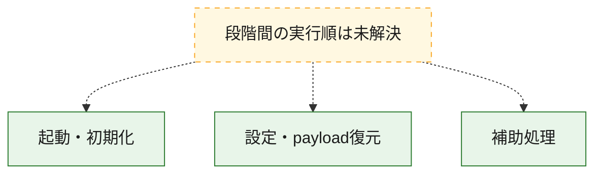
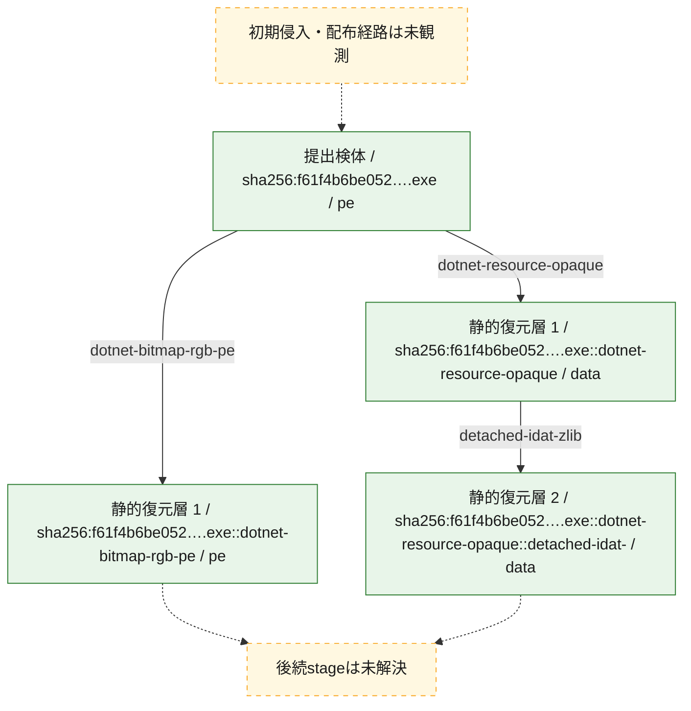
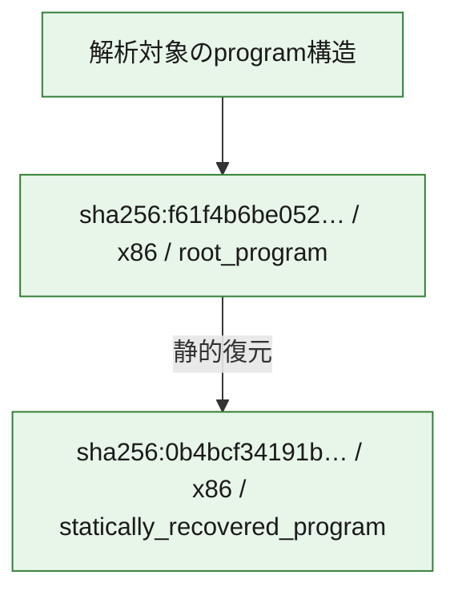

# 全体ロジック：f61f4b6be052b4bc7d2590edd37544f210e0b79df968e739a00e586de66dd86f

代表関数の静的証跡から、起動・初期化、設定・payload復元の処理群を確認しました。

## 読み方

- phaseの掲載順は解析上の整理順です。observed_call_edgesがない段階間の実行順を断定しません。
- 図の実線は静的に観測した関係、点線と黄色のノードは未観測・未解決の関係を示します。
- 図は静的な要約であり、動的実行を再現するものではありません。
- 詳細な関数解説とfingerprintは[STATIC-LOGIC.md](STATIC-LOGIC.md)を参照してください。

## 静的可視化

### 実行フロー

### 感染チェーン

### モジュール関係

## 処理段階

### 1. 起動・初期化

entry pointから初期化と後続処理への移行を確認します。
確度: `confirmed_static_function_evidence`

- `f61f4b6be052b4bc7d2590edd37544f210e0b79df968e739a00e586de66dd86f:cil:0x06000001` — 初期化と主要処理への分岐を行う入口関数です。 状態: `succeeded`、選定理由: `entry_point`, `reviewed_call_centrality:8`

### 2. 設定・payload復元

設定、resource、payload、暗号化データの復元・変換を確認します。
確度: `confirmed_static_function_evidence`

- `f61f4b6be052b4bc7d2590edd37544f210e0b79df968e739a00e586de66dd86f:cil:0x06000064` — 設定、resource、payloadなどの解析・変換を行う関数です。 状態: `succeeded`、選定理由: `reviewed_call_centrality:6`, `role:config_or_data_transform`

### 3. 補助処理

主要処理を支える一般内部関数またはlibrary処理を確認します。
確度: `confirmed_static_function_evidence`

- `0b4bcf34191bc7819a2c1a4d996142cf1126db8dd3e1a890b77c94a002ab5535:cil:0x06000001` — compiler生成処理または汎用library処理とみられる関数です。 状態: `succeeded`、選定理由: `reviewed_call_centrality:24`
- `0b4bcf34191bc7819a2c1a4d996142cf1126db8dd3e1a890b77c94a002ab5535:cil:0x06000002` — 検体内部の一般処理を実装する関数です。 状態: `succeeded`、選定理由: `reviewed_call_centrality:18`
- `0b4bcf34191bc7819a2c1a4d996142cf1126db8dd3e1a890b77c94a002ab5535:cil:0x06000004` — 検体内部の一般処理を実装する関数です。 状態: `succeeded`、選定理由: `reviewed_call_centrality:12`
- `0b4bcf34191bc7819a2c1a4d996142cf1126db8dd3e1a890b77c94a002ab5535:cil:0x06000008` — 検体内部の一般処理を実装する関数です。 状態: `succeeded`、選定理由: `large_function:instructions=179`, `reviewed_call_centrality:56`
- `0b4bcf34191bc7819a2c1a4d996142cf1126db8dd3e1a890b77c94a002ab5535:cil:0x0600000a` — 検体内部の一般処理を実装する関数です。 状態: `succeeded`、選定理由: `large_function:instructions=171`, `reviewed_call_centrality:16`
- `0b4bcf34191bc7819a2c1a4d996142cf1126db8dd3e1a890b77c94a002ab5535:cil:0x0600000b` — 検体内部の一般処理を実装する関数です。 状態: `succeeded`、選定理由: `large_function:instructions=123`, `reviewed_call_centrality:22`
- `0b4bcf34191bc7819a2c1a4d996142cf1126db8dd3e1a890b77c94a002ab5535:cil:0x0600000d` — 検体内部の一般処理を実装する関数です。 状態: `succeeded`、選定理由: `large_function:instructions=96`, `reviewed_call_centrality:16`
- `0b4bcf34191bc7819a2c1a4d996142cf1126db8dd3e1a890b77c94a002ab5535:cil:0x0600000e` — 検体内部の一般処理を実装する関数です。 状態: `succeeded`、選定理由: `large_function:instructions=111`, `reviewed_call_centrality:12`
- `0b4bcf34191bc7819a2c1a4d996142cf1126db8dd3e1a890b77c94a002ab5535:cil:0x0600000f` — 検体内部の一般処理を実装する関数です。 状態: `succeeded`、選定理由: `large_function:instructions=84`, `reviewed_call_centrality:16`
- `0b4bcf34191bc7819a2c1a4d996142cf1126db8dd3e1a890b77c94a002ab5535:cil:0x06000014` — 検体内部の一般処理を実装する関数です。 状態: `succeeded`、選定理由: `reviewed_call_centrality:12`
- `0b4bcf34191bc7819a2c1a4d996142cf1126db8dd3e1a890b77c94a002ab5535:cil:0x06000015` — 検体内部の一般処理を実装する関数です。 状態: `succeeded`、選定理由: `large_function:instructions=119`, `reviewed_call_centrality:18`
- `0b4bcf34191bc7819a2c1a4d996142cf1126db8dd3e1a890b77c94a002ab5535:cil:0x0600001b` — 検体内部の一般処理を実装する関数です。 状態: `succeeded`、選定理由: `reviewed_call_centrality:14`
- `0b4bcf34191bc7819a2c1a4d996142cf1126db8dd3e1a890b77c94a002ab5535:cil:0x0600001c` — 検体内部の一般処理を実装する関数です。 状態: `succeeded`、選定理由: `reviewed_call_centrality:14`
- `0b4bcf34191bc7819a2c1a4d996142cf1126db8dd3e1a890b77c94a002ab5535:cil:0x0600001d` — 検体内部の一般処理を実装する関数です。 状態: `succeeded`、選定理由: `reviewed_call_centrality:14`
- `0b4bcf34191bc7819a2c1a4d996142cf1126db8dd3e1a890b77c94a002ab5535:cil:0x06000029` — compiler生成処理または汎用library処理とみられる関数です。 状態: `succeeded`、選定理由: `large_function:instructions=76`, `reviewed_call_centrality:20`
- `0b4bcf34191bc7819a2c1a4d996142cf1126db8dd3e1a890b77c94a002ab5535:cil:0x06000034` — 検体内部の一般処理を実装する関数です。 状態: `succeeded`、選定理由: `large_function:instructions=107`, `reviewed_call_centrality:18`
- `0b4bcf34191bc7819a2c1a4d996142cf1126db8dd3e1a890b77c94a002ab5535:cil:0x0600003e` — 検体内部の一般処理を実装する関数です。 状態: `succeeded`、選定理由: `large_function:instructions=203`, `reviewed_call_centrality:12`
- `0b4bcf34191bc7819a2c1a4d996142cf1126db8dd3e1a890b77c94a002ab5535:cil:0x06000046` — 検体内部の一般処理を実装する関数です。 状態: `succeeded`、選定理由: `large_function:instructions=98`, `reviewed_call_centrality:22`
- `0b4bcf34191bc7819a2c1a4d996142cf1126db8dd3e1a890b77c94a002ab5535:cil:0x06000051` — 検体内部の一般処理を実装する関数です。 状態: `succeeded`、選定理由: `large_function:instructions=287`, `reviewed_call_centrality:8`
- `0b4bcf34191bc7819a2c1a4d996142cf1126db8dd3e1a890b77c94a002ab5535:cil:0x06000059` — 検体内部の一般処理を実装する関数です。 状態: `succeeded`、選定理由: `large_function:instructions=147`, `reviewed_call_centrality:24`
- `0b4bcf34191bc7819a2c1a4d996142cf1126db8dd3e1a890b77c94a002ab5535:cil:0x0600005b` — 検体内部の一般処理を実装する関数です。 状態: `succeeded`、選定理由: `large_function:instructions=213`, `reviewed_call_centrality:44`
- `0b4bcf34191bc7819a2c1a4d996142cf1126db8dd3e1a890b77c94a002ab5535:cil:0x0600005e` — 検体内部の一般処理を実装する関数です。 状態: `succeeded`、選定理由: `large_function:instructions=412`, `reviewed_call_centrality:6`
- `0b4bcf34191bc7819a2c1a4d996142cf1126db8dd3e1a890b77c94a002ab5535:cil:0x0600006d` — 検体内部の一般処理を実装する関数です。 状態: `succeeded`、選定理由: `large_function:instructions=150`, `reviewed_call_centrality:16`
- `0b4bcf34191bc7819a2c1a4d996142cf1126db8dd3e1a890b77c94a002ab5535:cil:0x06000072` — 検体内部の一般処理を実装する関数です。 状態: `succeeded`、選定理由: `large_function:instructions=110`, `reviewed_call_centrality:12`
- `0b4bcf34191bc7819a2c1a4d996142cf1126db8dd3e1a890b77c94a002ab5535:cil:0x0600007d` — 検体内部の一般処理を実装する関数です。 状態: `succeeded`、選定理由: `large_function:instructions=1558`, `reviewed_call_centrality:112`
- `0b4bcf34191bc7819a2c1a4d996142cf1126db8dd3e1a890b77c94a002ab5535:cil:0x0600007f` — 検体内部の一般処理を実装する関数です。 状態: `succeeded`、選定理由: `large_function:instructions=315`, `reviewed_call_centrality:12`
- `0b4bcf34191bc7819a2c1a4d996142cf1126db8dd3e1a890b77c94a002ab5535:cil:0x06000082` — 検体内部の一般処理を実装する関数です。 状態: `succeeded`、選定理由: `large_function:instructions=126`, `reviewed_call_centrality:12`
- `0b4bcf34191bc7819a2c1a4d996142cf1126db8dd3e1a890b77c94a002ab5535:cil:0x06000084` — 検体内部の一般処理を実装する関数です。 状態: `succeeded`、選定理由: `large_function:instructions=168`, `reviewed_call_centrality:10`
- `0b4bcf34191bc7819a2c1a4d996142cf1126db8dd3e1a890b77c94a002ab5535:cil:0x06000086` — 検体内部の一般処理を実装する関数です。 状態: `succeeded`、選定理由: `large_function:instructions=123`, `reviewed_call_centrality:14`
- `0b4bcf34191bc7819a2c1a4d996142cf1126db8dd3e1a890b77c94a002ab5535:cil:0x0600008a` — 検体内部の一般処理を実装する関数です。 状態: `succeeded`、選定理由: `large_function:instructions=237`, `reviewed_call_centrality:18`
- `0b4bcf34191bc7819a2c1a4d996142cf1126db8dd3e1a890b77c94a002ab5535:cil:0x0600008b` — 検体内部の一般処理を実装する関数です。 状態: `succeeded`、選定理由: `large_function:instructions=196`, `reviewed_call_centrality:20`
- `0b4bcf34191bc7819a2c1a4d996142cf1126db8dd3e1a890b77c94a002ab5535:cil:0x06000093` — 検体内部の一般処理を実装する関数です。 状態: `succeeded`、選定理由: `large_function:instructions=1551`, `reviewed_call_centrality:90`
- `f61f4b6be052b4bc7d2590edd37544f210e0b79df968e739a00e586de66dd86f:cil:0x06000008` — 検体内部の一般処理を実装する関数です。 状態: `succeeded`、選定理由: `large_function:instructions=1160`, `reviewed_call_centrality:18`
- `f61f4b6be052b4bc7d2590edd37544f210e0b79df968e739a00e586de66dd86f:cil:0x06000011` — 検体内部の一般処理を実装する関数です。 状態: `succeeded`、選定理由: `large_function:instructions=476`, `reviewed_call_centrality:98`
- `f61f4b6be052b4bc7d2590edd37544f210e0b79df968e739a00e586de66dd86f:cil:0x06000015` — 検体内部の一般処理を実装する関数です。 状態: `succeeded`、選定理由: `large_function:instructions=142`, `reviewed_call_centrality:22`
- `f61f4b6be052b4bc7d2590edd37544f210e0b79df968e739a00e586de66dd86f:cil:0x06000016` — 検体内部の一般処理を実装する関数です。 状態: `succeeded`、選定理由: `large_function:instructions=64`, `reviewed_call_centrality:26`
- `f61f4b6be052b4bc7d2590edd37544f210e0b79df968e739a00e586de66dd86f:cil:0x06000017` — 検体内部の一般処理を実装する関数です。 状態: `succeeded`、選定理由: `large_function:instructions=64`, `reviewed_call_centrality:26`
- `f61f4b6be052b4bc7d2590edd37544f210e0b79df968e739a00e586de66dd86f:cil:0x06000018` — 検体内部の一般処理を実装する関数です。 状態: `succeeded`、選定理由: `large_function:instructions=64`, `reviewed_call_centrality:26`
- `f61f4b6be052b4bc7d2590edd37544f210e0b79df968e739a00e586de66dd86f:cil:0x06000019` — 検体内部の一般処理を実装する関数です。 状態: `succeeded`、選定理由: `large_function:instructions=64`, `reviewed_call_centrality:26`
- `f61f4b6be052b4bc7d2590edd37544f210e0b79df968e739a00e586de66dd86f:cil:0x0600001a` — 検体内部の一般処理を実装する関数です。 状態: `succeeded`、選定理由: `large_function:instructions=64`, `reviewed_call_centrality:26`
- `f61f4b6be052b4bc7d2590edd37544f210e0b79df968e739a00e586de66dd86f:cil:0x0600001f` — 検体内部の一般処理を実装する関数です。 状態: `succeeded`、選定理由: `large_function:instructions=381`, `reviewed_call_centrality:76`
- `f61f4b6be052b4bc7d2590edd37544f210e0b79df968e739a00e586de66dd86f:cil:0x06000023` — 検体内部の一般処理を実装する関数です。 状態: `succeeded`、選定理由: `large_function:instructions=1124`, `reviewed_call_centrality:92`
- `f61f4b6be052b4bc7d2590edd37544f210e0b79df968e739a00e586de66dd86f:cil:0x06000025` — 検体内部の一般処理を実装する関数です。 状態: `succeeded`、選定理由: `large_function:instructions=99`, `reviewed_call_centrality:44`
- `f61f4b6be052b4bc7d2590edd37544f210e0b79df968e739a00e586de66dd86f:cil:0x06000026` — 検体内部の一般処理を実装する関数です。 状態: `succeeded`、選定理由: `large_function:instructions=151`, `reviewed_call_centrality:46`
- `f61f4b6be052b4bc7d2590edd37544f210e0b79df968e739a00e586de66dd86f:cil:0x0600002c` — 検体内部の一般処理を実装する関数です。 状態: `succeeded`、選定理由: `large_function:instructions=1248`, `reviewed_call_centrality:122`
- `f61f4b6be052b4bc7d2590edd37544f210e0b79df968e739a00e586de66dd86f:cil:0x0600002e` — 検体内部の一般処理を実装する関数です。 状態: `succeeded`、選定理由: `large_function:instructions=99`, `reviewed_call_centrality:40`
- `f61f4b6be052b4bc7d2590edd37544f210e0b79df968e739a00e586de66dd86f:cil:0x0600002f` — 検体内部の一般処理を実装する関数です。 状態: `succeeded`、選定理由: `large_function:instructions=80`, `reviewed_call_centrality:28`
- `f61f4b6be052b4bc7d2590edd37544f210e0b79df968e739a00e586de66dd86f:cil:0x06000035` — 検体内部の一般処理を実装する関数です。 状態: `succeeded`、選定理由: `large_function:instructions=1081`, `reviewed_call_centrality:128`
- `f61f4b6be052b4bc7d2590edd37544f210e0b79df968e739a00e586de66dd86f:cil:0x06000037` — 検体内部の一般処理を実装する関数です。 状態: `succeeded`、選定理由: `large_function:instructions=107`, `reviewed_call_centrality:34`
- `f61f4b6be052b4bc7d2590edd37544f210e0b79df968e739a00e586de66dd86f:cil:0x06000038` — 検体内部の一般処理を実装する関数です。 状態: `succeeded`、選定理由: `reviewed_call_centrality:22`
- `f61f4b6be052b4bc7d2590edd37544f210e0b79df968e739a00e586de66dd86f:cil:0x06000039` — 検体内部の一般処理を実装する関数です。 状態: `succeeded`、選定理由: `large_function:instructions=93`, `reviewed_call_centrality:38`
- `f61f4b6be052b4bc7d2590edd37544f210e0b79df968e739a00e586de66dd86f:cil:0x0600003b` — 検体内部の一般処理を実装する関数です。 状態: `succeeded`、選定理由: `large_function:instructions=801`, `reviewed_call_centrality:76`
- `f61f4b6be052b4bc7d2590edd37544f210e0b79df968e739a00e586de66dd86f:cil:0x06000041` — 検体内部の一般処理を実装する関数です。 状態: `succeeded`、選定理由: `large_function:instructions=172`, `reviewed_call_centrality:58`
- `f61f4b6be052b4bc7d2590edd37544f210e0b79df968e739a00e586de66dd86f:cil:0x06000042` — 検体内部の一般処理を実装する関数です。 状態: `succeeded`、選定理由: `large_function:instructions=113`, `reviewed_call_centrality:38`
- `f61f4b6be052b4bc7d2590edd37544f210e0b79df968e739a00e586de66dd86f:cil:0x06000043` — 検体内部の一般処理を実装する関数です。 状態: `succeeded`、選定理由: `large_function:instructions=91`, `reviewed_call_centrality:28`
- `f61f4b6be052b4bc7d2590edd37544f210e0b79df968e739a00e586de66dd86f:cil:0x06000058` — compiler生成処理または汎用library処理とみられる関数です。 状態: `succeeded`、選定理由: `reviewed_call_centrality:26`
- `f61f4b6be052b4bc7d2590edd37544f210e0b79df968e739a00e586de66dd86f:cil:0x06000059` — 検体内部の一般処理を実装する関数です。 状態: `succeeded`、選定理由: `large_function:instructions=144`, `reviewed_call_centrality:30`
- `f61f4b6be052b4bc7d2590edd37544f210e0b79df968e739a00e586de66dd86f:cil:0x0600005a` — 検体内部の一般処理を実装する関数です。 状態: `succeeded`、選定理由: `large_function:instructions=122`, `reviewed_call_centrality:32`
- `f61f4b6be052b4bc7d2590edd37544f210e0b79df968e739a00e586de66dd86f:cil:0x0600005f` — 検体内部の一般処理を実装する関数です。 状態: `succeeded`、選定理由: `reviewed_call_centrality:22`
- `f61f4b6be052b4bc7d2590edd37544f210e0b79df968e739a00e586de66dd86f:cil:0x06000060` — 検体内部の一般処理を実装する関数です。 状態: `succeeded`、選定理由: `large_function:instructions=117`, `reviewed_call_centrality:40`
- `f61f4b6be052b4bc7d2590edd37544f210e0b79df968e739a00e586de66dd86f:cil:0x06000062` — 検体内部の一般処理を実装する関数です。 状態: `succeeded`、選定理由: `large_function:instructions=75`, `reviewed_call_centrality:30`
- `f61f4b6be052b4bc7d2590edd37544f210e0b79df968e739a00e586de66dd86f:cil:0x060000a9` — compiler生成処理または汎用library処理とみられる関数です。 状態: `succeeded`、選定理由: `reviewed_call_centrality:28`

## 観測したcall関係

- 代表関数間で直接解決できた呼出関係はありません。

## 解析範囲と制約

- 選定外関数は全体inventoryへ残しますが、関数本体の個別解説対象にはしていません。
- indirect call、難読化、packer、VM、壊れたcontrol flowによりcall関係が欠落する場合があります。
- 文書は静的解析に基づき、検体実行や外部通信による動的確認は行っていません。
