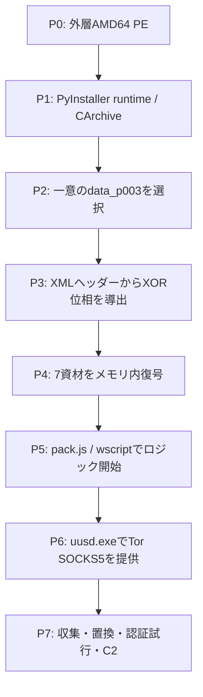
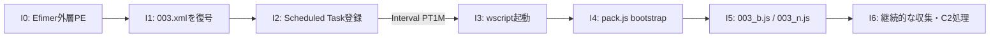
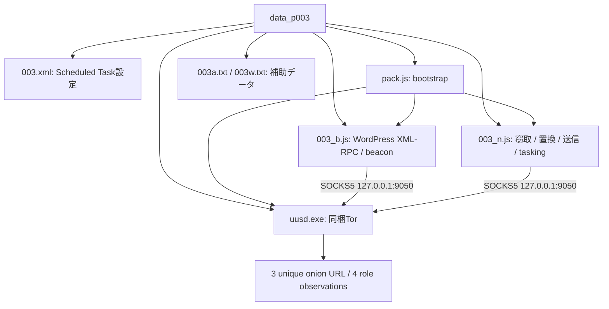

# Efimer全体ロジック `c5125a9712a4bece5cc1d53da1914ec5ac7ba147ab37242b03ce488bc2909137`

## 実行フロー

## 感染・永続化チェーン

## モジュール関係

## 4件の比較

| 検体SHA-256 | 位相SHA-256 | bundle | 復号資材 | C2（一意/観測） |
|---|---|---|---|---|
| `599584e6e42436721a66c2d3fbc29fe0d9be0b0e3f9e0f5f0333293e293920fc` | `7413152edc4ee06606ef3ecd6a04aca7a3317fa56fcf43e2db4914b05f153a61` | `003` | 7/7一致 | 3 / 4 |
| `604540e8f61d04ed0bde2678ace8d1d9a43461e0a2b8533d371891d6bf4089a2` | `1210d21940065543d10d5f69af6aced0a5304489e76152f172e0dd591a25cc13` | `003` | 7/7一致 | 3 / 4 |
| `c5125a9712a4bece5cc1d53da1914ec5ac7ba147ab37242b03ce488bc2909137` | `00560a0c1c608054c670a140a7fbc8b9f51c96ee050ebbb69f209c71796b3cbf` | `003` | 7/7一致 | 3 / 4 |
| `cdde719462e36f6a902e40859fab9e057acc944a02cc56c43353ab449efe6105` | `155d0d3ada455024542f81bf60ec9a40050677c3d2f02491593605689c25fefe` | `003` | 7/7一致 | 3 / 4 |

### 比較結論

- 外層SHA-256、暗号化entry hash、12 byte位相hashは検体ごとに異なります。
- 復号後7資材のSHA-256、13特徴関数、3つの一意onion URL、4役割観測はすべて一致します。
- 同じbuilder/templateまたは同一operation clusterの可能性は高い一方、攻撃者同一性の断定材料にはしません。
