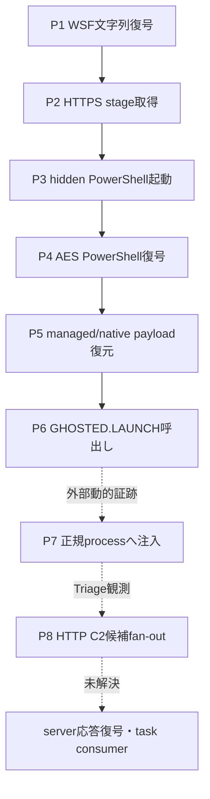
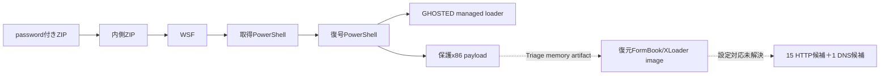
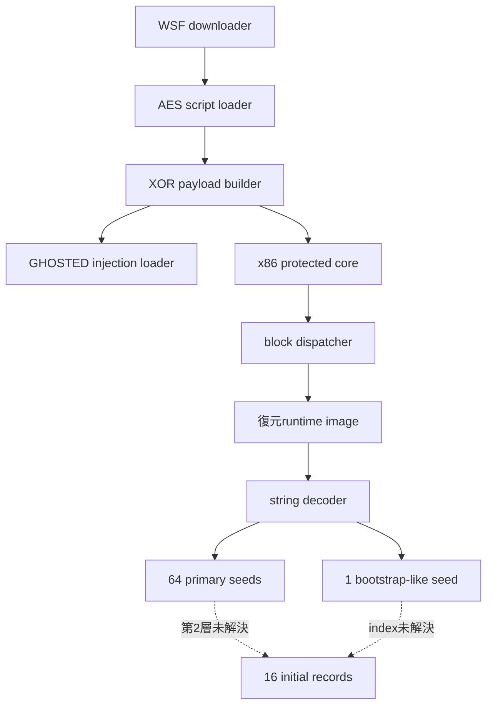

# 全体ロジック

以下の図は静的証跡と完全SHA-256一致のTriage外部動的証跡を分けて表現します。実線は確認済みの親子・call・復元関係、点線は外部動的証跡または未解決の対応です。

### 実行フロー

### 感染チェーン

### モジュール関係

## 比較プロファイル

| 軸 | 本件 |
|---|---|
| 配布 | 日本語名ZIP → WSF |
| stage | HTTPS取得PowerShell |
| 復号 | RC4、AES-256-CBC、Base64＋反復XOR |
| 注入 | managed GHOSTED loader → 正規32-bit process |
| native保護 | selector dispatcher＋算術delay stub |
| C2設定構造 | 64 primary seed＋1 isolated bootstrap-like seed |
| 通信 | HTTP/80、POST×4＋GET、候補fan-out |
| family | FormBook/XLoader |
| 世代 | XLoader v8.1+互換の可能性 |

## 他ケースとの比較

既存のGuLoader→XLoaderケース`8d96249a…`と、少なくとも次の独立軸が一致します。

1. 64件の連続network seed＋1件の分離bootstrap seedという設定構造。
2. TCP上のHTTP、16 initial record、複数候補fan-outという通信構造。
3. 20-byte導出鍵とRC4系置換を用いる復号primitive。

一方、本件はWSF→PowerShell→GHOSTED loaderであり、既存ケースのGuLoader配布chainとは異なります。同一campaignやactorとは判断しません。
