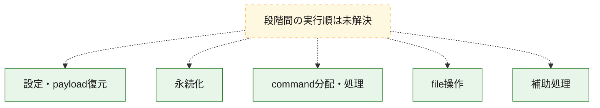
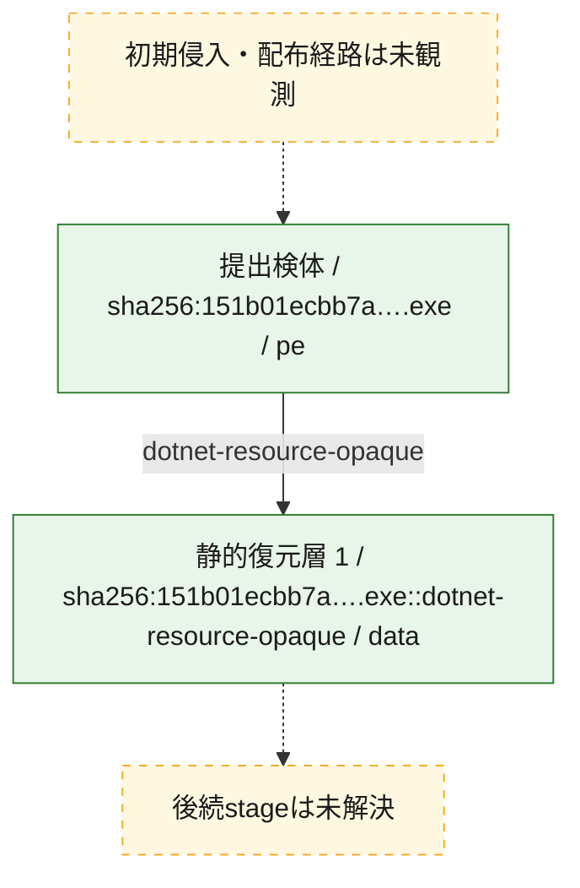
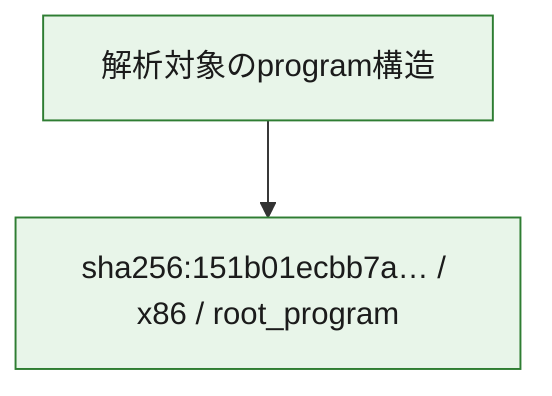

# 全体ロジック：151b01ecbb7aca8b8a3e82f2e74c4f496e95046b89601a2482e6dcb3d570d78c

代表関数の静的証跡から、設定・payload復元、永続化、command分配・処理、file操作の処理群を確認しました。

## 読み方

- phaseの掲載順は解析上の整理順です。observed_call_edgesがない段階間の実行順を断定しません。
- 図の実線は静的に観測した関係、点線と黄色のノードは未観測・未解決の関係を示します。
- 図は静的な要約であり、動的実行を再現するものではありません。
- 詳細な関数解説とfingerprintは[STATIC-LOGIC.md](STATIC-LOGIC.md)を参照してください。

## 静的可視化

### 実行フロー

### 感染チェーン

### モジュール関係

## 処理段階

### 1. 設定・payload復元

設定、resource、payload、暗号化データの復元・変換を確認します。
確度: `confirmed_static_function_evidence`

- `151b01ecbb7aca8b8a3e82f2e74c4f496e95046b89601a2482e6dcb3d570d78c:cil:0x0600000c` — 設定、resource、payloadなどの解析・変換を行う関数です。 状態: `succeeded`、選定理由: `large_function:instructions=163`, `reviewed_call_centrality:28`, `role:config_or_data_transform`
- `151b01ecbb7aca8b8a3e82f2e74c4f496e95046b89601a2482e6dcb3d570d78c:cil:0x06000024` — 設定、resource、payloadなどの解析・変換を行う関数です。 状態: `succeeded`、選定理由: `reviewed_call_centrality:10`, `role:config_or_data_transform`
- `151b01ecbb7aca8b8a3e82f2e74c4f496e95046b89601a2482e6dcb3d570d78c:cil:0x06000075` — 暗号、hash、encoding、または復号処理に関係する関数です。 状態: `succeeded`、選定理由: `large_function:instructions=413`, `reviewed_call_centrality:48`, `role:cryptographic_transform`
- `151b01ecbb7aca8b8a3e82f2e74c4f496e95046b89601a2482e6dcb3d570d78c:cil:0x060000d1` — 設定、resource、payloadなどの解析・変換を行う関数です。 状態: `succeeded`、選定理由: `large_function:instructions=77`, `reviewed_call_centrality:24`, `role:config_or_data_transform`
- `151b01ecbb7aca8b8a3e82f2e74c4f496e95046b89601a2482e6dcb3d570d78c:cil:0x060000f3` — 設定、resource、payloadなどの解析・変換を行う関数です。 状態: `succeeded`、選定理由: `large_function:instructions=120`, `reviewed_call_centrality:20`, `role:config_or_data_transform`
- `151b01ecbb7aca8b8a3e82f2e74c4f496e95046b89601a2482e6dcb3d570d78c:cil:0x060001ab` — 設定、resource、payloadなどの解析・変換を行う関数です。 状態: `succeeded`、選定理由: `large_function:instructions=865`, `reviewed_call_centrality:122`, `role:config_or_data_transform`
- `151b01ecbb7aca8b8a3e82f2e74c4f496e95046b89601a2482e6dcb3d570d78c:cil:0x0600020d` — 設定、resource、payloadなどの解析・変換を行う関数です。 状態: `succeeded`、選定理由: `large_function:instructions=3969`, `reviewed_call_centrality:358`, `role:config_or_data_transform`
- `151b01ecbb7aca8b8a3e82f2e74c4f496e95046b89601a2482e6dcb3d570d78c:cil:0x0600028f` — 暗号、hash、encoding、または復号処理に関係する関数です。 状態: `succeeded`、選定理由: `reviewed_call_centrality:8`, `role:cryptographic_transform`
- `151b01ecbb7aca8b8a3e82f2e74c4f496e95046b89601a2482e6dcb3d570d78c:cil:0x06000290` — 設定、resource、payloadなどの解析・変換を行う関数です。 状態: `succeeded`、選定理由: `large_function:instructions=134`, `reviewed_call_centrality:24`, `role:config_or_data_transform`
- `151b01ecbb7aca8b8a3e82f2e74c4f496e95046b89601a2482e6dcb3d570d78c:cil:0x06000294` — 暗号、hash、encoding、または復号処理に関係する関数です。 状態: `succeeded`、選定理由: `large_function:instructions=191`, `reviewed_call_centrality:6`, `role:cryptographic_transform`
- `151b01ecbb7aca8b8a3e82f2e74c4f496e95046b89601a2482e6dcb3d570d78c:cil:0x06000296` — 暗号、hash、encoding、または復号処理に関係する関数です。 状態: `succeeded`、選定理由: `large_function:instructions=201`, `reviewed_call_centrality:6`, `role:cryptographic_transform`

### 2. 永続化

自動起動や永続化に関係する設定変更を確認します。
確度: `confirmed_static_function_evidence`

- `151b01ecbb7aca8b8a3e82f2e74c4f496e95046b89601a2482e6dcb3d570d78c:cil:0x0600002f` — 自動起動または永続化に関係する処理を含む関数です。 状態: `succeeded`、選定理由: `reviewed_call_centrality:8`, `role:persistence`
- `151b01ecbb7aca8b8a3e82f2e74c4f496e95046b89601a2482e6dcb3d570d78c:cil:0x06000030` — 自動起動または永続化に関係する処理を含む関数です。 状態: `succeeded`、選定理由: `reviewed_call_centrality:10`, `role:persistence`
- `151b01ecbb7aca8b8a3e82f2e74c4f496e95046b89601a2482e6dcb3d570d78c:cil:0x0600006f` — 自動起動または永続化に関係する処理を含む関数です。 状態: `succeeded`、選定理由: `large_function:instructions=188`, `reviewed_call_centrality:56`, `role:persistence`
- `151b01ecbb7aca8b8a3e82f2e74c4f496e95046b89601a2482e6dcb3d570d78c:cil:0x0600007c` — 自動起動または永続化に関係する処理を含む関数です。 状態: `succeeded`、選定理由: `large_function:instructions=2737`, `reviewed_call_centrality:306`, `role:persistence`
- `151b01ecbb7aca8b8a3e82f2e74c4f496e95046b89601a2482e6dcb3d570d78c:cil:0x060000c9` — 自動起動または永続化に関係する処理を含む関数です。 状態: `succeeded`、選定理由: `large_function:instructions=215`, `reviewed_call_centrality:78`, `role:persistence`
- `151b01ecbb7aca8b8a3e82f2e74c4f496e95046b89601a2482e6dcb3d570d78c:cil:0x060000d0` — 自動起動または永続化に関係する処理を含む関数です。 状態: `succeeded`、選定理由: `large_function:instructions=183`, `reviewed_call_centrality:32`, `role:persistence`
- `151b01ecbb7aca8b8a3e82f2e74c4f496e95046b89601a2482e6dcb3d570d78c:cil:0x060000e3` — 自動起動または永続化に関係する処理を含む関数です。 状態: `succeeded`、選定理由: `large_function:instructions=136`, `reviewed_call_centrality:16`, `role:persistence`
- `151b01ecbb7aca8b8a3e82f2e74c4f496e95046b89601a2482e6dcb3d570d78c:cil:0x06000103` — 自動起動または永続化に関係する処理を含む関数です。 状態: `succeeded`、選定理由: `large_function:instructions=5320`, `reviewed_call_centrality:442`, `role:persistence`
- `151b01ecbb7aca8b8a3e82f2e74c4f496e95046b89601a2482e6dcb3d570d78c:cil:0x060001a6` — 自動起動または永続化に関係する処理を含む関数です。 状態: `succeeded`、選定理由: `large_function:instructions=200`, `reviewed_call_centrality:46`, `role:persistence`
- `151b01ecbb7aca8b8a3e82f2e74c4f496e95046b89601a2482e6dcb3d570d78c:cil:0x060001a8` — 自動起動または永続化に関係する処理を含む関数です。 状態: `succeeded`、選定理由: `large_function:instructions=157`, `reviewed_call_centrality:38`, `role:persistence`
- `151b01ecbb7aca8b8a3e82f2e74c4f496e95046b89601a2482e6dcb3d570d78c:cil:0x060001b0` — 自動起動または永続化に関係する処理を含む関数です。 状態: `succeeded`、選定理由: `large_function:instructions=267`, `reviewed_call_centrality:26`, `role:persistence`
- `151b01ecbb7aca8b8a3e82f2e74c4f496e95046b89601a2482e6dcb3d570d78c:cil:0x060001b1` — 自動起動または永続化に関係する処理を含む関数です。 状態: `succeeded`、選定理由: `large_function:instructions=327`, `reviewed_call_centrality:24`, `role:persistence`
- `151b01ecbb7aca8b8a3e82f2e74c4f496e95046b89601a2482e6dcb3d570d78c:cil:0x060001b2` — 自動起動または永続化に関係する処理を含む関数です。 状態: `succeeded`、選定理由: `large_function:instructions=125`, `reviewed_call_centrality:16`, `role:persistence`
- `151b01ecbb7aca8b8a3e82f2e74c4f496e95046b89601a2482e6dcb3d570d78c:cil:0x06000206` — 自動起動または永続化に関係する処理を含む関数です。 状態: `succeeded`、選定理由: `reviewed_call_centrality:10`, `role:persistence`
- `151b01ecbb7aca8b8a3e82f2e74c4f496e95046b89601a2482e6dcb3d570d78c:cil:0x06000207` — 自動起動または永続化に関係する処理を含む関数です。 状態: `succeeded`、選定理由: `reviewed_call_centrality:10`, `role:persistence`

### 3. command分配・処理

受信commandやtaskの解釈、分配、個別handlerへの移行を確認します。
確度: `confirmed_static_function_evidence`

- `151b01ecbb7aca8b8a3e82f2e74c4f496e95046b89601a2482e6dcb3d570d78c:cil:0x0600007a` — commandの解釈、分配、または個別処理を担当する関数です。 状態: `succeeded`、選定理由: `reviewed_call_centrality:10`, `role:command_dispatch_or_handler`
- `151b01ecbb7aca8b8a3e82f2e74c4f496e95046b89601a2482e6dcb3d570d78c:cil:0x060001a2` — commandの解釈、分配、または個別処理を担当する関数です。 状態: `succeeded`、選定理由: `reviewed_call_centrality:10`, `role:command_dispatch_or_handler`
- `151b01ecbb7aca8b8a3e82f2e74c4f496e95046b89601a2482e6dcb3d570d78c:cil:0x0600020b` — commandの解釈、分配、または個別処理を担当する関数です。 状態: `succeeded`、選定理由: `reviewed_call_centrality:8`, `role:command_dispatch_or_handler`

### 4. file操作

fileやdirectoryの作成、読書き、削除を確認します。
確度: `confirmed_static_function_evidence`

- `151b01ecbb7aca8b8a3e82f2e74c4f496e95046b89601a2482e6dcb3d570d78c:cil:0x060000d2` — fileまたはdirectoryの読書き・管理に関係する関数です。 状態: `succeeded`、選定理由: `large_function:instructions=411`, `reviewed_call_centrality:54`, `role:file_operation`
- `151b01ecbb7aca8b8a3e82f2e74c4f496e95046b89601a2482e6dcb3d570d78c:cil:0x060000df` — fileまたはdirectoryの読書き・管理に関係する関数です。 状態: `succeeded`、選定理由: `large_function:instructions=132`, `reviewed_call_centrality:16`, `role:file_operation`

### 5. 補助処理

主要処理を支える一般内部関数またはlibrary処理を確認します。
確度: `confirmed_static_function_evidence`

- `151b01ecbb7aca8b8a3e82f2e74c4f496e95046b89601a2482e6dcb3d570d78c:cil:0x060001ac` — 検体内部の一般処理を実装する関数です。 状態: `succeeded`、選定理由: `large_function:instructions=164`, `reviewed_call_centrality:56`

## 観測したcall関係

- 代表関数間で直接解決できた呼出関係はありません。

## 解析範囲と制約

- 選定外関数は全体inventoryへ残しますが、関数本体の個別解説対象にはしていません。
- indirect call、難読化、packer、VM、壊れたcontrol flowによりcall関係が欠落する場合があります。
- 文書は静的解析に基づき、検体実行や外部通信による動的確認は行っていません。
