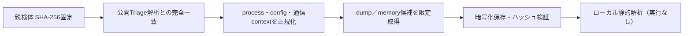

# Triage公開解析・後段取得証跡

## 完全ハッシュ一致

- [260803-pacsqsam5v](https://tria.ge/260803-pacsqsam5v): ファミリー候補 `formbook`、評価score `10`
- [260803-nhxmfahq2y](https://tria.ge/260803-nhxmfahq2y): ファミリー候補 `formbook`、評価score `10`
- [240226-dxbneabe32](https://tria.ge/240226-dxbneabe32): ファミリー候補 `未確定`、評価score `7`

## プロセス・通信

- 観測process: `AWB_NO_907853880911.exe, DHL_AWB#6078538091.exe, Explorer.EXE, Firefox.exe, WerFault.exe, a6d4a7d43d4868e871e0caac0ac2cbaa742a1c0a2416ce70c43a5e1c418d4a64.exe, dvdplay.exe, explorer.exe, powershell.exe, rundll32.exe, taskmgr.exe`
- raw commandは保存せず、command SHA-256と処理patternだけをJSONへ保持しています。
- sandbox background trafficは`context_only`であり、C2へ自動昇格しません。

- 取得できませんでした。

## 二段目成果物

- 取得できませんでした。

## 判定境界

Triage由来のfamily、process、config、通信は外部sandbox証跡です。config extractorが返したendpointはC2候補として扱えますが、
静的設定復元またはprocess帰属とprotocol応答が揃うまでは確認済みC2とはしません。取得成果物と検体は実行していません。
