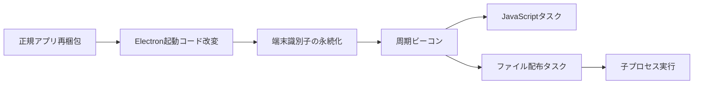

# 全体ロジックと比較軸

## 他ケースとの比較に使う固定軸

- フェーズ1: 正規 Electron アプリケーションの再梱包。
- フェーズ2: `app.asar` 内のエントリーポイント改変。
- フェーズ3: ファイルベースの端末IDとログオン時起動。
- フェーズ4: 固定周期のHTTPSビーコン。
- フェーズ5: `eval` または Base64 ファイル展開によるタスク実行。

この5軸に加え、C2パス、周期、応答キー、端末ID形式、キャンペーン文字列を比較する。同じ Franz を装うだけでは同一キャンペーンと判定しない。