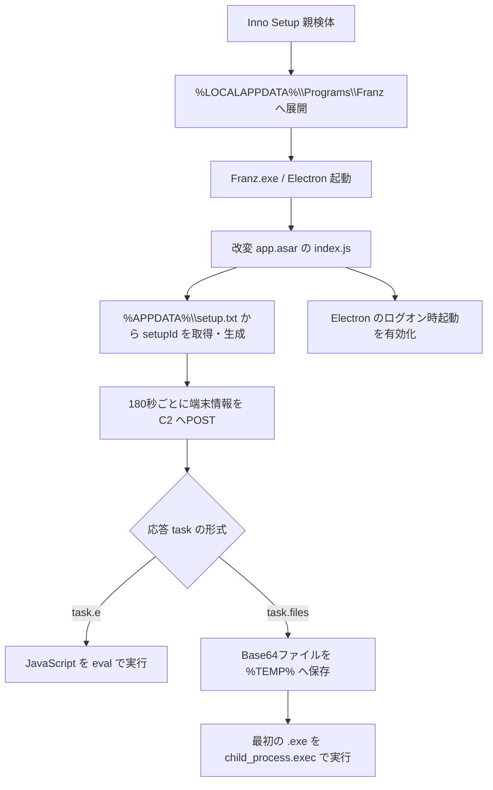

# Franz Electron バックドア ケース 9c0a88ea…

## 結論

本検体は HijackLoader ではない。正規のメッセージングクライアント Franz 5.10.0 を Inno Setup で再梱包し、`app.asar` の起動スクリプトへバックドアを追加した改変 Electron アプリケーションである。ローカルでは暫定ファミリー名を `franz-electron-backdoor` とする。既知製品名や攻撃者への帰属を意味しない。

- 親検体 SHA-256: `9c0a88ea53c4e0324157542385a1d342101feb51cf7b8cf76e9441376f1f522a`
- 表示名: Franz 5.10.0
- 配布方式: Inno Setup
- C2候補: `https://web-telegram[.]ug/api/`
- 解析方式: 静的展開と JavaScript の制御フロー確認
- 実行・外部通信: 実施していない

## 感染・実行チェーン

## 詳細な静的ロジック

1. `app.setLoginItemSettings` により Franz をログオン時に起動する。
2. `%APPDATA%\setup.txt` に8文字のランダム識別子を保存し、再起動後も同じ端末を追跡する。
3. `COMPUTERNAME`、`USERNAME`、`setupId`、配布物の `readme.txt` から得たキャンペーン識別子を JSON 配列として送信する。
4. 通信は180秒間隔で行われる。TLS証明書検証を無効化する `rejectUnauthorized: false` が設定されている。
5. 応答に `task.e` がある場合は `eval` で任意の JavaScript を実行する。
6. 応答に `task.files` がある場合は Base64 を復号して時刻名の一時ディレクトリへ保存し、最初の `.exe` を起動する。
7. デバッガ時間差、コンソール無効化、JavaScript整合性確認を組み合わせた解析妨害を備える。

## 評価

C2命令に JavaScript 実行と任意ファイル実行の二系統があるため、追加ペイロードの種類を限定しない汎用バックドアである。今回の静的解析では後段ペイロードそのものは内包されておらず、C2応答依存である。C2へ接続していないため稼働状態や追加コマンドの有無は未確認である。

詳細は [STATIC-LOGIC.md](STATIC-LOGIC.md)、比較可能な全体図は [OVERALL-LOGIC.md](OVERALL-LOGIC.md)、公開IOCは [IOC-LIST.md](IOC-LIST.md) を参照すること。