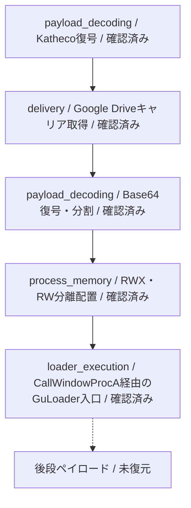
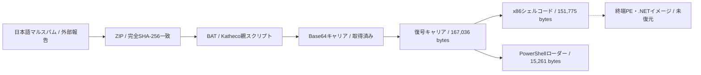
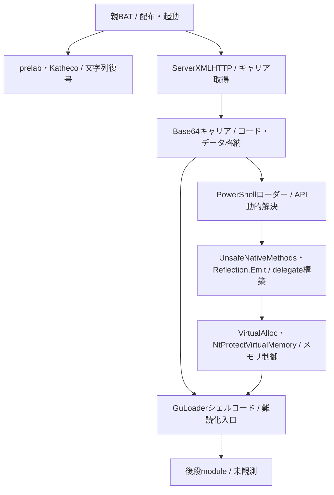

# 全体ロジックとモジュール関係

本文書は、親BAT、静的に復元したキャリア、PowerShellメモリローダー、Ghidra MCPで確認したx86 GuLoader入口の関係を整理します。実線は静的に確認したcallまたは復元関係、点線は未復元の後段を示します。

## 静的可視化

### 実行フロー

### 感染チェーン

### モジュール関係

## 処理段階

1. 親BATは数値配列を8-byte鍵で減算復号し、Katheco関数を構成します。
2. KathecoはBase64復号後に同じ鍵で反復XORし、URL、COM名、PowerShell式を復元します。
3. 取得したキャリア全体をBase64復号し、親BAT内の2つの長さでシェルコードとPowerShellへ分割します。
4. PowerShellはReflection.Emitでdelegate型を作り、VirtualAllocで確保したRWXとRW領域へコードとデータを分離コピーします。
5. CallWindowProcAのcallbackとしてGuLoader入口へ制御を渡します。
6. GuLoader入口は516命令、156 basic block、150本の無条件jumpを持ち、MMX/SSE命令とjunkを使う制御フロー難読化を行います。
7. 公開Triageの3メモリ成果物を比較しましたが、完全な後段PEまたは.NETイメージは残存していませんでした。

## 比較プロファイル

- 共通phase ID: `payload_decoding`、`delivery`、`process_memory`、`loader_execution`
- 復元層: ZIP→BAT→ファイル全体Base64キャリア→x86シェルコード＋PowerShell
- module: Katheco復号器、HTTP取得、Reflection.Emitローダー、GuLoader入口
- 特徴: 9,511-byte RWX領域、大型RW領域、CallWindowProcA経由の起動
- 比較可能なfingerprint: 7スクリプト処理単位のsemantic fingerprint。難読化入口のopcode hashは未作成

## 他ケースとの比較

| 観点 | 既存GuLoader知識 | 本件 |
|---|---|---|
| 配布 | マルスパム、クラウドストレージ悪用 | 日本語マルスパム、Google Drive |
| 復元層 | 暗号化・難読化キャリア | ファイル全体Base64、Katheco復号 |
| 実行 | シェルコードとAPI動的解決 | Reflection.Emit、CallWindowProcA |
| 解析妨害 | jump、junk、例外、anti-analysis | MMX/SSEと150本の無条件jump |
| 後段 | campaignごとに異なる | 未復元 |

Katheco、Ovenly.Foa、固定分割サイズ、CallWindowProcAとNtProtectVirtualMemoryの引数関係は、近接variantのreview候補を探す複数軸に使えます。ただし、これらの一致だけでcampaignまたはactorの同一性を確定しません。

## 解析限界

Triageの同一仮想領域2時点で104,741 bytesの変化を確認しましたが、PE、.NET metadata、ZIP、DOS stubを構築できる完全イメージは得られませんでした。次に必要な最小追加証跡は、最終復号直後のフルプロセスメモリ、RWX遷移直後のページ、または同一campaignの完全な後段ペイロードです。
