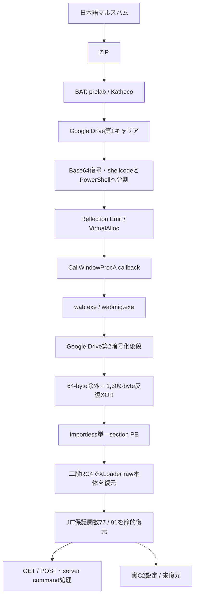
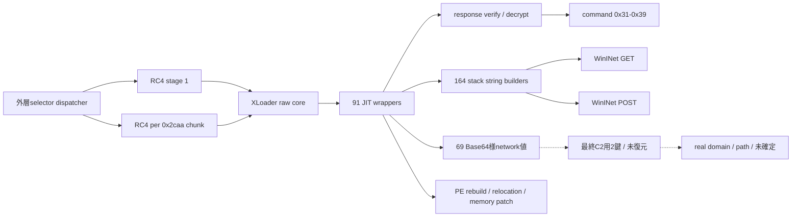
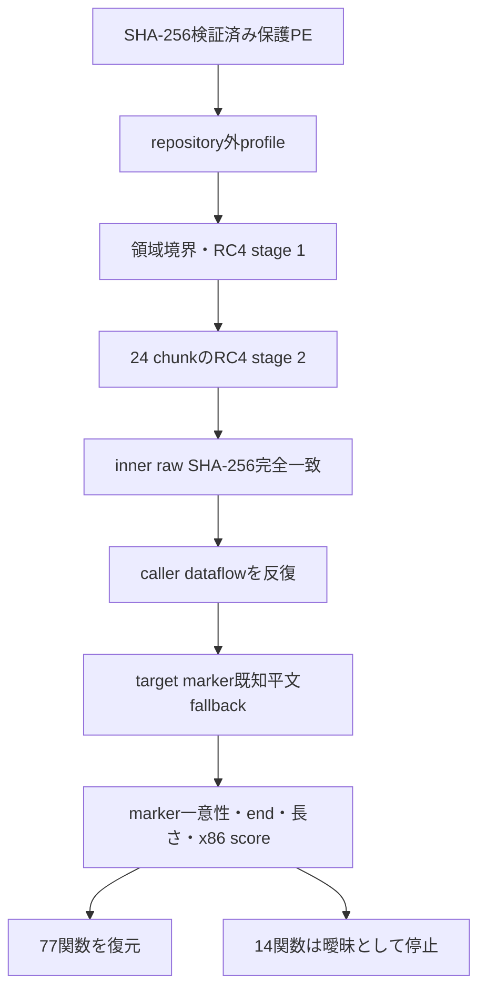

# 全体ロジックとモジュール関係

## 実行・感染チェーン

## 内側モジュール関係

## 静的復元処理

## 類似性比較の軸

| 層 | 安定しやすい特徴 | 検体ごとに変化しやすい特徴 |
|---|---|---|
| GuLoader script | Katheco、Base64、memory callback | 関数名、Drive ID、分割サイズ |
| GuLoader後段 | 先頭padding除外、長周期XOR | padding長、鍵長、鍵値 |
| XLoader外層 | RC4二段、chunk処理、JIT wrapper | base dword、XOR定数、marker |
| XLoader network | decoy群と離れたreal候補、GET／POST、response検証 | C2鍵、domain、path、User-Agent |
| 機能本体 | PE再構築、memory処理、anti-analysis | 個別命令列、command実装 |

この比較軸は近接variantの候補抽出に使えますが、単一特徴で同一campaignや同一actorを確定しません。
