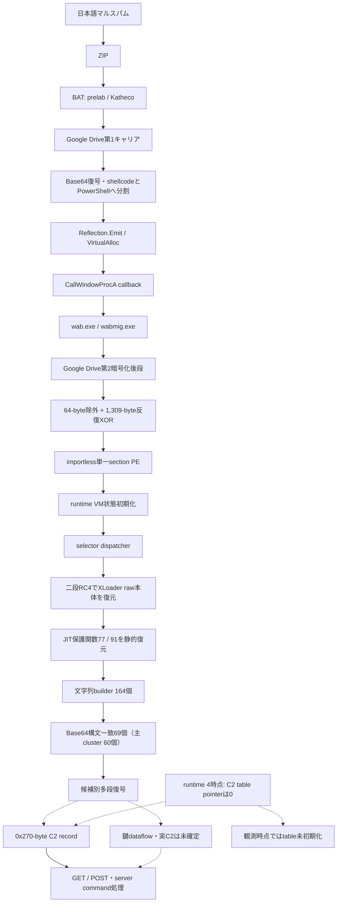
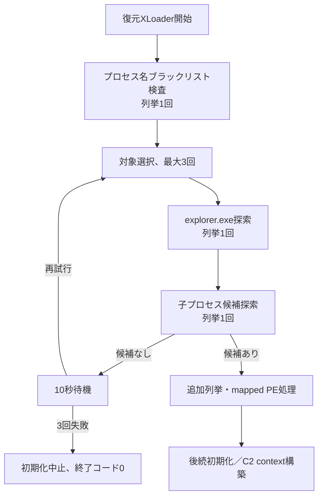
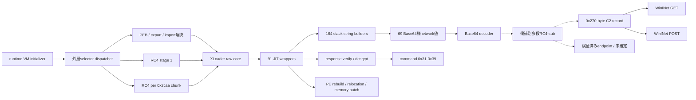
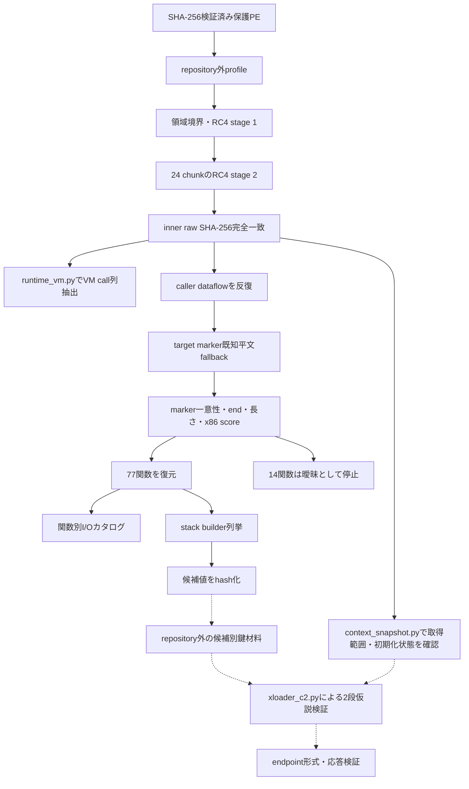

# 全体ロジックとモジュール関係

## 実行・感染チェーン

## XLoader初期化ゲート

本検体のTriage観測は列挙7回、10秒待機3回、約31秒後の正常終了でした。候補利用時の追加列挙がないため、適格な`explorer.exe`子プロセスが3試行とも0だった経路と一致します。反解析ブラックリストは別に存在しますが、その一致が直接原因とは確認できません。

## 対象選択成功後の注入チェーン

プロセス選択ゲートを通過すると、XLoaderはmodule cloneと復号stubを対象processへ配置し、停止したthreadのEIPをstubへ変更します。元processは注入成功後に終了し、処理は注入先子processで継続します。C2 contextを取得する場合の対象変更を含む詳細は[XLoader注入チェーンの静的解析](XLOADER-INJECTION-CHAIN.md)を参照してください。

## 内側モジュール関係

## 静的復元処理

## 類似性比較の軸

| 層 | 安定しやすい特徴 | 検体ごとに変化しやすい特徴 |
|---|---|---|
| GuLoader script | Katheco、Base64、memory callback | 関数名、Drive ID、分割サイズ |
| GuLoader後段 | 先頭padding除外、長周期XOR | padding長、鍵長、鍵値 |
| XLoader外層 | RC4二段、chunk処理、JIT wrapper | base dword、XOR定数、marker |
| XLoader network | builder cluster、Base64復号、多段RC4-sub、GET／POST、response検証 | 候補選択、C2鍵dataflow、domain、path、User-Agent |
| 機能本体 | PE再構築、memory処理、プロセス列挙と対象選択、anti-analysis | ブラックリストCRC、対象選択条件、個別命令列、command実装 |

この比較軸は近接variantの候補抽出に使えますが、単一特徴で同一campaignや同一actorを確定しません。
