# 2026-08-05 日本語マルスパム GuLoader解析

## 結論

GuLoaderの復号をさらに進め、Google Driveから取得した暗号化後段の内側から、**XLoader／FormBook系統のネイティブ本体**を高い確度で確認しました。ローカルで検体を実行せず、次の段階まで静的に再現しています。

- 暗号化後段から286,208-byteの保護PEを完全復元
- PE内`0x2c81`から始まる`0x43000`-byte領域を二段RC4で完全復号
- raw XLoader本体のSHA-256: `efabe12c2df52fbf5894e093aef67e9083e44ba419da7905e5185e7c7367829c`
- JIT保護関数91個中77個を静的復元
- WinINet GET／POST、応答処理、command `0x31`から`0x39`の分岐を確認
- 164個の文字列builderと69個のBase64構文一致（network候補の主clusterは60個）を抽出
- 91個すべての保護関数について、復元状態、入力、出力、副作用、call特徴をカタログ化
- 約31秒後の終了経路を静的復元し、explorer.exe配下の適格候補を3回とも取得できなかった分岐とTriageイベントを対応付け

厳密なXLoader versionと最終C2設定は未確定です。復元XLoaderの直接実行は、`explorer.exe`配下の適格な処理対象を3回とも取得できず、C2 context初期化より前に正常終了していました。実C2候補は多段の追加復号が必要で、鍵dataflowも未確定なため、検証なしにIOCとして公開していません。未復元14関数は静的未参照または全確認像でmarker不在のoptional pathに分類でき、C2未確定とは分離して扱います。したがってケース状態は`partial`です。

追加静的解析では、候補選択成功後にXLoader moduleと復号stubを対象processへ配置し、対象threadのcontextを変更して実行を移すことを確認しました。C2 table pointer `+0x2ed4`は静的image内で12回readされますが直接writeはありません。既存runは注入候補0件でこの処理へ到達していないため、元XLoader processのpointerが0なのは予測どおりです。今後のmemory取得対象は元processだけではなく、注入成功後の子processです。

## 主要artifact

| 段階 | SHA-256 | サイズ | 状態 |
|---|---|---:|---|
| 提出ZIP | `8d96249aa92bee27d9ac8ffa8e32e3f8dd3a5c77cbe541b1d0cc97f37e962a1e` | 2,448 | Triageから取得 |
| x86 GuLoader shellcode | `07aca84ab11cb3dae552f4b2bc478acf2d2c8ed5785ba1d54614a25a3123c818` | 151,775 | 静的復元済み |
| 第2 Google Drive暗号化後段 | `c3ba72604a3d7ee6cbeb11ee19984196f3ed3e8efb3c8891ebf7dac16b4934e4` | 286,272 | 取得済み |
| 復号・再構築後段PE | `3f79dba83a2059c77f593c3247acf8f3d2b4c3e8a60f9ba1a656d0c04e600948` | 286,208 | 完全一致検証済み |
| 内側XLoader raw像 | `efabe12c2df52fbf5894e093aef67e9083e44ba419da7905e5185e7c7367829c` | 274,432 | 二段RC4で完全復号 |
| 77関数復元後raw像 | `58d054cdb9cfb32e4e6dfb08fdb5a1a3bc5d0461f78f7342e50d88789c01755b` | 274,432 | 91関数中77関数を復元 |

生検体、memory dump、復元バイナリ、復号鍵と検体固有profileはリポジトリへ格納していません。公開するのはhash、範囲、アルゴリズム、関数メタデータだけです。

## 感染・復号チェーン

```mermaid
flowchart LR
    mail["日本語マルスパム"] --> zip["ZIP"]
    zip --> bat["BAT / Katheco"]
    bat --> drive1["Google Drive 第1キャリア"]
    drive1 --> carrier["Base64キャリア"]
    carrier --> gu["GuLoader x86 shellcode"]
    carrier --> ps["PowerShell memory loader"]
    ps --> host["wab.exe / wabmig.exe"]
    gu --> host
    host --> drive2["Google Drive 第2後段"]
    drive2 --> blob["暗号化blob"]
    blob --> outer["64-byte除外 + 1,309-byte反復XOR"]
    outer --> pe["importless保護PE"]
    pe --> rc41["RC4 stage 1"]
    rc41 --> rc42["24 chunkのRC4 stage 2"]
    rc42 --> xloader["XLoader / FormBook系raw本体"]
    xloader --> gate["プロセス選択ゲート"]
    gate -- "適格候補あり" --> funcs["JIT保護関数 77 / 91復元"]
    gate -- "3回失敗" --> stop["約31秒後に正常終了"]
    funcs --> net["GET / POST・応答command処理"]
    funcs -.-> c2["最終C2設定 / 未復元"]
```

## 内側復号

復元PEの`0x2c81`から`0x43000` bytesを対象に、20-byte鍵のRC4を1回適用し、続いて同じ領域を`0x2caa` bytesずつ24 chunkへ分割して別の20-byte鍵でRC4処理しました。末尾16 bytesは変換対象外です。鍵材料は外部profileに隔離し、入力hash・出力hash・範囲を満たさない場合は停止します。

この処理は`analysis-framework/malware/guloader/inner_payload.py`へ実装しました。公開レポートは[二段RC4復号記録](inner-payload-static-report.json)です。

## XLoader系統判定

判定根拠は、単なるAV family labelではなく、次の静的構造の組み合わせです。

- start／end markerで囲まれたJIT復号関数群
- RC4置換処理と複数層のnetwork値復号
- 連続配置されたBase64構文一致の主cluster 60個と、主cluster外の追加レビュー候補
- WinINet相当のGET／POST処理と`Windows Explorer` User-Agent構築
- server responseを検証してcommand `0x31`から`0x39`へ分岐する処理

これらはZscalerが公開したXLoader v6/v7系の復号・C2構造と整合します。ただし本検体の厳密なversion番号は断定していません。

## 未解決部分と次の静的解析

77関数は、呼出元dataflowで復号用mix値を解決した72関数と、call target直後のmarkerを既知平文として一意な即値を選別した5関数です。未復元14関数は存在しますが、追加調査では本検体の観測経路で有効な未処理関数とは確認できませんでした。

2026-08-07の再解析では、14関数を次の2群へ分離しました。

- 7関数: wrapperへの直接callも、wrapper addressを保持する絶対pointerもない。targetへの参照はwrapper内部だけであり、現検体では静的に未参照である。
- 7関数: 直接callerと復号用mix候補は一意に解決できるが、保護raw像、77関数復元像、外層PE、2個の整列可能なmapped module像を含む確認像すべてでmarkerがない。target位置の実行時変更も0件である。

`FUN_00025010`の逆コンパイルでは、保護解除器が参照するcontext `+0xA90`はcurrent module baseで初期化されます。別のnetwork bufferを常に指すfieldではなく、anti-analysis成立時には無効なsentinelへ置換されます。このためmarker不在を単純なcontext取得不足とは扱いません。

早期・後期mapped moduleは静的raw像に対して同じ`0x1c81`で整列し、類似率はそれぞれ99.66%と99.91%でした。14 targetの先頭256 byteに変化はなく、wrapperの実行も確認できませんでした。

したがって、単に実行時間を延長しても14関数が復元される見込みは低いと判断します。別versionで同じwrapperが参照される場合、C2応答で該当機能が明示的に起動される場合、またはtarget変更を観測した場合だけ限定memory取得を優先します。

同一SHA-256の別Triage runから実行後12.5秒から34.7秒の8時点を追加確認しましたが、8.1 MB領域はXLoaderではなく32-bit CLR runtime imageでした。これをXLoaderの一時復号像として誤利用しないよう、PE image base、section、CLR文字列で識別しています。

最終C2については14関数の総当たりと分離し、C2鍵builder、candidate index、認証済み応答処理の静的dataflowを継続します。追加確認では、main contextがmodule base `+0x43000`に置かれ、4個の既存runtime snapshotはいずれもcontext先頭`0x3000` byteを取得していることを確認しました。C2 table pointer `+0x2ed4`は全4時点で取得範囲内ですが0のままで、pointerを含むpageも全byteが0でした。したがって、既存snapshotにrecordがない理由は単純なheap取得漏れではなく、観測時点でC2 tableが未初期化だったためです。動的証跡を利用する場合も、値を固定実装せず既知平文制約へ還元します。

## 通信評価

Google Driveは配布基盤でありC2ではありません。Triageの公開runではXLoader最終C2通信が発生せず、取得したmemoryからも検証可能な平文C2を回収できませんでした。復号途中の候補値をC2 IOCとして扱わないでください。

C2 contextの取得範囲と初期化状態は[xloader-context-snapshots.json](xloader-context-snapshots.json)へ機械可読で記録しました。pointer実値と候補生値は公開していません。

## 参照

- [静的ロジック](STATIC-LOGIC.md)
- [全体ロジック](OVERALL-LOGIC.md)
- [Triage証跡](TRIAGE.md)
- [XLoader静的復元ガイド](XLOADER-STATIC-RECOVERY.md)
- [保護関数復元レポート](protected-functions-static-report.json)
- [未復元関数の静的証拠](XLOADER-UNRESOLVED-EVIDENCE.md)
- [機械可読な未復元証拠](xloader-unresolved-evidence.json)
- [XLoader保護関数カタログ](XLOADER-FUNCTION-CATALOG.md)
- [機械可読な関数カタログ](xloader-function-catalog.json)
- [ランタイム復号VM追跡](XLOADER-RUNTIME-VM.md)
- [XLoaderプロセス選択ゲートの静的復元](XLOADER-PROCESS-GATE.md)
- [XLoader注入チェーンの静的解析](XLOADER-INJECTION-CHAIN.md)
- [機械可読なプロセス選択ゲート](xloader-process-gate.json)
- [機械可読なランタイムVM追跡](xloader-runtime-vm.json)
- [C2コンテキストの静的snapshot確認](xloader-context-snapshots.json)
- [文字列builder一覧](xloader-string-builder-inventory.json)
- [ZscalerによるXLoader v6／v7技術解析（第1部）](https://www.zscaler.com/blogs/security-research/technical-analysis-xloader-versions-6-and-7-part-1)
- [ZscalerによるXLoader v6／v7技術解析（第2部）](https://www.zscaler.com/jp/blogs/security-research/technical-analysis-xloader-versions-6-and-7-part-2)
- [Zscalerによる最新XLoader難読化・通信プロトコル解析](https://www.zscaler.com/blogs/security-research/latest-xloader-obfuscation-methods-and-network-protocol)
