# 2026-08-05 日本語マルスパム GuLoader解析

## 結論

GuLoaderの復号をさらに進め、Google Driveから取得した暗号化後段の内側から、**XLoader／FormBook系統のネイティブ本体**を高い確度で確認しました。ローカルで検体を実行せず、次の段階まで静的に再現しています。

- 暗号化後段から286,208-byteの保護PEを完全復元
- PE内`0x2c81`から始まる`0x43000`-byte領域を二段RC4で完全復号
- raw XLoader本体のSHA-256: `efabe12c2df52fbf5894e093aef67e9083e44ba419da7905e5185e7c7367829c`
- JIT保護関数91個中77個を静的復元
- WinINet GET／POST、応答処理、command `0x31`から`0x39`の分岐を確認
- 164個の文字列builderと69個のBase64様network値候補を抽出

厳密なXLoader versionと最終C2設定は未確定です。実C2候補は二重の追加鍵で保護され、残る14関数の一部が実行時状態に依存するため、検証なしにIOCとして公開していません。したがってケース状態は`partial`です。

## 主要artifact

| 段階 | SHA-256 | サイズ | 状態 |
|---|---|---:|---|
| 提出ZIP | `8d96249aa92bee27d9ac8ffa8e32e3f8dd3a5c77cbe541b1d0cc97f37e962a1e` | 2,448 | Triageから取得 |
| x86 GuLoader shellcode | `07aca84ab11cb3dae552f4b2bc478acf2d2c8ed5785ba1d54614a25a3123c818` | 151,775 | 静的復元済み |
| 第2 Google Drive暗号化後段 | `c3ba72604a3d7ee6cbeb11ee19984196f3ed3e8efb3c8891ebf7dac16b4934e4` | 286,272 | 取得済み |
| 復号・再構築後段PE | `3f79dba83a2059c77f593c3247acf8f3d2b4c3e8a60f9ba1a656d0c04e600948` | 286,208 | 完全一致検証済み |
| 内側XLoader raw像 | `efabe12c2df52fbf5894e093aef67e9083e44ba419da7905e5185e7c7367829c` | 274,432 | 二段RC4で完全復号 |
| 77関数復元後raw像 | `58d054cdb9cfb32e4e6dfb08fdb5a1a3bc5d0461f78f7342e50d88789c01755b` | 274,432 | 91関数中77関数を復元 |

生検体、memory dump、復元バイナリ、復号鍵と検体固有profileはリポジトリへ格納していません。公開するのはhash、範囲、アルゴリズム、関数メタデータだけです。

## 感染・復号チェーン

```mermaid
flowchart LR
    mail["日本語マルスパム"] --> zip["ZIP"]
    zip --> bat["BAT / Katheco"]
    bat --> drive1["Google Drive 第1キャリア"]
    drive1 --> carrier["Base64キャリア"]
    carrier --> gu["GuLoader x86 shellcode"]
    carrier --> ps["PowerShell memory loader"]
    ps --> host["wab.exe / wabmig.exe"]
    gu --> host
    host --> drive2["Google Drive 第2後段"]
    drive2 --> blob["暗号化blob"]
    blob --> outer["64-byte除外 + 1,309-byte反復XOR"]
    outer --> pe["importless保護PE"]
    pe --> rc41["RC4 stage 1"]
    rc41 --> rc42["24 chunkのRC4 stage 2"]
    rc42 --> xloader["XLoader / FormBook系raw本体"]
    xloader --> funcs["JIT保護関数 77 / 91復元"]
    funcs --> net["GET / POST・応答command処理"]
    funcs -.-> c2["最終C2設定 / 未復元"]
```

## 内側復号

復元PEの`0x2c81`から`0x43000` bytesを対象に、20-byte鍵のRC4を1回適用し、続いて同じ領域を`0x2caa` bytesずつ24 chunkへ分割して別の20-byte鍵でRC4処理しました。末尾16 bytesは変換対象外です。鍵材料は外部profileに隔離し、入力hash・出力hash・範囲を満たさない場合は停止します。

この処理は`analysis-framework/malware/guloader/inner_payload.py`へ実装しました。公開レポートは[二段RC4復号記録](inner-payload-static-report.json)です。

## XLoader系統判定

判定根拠は、単なるAV family labelではなく、次の静的構造の組み合わせです。

- start／end markerで囲まれたJIT復号関数群
- RC4置換処理と複数層のnetwork値復号
- 連続配置されたdecoy候補群と、離れた実C2 index候補
- WinINet相当のGET／POST処理と`Windows Explorer` User-Agent構築
- server responseを検証してcommand `0x31`から`0x39`へ分岐する処理

これらはZscalerが公開したXLoader v6/v7系の復号・C2構造と整合します。ただし本検体の厳密なversion番号は断定していません。

## 未解決部分と次の静的解析

77関数は、呼出元dataflowで復号用mix値を解決した72関数と、call target直後のmarkerを既知平文として一意な即値を選別した5関数です。残る14関数は、値がruntime stateまたは間接call経由で流入し、静的即値だけでは一意に決まりません。

次に必要なのは、残るwrapper直前の状態値、最終C2鍵builderの既知平文、またはその時点の限定memory pageです。動的証跡を取得した場合も、値を固定実装せず、dataflowまたは既知平文制約へ還元して汎用スクリプトへ反映します。

## 通信評価

Google Driveは配布基盤でありC2ではありません。Triageの公開runではXLoader最終C2通信が発生せず、取得したmemoryからも検証可能な平文C2を回収できませんでした。復号途中の候補値をC2 IOCとして扱わないでください。

## 参照

- [静的ロジック](STATIC-LOGIC.md)
- [全体ロジック](OVERALL-LOGIC.md)
- [Triage証跡](TRIAGE.md)
- [保護関数復元レポート](protected-functions-static-report.json)
- [文字列builder一覧](xloader-string-builder-inventory.json)
- [ZscalerによるXLoader v6／v7技術解析（第1部）](https://www.zscaler.com/blogs/security-research/technical-analysis-xloader-versions-6-and-7-part-1)
- [ZscalerによるXLoader v6／v7技術解析（第2部）](https://www.zscaler.com/jp/blogs/security-research/technical-analysis-xloader-versions-6-and-7-part-2)
- [Zscalerによる最新XLoader難読化・通信プロトコル解析](https://www.zscaler.com/blogs/security-research/latest-xloader-obfuscation-methods-and-network-protocol)
