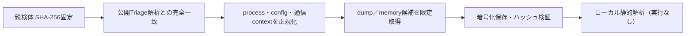

# Triage公開解析・後段取得証跡

## 完全ハッシュ一致

- [260805-axczpavamc](https://tria.ge/260805-axczpavamc): ファミリー候補 `guloader`、評価score `10`
- [260805-arwvls1zdy](https://tria.ge/260805-arwvls1zdy): ファミリー候補 `未確定`、評価score `8`

## プロセス・通信

- 観測process: `cmd.exe, powershell.exe, svchost.exe, wab.exe, wabmig.exe`
- raw commandは保存せず、command SHA-256と処理patternだけをJSONへ保持しています。
- sandbox background trafficは`context_only`であり、C2へ自動昇格しません。

- 取得できませんでした。

## 二段目成果物

- `46438130d3b35810ef593c73db9ffdd88b7e9c5d8299dc67353d5ab27fdcd6b0` / `memory_image` / 516096 bytes / 親と同一: `false` / 静的解析: `partial`
- `a71b124dec447fba093d00e359de4ca36fdd177b0d9ac85c97f372979d587ebb` / `memory_image` / 1982464 bytes / 親と同一: `false` / 静的解析: `未実施`
- `7cced54a8b57fd356c991bdd7c290d6299f44e7672daa2f0ab1b93ddba2d73a4` / `memory_image` / 516096 bytes / 親と同一: `false` / 静的解析: `partial`

## 判定境界

Triage由来のfamily、process、config、通信は外部sandbox証跡です。config extractorが返したendpointはC2候補として扱えますが、
静的設定復元またはprocess帰属とprotocol応答が揃うまでは確認済みC2とはしません。取得成果物と検体は実行していません。
