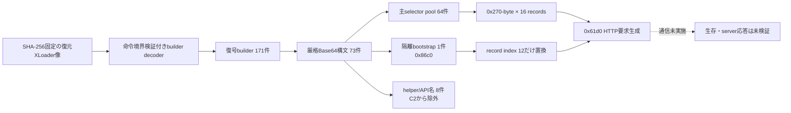
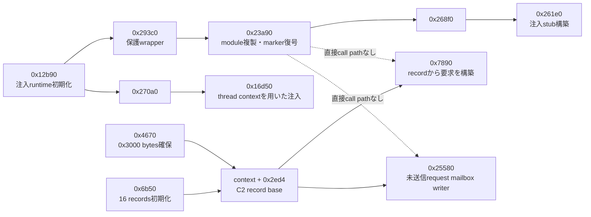
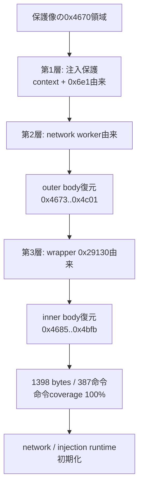
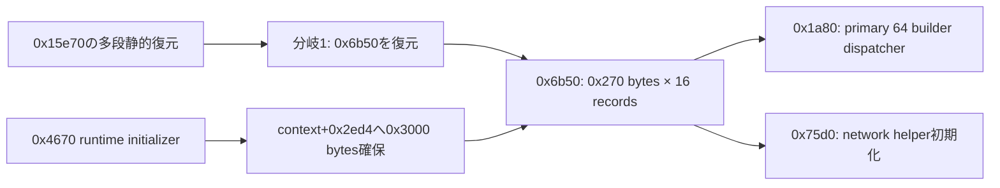

# XLoader C2データフローの静的解析

## 結論

保護wrapper対象91件をすべて静的復元し、C2 recordの確保、初期化、候補復号、後半slotのrotation、HTTP要求生成まで追跡しました。ローカルで検体を実行せず、C2への通信も行っていません。

高確度の静的bootstrap C2候補は次のとおりです。

- URL: `http://www.plantaonewsms.com.br/ximu/`
- port: `80/TCP`
- 採用箇所: 0-based `record index 12`
- 確度: `high_static`
- 生存確認・server応答検証: 未実施

候補構造は「同列の65候補」ではありません。`0x1a80`が扱う主selector poolは`1..64`の64件で、`0x86c0`由来の隔離値1件はrecord index 12だけが主候補を置換するbootstrapです。これはXLoader v8.1+互換構造ですが、製品version文字列で版番号を確証したものではありません。

`0x61d0`からHTTP要求の論理payloadと受信buffer保存までは復元できました。一方、C2の現在の稼働状態、受信後の復号、task dispatch、追加moduleは静的像内でconsumerを確認できず、未確定です。

解析には次のGhidra program selectorを明示的に使用しました。

- `/Malware/GuLoader/20260806/3f79dba8/fully-recovered-v4/xloader-20260806-fully-recovered-v4.bin`
- `/Malware/GuLoader/20260806/3f79dba8/network-config-recovered/xloader-20260806-network-config-recovered.bin`
- `/Malware/GuLoader/20260806/3f79dba8/static-child-state/xloader-20260808-all91-fully-recovered.bin`

## C2 seedの静的分類



主poolは`0x2650`から`0x3e70`までの64 builderです。隔離bootstrapは`0x86c0`で、helper 4件とAPI名4件はC2対象から除外しました。64個の復号domain suffixはすべて一意で、順序付きinventory SHA-256は`6858fe7105ef686a917fda196c0e27fa2031dfed9ce8a7d90b95e6c7a2e51ed9`です。64個の4文字path tokenもすべて一意で、順序付きinventory SHA-256は`872e66d049e0e632d9a650774a522d40e6ed7974d0db7d6d26183e4158c37986`です。

selector 49の主pool値`watchwomen.shop`はrecord index 12では採用されず、隔離bootstrapの`www.plantaonewsms.com.br`へ置換されます。対応pathは`/ximu/`です。この構造上の特別扱いと復号dataflowが一致するため高確度の静的C2候補へ昇格しました。ただし到達性やmalware protocol応答は確認していません。

再利用可能な抽出処理は`analysis-framework/malware/formbook_loader/c2_static_extract.py`へ実装しました。lineage、offset、件数、復号値fingerprintが一致しない場合はfail-closedで停止し、鍵や生byteは公開結果へ残しません。

## 注入経路とC2利用経路の分離



`0x23a90` の第3引数は0x38-byteの注入descriptorです。先頭4 DWORDには、複製した
module base、複製像内の `PUSH imm32` とそのoperand、`0x88888888` placeholderの
patch先が格納されます。後段 `0x16d50` はこのdescriptorを使ってentry codeをpatchし、
thread contextを更新します。この出力形式は `0x270`-byte C2 recordとは一致しません。

## C2 recordの確認済みレイアウト

record addressは次式で求められます。

```text
record = *(context + 0x2ed4) + index * 0x270
```

| offset | 範囲 | 静的に確認した使用 | 解釈 |
|---:|---:|---|---|
| `0x008` | `0x42` byte | hostnameとpathを結合 | SHA-1入力とrequest構築に使う`hostname+path` |
| `0x04a` | `0x15` byte | `hostname+path`をSHA-1し、先頭20 byteを保存 | per-record SHA-1-derived RC4 key |
| `0x05f` | `0x89` byte | DNS解決とHTTP `Host`へ渡す | 完全なhostname |
| `0x0e8` | `0x64` byte | `0x26c` flagに応じてqueryへ連結 | 2～5文字+`=`+4～16文字の可変query補助token |
| `0x14c` | `0x120` byte | HTTP request-targetへ使用 | `/<4文字>/`形式のpath token |
| `0x26c` | 4 byte | `+0xe8`の連結有無を判定 | query補助tokenの有無flag |

上表は`0x6b50`、`0x5a80`、`0x7890`、`0x61d0`の復元結果を突合した確定用途です。`+0x4a`はSHA-1 IV、update、finalの実装まで追跡し、`0x15450`が20-byte RC4 keyとして使うことを確認しました。

旧文書でresponse processor候補としていた`0x25580`は、`context+0xa90==0`のとき送信前requestとmetadataをmodule-global mailboxへ退避するwriterです。HTTP responseのstrip、復号、task dispatchは行いません。実際のrequest processorは`0x61d0`です。

## 既存memory snapshotとの対応

4個のruntime snapshotは `context+0x2ed4` を含んでいますが、全時点でpointerは0でした。
これは取得範囲不足ではなく、観測runが適格な `explorer.exe` 子processを選べず、
注入後runtimeへ到達する前に終了したことと整合します。

今後の動的証拠を利用する場合は、元XLoader processの長時間dumpではなく、注入成功後の
子processでC2 record初期化直後のcontextと参照heapを限定取得する必要があります。
動的に得た値も固定実装せず、静的なwriter、鍵builder、record境界へ還元してから採用します。

## `0x4670` の三層静的復元

従来未復元だった `0x4670` は、単一wrapper鍵ではなく、注入保護層、network層、inner関数層を
順番に適用することで静的に完全復元できました。鍵値、marker生値、復号byte列は公開していません。



inner bodyは1398 bytesで、SHA-256は
`9c56c6fab7e360605206e93ae06deceff77d2b9c6e36f245f7208f258a61c36f` です。Capstoneで
387命令が1398 bytesを隙間なく覆うことを確認しました。復元後の `0x4670` は、後続の
network / injection処理で使うcontext、API dispatcher、鍵・buffer群を準備するruntime initializerです。
具体的には、`context+0x28fc` の有効化、隔離builder `0x86c0` から `context+0x3014` への値生成、
`context+0xc58` の鍵・状態初期化、API hash解決、`0x4000` bytesのbuffer確保などを行います。
同じ関数が `0x3000` bytesを確保し、そのpointerをC2 record base `context+0x2ed4` へ保存することも
確定しました。

## `0x15e70` からC2 record builderへの到達

`0x15e70` も三層の順序付き変換で静的復元しました。inner bodyは `0x15e88`–`0x16362` の
1242 bytes、SHA-256は `f877b258fc8a2b31c8df747ace6003c8ffe17fe31fdb6f6f108bdff7a1209627` で、
352命令が全範囲を覆います。その分岐から復元した `0x6b50` は、C2 record tableのwriterです。



`0x6b50` のinner bodyは `0x6b68`–`0x724d` の1765 bytes、SHA-256は
`5a4822a20b481f25d3590c749374dacfdaa3353208af71a49f08b146e9fc1117` で、430命令のcoverageは
100%です。loopは `0x270` bytes strideで16回実行し、`+0x08`、`+0x4a`、`+0x5f`、`+0xe8`、
`+0x12c`、`+0x130`、`+0x14c`、`+0x26c` の各fieldを初期化します。

16 recordのselectorは順に`39, 50, 43, 47, 33, 40, 13, 59, 57, 28, 29, 54, 49, 4, 24, 15`です。初期状態は次のとおりです。

| index | selector | hostname | path | 評価 |
|---:|---:|---|---|---|
| 0 | 39 | `www.latinobro.cam` | `/r79d/` | 主pool候補 |
| 1 | 50 | `www.free-phone-chat.top` | `/sy4v/` | 主pool候補 |
| 2 | 43 | `www.whalengraphics.shop` | `/yim2/` | 主pool候補 |
| 3 | 47 | `www.vilgot.store` | `/lieg/` | 主pool候補 |
| 4 | 33 | `www.patenjangandites.org` | `/s50d/` | 主pool候補 |
| 5 | 40 | `www.hzdfthr018.top` | `/bvy8/` | 主pool候補 |
| 6 | 13 | `www.empoint.site` | `/iir6/` | 主pool候補 |
| 7 | 59 | `www.wavelies.online` | `/70hw/` | 主pool候補 |
| 8 | 57 | `www.9seshipinw.cc` | `/ue3i/` | 主pool候補 |
| 9 | 28 | `www.applypointguides.in` | `/rjwn/` | 主pool候補 |
| 10 | 29 | `www.peteramassih.com` | `/ievt/` | 主pool候補 |
| 11 | 54 | `www.lovesj88.com` | `/tb8q/` | 主pool候補 |
| 12 | 49 | `www.plantaonewsms.com.br` | `/ximu/` | 隔離bootstrapへ置換、高確度の静的C2候補 |
| 13 | 4 | `www.rabsila-msk.ru` | `/s3gf/` | 主pool候補 |
| 14 | 24 | `www.87dx.xyz` | `/lsg7/` | 主pool候補 |
| 15 | 15 | `www.kebetcomh.com` | `/zqgn/` | 主pool候補 |

index 12ではselector 49の主pool domain `watchwomen.shop`を使用せず、`context+0x3014`の隔離bootstrapへ明示的に差し替えます。他の15 hostnameは初期pool候補であり、稼働C2と確認した値ではありません。

## 候補のrotation

`0x5a80`は重複しないselectorを6個生成しますが、更新するのはrecord index`10, 11, 13, 14, 15`の5 slotだけです。bootstrapのindex 12は明示的にskipして保存し、生成した6番目のselectorは使いません。

## HTTP要求と受信境界

- `0x61d0`はtype 6/10でGET、それ以外ではPOSTを選ぶ。
- 論理payload envelopeは`dat=<二層RC4変換後のBase64値>&un=<ID>&br=9`で、type 7だけ`br=7`を使う。
- POSTではこのform全体を同じ二層RC4で再変換・Base64化し、8文字+`=`の可変parameter名へ格納する。
- GETでは`dat=`の値部分を可変parameter名のqueryへ組み込み、`&wn=1`を付ける分岐がある。
- header順はrandom shuffleではなく固定並べ替えで、`Accept`、`Accept-Encoding`、`Accept-Language`、`Host`、`Origin`、`Referer`、`Content-Type`、`Cache-Control`、`Content-Length`、`Connection`、最後に`User-Agent`となる。
- `Accept-Encoding`は`gzip, deflate, br`。User-AgentはAndroid 4.1.2/Xoomを名乗る固定値である。
- type 6/10だけsend後にrecv loopを実行し、stride`0x192020`、capacity`0x274000`のbufferへ受信長、record key、ready flagを保存する。

`dat=`はwire上で常に平文開始する文字列ではなく、内部で構成する論理envelopeです。統合像では受信buffer stateのlocal reader xrefが0件であり、response復号やtask dispatchは別module、実行時導入code、間接consumerのいずれかである可能性を残します。

## 残る限界

静的解析でbootstrap endpointと要求生成までは確定しました。未解決なのはC2の現在の生存状態、server応答の復号、受信taskの実行、追加moduleです。これらは今回通信していないため、`www.plantaonewsms.com.br/ximu/`を現在稼働中のC2とは表記しません。

機械可読な結果は[c2-analysis.json](c2-analysis.json)を参照してください。
