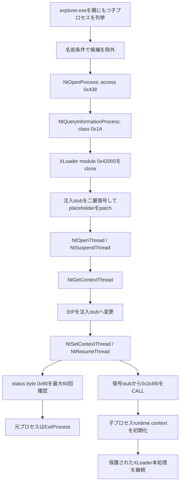

# XLoader注入チェーンの静的解析

## 結論

復元済みx86イメージだけから、XLoaderが候補プロセスへモジュールと復号stubを配置し、対象スレッドのcontextを変更して実行を移すことを確認した。解析状態は `confirmed` である。さらに、埋め込みstubの二層復号と、子プロセスbootstrap `0x2c6f0` への引き渡しを静的に復元した。ローカルで検体を実行せず、外部通信も行っていない。

## 実行・注入チェーン

## 候補プロセスの除外条件

- 空のプロセス名を除外する。
- 19文字以上の名前を除外するため、受理できる最大長は18文字である。
- `explorer.exe` 自体をCRC `0x19996921` で除外する。
- 現在の実行ファイル名から拡張子4文字を除いたstemを含む候補を除外する。

## Native APIの静的復元

| API | wrapper | 復元hash | 検証 |
|---|---:|---:|---|
| `NtOpenProcess` | `0x299b0` | `0xc8c42cc6` | 一致 |
| `NtQueryInformationProcess` | `0x29fc0` | `0x11da8518` | 一致 |
| `NtOpenThread` | `0x29a70` | `0x2e1b7599` | 一致 |
| `NtSuspendThread` | `0x29c90` | `0x8ea85a2f` | 一致 |
| `NtGetContextThread` | `0x29b30` | `0x210d4d07` | 一致 |
| `NtSetContextThread` | `0x29be0` | `0x6d2a7921` | 一致 |
| `NtResumeThread` | `0x29d40` | `0x207c50ff` | 一致 |
| `ExitProcess` | `0x2ad60` | `0xf5d02cd8` | 一致 |

`0x438` はVM操作・read・write・queryを含むprocess access、thread access `0x1A` はsuspend/resume・get/set contextを含む。`ProcessWow64Information` のclassは `0x1A` である。

## 注入stub

- module extent: `0x42000`
- clone allocation: `0x43000`
- 検出したplaceholder数: 15
- placeholder: 0x77777777、0x11111111、0x11111112、0x11111113、0x11111114、0x11111115、0x11111116、0x11111117、0x11111118、0x11111119、0x1111111a、0x1111111f、0x111111aa、0x111111bb、0x111111cc

context `+0x6E1`の20-byte鍵は、`0x2bda0` がfield addressを `0x14b0` と `0x10c0` に渡し、固定seedを格納後に `0x6c` でXORして生成する。直接MOVによるfield writeはないが、LEAを使う間接初期化経路は確定した。C2候補復号鍵とは分離して扱う。

- 暗号化領域: `0xad53` / 1820 bytes
- 復号stub SHA-256: `3fa244dede83746403631d49154d4ad098f536446c7815f1d47ae6bef80118ad`
- x86命令密度: 1.0 (390命令)
- 元モジュール基準の直接CALL先: `0x2c6f0`
- 鍵素材は公開せず、機械可読結果にはSHA-256のみを保存する。

`0x3EE0`と`0x3F50`はC2処理ではなく、注入mapper／threadの共有状態を1秒間隔・最大6回確認する同期関数である。成功状態は2、失敗状態は-1である。

## C2テーブル復元への影響

大きなruntime／worker objectの `+0x2ED4` は直接read 12 件、直接write 0 件だった。復号した注入stubはこのfieldを直接初期化せず、`0x2c6f0` の子プロセスbootstrapへ処理を渡す。したがって、残る課題はbootstrap以降にある間接writerの静的追跡であり、`+0x2ED4`を親contextの静的globalとみなす従来解釈は修正する。

`+0xA90` は直接read 37 件、write 9 件で、module base、API解決、relocation、自己復号、注入準備に横断的に使われる。

## 既知版との比較

既知XLoader v8.7の関数 `0x13A01` にも、`NtOpenProcess(0x438)`、`ProcessWow64Information(0x1A)`、module clone、thread context hijackingが存在する。既知版でも注入stub用20-byte seedを格納後、1-byte定数でXORする同型の鍵生成がある。今回の注入方式は継続的なfamily実装と判断する。confidenceは `high_static` とする。

## 安全性

- 検体のローカル実行: なし
- 外部通信: なし
- 入力: 復元済みraw x86イメージのみ
- 鍵素材の文書化: なし（SHA-256のみ）
