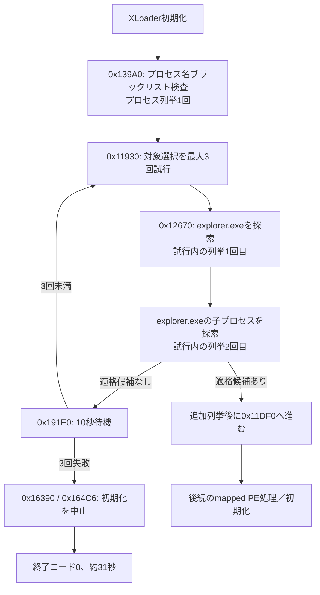

# XLoaderプロセス選択ゲートの静的復元

## 結論

約31秒後に終了コード0で終了した直接原因は、`explorer.exe`配下の適格な処理対象を3回の再試行で取得できなかったことです。復元コードが予測する「起動時ブラックリスト検査1回、対象探索2回を3試行、各失敗後に10秒待機、呼出元で初期化中止」という列と、Windows 10／11のTriageイベントが一致しました。confidenceは`high_static_dynamic_correlation`です。

反解析用のプロセス名ブラックリストと実行ファイル名検査も静的に復元しました。ただし、Triageログには比較結果そのものがないため、ブラックリスト一致を今回の直接原因とはしていません。

## 終了経路



`0x12670`は最初にCRC値`0x19996921`で`explorer.exe`を探し、次にそのPIDを親に持つプロセスから候補を選びます。適格候補があれば、候補利用時に少なくとも1回の追加列挙が生じます。観測は各試行2回の列挙だけで終わっているため、候補利用前に候補数が0になった分岐と一致します。

## 静的コードと動的イベントの対応

| 静的処理 | 予測回数 | behavioral1 | behavioral2 | 判定 |
|---|---:|---:|---:|---|
| 起動時ブラックリスト列挙 | 1 | 1相当 | 1相当 | 一致 |
| 対象探索の列挙 | 2回 × 3試行 | 6相当 | 6相当 | 一致 |
| 合計プロセス列挙 | 7 | 7 | 7 | 一致 |
| 10,000 ms待機 | 3 | 3 | 3 | 一致 |
| 失敗時の最小待機 | 30,000 ms | 約31.5秒で終了 | 約31.7秒で終了 | 一致 |
| 終了状態 | 正常な初期化中止 | 0 | 0 | 一致 |

behavioral1では列挙が421、734、890、11,000、11,093、21,218、21,328 ms、待機が984、11,203、21,437 ms、終了が31,453 msでした。behavioral2では列挙が515、750、937、11,156、11,281、21,422、21,547 ms、待機が1,140、11,406、21,656 ms、終了が31,656 msでした。

## 反解析プロセス検査

`0x139A0`はプロセス名を小文字化し、非反転CRC-32（多項式`0x04C11DB7`、初期値と最終XORは`0xFFFFFFFF`、左シフト）でハッシュ化します。比較対象20個は保護定数から静的に復元しました。14個は名前まで検証済みです。

| ハッシュ | 復元名 |
|---|---|
| `0x3EBE9086` | `vmwareuser.exe` |
| `0x4C6FDDB5` | `vmwareservice.exe` |
| `0xD0C58467` | 未解決 |
| `0xA8D123C8` | 未解決 |
| `0x85CF9404` | `sandboxiedcomlaunch.exe` |
| `0xB2248784` | `sandboxierpcss.exe` |
| `0xCDC7E023` | `procmon.exe` |
| `0x011F5F50` | `filemon.exe` |
| `0x1DD4BC1C` | `wireshark.exe` |
| `0x8235FCE2` | `netmon.exe` |
| `0xC72CE2D5` | 未解決 |
| `0x0263178B` | 未解決 |
| `0x57585356` | 未解決 |
| `0x9CB95240` | `sharedintapp.exe` |
| `0x0CC39FEF` | 未解決 |
| `0x9347AC57` | `vmsrvc.exe` |
| `0x9D9522DC` | `vmusrvc.exe` |
| `0x911BC70E` | `python.exe` |
| `0x74443DB9` | `perl.exe` |
| `0xF04C1AA9` | `regmon.exe` |

一致時にはcontext `+0xA90`へ`0x726377DC`を書き、通常のmodule base由来値を破壊します。また、反解析カウンターとみられるcontext `+0x34`と`+0x868`を増加させます。この挙動は存在しますが、今回の終了を直接起こしたとの証拠はありません。

`0x13D90`には別の実行ファイル名検査があります。空白を含まず31文字を超える名前、または末尾8文字のハッシュが`0x7C81C71D`となる名前を検出すると、同じsentinelを書き込みます。

## 再現方法

`process_gate.py`は検体を実行せず、復元済みraw像から保護された20個の比較値を抽出し、TriageのOnemonイベントと回数・時刻を照合します。命令のエミュレーションもネットワーク接続も行いません。

```powershell
py -3.13 analysis-framework/malware/formbook_loader/process_gate.py C:\tmp\xloader-20260806-fully-recovered-v4.bin `
  --sample-sha256 3f79dba83a2059c77f593c3247acf8f3d2b4c3e8a60f9ba1a656d0c04e600948 `
  --onemon C:\tmp\guloader-xloader-triage-longrun-20260808\behavioral1-onemon.json `
  --onemon C:\tmp\guloader-xloader-triage-longrun-20260808\behavioral2-onemon.json `
  --pid 2388 `
  --pid 4256 `
  --output xloader-process-gate.json
```

機械可読な全比較値、イベント時刻、相関判定は[xloader-process-gate.json](xloader-process-gate.json)に記録しています。


## 対象選択成功後の処理

適格候補が見つかった場合、`0x11df0`は単なるmapped PE処理ではなくthread context hijackingを実行します。候補processをaccess `0x438`で開き、WOW64状態を確認し、XLoader moduleと復号stubを配置します。その後、対象threadをaccess `0x1A`で開いて停止し、EIPをstubへ変更して再開します。詳細は[XLoader注入チェーンの静的解析](XLOADER-INJECTION-CHAIN.md)に分離しました。

このため、C2 contextの動的取得対象は元XLoader processではなく、注入後の子processです。今回のTriage runでは候補利用時に発生する追加列挙がなく、この処理へ到達していません。

## 参考情報

既知名の候補集合は[Trend MicroのFormBook解析](https://www.trendmicro.com/vinfo/us/threat-encyclopedia/malware/TrojanSpy.Win32.FORMBOOK.DE)を参照し、本検体から復元したCRCとローカルで再照合しました。XLoader／FormBookの系統背景は[Google Cloud MandiantのFormBook配布キャンペーン分析](https://cloud.google.com/blog/topics/threat-intelligence/formbook-malware-distribution-campaigns/)も参照しています。OSINT上の名前をそのまま採用せず、本検体のハッシュと一致した14個だけを復元済みとしました。

## 安全制約

- 検体と復元コードをローカル実行していない。
- binary instructionをエミュレーションしていない。
- C2を含むネットワーク接続を行っていない。
- Ghidraの任意script実行を有効化していない。
