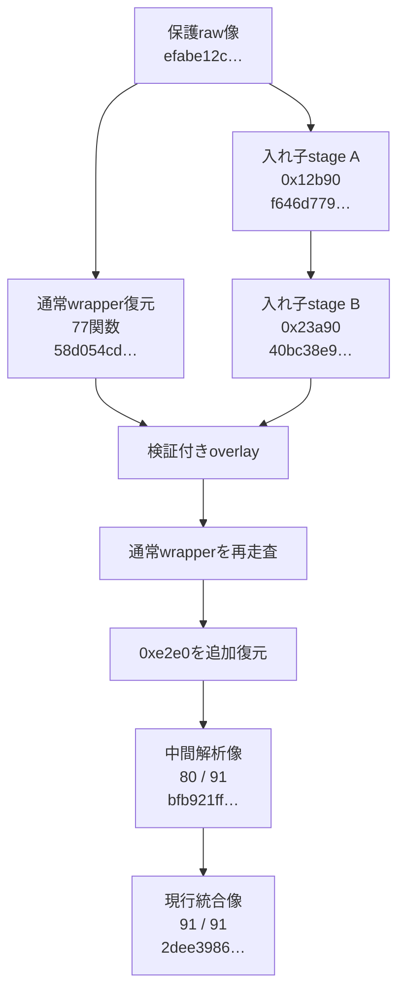
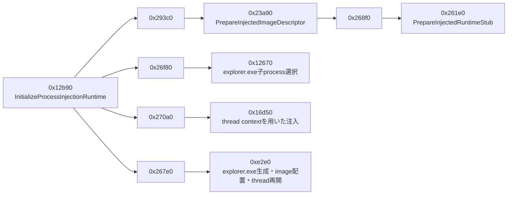

# XLoader追加静的復元（2026-08-08）

> 更新注記: 本文の80/91は同日の中間復元段階です。後続の多段静的復元で当時残った11 wrapperもすべて復元し、
> 現行結果は91/91、未解決0、統合像SHA-256 `2dee3986363adac0185279b0412a04db30b11bee2c4f2fd30e5e7ffdb5a3366f`です。

## 結論

GuLoaderから復元したXLoader raw像について、従来の「91 wrapper中77関数復元・14関数未解決」を
再検証しました。入れ子になった暗号化コンテナを静的に復号して `0x12b90` と `0x23a90` を
追加復元し、その結果caller dataflowが見えるようになった `0xe2e0` も通常の保護関数復元器で
復元できました。

この時点の中間結果は次のとおりです。

- 保護wrapper: 91
- 静的復元済み: 80
- 未解決: 11
- 新規復元: `0x12b90`、`0x23a90`、`0xe2e0`
- ローカル検体実行: なし
- 外部通信・C2接続: なし
- 後続の現行結果: 91/91復元、未解決0

追加2関数はmemory dumpからコピーしたものではありません。保護raw像に内包された
暗号化コンテナを順番に復号し、親像・子像SHA-256、変更可能範囲、復元body SHA-256を
一致させた完全な静的復元です。

## 復元像の系譜

| 段階 | SHA-256 | 説明 |
|---|---|---|
| 保護raw像 | `efabe12c2df52fbf5894e093aef67e9083e44ba419da7905e5185e7c7367829c` | GuLoader後段PE内を二段RC4で復元したXLoader像 |
| 通常77関数復元像 | `58d054cdb9cfb32e4e6dfb08fdb5a1a3bc5d0461f78f7342e50d88789c01755b` | caller dataflow 72件、既知marker fallback 5件 |
| 入れ子stage A | `f646d7790eda4a3ab9371fa2408e7e3f9d698d3225f6237bc77bdc365598fce1` | `0x12b90` を静的復元 |
| 入れ子stage B | `40bc38e9e8e25015a40758686faf14e9e5f82947ba265cea2746f2e0f2f4de6e` | `0x23a90` を静的復元 |
| 統合・再走査後（中間） | `bfb921ff27c4f10cda852fdb58207875436cda664e802e8989e5fb08299f5513` | `0xe2e0` を含む80関数復元像 |
| 多段静的復元後（現行） | `2dee3986363adac0185279b0412a04db30b11bee2c4f2fd30e5e7ffdb5a3366f` | 対象wrapper 91/91を復元した統合像 |

非公開profileの内容はリポジトリへ置きません。再現性の識別には次のprofile SHA-256を使います。

- 通常保護関数profile: `a7477d0d33026205e65379b5a4288b6d64f41b1b08c98ba12a7a2e4831509750`
- 入れ子静的復元profile: `bbf915946c86778eb965248b64e8edcf22ffcf8be00eb71765519c0f1c3cbb55`

## 新規復元関数

| target | 復元範囲 | 復元body SHA-256 | 静的に確認した役割 |
|---:|---:|---|---|
| `0x12b90` | `0x12b90:0x1313c` | `c8b944ff35614f0bf00b6ee19b5fe1d4017d83964d937c7f136e72a3aacc2cb1` | module descriptor初期化、module複製、入れ子marker復号、注入対象選択、注入処理の統括 |
| `0x23a90` | `0x23a90:0x2406f` | `3c9a667c2df2a83d430bb745f3e5782fd2810bcefb11f32dedbc2a9035173658` | module cloneを再複製し、markerを復号・patchして0x38-byteの注入descriptorを作成 |
| `0xe2e0` | `0xe2f1:0xe56c` | `52f6942c9180a0ce7ec58d95da6e05daec449120d1f6a347006d5c06958a57e0` | `explorer.exe`を準備し、image配置・entry patch後にthreadを再開する注入経路 |

`0xe2e0` の検証付きpatch区間は `0xe2e0:0xe572`、区間全体のSHA-256は
`0b87255786700046547887679f2f9fd43cb1fa42c99049c34ab5770aac5c7e69` です。上表はその区間内から
関数prologueと終端paddingを除いた実bodyだけを示します。

`0x23a90` は以前「C2候補初期化」と推定していましたが、引数と出力を追跡すると明示的な
出力は注入descriptorでした。network request processor `0x61d0`、未送信request mailbox writer `0x25580` への直接call pathも
ありません。このため旧名称は撤回し、`PrepareInjectedImageDescriptor` 相当へ修正しました。

## 注入ロジック

この結果は、既存Triage runが適格な `explorer.exe` 子processを選べず、約31秒後に
終了したため、注入後のC2初期化へ到達しなかったという従来の観測と整合します。

## 当時残った11関数（後続解析で全件復元）

80/91中間像の時点で未解決だったtargetは次のとおりです。

`0x75d0`、`0x1a80`、`0xf0e0`、`0x4670`、`0x6b50`、`0x61d0`、
`0x4410`、`0xe5e0`、`0x5a80`、`0x15e70`、`0x14f40`

これらは後続の多段静的復元で全件復元済みです。現行の未解決wrapper数は0です。

過去の「静的未参照」「全像でmarker不在」という表現は範囲が強すぎました。今回、
現在収集済みのcall graph・絶対pointer・証拠像集合で未観測という分類へ変更します。
別version、未取得の注入後runtime、間接callbackにおける不在までは主張しません。

## 自動化と検証方針

新しい静的復元pipelineは次をfail-closeで検証します。

1. 通常復元reportの入力・出力SHA-256と関数body SHA-256。
2. 各入れ子stageの親・子SHA-256。
3. 許可したpatch区間外に変更がないこと。
4. 既存復元bodyを別stageが上書きしないこと。
5. 同じwrapperに異なるbodyを提示する曖昧なstageがないこと。
6. stage適用後に通常復元器を反復し、新しく到達可能になったwrapperを昇格すること。
7. 公開reportをallowlistから再構成し、鍵、marker、mix、関数byte列を含めないこと。

関数カタログ生成時にも、解析像全体SHA-256と各body SHA-256をreportへ照合します。
これにより、中間段階のように「77関数reportと80関数像を組み合わせた古いcatalog」を
自動的に拒否できます。

最終C2設定の残課題は[XLoader C2データフローの静的解析](XLOADER-C2-STATIC-DATAFLOW.md)を
参照してください。
