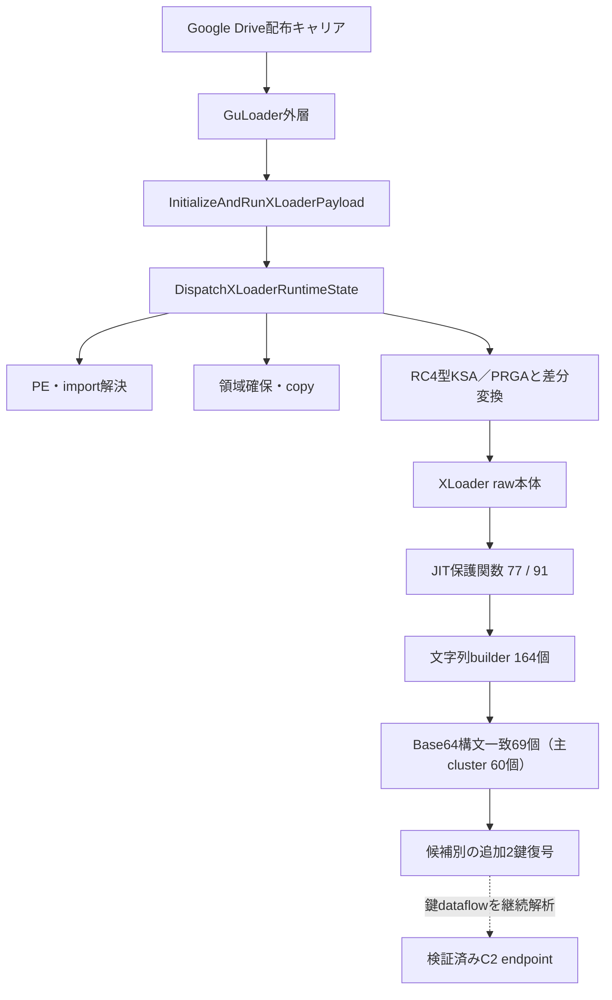

# XLoader静的復元ガイド

## 結論

本ケースでは、ローカルで検体を実行せず、GuLoader外層からXLoader本体、
JIT保護関数、文字列builder、通信request／response処理まで静的に復元した。
既存Triageメモリ像は、静的に得たaddress対応と復号状態を照合する教師データとして
のみ使用した。新たなprocess起動、外部通信、C2への接続は行っていない。

現時点で、91個の保護wrapperのうち77個を復元し、14個は無効またはalternate
pathの可能性が高いと分類した。文字列builderは164個、Base64構文一致は69個で、
network候補の主clusterは60個である。主cluster外9個には環境変数名とAPI名が含まれ、
独立値0x86c0の役割だけが未確定である。最終C2は、候補ごとの第1鍵と
第2鍵の完全なdataflowが未確定であるため、IOCとしては公開していない。

## 全体復元flow

## ランタイム復号VM

| address | 関数 | 入力 | 出力・副作用 | 確度 |
|---|---|---|---|---|
| `0x741720` | `InitializeAndRunXLoaderPayload` | 通常引数なし。内包imageとstack上の初期値を暗黙利用 | 1,165 byteの状態領域を初期化し、dispatcherを25回呼ぶ。領域確保、復号、import解決後に内側entryを間接call | confirmed static |
| `0x7400f0` | `DispatchXLoaderRuntimeState` | stack上から探索した状態record、selector、必要時はcaller引数 | 状態record、鍵schedule、対象buffer、解決API、復号codeを更新 | confirmed static |
| `0x741680` | `RuntimeStrlenA` | NUL終端ANSI文字列 | 終端を除く文字数 | confirmed static |
| `0x7416a0` | `RuntimeStrlenW` | NUL終端UTF-16文字列 | 終端を除く16-bit要素数 | confirmed static |
| `0x7416c0` | `RuntimeMemcpy` | destination、source、byte数 | destinationへ前方向copyし、destinationを返す | confirmed static |
| `0x7416f0` | `RuntimeMemset` | destination、1-byte値、byte数 | destinationを充填し、destinationを返す | confirmed static |

dispatcherは通常のswitch文ではない。selectorを4 byteへ複製して状態seedとXORし、
初期化済み比較値と一致した処理だけを実行する。処理には次が含まれる。

- handler比較値の初期化
- PE header、PEB、loader list、exportの探索
- ANSI／UTF-16名によるmodule・API解決
- 作業領域の確保とcopy
- RC4型KSA／PRGA、前後差分変換、20-byte鍵materialのXOR
- 保護codeの一時展開、間接call、元byte列の復元

セレクタ値は亜種で変わり得るため、実装では値を固定判定に使わない。
`runtime_vm.py`は「同一call先」「同一stack displacement」「複数の異なる
1-byte即値」という構造からinitializerとdispatcherを自動検出する。

## XLoader本体の特徴的関数

## JIT保護関数の復号ロジック

| address | 関数 | 入力 | 出力・副作用 |
|---|---|---|---|
| `0x1050` | `CaseInsensitiveMarkerEquals` | 比較対象byte列と暗黙register上のmarker／長さ | ASCII大文字小文字を同一視した一致結果 |
| `0x1100` | `BuildJitBaseKey20` | 20-byte出力buffer | sample内のJIT基礎鍵を構築 |
| `0x1660` | `DecryptJitProtectedFunction` | context、wrapper descriptor、走査開始delta | seed／mixから鍵を導出し、markerを復号・探索して関数本体をin-place復号。descriptorへaddressとlengthを返す |
| `0x18e0` | `PrepareContextBoundJitCall` | context、descriptor | `0x1660`へ走査delta 0を渡した成功状態 |
| `0x1900` | `PrepareModuleBoundJitCall` | contextまたはNULL、descriptor | `0x1660`へ走査delta 4を渡した成功状態。NULL時はmodule baseを利用 |

`0x1660`はdescriptorのseedとcaller由来mixを組み合わせ、20-byte鍵を作る。暗号化markerを
2回のRC4-subで処理し、context `+0xA90`またはmodule baseを走査する。一致時だけmarkerを
NOP化し、挟まれた本体へRC4-subを適用して一時実行可能にする。`protected_functions.py`は
この処理を検体実行なしで再現し、一意marker、関数長、x86妥当性が成立した77関数だけを採用する。

| address | 関数・役割 | 想定入力 | 出力・更新先 | 類似性比較点 |
|---|---|---|---|---|
| `0x2650`–`0x3e70` | 連続文字列builder群 | stack即値、20-byte基礎鍵、1-byte XOR selector | Base64様の暗号化候補文字列 | 関数順、出力長、body hash、selector |
| `0x8630` | stack文字列復号wrapper | 暗号化stack byte列、長さ、caller指定1-byte値 | 復号済み文字列buffer | 20-byte seed構築と`0x7ef0`呼出し |
| `0x4390` | custom RC4-sub本体 | byte列、鍵、長さまたは同等state | 前後差分変換とRC4を適用したbyte列 | backward subtraction、KSA／PRGA、forward subtraction |
| `0x7ef0` | RC4-sub descriptor処理 | buffer、鍵、長さを含むdescriptor | descriptorが指すbufferをin-place更新 | descriptor field配置と`0x4390`へのcall |
| `0x150b0` | `DecodeBase64Value` | destination、NUL終端Base64様source | 復号byte列、末尾NUL、復号長 | 反転256-byte table、4文字から3 byteへのbit結合 |
| `0x25580` | `PrepareXLoaderConnectionState` | 全体context、worker state、C2 record index | recordの20-byte鍵、2文字列、選択flagをworker stateへcopy | record幅`0x270`とfield offsetの組合せ |
| `0x7890` | `BuildXLoaderHttpRequest` | context、request state、request type | GET／POST request、header、payload、response state | request type、record参照、transport分岐 |
| `0xf340` | `HandleAuthenticatedServerResponse` | context、受信response | 認証・復号後のcommand `0x31`–`0x39`をdispatch | 認証比較、command範囲、callee順 |
| `0x131b0` | `InitializeNetworkRuntime` | XLoader context | network buffer、接続状態、worker callback | marker復号とtransport初期化順 |
| `0x13490` | `ProcessNetworkWorker` | XLoader context | 応答、session、task、次回worker状態 | response探索と保護callee関係 |
| `0x250a0` | `PerformHttpGet` | context、request | response bufferと処理結果 | User-Agent、read loop、handle解放 |
| `0x25280` | `PerformHttpPost` | context、request、送信payload | response bufferと処理結果 | content header、送信・受信順 |
| `0x25420` | `RunXLoaderNetworkWorkerLoop` | context | GET／POSTの反復、sleep後の次状態 | WinINet解決とtransport選択 |
| `0x1fd20` | `ExtractChromiumLocalStateKeys` | Chromium profile pathを含むcontext | `encrypted_key`と`app_bound_encrypted_key` | 2個のJSON keyと保存offset |

全91 wrapperの関数別入力、出力、副作用、body hash、call集合は
[XLoader保護関数カタログ](XLOADER-FUNCTION-CATALOG.md)に記録した。

## 追加C2復元結果（2026-08-07）

- Ghidraで0x86c0の未定義領域を命令化し、32-byte値を復号する独立builderであることを確認した。直接参照はなく、endpoint、鍵、seedの役割は未確定である。
- 主cluster 60件は同型builderであり、0x2650から0x3e70へ連続配置される。Base64構文一致69件の残り9件には環境変数名とWinINet API名が含まれるため、C2候補数へ直接読み替えない。
- 4個のcontext snapshotと、既知v8.7比較像を含む15個のmemory artifactを走査したが、平文endpoint、XLNG／PKT2 marker、6個のnetwork seedから反復DWORD XORで導出できる20-byte鍵はいずれも0件だった。
- 本検体から復元できた主cluster 60件と独立値1件は、v8.1以降について公開されている65 C2候補という構造と件数が一致しない。厳密なversionを確定できるまでは、legacy v6／v7の固定indexモデルもv8.1以降の65候補モデルも自動適用しない。
- v8.1以降ではdecoyと実C2が同じ要求を受け、応答またはnetwork emulationでなければ区別できない。静的解析の目標は全候補と鍵導出を復元するところまでとし、実C2判定は別の検証段階として記録する。

## C2候補の静的復元flow

```mermaid
flowchart LR
    immediates["stack即値"] --> first_decrypt["20-byte基礎鍵 + 1-byte XOR"]
    first_decrypt --> encoded["Base64様候補"]
    encoded --> b64["DecodeBase64Value"]
    b64 --> layer1["候補別 第1 RC4-sub"]
    layer1 --> layer2["第2 RC4-sub"]
    layer2 --> record["0x270-byte C2 record"]
    record --> selected["接続候補選択"]
    selected --> request["GET／POST request構築"]
    request --> response["応答認証・復号"]
    response --> commands["command 0x31–0x39"]
```

現在確定しているのは、Base64復号、独自RC4-sub primitive、C2 recordの利用側、
request構築、応答認証とcommand dispatchである。未確定なのは、各候補へ対応する
第1鍵・第2鍵の生成元からrecord書込みまでの完全なdataflowである。
復元像全体を命令境界に依存せず走査しても、context `+0x2ed4`のC2 record baseを読む
12命令だけが見つかり、直接書き込む命令はなかった。構造体copyまたはruntime計算offsetを
経由するため、静的なfield xrefだけでは生成元を確定できない。

追加追跡では、`FUN_0002c330`がmodule末尾offset `0x42000`を返し、`FUN_00011900`が
module base `+0x43000`をmain contextとして使うことを確認した。既存4 runtime snapshotは
いずれも長さ`0x46000`で、context先頭`0x3000` byteを含む。したがって`+0x2ed4` fieldは
取得範囲内である。実値を公開せず確認した結果、全4時点でpointerは0、fieldを含む
`0x1000`-byte pageの非0 byte数も0だった。従来の「module dumpにcontextが含まれない」
という説明は誤りであり、「観測時点でC2 table初期化へ未到達」が現在の直接証拠である。
追加Triageを使う場合は単なる時間延長ではなく、table初期化直後のcontext／heapを限定取得する。

`InitializeNetworkRuntime`自身には`+0x2ed4`への直接書込みがなく、末尾で未復元target
`0x12b90`をwrapper経由で呼ぶ。この位置関係から`0x12b90`はtable初期化経路の重点候補だが、
本体markerが全確認像で不在のため、書込み元とはまだ断定しない。

Ghidraでは`0x2cae0`のゼロ初期化wrapperが一時的にno-returnと誤認され、callerの後半が
逆コンパイルから欠落していた。returning属性へ訂正すると`0x16380`のRC4-sub処理、mapping、
後段state更新まで復元できた。自動builder抽出はこの関数境界誤認に依存せずraw命令列を走査する。
さらに`InitializeNetworkRuntime`内のcall site `0x13321`には古い`CALL_RETURN` flow overrideが
残っており、`0x13326`以降が関数本体から脱落していた。overrideを解除し、欠落していた20命令を
再命令化すると、module内の派生marker走査、動的API解決、`0x202`と約400-byteの局所bufferを
渡す呼出し、その直後の保護wrapper呼出しまで復元できた。引数形状は
`WSAStartup(0x0202, WSADATA*)`と一致する。

保護wrapper `0x29440`はcontextとdescriptorを受け、marker走査が成功した場合だけcontext 1引数で
`0x12b90`を呼ぶ。これにより`0x12b90`がネットワーク初期化後段である確度は上がったが、
`context +0x2ed4`への書込み自体は未確認である。

## 自動復元scriptの入出力

| module／関数 | 入力 | 出力 | 安全性 |
|---|---|---|---|
| `native_xloader.rc4` | byte列、非空鍵 | RC4変換byte列 | 純粋関数 |
| `decrypt_rc4_sub` | 暗号化byte列、鍵 | 前後差分＋RC4の復号byte列 | 純粋関数 |
| `derive_protected_function_key` | wrapper記述子、基礎DWORD列、XOR値 | 保護関数鍵 | raw鍵は公開reportへ残さない |
| `recover_protected_function` | image、marker記述子、外部鍵材料 | patch済みimage、hash中心のreport | marker一意性とx86 scoreを検証 |
| `decode_stack_string_builders` | x86像、復号call先、外部基礎鍵 | `DecodedBuilder`列 | processを起動しない |
| `inventory_encoded_network_candidates` | builder列 | 候補数、offset、長さ、SHA-256 | 候補生値を保持しない |
| `recover_protected_functions` | image、repository外profile | 反復復元image、91 wrapperの診断 | 曖昧な候補はpatchしない |
| `build_evidence` | baseline、復元像、memory像 | 未復元理由とruntime取得優先度 | raw marker／mixを出さない |
| `build_catalog` | 復元report、image、semantics | 関数別I/Oカタログ | 関数byte列を出さない |
| `runtime_vm.find_runtime_vm` | x86像、image base | initializer、dispatcher、selector列 | 実行・通信なし |
| `runtime_vm.build_report` | image、VM profile | hashと制御flowの公開report | marker／鍵を除外 |
| `context_snapshot.inspect_snapshot` | 取得済みmapped image、context配置 | C2 pointerの取得・初期化状態 | path、pointer実値、C2値を出さない |
| `context_snapshot.build_report` | 複数runtime snapshot | 時点間のpointer状態比較 | 実行・通信なし |
| `xloader_c2.decode_base64_candidate` | repository外の候補値 | Base64復号byte列 | 厳格形式・size検査 |
| `xloader_c2.decrypt_layered_candidate` | 候補、第1鍵、第2鍵 | 2段復号の中間値と平文 | 呼出元のprivate領域だけで保持 |
| `xloader_c2.summarize_candidate` | 候補と復号結果 | hash、長さ、endpoint妥当性 | 平文・鍵を公開しない |

`xloader_c2.py`は、鍵が静的に復元できた候補を自動検証する受け皿まで実装済みである。
鍵fileと候補fileはrepository外に置き、平文を保存する場合もrepository外を必須とする。

## 新パターンでの復元順序

1. `protected_functions.py`でwrapperと保護本体を反復復元する。
2. `runtime_vm.py`で外層dispatcherのcall列を抽出し、既知版と順序を比較する。
3. `native_xloader.py`でstack builderを列挙し、Base64様候補をhash化する。
4. `DecodeBase64Value`、custom RC4-sub、20-byte seed builderのcall graphを対応付ける。
5. 候補indexごとの鍵builder、DWORD XOR、record書込み先を後方dataflowで追跡する。
6. 2鍵が確定した候補だけ`xloader_c2.py`へ渡し、endpoint形式を検証する。
7. request生成と認証済みresponse処理まで一致したendpointだけをC2 IOCへ昇格する。
8. `context_snapshot.py`でfieldが取得済みか、未初期化かを先に区別する。
9. 静的に初期化後のheap値だけ不足する場合に限り、Triageで対象processの限定memoryを取得する。

この順序により、亜種でaddressやselectorが変わっても、関数body hash、call集合、
record field配置、アルゴリズム順序を使って復元を継続できる。
