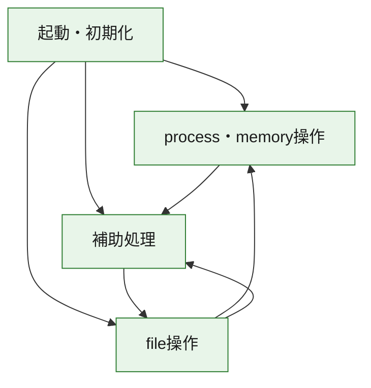
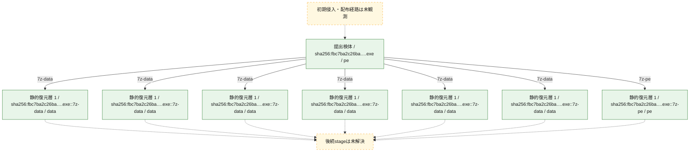
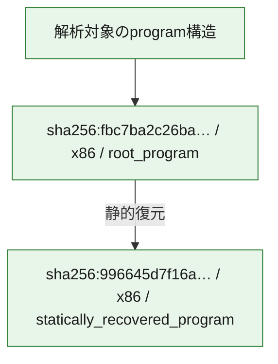

# 全体ロジック：fbc7ba2c26bae1175976f140bb9d4d5eaf744c95ba8aaadec3fd8ad129b89221

代表関数の静的証跡から、起動・初期化、process・memory操作、file操作の処理群を確認しました。

## 読み方

- phaseの掲載順は解析上の整理順です。observed_call_edgesがない段階間の実行順を断定しません。
- 図の実線は静的に観測した関係、点線と黄色のノードは未観測・未解決の関係を示します。
- 図は静的な要約であり、動的実行を再現するものではありません。
- 詳細な関数解説とfingerprintは[STATIC-LOGIC.md](STATIC-LOGIC.md)を参照してください。

## 静的可視化

### 実行フロー

### 感染チェーン

### モジュール関係

## 処理段階

### 1. 起動・初期化

entry pointから初期化と後続処理への移行を確認します。
確度: `confirmed_static_function_evidence`

- `996645d7f16a6294babb6da83478062aed7b72318d7a51b66e90ab5d3edc51a5:ghidra:10002a7f` — 初期化と主要処理への分岐を行う入口関数です。 状態: `succeeded`、選定理由: `call_graph_centrality:in=0,out=1`, `entry_point`, `meaningful_symbol_name`, `reviewed_call_centrality:1`, `reviewed_call_centrality:2`, `role:entrypoint`, `small_program_complete_context`
- `fbc7ba2c26bae1175976f140bb9d4d5eaf744c95ba8aaadec3fd8ad129b89221:ghidra:0040358d` — 初期化と主要処理への分岐を行う入口関数です。 状態: `succeeded`、選定理由: `call_graph_centrality:in=0,out=45`, `entry_point`, `large_function:instructions=467`, `meaningful_symbol_name`, `reviewed_call_centrality:50`, `reviewed_call_centrality:69`, `role:entrypoint`

### 2. process・memory操作

process、thread、module、memory操作と実行移行を確認します。
確度: `confirmed_static_function_evidence`

- `fbc7ba2c26bae1175976f140bb9d4d5eaf744c95ba8aaadec3fd8ad129b89221:ghidra:00405783` — process、thread、module、またはmemory操作に関係する関数です。 状態: `succeeded`、選定理由: `call_graph_centrality:in=0,out=25`, `large_function:instructions=284`, `reviewed_call_centrality:25`, `reviewed_call_centrality:43`, `role:process_or_memory_operation`
- `fbc7ba2c26bae1175976f140bb9d4d5eaf744c95ba8aaadec3fd8ad129b89221:ghidra:00405ba2` — process、thread、module、またはmemory操作に関係する関数です。 状態: `succeeded`、選定理由: `call_graph_centrality:in=2,out=2`, `reviewed_call_centrality:4`, `reviewed_call_centrality:6`, `role:process_or_memory_operation`

### 3. file操作

fileやdirectoryの作成、読書き、削除を確認します。
確度: `confirmed_static_function_evidence_with_limits`

- `fbc7ba2c26bae1175976f140bb9d4d5eaf744c95ba8aaadec3fd8ad129b89221:ghidra:00401434` — fileまたはdirectoryの読書き・管理に関係する関数です。 状態: `failed`、選定理由: `call_graph_centrality:in=1,out=107`, `large_function:instructions=2019`, `reviewed_call_centrality:112`, `reviewed_call_centrality:167`, `role:file_operation`
- `fbc7ba2c26bae1175976f140bb9d4d5eaf744c95ba8aaadec3fd8ad129b89221:ghidra:00405c83` — fileまたはdirectoryの読書き・管理に関係する関数です。 状態: `succeeded`、選定理由: `call_graph_centrality:in=1,out=4`, `reviewed_call_centrality:5`, `reviewed_call_centrality:8`, `role:file_operation`
- `fbc7ba2c26bae1175976f140bb9d4d5eaf744c95ba8aaadec3fd8ad129b89221:ghidra:00405ccb` — fileまたはdirectoryの読書き・管理に関係する関数です。 状態: `succeeded`、選定理由: `call_graph_centrality:in=4,out=15`, `large_function:instructions=148`, `reviewed_call_centrality:20`, `reviewed_call_centrality:23`, `role:file_operation`
- `fbc7ba2c26bae1175976f140bb9d4d5eaf744c95ba8aaadec3fd8ad129b89221:ghidra:004060af` — fileまたはdirectoryの読書き・管理に関係する関数です。 状態: `succeeded`、選定理由: `call_graph_centrality:in=3,out=2`, `reviewed_call_centrality:5`, `reviewed_call_centrality:7`, `role:file_operation`
- `fbc7ba2c26bae1175976f140bb9d4d5eaf744c95ba8aaadec3fd8ad129b89221:ghidra:00406132` — fileまたはdirectoryの読書き・管理に関係する関数です。 状態: `succeeded`、選定理由: `call_graph_centrality:in=4,out=1`, `reviewed_call_centrality:5`, `reviewed_call_centrality:6`, `role:file_operation`
- `fbc7ba2c26bae1175976f140bb9d4d5eaf744c95ba8aaadec3fd8ad129b89221:ghidra:00406161` — fileまたはdirectoryの読書き・管理に関係する関数です。 状態: `succeeded`、選定理由: `call_graph_centrality:in=4,out=1`, `reviewed_call_centrality:5`, `reviewed_call_centrality:6`, `role:file_operation`
- `fbc7ba2c26bae1175976f140bb9d4d5eaf744c95ba8aaadec3fd8ad129b89221:ghidra:0040691c` — fileまたはdirectoryの読書き・管理に関係する関数です。 状態: `succeeded`、選定理由: `call_graph_centrality:in=4,out=2`, `reviewed_call_centrality:6`, `reviewed_call_centrality:8`, `role:file_operation`

### 4. 補助処理

主要処理を支える一般内部関数またはlibrary処理を確認します。
確度: `confirmed_static_function_evidence`

- `fbc7ba2c26bae1175976f140bb9d4d5eaf744c95ba8aaadec3fd8ad129b89221:ghidra:00401000` — 検体内部の一般処理を実装する関数です。 状態: `succeeded`、選定理由: `call_graph_centrality:in=0,out=12`, `large_function:instructions=125`, `reviewed_call_centrality:13`, `reviewed_call_centrality:24`
- `fbc7ba2c26bae1175976f140bb9d4d5eaf744c95ba8aaadec3fd8ad129b89221:ghidra:00401389` — 検体内部の一般処理を実装する関数です。 状態: `succeeded`、選定理由: `call_graph_centrality:in=3,out=4`, `reviewed_call_centrality:7`, `reviewed_call_centrality:9`
- `fbc7ba2c26bae1175976f140bb9d4d5eaf744c95ba8aaadec3fd8ad129b89221:ghidra:00402ed5` — 検体内部の一般処理を実装する関数です。 状態: `succeeded`、選定理由: `call_graph_centrality:in=2,out=7`, `large_function:instructions=84`, `reviewed_call_centrality:10`, `reviewed_call_centrality:13`
- `fbc7ba2c26bae1175976f140bb9d4d5eaf744c95ba8aaadec3fd8ad129b89221:ghidra:004030a9` — 検体内部の一般処理を実装する関数です。 状態: `succeeded`、選定理由: `call_graph_centrality:in=1,out=16`, `large_function:instructions=190`, `reviewed_call_centrality:17`, `reviewed_call_centrality:24`
- `fbc7ba2c26bae1175976f140bb9d4d5eaf744c95ba8aaadec3fd8ad129b89221:ghidra:00403314` — 検体内部の一般処理を実装する関数です。 状態: `succeeded`、選定理由: `call_graph_centrality:in=2,out=8`, `large_function:instructions=166`, `reviewed_call_centrality:10`, `reviewed_call_centrality:13`
- `fbc7ba2c26bae1175976f140bb9d4d5eaf744c95ba8aaadec3fd8ad129b89221:ghidra:00403c91` — 検体内部の一般処理を実装する関数です。 状態: `succeeded`、選定理由: `call_graph_centrality:in=1,out=24`, `large_function:instructions=215`, `reviewed_call_centrality:28`, `reviewed_call_centrality:33`
- `fbc7ba2c26bae1175976f140bb9d4d5eaf744c95ba8aaadec3fd8ad129b89221:ghidra:004045a5` — 検体内部の一般処理を実装する関数です。 状態: `succeeded`、選定理由: `call_graph_centrality:in=5,out=7`, `large_function:instructions=68`, `reviewed_call_centrality:12`, `reviewed_call_centrality:19`
- `fbc7ba2c26bae1175976f140bb9d4d5eaf744c95ba8aaadec3fd8ad129b89221:ghidra:004046fd` — 検体内部の一般処理を実装する関数です。 状態: `succeeded`、選定理由: `call_graph_centrality:in=0,out=13`, `large_function:instructions=204`, `reviewed_call_centrality:13`, `reviewed_call_centrality:19`
- `fbc7ba2c26bae1175976f140bb9d4d5eaf744c95ba8aaadec3fd8ad129b89221:ghidra:00404a2f` — 検体内部の一般処理を実装する関数です。 状態: `succeeded`、選定理由: `call_graph_centrality:in=0,out=28`, `large_function:instructions=275`, `reviewed_call_centrality:29`, `reviewed_call_centrality:35`
- `fbc7ba2c26bae1175976f140bb9d4d5eaf744c95ba8aaadec3fd8ad129b89221:ghidra:00404deb` — 検体内部の一般処理を実装する関数です。 状態: `succeeded`、選定理由: `call_graph_centrality:in=2,out=4`, `large_function:instructions=84`, `reviewed_call_centrality:6`, `reviewed_call_centrality:7`
- `fbc7ba2c26bae1175976f140bb9d4d5eaf744c95ba8aaadec3fd8ad129b89221:ghidra:00404fab` — 検体内部の一般処理を実装する関数です。 状態: `succeeded`、選定理由: `call_graph_centrality:in=0,out=25`, `large_function:instructions=489`, `reviewed_call_centrality:25`, `reviewed_call_centrality:38`
- `fbc7ba2c26bae1175976f140bb9d4d5eaf744c95ba8aaadec3fd8ad129b89221:ghidra:00405644` — 検体内部の一般処理を実装する関数です。 状態: `succeeded`、選定理由: `call_graph_centrality:in=5,out=5`, `large_function:instructions=72`, `reviewed_call_centrality:10`, `reviewed_call_centrality:12`
- `fbc7ba2c26bae1175976f140bb9d4d5eaf744c95ba8aaadec3fd8ad129b89221:ghidra:00405e8e` — 検体内部の一般処理を実装する関数です。 状態: `succeeded`、選定理由: `call_graph_centrality:in=6,out=3`, `reviewed_call_centrality:10`, `reviewed_call_centrality:9`
- `fbc7ba2c26bae1175976f140bb9d4d5eaf744c95ba8aaadec3fd8ad129b89221:ghidra:00405eda` — 検体内部の一般処理を実装する関数です。 状態: `succeeded`、選定理由: `call_graph_centrality:in=5,out=2`, `reviewed_call_centrality:7`, `reviewed_call_centrality:8`
- `fbc7ba2c26bae1175976f140bb9d4d5eaf744c95ba8aaadec3fd8ad129b89221:ghidra:00405f96` — 検体内部の一般処理を実装する関数です。 状態: `succeeded`、選定理由: `call_graph_centrality:in=4,out=8`, `reviewed_call_centrality:12`, `reviewed_call_centrality:13`
- `fbc7ba2c26bae1175976f140bb9d4d5eaf744c95ba8aaadec3fd8ad129b89221:ghidra:00406205` — 検体内部の一般処理を実装する関数です。 状態: `succeeded`、選定理由: `call_graph_centrality:in=1,out=14`, `large_function:instructions=130`, `reviewed_call_centrality:15`, `reviewed_call_centrality:23`
- `fbc7ba2c26bae1175976f140bb9d4d5eaf744c95ba8aaadec3fd8ad129b89221:ghidra:004065bf` — 検体内部の一般処理を実装する関数です。 状態: `succeeded`、選定理由: `call_graph_centrality:in=9,out=1`, `reviewed_call_centrality:10`, `reviewed_call_centrality:11`
- `fbc7ba2c26bae1175976f140bb9d4d5eaf744c95ba8aaadec3fd8ad129b89221:ghidra:004065fc` — 検体内部の一般処理を実装する関数です。 状態: `succeeded`、選定理由: `call_graph_centrality:in=15,out=12`, `large_function:instructions=204`, `reviewed_call_centrality:27`, `reviewed_call_centrality:31`
- `fbc7ba2c26bae1175976f140bb9d4d5eaf744c95ba8aaadec3fd8ad129b89221:ghidra:0040686d` — 検体内部の一般処理を実装する関数です。 状態: `succeeded`、選定理由: `call_graph_centrality:in=6,out=5`, `large_function:instructions=69`, `reviewed_call_centrality:11`, `reviewed_call_centrality:13`
- `fbc7ba2c26bae1175976f140bb9d4d5eaf744c95ba8aaadec3fd8ad129b89221:ghidra:004069b3` — 検体内部の一般処理を実装する関数です。 状態: `succeeded`、選定理由: `call_graph_centrality:in=7,out=3`, `reviewed_call_centrality:10`, `reviewed_call_centrality:12`
- `fbc7ba2c26bae1175976f140bb9d4d5eaf744c95ba8aaadec3fd8ad129b89221:ghidra:00406b0e` — 検体内部の一般処理を実装する関数です。 状態: `succeeded`、選定理由: `call_graph_centrality:in=1,out=3`, `large_function:instructions=817`, `reviewed_call_centrality:4`
- `fbc7ba2c26bae1175976f140bb9d4d5eaf744c95ba8aaadec3fd8ad129b89221:ghidra:00407605` — 検体内部の一般処理を実装する関数です。 状態: `succeeded`、選定理由: `call_graph_centrality:in=1,out=0`, `large_function:instructions=300`, `reviewed_call_centrality:1`, `reviewed_call_centrality:4`

## 観測したcall関係

- `fbc7ba2c26bae1175976f140bb9d4d5eaf744c95ba8aaadec3fd8ad129b89221:ghidra:00401389` → `fbc7ba2c26bae1175976f140bb9d4d5eaf744c95ba8aaadec3fd8ad129b89221:ghidra:00401434` （`support` → `file_activity`）
- `fbc7ba2c26bae1175976f140bb9d4d5eaf744c95ba8aaadec3fd8ad129b89221:ghidra:00401434` → `fbc7ba2c26bae1175976f140bb9d4d5eaf744c95ba8aaadec3fd8ad129b89221:ghidra:00401389` （`file_activity` → `support`）
- `fbc7ba2c26bae1175976f140bb9d4d5eaf744c95ba8aaadec3fd8ad129b89221:ghidra:00401434` → `fbc7ba2c26bae1175976f140bb9d4d5eaf744c95ba8aaadec3fd8ad129b89221:ghidra:00403314` （`file_activity` → `support`）
- `fbc7ba2c26bae1175976f140bb9d4d5eaf744c95ba8aaadec3fd8ad129b89221:ghidra:00401434` → `fbc7ba2c26bae1175976f140bb9d4d5eaf744c95ba8aaadec3fd8ad129b89221:ghidra:00405644` （`file_activity` → `support`）
- `fbc7ba2c26bae1175976f140bb9d4d5eaf744c95ba8aaadec3fd8ad129b89221:ghidra:00401434` → `fbc7ba2c26bae1175976f140bb9d4d5eaf744c95ba8aaadec3fd8ad129b89221:ghidra:00405ba2` （`file_activity` → `execution`）
- `fbc7ba2c26bae1175976f140bb9d4d5eaf744c95ba8aaadec3fd8ad129b89221:ghidra:00401434` → `fbc7ba2c26bae1175976f140bb9d4d5eaf744c95ba8aaadec3fd8ad129b89221:ghidra:00405ccb` （`file_activity` → `file_activity`）
- `fbc7ba2c26bae1175976f140bb9d4d5eaf744c95ba8aaadec3fd8ad129b89221:ghidra:00401434` → `fbc7ba2c26bae1175976f140bb9d4d5eaf744c95ba8aaadec3fd8ad129b89221:ghidra:00405e8e` （`file_activity` → `support`）
- `fbc7ba2c26bae1175976f140bb9d4d5eaf744c95ba8aaadec3fd8ad129b89221:ghidra:00401434` → `fbc7ba2c26bae1175976f140bb9d4d5eaf744c95ba8aaadec3fd8ad129b89221:ghidra:004060af` （`file_activity` → `file_activity`）
- `fbc7ba2c26bae1175976f140bb9d4d5eaf744c95ba8aaadec3fd8ad129b89221:ghidra:00401434` → `fbc7ba2c26bae1175976f140bb9d4d5eaf744c95ba8aaadec3fd8ad129b89221:ghidra:00406132` （`file_activity` → `file_activity`）
- `fbc7ba2c26bae1175976f140bb9d4d5eaf744c95ba8aaadec3fd8ad129b89221:ghidra:00401434` → `fbc7ba2c26bae1175976f140bb9d4d5eaf744c95ba8aaadec3fd8ad129b89221:ghidra:00406161` （`file_activity` → `file_activity`）
- `fbc7ba2c26bae1175976f140bb9d4d5eaf744c95ba8aaadec3fd8ad129b89221:ghidra:00401434` → `fbc7ba2c26bae1175976f140bb9d4d5eaf744c95ba8aaadec3fd8ad129b89221:ghidra:004065bf` （`file_activity` → `support`）
- `fbc7ba2c26bae1175976f140bb9d4d5eaf744c95ba8aaadec3fd8ad129b89221:ghidra:00401434` → `fbc7ba2c26bae1175976f140bb9d4d5eaf744c95ba8aaadec3fd8ad129b89221:ghidra:004065fc` （`file_activity` → `support`）
- `fbc7ba2c26bae1175976f140bb9d4d5eaf744c95ba8aaadec3fd8ad129b89221:ghidra:00401434` → `fbc7ba2c26bae1175976f140bb9d4d5eaf744c95ba8aaadec3fd8ad129b89221:ghidra:0040686d` （`file_activity` → `support`）
- `fbc7ba2c26bae1175976f140bb9d4d5eaf744c95ba8aaadec3fd8ad129b89221:ghidra:00401434` → `fbc7ba2c26bae1175976f140bb9d4d5eaf744c95ba8aaadec3fd8ad129b89221:ghidra:0040691c` （`file_activity` → `file_activity`）
- `fbc7ba2c26bae1175976f140bb9d4d5eaf744c95ba8aaadec3fd8ad129b89221:ghidra:00401434` → `fbc7ba2c26bae1175976f140bb9d4d5eaf744c95ba8aaadec3fd8ad129b89221:ghidra:004069b3` （`file_activity` → `support`）
- `fbc7ba2c26bae1175976f140bb9d4d5eaf744c95ba8aaadec3fd8ad129b89221:ghidra:00402ed5` → `fbc7ba2c26bae1175976f140bb9d4d5eaf744c95ba8aaadec3fd8ad129b89221:ghidra:004069b3` （`support` → `support`）
- `fbc7ba2c26bae1175976f140bb9d4d5eaf744c95ba8aaadec3fd8ad129b89221:ghidra:004030a9` → `fbc7ba2c26bae1175976f140bb9d4d5eaf744c95ba8aaadec3fd8ad129b89221:ghidra:00403314` （`support` → `support`）
- `fbc7ba2c26bae1175976f140bb9d4d5eaf744c95ba8aaadec3fd8ad129b89221:ghidra:004030a9` → `fbc7ba2c26bae1175976f140bb9d4d5eaf744c95ba8aaadec3fd8ad129b89221:ghidra:00405eda` （`support` → `support`）
- `fbc7ba2c26bae1175976f140bb9d4d5eaf744c95ba8aaadec3fd8ad129b89221:ghidra:004030a9` → `fbc7ba2c26bae1175976f140bb9d4d5eaf744c95ba8aaadec3fd8ad129b89221:ghidra:004060af` （`support` → `file_activity`）
- `fbc7ba2c26bae1175976f140bb9d4d5eaf744c95ba8aaadec3fd8ad129b89221:ghidra:004030a9` → `fbc7ba2c26bae1175976f140bb9d4d5eaf744c95ba8aaadec3fd8ad129b89221:ghidra:004065bf` （`support` → `support`）
- `fbc7ba2c26bae1175976f140bb9d4d5eaf744c95ba8aaadec3fd8ad129b89221:ghidra:00403314` → `fbc7ba2c26bae1175976f140bb9d4d5eaf744c95ba8aaadec3fd8ad129b89221:ghidra:00405644` （`support` → `support`）
- `fbc7ba2c26bae1175976f140bb9d4d5eaf744c95ba8aaadec3fd8ad129b89221:ghidra:00403314` → `fbc7ba2c26bae1175976f140bb9d4d5eaf744c95ba8aaadec3fd8ad129b89221:ghidra:00406161` （`support` → `file_activity`）
- `fbc7ba2c26bae1175976f140bb9d4d5eaf744c95ba8aaadec3fd8ad129b89221:ghidra:00403314` → `fbc7ba2c26bae1175976f140bb9d4d5eaf744c95ba8aaadec3fd8ad129b89221:ghidra:00406b0e` （`support` → `support`）
- `fbc7ba2c26bae1175976f140bb9d4d5eaf744c95ba8aaadec3fd8ad129b89221:ghidra:0040358d` → `fbc7ba2c26bae1175976f140bb9d4d5eaf744c95ba8aaadec3fd8ad129b89221:ghidra:004030a9` （`startup` → `support`）
- `fbc7ba2c26bae1175976f140bb9d4d5eaf744c95ba8aaadec3fd8ad129b89221:ghidra:0040358d` → `fbc7ba2c26bae1175976f140bb9d4d5eaf744c95ba8aaadec3fd8ad129b89221:ghidra:00403c91` （`startup` → `support`）
- `fbc7ba2c26bae1175976f140bb9d4d5eaf744c95ba8aaadec3fd8ad129b89221:ghidra:0040358d` → `fbc7ba2c26bae1175976f140bb9d4d5eaf744c95ba8aaadec3fd8ad129b89221:ghidra:00405ba2` （`startup` → `execution`）
- `fbc7ba2c26bae1175976f140bb9d4d5eaf744c95ba8aaadec3fd8ad129b89221:ghidra:0040358d` → `fbc7ba2c26bae1175976f140bb9d4d5eaf744c95ba8aaadec3fd8ad129b89221:ghidra:00405ccb` （`startup` → `file_activity`）
- `fbc7ba2c26bae1175976f140bb9d4d5eaf744c95ba8aaadec3fd8ad129b89221:ghidra:0040358d` → `fbc7ba2c26bae1175976f140bb9d4d5eaf744c95ba8aaadec3fd8ad129b89221:ghidra:00405f96` （`startup` → `support`）
- `fbc7ba2c26bae1175976f140bb9d4d5eaf744c95ba8aaadec3fd8ad129b89221:ghidra:0040358d` → `fbc7ba2c26bae1175976f140bb9d4d5eaf744c95ba8aaadec3fd8ad129b89221:ghidra:004065bf` （`startup` → `support`）
- `fbc7ba2c26bae1175976f140bb9d4d5eaf744c95ba8aaadec3fd8ad129b89221:ghidra:0040358d` → `fbc7ba2c26bae1175976f140bb9d4d5eaf744c95ba8aaadec3fd8ad129b89221:ghidra:004065fc` （`startup` → `support`）
- `fbc7ba2c26bae1175976f140bb9d4d5eaf744c95ba8aaadec3fd8ad129b89221:ghidra:0040358d` → `fbc7ba2c26bae1175976f140bb9d4d5eaf744c95ba8aaadec3fd8ad129b89221:ghidra:0040691c` （`startup` → `file_activity`）
- `fbc7ba2c26bae1175976f140bb9d4d5eaf744c95ba8aaadec3fd8ad129b89221:ghidra:0040358d` → `fbc7ba2c26bae1175976f140bb9d4d5eaf744c95ba8aaadec3fd8ad129b89221:ghidra:004069b3` （`startup` → `support`）
- `fbc7ba2c26bae1175976f140bb9d4d5eaf744c95ba8aaadec3fd8ad129b89221:ghidra:00403c91` → `fbc7ba2c26bae1175976f140bb9d4d5eaf744c95ba8aaadec3fd8ad129b89221:ghidra:00405e8e` （`support` → `support`）
- `fbc7ba2c26bae1175976f140bb9d4d5eaf744c95ba8aaadec3fd8ad129b89221:ghidra:00403c91` → `fbc7ba2c26bae1175976f140bb9d4d5eaf744c95ba8aaadec3fd8ad129b89221:ghidra:00405eda` （`support` → `support`）
- `fbc7ba2c26bae1175976f140bb9d4d5eaf744c95ba8aaadec3fd8ad129b89221:ghidra:00403c91` → `fbc7ba2c26bae1175976f140bb9d4d5eaf744c95ba8aaadec3fd8ad129b89221:ghidra:00405f96` （`support` → `support`）
- `fbc7ba2c26bae1175976f140bb9d4d5eaf744c95ba8aaadec3fd8ad129b89221:ghidra:00403c91` → `fbc7ba2c26bae1175976f140bb9d4d5eaf744c95ba8aaadec3fd8ad129b89221:ghidra:004065bf` （`support` → `support`）
- `fbc7ba2c26bae1175976f140bb9d4d5eaf744c95ba8aaadec3fd8ad129b89221:ghidra:00403c91` → `fbc7ba2c26bae1175976f140bb9d4d5eaf744c95ba8aaadec3fd8ad129b89221:ghidra:004065fc` （`support` → `support`）
- `fbc7ba2c26bae1175976f140bb9d4d5eaf744c95ba8aaadec3fd8ad129b89221:ghidra:00403c91` → `fbc7ba2c26bae1175976f140bb9d4d5eaf744c95ba8aaadec3fd8ad129b89221:ghidra:004069b3` （`support` → `support`）
- `fbc7ba2c26bae1175976f140bb9d4d5eaf744c95ba8aaadec3fd8ad129b89221:ghidra:004046fd` → `fbc7ba2c26bae1175976f140bb9d4d5eaf744c95ba8aaadec3fd8ad129b89221:ghidra:004045a5` （`support` → `support`）
- `fbc7ba2c26bae1175976f140bb9d4d5eaf744c95ba8aaadec3fd8ad129b89221:ghidra:00404a2f` → `fbc7ba2c26bae1175976f140bb9d4d5eaf744c95ba8aaadec3fd8ad129b89221:ghidra:004045a5` （`support` → `support`）
- `fbc7ba2c26bae1175976f140bb9d4d5eaf744c95ba8aaadec3fd8ad129b89221:ghidra:00404a2f` → `fbc7ba2c26bae1175976f140bb9d4d5eaf744c95ba8aaadec3fd8ad129b89221:ghidra:00404deb` （`support` → `support`）
- `fbc7ba2c26bae1175976f140bb9d4d5eaf744c95ba8aaadec3fd8ad129b89221:ghidra:00404a2f` → `fbc7ba2c26bae1175976f140bb9d4d5eaf744c95ba8aaadec3fd8ad129b89221:ghidra:00405e8e` （`support` → `support`）
- `fbc7ba2c26bae1175976f140bb9d4d5eaf744c95ba8aaadec3fd8ad129b89221:ghidra:00404a2f` → `fbc7ba2c26bae1175976f140bb9d4d5eaf744c95ba8aaadec3fd8ad129b89221:ghidra:00405eda` （`support` → `support`）
- `fbc7ba2c26bae1175976f140bb9d4d5eaf744c95ba8aaadec3fd8ad129b89221:ghidra:00404a2f` → `fbc7ba2c26bae1175976f140bb9d4d5eaf744c95ba8aaadec3fd8ad129b89221:ghidra:00405f96` （`support` → `support`）
- `fbc7ba2c26bae1175976f140bb9d4d5eaf744c95ba8aaadec3fd8ad129b89221:ghidra:00404a2f` → `fbc7ba2c26bae1175976f140bb9d4d5eaf744c95ba8aaadec3fd8ad129b89221:ghidra:004065bf` （`support` → `support`）
- `fbc7ba2c26bae1175976f140bb9d4d5eaf744c95ba8aaadec3fd8ad129b89221:ghidra:00404a2f` → `fbc7ba2c26bae1175976f140bb9d4d5eaf744c95ba8aaadec3fd8ad129b89221:ghidra:004065fc` （`support` → `support`）
- `fbc7ba2c26bae1175976f140bb9d4d5eaf744c95ba8aaadec3fd8ad129b89221:ghidra:00404a2f` → `fbc7ba2c26bae1175976f140bb9d4d5eaf744c95ba8aaadec3fd8ad129b89221:ghidra:0040686d` （`support` → `support`）
- `fbc7ba2c26bae1175976f140bb9d4d5eaf744c95ba8aaadec3fd8ad129b89221:ghidra:00404a2f` → `fbc7ba2c26bae1175976f140bb9d4d5eaf744c95ba8aaadec3fd8ad129b89221:ghidra:004069b3` （`support` → `support`）
- `fbc7ba2c26bae1175976f140bb9d4d5eaf744c95ba8aaadec3fd8ad129b89221:ghidra:00404deb` → `fbc7ba2c26bae1175976f140bb9d4d5eaf744c95ba8aaadec3fd8ad129b89221:ghidra:004065fc` （`support` → `support`）
- `fbc7ba2c26bae1175976f140bb9d4d5eaf744c95ba8aaadec3fd8ad129b89221:ghidra:00404fab` → `fbc7ba2c26bae1175976f140bb9d4d5eaf744c95ba8aaadec3fd8ad129b89221:ghidra:004045a5` （`support` → `support`）
- `fbc7ba2c26bae1175976f140bb9d4d5eaf744c95ba8aaadec3fd8ad129b89221:ghidra:00404fab` → `fbc7ba2c26bae1175976f140bb9d4d5eaf744c95ba8aaadec3fd8ad129b89221:ghidra:004065fc` （`support` → `support`）
- `fbc7ba2c26bae1175976f140bb9d4d5eaf744c95ba8aaadec3fd8ad129b89221:ghidra:00405644` → `fbc7ba2c26bae1175976f140bb9d4d5eaf744c95ba8aaadec3fd8ad129b89221:ghidra:004065fc` （`support` → `support`）
- `fbc7ba2c26bae1175976f140bb9d4d5eaf744c95ba8aaadec3fd8ad129b89221:ghidra:00405783` → `fbc7ba2c26bae1175976f140bb9d4d5eaf744c95ba8aaadec3fd8ad129b89221:ghidra:004045a5` （`execution` → `support`）
- `fbc7ba2c26bae1175976f140bb9d4d5eaf744c95ba8aaadec3fd8ad129b89221:ghidra:00405783` → `fbc7ba2c26bae1175976f140bb9d4d5eaf744c95ba8aaadec3fd8ad129b89221:ghidra:00405644` （`execution` → `support`）
- `fbc7ba2c26bae1175976f140bb9d4d5eaf744c95ba8aaadec3fd8ad129b89221:ghidra:00405783` → `fbc7ba2c26bae1175976f140bb9d4d5eaf744c95ba8aaadec3fd8ad129b89221:ghidra:004065fc` （`execution` → `support`）
- `fbc7ba2c26bae1175976f140bb9d4d5eaf744c95ba8aaadec3fd8ad129b89221:ghidra:00405ccb` → `fbc7ba2c26bae1175976f140bb9d4d5eaf744c95ba8aaadec3fd8ad129b89221:ghidra:00405644` （`file_activity` → `support`）
- `fbc7ba2c26bae1175976f140bb9d4d5eaf744c95ba8aaadec3fd8ad129b89221:ghidra:00405ccb` → `fbc7ba2c26bae1175976f140bb9d4d5eaf744c95ba8aaadec3fd8ad129b89221:ghidra:00405c83` （`file_activity` → `file_activity`）
- `fbc7ba2c26bae1175976f140bb9d4d5eaf744c95ba8aaadec3fd8ad129b89221:ghidra:00405ccb` → `fbc7ba2c26bae1175976f140bb9d4d5eaf744c95ba8aaadec3fd8ad129b89221:ghidra:00405e8e` （`file_activity` → `support`）
- `fbc7ba2c26bae1175976f140bb9d4d5eaf744c95ba8aaadec3fd8ad129b89221:ghidra:00405ccb` → `fbc7ba2c26bae1175976f140bb9d4d5eaf744c95ba8aaadec3fd8ad129b89221:ghidra:00405eda` （`file_activity` → `support`）
- `fbc7ba2c26bae1175976f140bb9d4d5eaf744c95ba8aaadec3fd8ad129b89221:ghidra:00405ccb` → `fbc7ba2c26bae1175976f140bb9d4d5eaf744c95ba8aaadec3fd8ad129b89221:ghidra:00405f96` （`file_activity` → `support`）
- `fbc7ba2c26bae1175976f140bb9d4d5eaf744c95ba8aaadec3fd8ad129b89221:ghidra:00405ccb` → `fbc7ba2c26bae1175976f140bb9d4d5eaf744c95ba8aaadec3fd8ad129b89221:ghidra:004065bf` （`file_activity` → `support`）
- `fbc7ba2c26bae1175976f140bb9d4d5eaf744c95ba8aaadec3fd8ad129b89221:ghidra:00405ccb` → `fbc7ba2c26bae1175976f140bb9d4d5eaf744c95ba8aaadec3fd8ad129b89221:ghidra:0040691c` （`file_activity` → `file_activity`）
- `fbc7ba2c26bae1175976f140bb9d4d5eaf744c95ba8aaadec3fd8ad129b89221:ghidra:00405f96` → `fbc7ba2c26bae1175976f140bb9d4d5eaf744c95ba8aaadec3fd8ad129b89221:ghidra:00405e8e` （`support` → `support`）
- `fbc7ba2c26bae1175976f140bb9d4d5eaf744c95ba8aaadec3fd8ad129b89221:ghidra:00405f96` → `fbc7ba2c26bae1175976f140bb9d4d5eaf744c95ba8aaadec3fd8ad129b89221:ghidra:00405eda` （`support` → `support`）
- `fbc7ba2c26bae1175976f140bb9d4d5eaf744c95ba8aaadec3fd8ad129b89221:ghidra:00405f96` → `fbc7ba2c26bae1175976f140bb9d4d5eaf744c95ba8aaadec3fd8ad129b89221:ghidra:004065bf` （`support` → `support`）
- `fbc7ba2c26bae1175976f140bb9d4d5eaf744c95ba8aaadec3fd8ad129b89221:ghidra:00405f96` → `fbc7ba2c26bae1175976f140bb9d4d5eaf744c95ba8aaadec3fd8ad129b89221:ghidra:0040686d` （`support` → `support`）
- `fbc7ba2c26bae1175976f140bb9d4d5eaf744c95ba8aaadec3fd8ad129b89221:ghidra:00405f96` → `fbc7ba2c26bae1175976f140bb9d4d5eaf744c95ba8aaadec3fd8ad129b89221:ghidra:0040691c` （`support` → `file_activity`）
- `fbc7ba2c26bae1175976f140bb9d4d5eaf744c95ba8aaadec3fd8ad129b89221:ghidra:00406205` → `fbc7ba2c26bae1175976f140bb9d4d5eaf744c95ba8aaadec3fd8ad129b89221:ghidra:004060af` （`support` → `file_activity`）
- `fbc7ba2c26bae1175976f140bb9d4d5eaf744c95ba8aaadec3fd8ad129b89221:ghidra:00406205` → `fbc7ba2c26bae1175976f140bb9d4d5eaf744c95ba8aaadec3fd8ad129b89221:ghidra:00406132` （`support` → `file_activity`）
- `fbc7ba2c26bae1175976f140bb9d4d5eaf744c95ba8aaadec3fd8ad129b89221:ghidra:00406205` → `fbc7ba2c26bae1175976f140bb9d4d5eaf744c95ba8aaadec3fd8ad129b89221:ghidra:00406161` （`support` → `file_activity`）
- `fbc7ba2c26bae1175976f140bb9d4d5eaf744c95ba8aaadec3fd8ad129b89221:ghidra:00406205` → `fbc7ba2c26bae1175976f140bb9d4d5eaf744c95ba8aaadec3fd8ad129b89221:ghidra:004065fc` （`support` → `support`）
- `fbc7ba2c26bae1175976f140bb9d4d5eaf744c95ba8aaadec3fd8ad129b89221:ghidra:004065fc` → `fbc7ba2c26bae1175976f140bb9d4d5eaf744c95ba8aaadec3fd8ad129b89221:ghidra:004065bf` （`support` → `support`）
- `fbc7ba2c26bae1175976f140bb9d4d5eaf744c95ba8aaadec3fd8ad129b89221:ghidra:004065fc` → `fbc7ba2c26bae1175976f140bb9d4d5eaf744c95ba8aaadec3fd8ad129b89221:ghidra:0040686d` （`support` → `support`）
- `fbc7ba2c26bae1175976f140bb9d4d5eaf744c95ba8aaadec3fd8ad129b89221:ghidra:004065fc` → `fbc7ba2c26bae1175976f140bb9d4d5eaf744c95ba8aaadec3fd8ad129b89221:ghidra:004069b3` （`support` → `support`）
- `fbc7ba2c26bae1175976f140bb9d4d5eaf744c95ba8aaadec3fd8ad129b89221:ghidra:00406b0e` → `fbc7ba2c26bae1175976f140bb9d4d5eaf744c95ba8aaadec3fd8ad129b89221:ghidra:00407605` （`support` → `support`）
- `ghidra-function:02c6b689f5d63728d0b877b7` → `ghidra-function:031ca66f51181bdc6ea91df2` （`unclassified` → `unclassified`）
- `ghidra-function:02c6b689f5d63728d0b877b7` → `ghidra-function:f4737d393b16faf6c1768b4d` （`unclassified` → `unclassified`）
- `ghidra-function:0c2a18d2b4c79e15d8446958` → `ghidra-function:031ca66f51181bdc6ea91df2` （`unclassified` → `unclassified`）
- `ghidra-function:0c2a18d2b4c79e15d8446958` → `ghidra-function:0eaf5ed7f098b4f7bd7b4d68` （`unclassified` → `unclassified`）
- `ghidra-function:0c2a18d2b4c79e15d8446958` → `ghidra-function:4a28f91403e097133cc6bcef` （`unclassified` → `unclassified`）
- `ghidra-function:0c2a18d2b4c79e15d8446958` → `ghidra-function:53ebf27d0e8b9252227e6f6d` （`unclassified` → `unclassified`）
- `ghidra-function:0c2a18d2b4c79e15d8446958` → `ghidra-function:677214f2714801cf23dfaa8d` （`unclassified` → `unclassified`）
- `ghidra-function:0c2a18d2b4c79e15d8446958` → `ghidra-function:6fba15d7f7c686417771803f` （`unclassified` → `unclassified`）
- `ghidra-function:0c2a18d2b4c79e15d8446958` → `ghidra-function:74e41cd5e6ab2e0ffc4dc1ae` （`unclassified` → `unclassified`）
- `ghidra-function:0c2a18d2b4c79e15d8446958` → `ghidra-function:9292d744d9ed2e4234b8f2e4` （`unclassified` → `unclassified`）
- `ghidra-function:0c2a18d2b4c79e15d8446958` → `ghidra-function:a0b551494acc754739d62e71` （`unclassified` → `unclassified`）
- `ghidra-function:0c2a18d2b4c79e15d8446958` → `ghidra-function:a17b7228260c38240c52c201` （`unclassified` → `unclassified`）
- `ghidra-function:0c2a18d2b4c79e15d8446958` → `ghidra-function:c2261f7b06ecb6cf3de5a075` （`unclassified` → `unclassified`）
- `ghidra-function:0c2a18d2b4c79e15d8446958` → `ghidra-function:c5d27ef1736201013343142a` （`unclassified` → `unclassified`）
- `ghidra-function:0c2a18d2b4c79e15d8446958` → `ghidra-function:c61f7c4f452d48410fbf502d` （`unclassified` → `unclassified`）
- `ghidra-function:0c2a18d2b4c79e15d8446958` → `ghidra-function:ebfa2ab9443a9065f733ce44` （`unclassified` → `unclassified`）
- `ghidra-function:0c2a18d2b4c79e15d8446958` → `ghidra-function:eee407c70c0c5812388cb55e` （`unclassified` → `unclassified`）
- `ghidra-function:0c2a18d2b4c79e15d8446958` → `ghidra-function:f593f10233387dd8fab131d5` （`unclassified` → `unclassified`）
- `ghidra-function:0d9b0b5d77658e93974ab285` → `ghidra-function:4b99ab566ee809a74dca45f8` （`unclassified` → `unclassified`）
- `ghidra-function:0d9b0b5d77658e93974ab285` → `ghidra-function:67b044f13bb8106ff6b6f6d4` （`unclassified` → `unclassified`）
- `ghidra-function:0d9b0b5d77658e93974ab285` → `ghidra-function:6a47838cdb8be4bf14276b17` （`unclassified` → `unclassified`）
- `ghidra-function:0f4c3255c9edf28080cafff9` → `ghidra-function:31c3e0d51ec718903b01396e` （`unclassified` → `unclassified`）
- `ghidra-function:0f4c3255c9edf28080cafff9` → `ghidra-function:694e1dc78fb34d760e17ad5f` （`unclassified` → `unclassified`）
- `ghidra-function:0f4c3255c9edf28080cafff9` → `ghidra-function:a0731a6d819aa3e5562236e3` （`unclassified` → `unclassified`）
- `ghidra-function:0f4c3255c9edf28080cafff9` → `ghidra-function:e343a61f193ff48a13531a3b` （`unclassified` → `unclassified`）
- `ghidra-function:0fcbc51b9c637ccbe781e5d3` → `ghidra-function:0bbe3b3bbec8daec22c27645` （`unclassified` → `unclassified`）
- `ghidra-function:0fcbc51b9c637ccbe781e5d3` → `ghidra-function:666ce30ac3426ee8eedb1ba8` （`unclassified` → `unclassified`）
- `ghidra-function:0fcbc51b9c637ccbe781e5d3` → `ghidra-function:70bb3235248d5b17c0017b0d` （`unclassified` → `unclassified`）
- `ghidra-function:0fcbc51b9c637ccbe781e5d3` → `ghidra-function:7b047402bcdb72acaf221ef1` （`unclassified` → `unclassified`）
- `ghidra-function:0fcbc51b9c637ccbe781e5d3` → `ghidra-function:7d44c8b0401248cf69895509` （`unclassified` → `unclassified`）
- `ghidra-function:0fcbc51b9c637ccbe781e5d3` → `ghidra-function:7ed116c9140fa848233c8c6b` （`unclassified` → `unclassified`）
- `ghidra-function:0fcbc51b9c637ccbe781e5d3` → `ghidra-function:81afdeb659b324b07499ac37` （`unclassified` → `unclassified`）
- `ghidra-function:0fcbc51b9c637ccbe781e5d3` → `ghidra-function:98686b81a014bea4850b9eda` （`unclassified` → `unclassified`）
- `ghidra-function:0fcbc51b9c637ccbe781e5d3` → `ghidra-function:aa5915f8f97f48cdc011e34f` （`unclassified` → `unclassified`）
- `ghidra-function:0fcbc51b9c637ccbe781e5d3` → `ghidra-function:e343a61f193ff48a13531a3b` （`unclassified` → `unclassified`）
- `ghidra-function:0fcbc51b9c637ccbe781e5d3` → `ghidra-function:efa884b7071fd4681f9cdd0d` （`unclassified` → `unclassified`）
- `ghidra-function:0fcbc51b9c637ccbe781e5d3` → `ghidra-function:f5cca745d1c0592f5998978e` （`unclassified` → `unclassified`）
- `ghidra-function:0fcbc51b9c637ccbe781e5d3` → `ghidra-function:fbebcd48f528bba52ffbfb7a` （`unclassified` → `unclassified`）
- `ghidra-function:132b70ee6e7418f149f5aa3e` → `ghidra-function:fba888e113cedcfb504bdba8` （`unclassified` → `unclassified`）
- `ghidra-function:151d5cc5db2f6a4d90822bb3` → `ghidra-function:4b1fbd5a0e62926fb6659af1` （`unclassified` → `unclassified`）
- `ghidra-function:151d5cc5db2f6a4d90822bb3` → `ghidra-function:a57d386196af0a0b786995da` （`unclassified` → `unclassified`）
- `ghidra-function:18f40b01826a177cb1f506b9` → `ghidra-function:0c4498551c43c304e36bd9e6` （`unclassified` → `unclassified`）
- `ghidra-function:1912f3dd1832637089bfeede` → `ghidra-external:c44212b871466f68ceaa9ce1` （`unclassified` → `unclassified`）
- `ghidra-function:1912f3dd1832637089bfeede` → `ghidra-function:35775652e30b883545bdcb2a` （`unclassified` → `unclassified`）
- `ghidra-function:1912f3dd1832637089bfeede` → `ghidra-function:3e6aaef0cf044f0d11147dd3` （`unclassified` → `unclassified`）
- `ghidra-function:1912f3dd1832637089bfeede` → `ghidra-function:4f401ff5dbc928da69946230` （`unclassified` → `unclassified`）
- `ghidra-function:1912f3dd1832637089bfeede` → `ghidra-function:4f935a6f2abee0d9698f4522` （`unclassified` → `unclassified`）
- `ghidra-function:1912f3dd1832637089bfeede` → `ghidra-function:62db6e45f918a226b29bcfe7` （`unclassified` → `unclassified`）
- `ghidra-function:1912f3dd1832637089bfeede` → `ghidra-function:6d95a1080b387776283ac8f5` （`unclassified` → `unclassified`）
- `ghidra-function:1912f3dd1832637089bfeede` → `ghidra-function:6db06593520529fbf998ce9f` （`unclassified` → `unclassified`）
- `ghidra-function:1912f3dd1832637089bfeede` → `ghidra-function:74fbaf19fc8025e539d58a61` （`unclassified` → `unclassified`）
- `ghidra-function:1912f3dd1832637089bfeede` → `ghidra-function:768cda28bafa27509ce01493` （`unclassified` → `unclassified`）
- `ghidra-function:1912f3dd1832637089bfeede` → `ghidra-function:c8b4b9043aae3ea8bd075f64` （`unclassified` → `unclassified`）
- `ghidra-function:1912f3dd1832637089bfeede` → `ghidra-function:ef3834601429439c9c3c6c7d` （`unclassified` → `unclassified`）
- `ghidra-function:1912f3dd1832637089bfeede` → `ghidra-function:f91e9136edc3c9e1e80941bf` （`unclassified` → `unclassified`）
- `ghidra-function:19a06e1f4c2c92df03cd3c40` → `ghidra-function:4ecf95bb031c22308f7c7ab6` （`unclassified` → `unclassified`）
- `ghidra-function:1b5c1297383af65406a5775c` → `ghidra-function:0e12be986e6c303516fa1552` （`unclassified` → `unclassified`）
- `ghidra-function:1b5c1297383af65406a5775c` → `ghidra-function:80b3dd9785eb9af8030d1e68` （`unclassified` → `unclassified`）
- `ghidra-function:1c23acd95b11e29e50be67e6` → `ghidra-external:bdb3326694134e1c1c320255` （`unclassified` → `unclassified`）
- `ghidra-function:1c23acd95b11e29e50be67e6` → `ghidra-function:059107c05c50c8d2181dd942` （`unclassified` → `unclassified`）
- `ghidra-function:1c23acd95b11e29e50be67e6` → `ghidra-function:09f430f100d1b53efa7151ca` （`unclassified` → `unclassified`）
- `ghidra-function:1c23acd95b11e29e50be67e6` → `ghidra-function:0d9b0b5d77658e93974ab285` （`unclassified` → `unclassified`）
- `ghidra-function:1c23acd95b11e29e50be67e6` → `ghidra-function:286bbe206e0dcc5e7687be87` （`unclassified` → `unclassified`）
- `ghidra-function:1c23acd95b11e29e50be67e6` → `ghidra-function:31c3e0d51ec718903b01396e` （`unclassified` → `unclassified`）
- `ghidra-function:1c23acd95b11e29e50be67e6` → `ghidra-function:53ebf27d0e8b9252227e6f6d` （`unclassified` → `unclassified`）
- `ghidra-function:1c23acd95b11e29e50be67e6` → `ghidra-function:55441fb20cd48881ea08ea55` （`unclassified` → `unclassified`）
- `ghidra-function:1c23acd95b11e29e50be67e6` → `ghidra-function:554889416dece0bd09073e20` （`unclassified` → `unclassified`）
- `ghidra-function:1c23acd95b11e29e50be67e6` → `ghidra-function:5c986e8ecac6b71e34f3b69c` （`unclassified` → `unclassified`）
- `ghidra-function:1c23acd95b11e29e50be67e6` → `ghidra-function:5dfa06a82cefb2f92a8f736e` （`unclassified` → `unclassified`）
- `ghidra-function:1c23acd95b11e29e50be67e6` → `ghidra-function:666ce30ac3426ee8eedb1ba8` （`unclassified` → `unclassified`）
- `ghidra-function:1c23acd95b11e29e50be67e6` → `ghidra-function:67686a99726cf7c1fa4aa10b` （`unclassified` → `unclassified`）
- `ghidra-function:1c23acd95b11e29e50be67e6` → `ghidra-function:694e1dc78fb34d760e17ad5f` （`unclassified` → `unclassified`）
- `ghidra-function:1c23acd95b11e29e50be67e6` → `ghidra-function:70bb3235248d5b17c0017b0d` （`unclassified` → `unclassified`）
- `ghidra-function:1c23acd95b11e29e50be67e6` → `ghidra-function:7d44c8b0401248cf69895509` （`unclassified` → `unclassified`）
- `ghidra-function:1c23acd95b11e29e50be67e6` → `ghidra-function:7df77e09b57665cad2b53ac4` （`unclassified` → `unclassified`）
- `ghidra-function:1c23acd95b11e29e50be67e6` → `ghidra-function:98686b81a014bea4850b9eda` （`unclassified` → `unclassified`）
- `ghidra-function:1c23acd95b11e29e50be67e6` → `ghidra-function:9ba6550440d7f00ab5629386` （`unclassified` → `unclassified`）
- `ghidra-function:1c23acd95b11e29e50be67e6` → `ghidra-function:9cdc35cdbcfc389dcae7a39c` （`unclassified` → `unclassified`）
- `ghidra-function:1c23acd95b11e29e50be67e6` → `ghidra-function:9dba20a7e8e3331b5999376e` （`unclassified` → `unclassified`）
- `ghidra-function:1c23acd95b11e29e50be67e6` → `ghidra-function:aa5915f8f97f48cdc011e34f` （`unclassified` → `unclassified`）
- `ghidra-function:1c23acd95b11e29e50be67e6` → `ghidra-function:aee97b0e2aa1d682d54d3b83` （`unclassified` → `unclassified`）
- `ghidra-function:1c23acd95b11e29e50be67e6` → `ghidra-function:b0ea8e4f8eab34b69d8bca2c` （`unclassified` → `unclassified`）
- `ghidra-function:1c23acd95b11e29e50be67e6` → `ghidra-function:b785d6118822c7e9d93969b5` （`unclassified` → `unclassified`）
- `ghidra-function:1c23acd95b11e29e50be67e6` → `ghidra-function:c5532e650573a17bf3291af5` （`unclassified` → `unclassified`）
- `ghidra-function:1c23acd95b11e29e50be67e6` → `ghidra-function:efa884b7071fd4681f9cdd0d` （`unclassified` → `unclassified`）
- `ghidra-function:1c23acd95b11e29e50be67e6` → `ghidra-function:f593f10233387dd8fab131d5` （`unclassified` → `unclassified`）
- `ghidra-function:1c23acd95b11e29e50be67e6` → `ghidra-function:fed704e528f608ca78abff13` （`unclassified` → `unclassified`）
- `ghidra-function:1ef9f626d2f1065e554d100b` → `ghidra-function:371b3b12fd414002433e172d` （`unclassified` → `unclassified`）
- `ghidra-function:1ef9f626d2f1065e554d100b` → `ghidra-function:abc113247a1aed47ab9f88c3` （`unclassified` → `unclassified`）
- `ghidra-function:1ef9f626d2f1065e554d100b` → `ghidra-function:b38764292a6c0477a0344d80` （`unclassified` → `unclassified`）
- `ghidra-function:21991554056a90776d3918dd` → `ghidra-external:bdb3326694134e1c1c320255` （`unclassified` → `unclassified`）
- `ghidra-function:21991554056a90776d3918dd` → `ghidra-function:0d9b0b5d77658e93974ab285` （`unclassified` → `unclassified`）
- `ghidra-function:21991554056a90776d3918dd` → `ghidra-function:47095088c419d415452a5148` （`unclassified` → `unclassified`）
- `ghidra-function:21991554056a90776d3918dd` → `ghidra-function:7ee935add0f115143652a0b9` （`unclassified` → `unclassified`）
- `ghidra-function:21991554056a90776d3918dd` → `ghidra-function:abc113247a1aed47ab9f88c3` （`unclassified` → `unclassified`）
- `ghidra-function:21991554056a90776d3918dd` → `ghidra-function:ac947c487483b48b4897f42c` （`unclassified` → `unclassified`）
- `ghidra-function:21991554056a90776d3918dd` → `ghidra-function:cdf994569d569d8ac488cd9e` （`unclassified` → `unclassified`）
- `ghidra-function:228203f7e3493409cc0f6ce7` → `ghidra-function:18f40b01826a177cb1f506b9` （`unclassified` → `unclassified`）
- `ghidra-function:228203f7e3493409cc0f6ce7` → `ghidra-function:67b044f13bb8106ff6b6f6d4` （`unclassified` → `unclassified`）
- `ghidra-function:286bbe206e0dcc5e7687be87` → `ghidra-function:2b769abc01a17c5d5b1b239b` （`unclassified` → `unclassified`）
- `ghidra-function:286bbe206e0dcc5e7687be87` → `ghidra-function:6fba15d7f7c686417771803f` （`unclassified` → `unclassified`）
- `ghidra-function:286bbe206e0dcc5e7687be87` → `ghidra-function:c0f9faa6565c440a7d616fee` （`unclassified` → `unclassified`）
- `ghidra-function:286bbe206e0dcc5e7687be87` → `ghidra-function:c30cdfca112e864a4d0252c7` （`unclassified` → `unclassified`）
- `ghidra-function:286bbe206e0dcc5e7687be87` → `ghidra-function:c5532e650573a17bf3291af5` （`unclassified` → `unclassified`）
- `ghidra-function:29390a55a5a3ef33d651c20d` → `ghidra-external:bdb3326694134e1c1c320255` （`unclassified` → `unclassified`）
- `ghidra-function:29390a55a5a3ef33d651c20d` → `ghidra-function:0d9b0b5d77658e93974ab285` （`unclassified` → `unclassified`）
- `ghidra-function:29390a55a5a3ef33d651c20d` → `ghidra-function:1677f5e116271781945e2470` （`unclassified` → `unclassified`）
- `ghidra-function:29390a55a5a3ef33d651c20d` → `ghidra-function:1f5f43b88ea9223a56625ce2` （`unclassified` → `unclassified`）
- `ghidra-function:29390a55a5a3ef33d651c20d` → `ghidra-function:30c7cfada31fa4f9117599b4` （`unclassified` → `unclassified`）
- `ghidra-function:29390a55a5a3ef33d651c20d` → `ghidra-function:31c3e0d51ec718903b01396e` （`unclassified` → `unclassified`）
- `ghidra-function:29390a55a5a3ef33d651c20d` → `ghidra-function:3dbabbd058ac40a3cd489ef4` （`unclassified` → `unclassified`）
- `ghidra-function:29390a55a5a3ef33d651c20d` → `ghidra-function:427de479ac56368649ff4bbd` （`unclassified` → `unclassified`）
- `ghidra-function:29390a55a5a3ef33d651c20d` → `ghidra-function:4b99ab566ee809a74dca45f8` （`unclassified` → `unclassified`）
- `ghidra-function:29390a55a5a3ef33d651c20d` → `ghidra-function:53ebf27d0e8b9252227e6f6d` （`unclassified` → `unclassified`）
- `ghidra-function:29390a55a5a3ef33d651c20d` → `ghidra-function:55441fb20cd48881ea08ea55` （`unclassified` → `unclassified`）
- `ghidra-function:29390a55a5a3ef33d651c20d` → `ghidra-function:60ebb43df14b5b6d33b4729c` （`unclassified` → `unclassified`）
- `ghidra-function:29390a55a5a3ef33d651c20d` → `ghidra-function:63ac902c61f015edd67187a3` （`unclassified` → `unclassified`）
- `ghidra-function:29390a55a5a3ef33d651c20d` → `ghidra-function:6b4c0f5b463a266b392c4f7f` （`unclassified` → `unclassified`）
- `ghidra-function:29390a55a5a3ef33d651c20d` → `ghidra-function:6e7204b4ae4898a98e1c5b3f` （`unclassified` → `unclassified`）
- `ghidra-function:29390a55a5a3ef33d651c20d` → `ghidra-function:7df77e09b57665cad2b53ac4` （`unclassified` → `unclassified`）
- `ghidra-function:29390a55a5a3ef33d651c20d` → `ghidra-function:7ed116c9140fa848233c8c6b` （`unclassified` → `unclassified`）
- `ghidra-function:29390a55a5a3ef33d651c20d` → `ghidra-function:9ba6550440d7f00ab5629386` （`unclassified` → `unclassified`）
- `ghidra-function:29390a55a5a3ef33d651c20d` → `ghidra-function:b0ea8e4f8eab34b69d8bca2c` （`unclassified` → `unclassified`）
- `ghidra-function:29390a55a5a3ef33d651c20d` → `ghidra-function:b5800d3d4c8af7585b7229a4` （`unclassified` → `unclassified`）
- `ghidra-function:29390a55a5a3ef33d651c20d` → `ghidra-function:b785d6118822c7e9d93969b5` （`unclassified` → `unclassified`）
- 残り422件は`static-logic.json`に記録しています。

## 解析範囲と制約

- 選定外関数は全体inventoryへ残しますが、関数本体の個別解説対象にはしていません。
- indirect call、難読化、packer、VM、壊れたcontrol flowによりcall関係が欠落する場合があります。
- 文書は静的解析に基づき、検体実行や外部通信による動的確認は行っていません。
