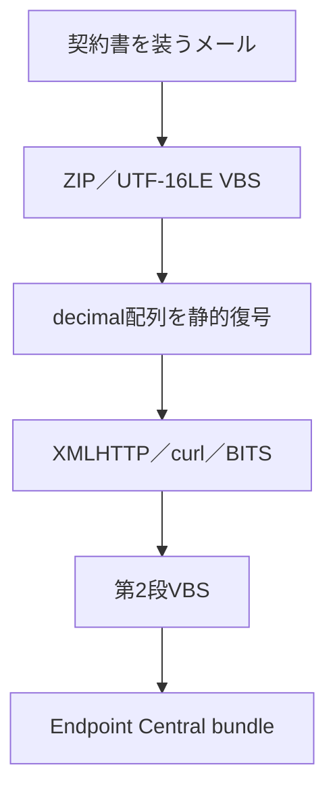
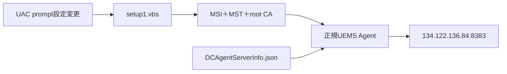
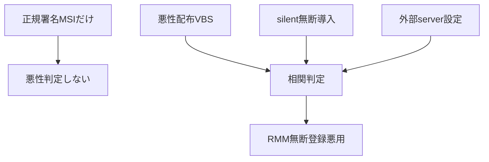

# 全体ロジック

## 配布chain

```mermaid
flowchart TD
  A["契約書を装うメール"] --> B["ZIP／UTF-16LE VBS"]
  B --> C["decimal配列を静的復号"]
  C --> D["XMLHTTP／curl／BITS"]
  D --> E["第2段VBS"]
  E --> F["Endpoint Central bundle"]
```

## 導入と登録

```mermaid
flowchart LR
  A["UAC prompt設定変更"] --> B["setup1.vbs"]
  B --> C["MSI＋MST＋root CA"]
  C --> D["正規UEMS Agent"]
  E["DCAgentServerInfo.json"] --> D
  D --> F["134.122.136.84:8383"]
```

## 判定境界

```mermaid
flowchart TD
  A["正規署名MSIだけ"] --> B["悪性判定しない"]
  C["悪性配布VBS"] --> F["相関判定"]
  D["silent無断導入"] --> F
  E["外部server設定"] --> F
  F --> G["RMM無断登録悪用"]
```
