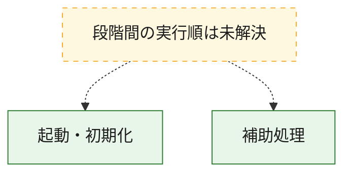
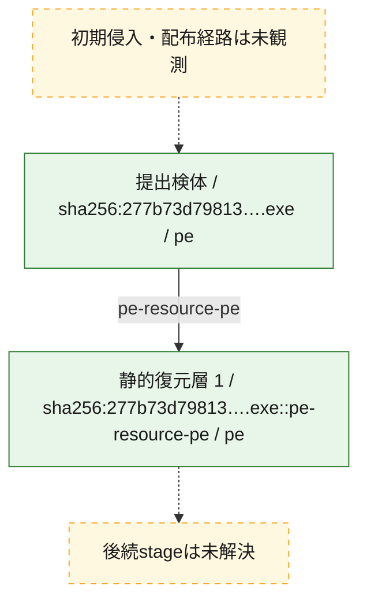
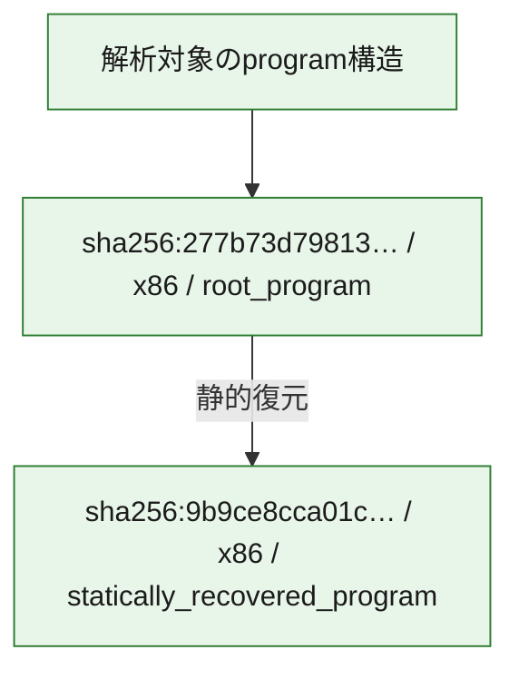

# 全体ロジック：277b73d7981302c0da84c9656c8c5e132929d433aa8485b288ba7c5397b4b469

代表関数の静的証跡から、起動・初期化の処理群を確認しました。

## 読み方

- phaseの掲載順は解析上の整理順です。observed_call_edgesがない段階間の実行順を断定しません。
- 図の実線は静的に観測した関係、点線と黄色のノードは未観測・未解決の関係を示します。
- 図は静的な要約であり、動的実行を再現するものではありません。
- 詳細な関数解説とfingerprintは[STATIC-LOGIC.md](STATIC-LOGIC.md)を参照してください。

## 静的可視化

### 実行フロー

### 感染チェーン

### モジュール関係

## 処理段階

### 1. 起動・初期化

entry pointから初期化と後続処理への移行を確認します。
確度: `confirmed_static_function_evidence_with_limits`

- `9b9ce8cca01ca1c6f3f49562db9c0a4992d706f73d1b0a2195c7d765c66805f5:ghidra:140001490` — 初期化と主要処理への分岐を行う入口関数です。 状態: `succeeded`、選定理由: `entry_point`, `meaningful_symbol_name`, `reviewed_call_centrality:31`, `role:entrypoint`
- `277b73d7981302c0da84c9656c8c5e132929d433aa8485b288ba7c5397b4b469:ghidra:140001470` — 初期化と主要処理への分岐を行う入口関数です。 状態: `failed_empty`、選定理由: `entry_point`, `meaningful_symbol_name`, `role:entrypoint`

### 2. 補助処理

主要処理を支える一般内部関数またはlibrary処理を確認します。
確度: `confirmed_static_function_evidence_with_limits`

- `9b9ce8cca01ca1c6f3f49562db9c0a4992d706f73d1b0a2195c7d765c66805f5:ghidra:140001000` — 検体内部の一般処理を実装する関数です。 状態: `succeeded`、選定理由: `context_representative`
- `9b9ce8cca01ca1c6f3f49562db9c0a4992d706f73d1b0a2195c7d765c66805f5:ghidra:140001010` — 検体内部の一般処理を実装する関数です。 状態: `succeeded`、選定理由: `context_representative`
- `9b9ce8cca01ca1c6f3f49562db9c0a4992d706f73d1b0a2195c7d765c66805f5:ghidra:140001030` — 検体内部の一般処理を実装する関数です。 状態: `limited_bad_instruction_or_flow`、選定理由: `context_representative`, `reviewed_call_centrality:2`
- `9b9ce8cca01ca1c6f3f49562db9c0a4992d706f73d1b0a2195c7d765c66805f5:ghidra:140001040` — 検体内部の一般処理を実装する関数です。 状態: `succeeded`、選定理由: `context_representative`, `reviewed_call_centrality:33`
- `9b9ce8cca01ca1c6f3f49562db9c0a4992d706f73d1b0a2195c7d765c66805f5:ghidra:1400010a0` — 検体内部の一般処理を実装する関数です。 状態: `succeeded`、選定理由: `context_representative`, `reviewed_call_centrality:31`
- `9b9ce8cca01ca1c6f3f49562db9c0a4992d706f73d1b0a2195c7d765c66805f5:ghidra:140001470` — 検体内部の一般処理を実装する関数です。 状態: `succeeded`、選定理由: `context_representative`, `reviewed_call_centrality:31`
- `9b9ce8cca01ca1c6f3f49562db9c0a4992d706f73d1b0a2195c7d765c66805f5:ghidra:1400014b0` — 検体内部の一般処理を実装する関数です。 状態: `limited_bad_instruction_or_flow`、選定理由: `context_representative`, `reviewed_call_centrality:2`
- `9b9ce8cca01ca1c6f3f49562db9c0a4992d706f73d1b0a2195c7d765c66805f5:ghidra:1400014c0` — 検体内部の一般処理を実装する関数です。 状態: `limited_bad_instruction_or_flow`、選定理由: `context_representative`, `reviewed_call_centrality:2`
- `9b9ce8cca01ca1c6f3f49562db9c0a4992d706f73d1b0a2195c7d765c66805f5:ghidra:1400014d0` — 検体内部の一般処理を実装する関数です。 状態: `succeeded`、選定理由: `context_representative`
- `9b9ce8cca01ca1c6f3f49562db9c0a4992d706f73d1b0a2195c7d765c66805f5:ghidra:1400014e0` — 検体内部の一般処理を実装する関数です。 状態: `succeeded`、選定理由: `context_representative`, `reviewed_call_centrality:3`
- `9b9ce8cca01ca1c6f3f49562db9c0a4992d706f73d1b0a2195c7d765c66805f5:ghidra:1400015f0` — 検体内部の一般処理を実装する関数です。 状態: `succeeded`、選定理由: `context_representative`, `reviewed_call_centrality:1`
- `9b9ce8cca01ca1c6f3f49562db9c0a4992d706f73d1b0a2195c7d765c66805f5:ghidra:140001660` — 検体内部の一般処理を実装する関数です。 状態: `succeeded`、選定理由: `context_representative`
- `9b9ce8cca01ca1c6f3f49562db9c0a4992d706f73d1b0a2195c7d765c66805f5:ghidra:140001690` — 検体内部の一般処理を実装する関数です。 状態: `succeeded`、選定理由: `context_representative`
- `9b9ce8cca01ca1c6f3f49562db9c0a4992d706f73d1b0a2195c7d765c66805f5:ghidra:1400016a0` — 検体内部の一般処理を実装する関数です。 状態: `succeeded`、選定理由: `context_representative`, `reviewed_call_centrality:1`
- `9b9ce8cca01ca1c6f3f49562db9c0a4992d706f73d1b0a2195c7d765c66805f5:ghidra:1400016e0` — 検体内部の一般処理を実装する関数です。 状態: `succeeded`、選定理由: `context_representative`, `reviewed_call_centrality:1`
- `9b9ce8cca01ca1c6f3f49562db9c0a4992d706f73d1b0a2195c7d765c66805f5:ghidra:140001780` — 検体内部の一般処理を実装する関数です。 状態: `succeeded`、選定理由: `context_representative`, `reviewed_call_centrality:5`
- `9b9ce8cca01ca1c6f3f49562db9c0a4992d706f73d1b0a2195c7d765c66805f5:ghidra:140001790` — 検体内部の一般処理を実装する関数です。 状態: `limited_bad_instruction_or_flow`、選定理由: `context_representative`, `reviewed_call_centrality:3`
- `9b9ce8cca01ca1c6f3f49562db9c0a4992d706f73d1b0a2195c7d765c66805f5:ghidra:1400017c0` — 検体内部の一般処理を実装する関数です。 状態: `succeeded`、選定理由: `context_representative`, `reviewed_call_centrality:5`
- `9b9ce8cca01ca1c6f3f49562db9c0a4992d706f73d1b0a2195c7d765c66805f5:ghidra:1400017d0` — 検体内部の一般処理を実装する関数です。 状態: `limited_bad_instruction_or_flow`、選定理由: `context_representative`, `reviewed_call_centrality:3`
- `9b9ce8cca01ca1c6f3f49562db9c0a4992d706f73d1b0a2195c7d765c66805f5:ghidra:140001800` — 検体内部の一般処理を実装する関数です。 状態: `succeeded`、選定理由: `context_representative`, `reviewed_call_centrality:1`
- `9b9ce8cca01ca1c6f3f49562db9c0a4992d706f73d1b0a2195c7d765c66805f5:ghidra:140001880` — 検体内部の一般処理を実装する関数です。 状態: `succeeded`、選定理由: `context_representative`, `reviewed_call_centrality:1`
- `9b9ce8cca01ca1c6f3f49562db9c0a4992d706f73d1b0a2195c7d765c66805f5:ghidra:140001900` — 検体内部の一般処理を実装する関数です。 状態: `succeeded`、選定理由: `context_representative`, `reviewed_call_centrality:1`
- `9b9ce8cca01ca1c6f3f49562db9c0a4992d706f73d1b0a2195c7d765c66805f5:ghidra:1400019f0` — 検体内部の一般処理を実装する関数です。 状態: `succeeded`、選定理由: `context_representative`, `reviewed_call_centrality:2`
- `9b9ce8cca01ca1c6f3f49562db9c0a4992d706f73d1b0a2195c7d765c66805f5:ghidra:140001ab0` — 検体内部の一般処理を実装する関数です。 状態: `succeeded`、選定理由: `context_representative`, `reviewed_call_centrality:7`
- `9b9ce8cca01ca1c6f3f49562db9c0a4992d706f73d1b0a2195c7d765c66805f5:ghidra:140001af0` — 検体内部の一般処理を実装する関数です。 状態: `succeeded`、選定理由: `context_representative`, `reviewed_call_centrality:5`
- `9b9ce8cca01ca1c6f3f49562db9c0a4992d706f73d1b0a2195c7d765c66805f5:ghidra:140001b90` — 検体内部の一般処理を実装する関数です。 状態: `succeeded`、選定理由: `context_representative`
- `9b9ce8cca01ca1c6f3f49562db9c0a4992d706f73d1b0a2195c7d765c66805f5:ghidra:140001c40` — 検体内部の一般処理を実装する関数です。 状態: `failed_empty`、選定理由: `context_representative`
- `9b9ce8cca01ca1c6f3f49562db9c0a4992d706f73d1b0a2195c7d765c66805f5:ghidra:1400022e0` — 検体内部の一般処理を実装する関数です。 状態: `failed_empty`、選定理由: `context_representative`
- `9b9ce8cca01ca1c6f3f49562db9c0a4992d706f73d1b0a2195c7d765c66805f5:ghidra:140002310` — 検体内部の一般処理を実装する関数です。 状態: `succeeded`、選定理由: `context_representative`, `reviewed_call_centrality:3`
- `9b9ce8cca01ca1c6f3f49562db9c0a4992d706f73d1b0a2195c7d765c66805f5:ghidra:1400026a0` — 検体内部の一般処理を実装する関数です。 状態: `succeeded`、選定理由: `context_representative`, `reviewed_call_centrality:3`
- `9b9ce8cca01ca1c6f3f49562db9c0a4992d706f73d1b0a2195c7d765c66805f5:ghidra:1405e2400` — compiler生成処理または汎用library処理とみられる関数です。 状態: `limited_bad_instruction_or_flow`、選定理由: `entry_point`, `meaningful_symbol_name`, `reviewed_call_centrality:12`
- `277b73d7981302c0da84c9656c8c5e132929d433aa8485b288ba7c5397b4b469:ghidra:140001000` — 検体内部の一般処理を実装する関数です。 状態: `succeeded`、選定理由: `context_representative`
- `277b73d7981302c0da84c9656c8c5e132929d433aa8485b288ba7c5397b4b469:ghidra:140001010` — 検体内部の一般処理を実装する関数です。 状態: `succeeded`、選定理由: `context_representative`
- `277b73d7981302c0da84c9656c8c5e132929d433aa8485b288ba7c5397b4b469:ghidra:140001030` — 検体内部の一般処理を実装する関数です。 状態: `limited_bad_instruction_or_flow`、選定理由: `context_representative`, `reviewed_call_centrality:2`
- `277b73d7981302c0da84c9656c8c5e132929d433aa8485b288ba7c5397b4b469:ghidra:140001040` — 検体内部の一般処理を実装する関数です。 状態: `succeeded`、選定理由: `context_representative`, `reviewed_call_centrality:32`
- `277b73d7981302c0da84c9656c8c5e132929d433aa8485b288ba7c5397b4b469:ghidra:1400010a0` — 検体内部の一般処理を実装する関数です。 状態: `succeeded`、選定理由: `context_representative`, `reviewed_call_centrality:30`
- `277b73d7981302c0da84c9656c8c5e132929d433aa8485b288ba7c5397b4b469:ghidra:140001490` — 検体内部の一般処理を実装する関数です。 状態: `succeeded`、選定理由: `context_representative`, `reviewed_call_centrality:30`
- `277b73d7981302c0da84c9656c8c5e132929d433aa8485b288ba7c5397b4b469:ghidra:1400014b0` — 検体内部の一般処理を実装する関数です。 状態: `limited_bad_instruction_or_flow`、選定理由: `context_representative`, `reviewed_call_centrality:2`
- `277b73d7981302c0da84c9656c8c5e132929d433aa8485b288ba7c5397b4b469:ghidra:1400014c0` — 検体内部の一般処理を実装する関数です。 状態: `limited_bad_instruction_or_flow`、選定理由: `context_representative`, `reviewed_call_centrality:2`
- `277b73d7981302c0da84c9656c8c5e132929d433aa8485b288ba7c5397b4b469:ghidra:1400014d0` — 検体内部の一般処理を実装する関数です。 状態: `succeeded`、選定理由: `context_representative`
- `277b73d7981302c0da84c9656c8c5e132929d433aa8485b288ba7c5397b4b469:ghidra:140001500` — 検体内部の一般処理を実装する関数です。 状態: `succeeded`、選定理由: `context_representative`, `reviewed_call_centrality:3`
- `277b73d7981302c0da84c9656c8c5e132929d433aa8485b288ba7c5397b4b469:ghidra:1400015d0` — 検体内部の一般処理を実装する関数です。 状態: `succeeded`、選定理由: `context_representative`, `reviewed_call_centrality:4`
- `277b73d7981302c0da84c9656c8c5e132929d433aa8485b288ba7c5397b4b469:ghidra:140001630` — 検体内部の一般処理を実装する関数です。 状態: `succeeded`、選定理由: `context_representative`, `reviewed_call_centrality:7`
- `277b73d7981302c0da84c9656c8c5e132929d433aa8485b288ba7c5397b4b469:ghidra:140001700` — 検体内部の一般処理を実装する関数です。 状態: `succeeded`、選定理由: `context_representative`, `reviewed_call_centrality:1`
- `277b73d7981302c0da84c9656c8c5e132929d433aa8485b288ba7c5397b4b469:ghidra:140001780` — 検体内部の一般処理を実装する関数です。 状態: `succeeded`、選定理由: `context_representative`, `reviewed_call_centrality:1`
- `277b73d7981302c0da84c9656c8c5e132929d433aa8485b288ba7c5397b4b469:ghidra:1400017e0` — 検体内部の一般処理を実装する関数です。 状態: `succeeded`、選定理由: `context_representative`, `reviewed_call_centrality:2`
- `277b73d7981302c0da84c9656c8c5e132929d433aa8485b288ba7c5397b4b469:ghidra:140001870` — 検体内部の一般処理を実装する関数です。 状態: `succeeded`、選定理由: `context_representative`
- `277b73d7981302c0da84c9656c8c5e132929d433aa8485b288ba7c5397b4b469:ghidra:1400019c0` — 検体内部の一般処理を実装する関数です。 状態: `succeeded`、選定理由: `context_representative`
- `277b73d7981302c0da84c9656c8c5e132929d433aa8485b288ba7c5397b4b469:ghidra:1400019f0` — 検体内部の一般処理を実装する関数です。 状態: `succeeded`、選定理由: `context_representative`, `reviewed_call_centrality:4`
- `277b73d7981302c0da84c9656c8c5e132929d433aa8485b288ba7c5397b4b469:ghidra:140001ad0` — 検体内部の一般処理を実装する関数です。 状態: `succeeded`、選定理由: `context_representative`, `reviewed_call_centrality:1`
- `277b73d7981302c0da84c9656c8c5e132929d433aa8485b288ba7c5397b4b469:ghidra:140001b20` — 検体内部の一般処理を実装する関数です。 状態: `succeeded`、選定理由: `context_representative`
- `277b73d7981302c0da84c9656c8c5e132929d433aa8485b288ba7c5397b4b469:ghidra:140001b90` — 検体内部の一般処理を実装する関数です。 状態: `succeeded`、選定理由: `context_representative`
- `277b73d7981302c0da84c9656c8c5e132929d433aa8485b288ba7c5397b4b469:ghidra:140001bf0` — 検体内部の一般処理を実装する関数です。 状態: `succeeded`、選定理由: `context_representative`, `reviewed_call_centrality:1`
- `277b73d7981302c0da84c9656c8c5e132929d433aa8485b288ba7c5397b4b469:ghidra:140001cd0` — 検体内部の一般処理を実装する関数です。 状態: `succeeded`、選定理由: `context_representative`
- `277b73d7981302c0da84c9656c8c5e132929d433aa8485b288ba7c5397b4b469:ghidra:140001e20` — 検体内部の一般処理を実装する関数です。 状態: `succeeded`、選定理由: `context_representative`, `reviewed_call_centrality:2`
- `277b73d7981302c0da84c9656c8c5e132929d433aa8485b288ba7c5397b4b469:ghidra:140001eb0` — 検体内部の一般処理を実装する関数です。 状態: `succeeded`、選定理由: `context_representative`, `reviewed_call_centrality:6`
- `277b73d7981302c0da84c9656c8c5e132929d433aa8485b288ba7c5397b4b469:ghidra:140001ff0` — 検体内部の一般処理を実装する関数です。 状態: `succeeded`、選定理由: `context_representative`, `reviewed_call_centrality:6`
- `277b73d7981302c0da84c9656c8c5e132929d433aa8485b288ba7c5397b4b469:ghidra:140002260` — 検体内部の一般処理を実装する関数です。 状態: `succeeded`、選定理由: `context_representative`, `reviewed_call_centrality:5`
- `277b73d7981302c0da84c9656c8c5e132929d433aa8485b288ba7c5397b4b469:ghidra:140002370` — 検体内部の一般処理を実装する関数です。 状態: `succeeded`、選定理由: `context_representative`, `reviewed_call_centrality:2`
- `277b73d7981302c0da84c9656c8c5e132929d433aa8485b288ba7c5397b4b469:ghidra:140002410` — 検体内部の一般処理を実装する関数です。 状態: `succeeded`、選定理由: `context_representative`, `reviewed_call_centrality:4`
- `277b73d7981302c0da84c9656c8c5e132929d433aa8485b288ba7c5397b4b469:ghidra:140002690` — 検体内部の一般処理を実装する関数です。 状態: `succeeded`、選定理由: `context_representative`, `reviewed_call_centrality:25`
- `277b73d7981302c0da84c9656c8c5e132929d433aa8485b288ba7c5397b4b469:ghidra:14001dc40` — compiler生成処理または汎用library処理とみられる関数です。 状態: `failed_empty`、選定理由: `entry_point`, `meaningful_symbol_name`

## 観測したcall関係

- `277b73d7981302c0da84c9656c8c5e132929d433aa8485b288ba7c5397b4b469:ghidra:140001700` → `277b73d7981302c0da84c9656c8c5e132929d433aa8485b288ba7c5397b4b469:ghidra:140001630` （`support` → `support`）
- `277b73d7981302c0da84c9656c8c5e132929d433aa8485b288ba7c5397b4b469:ghidra:1400017e0` → `277b73d7981302c0da84c9656c8c5e132929d433aa8485b288ba7c5397b4b469:ghidra:140001630` （`support` → `support`）
- `277b73d7981302c0da84c9656c8c5e132929d433aa8485b288ba7c5397b4b469:ghidra:140001e20` → `277b73d7981302c0da84c9656c8c5e132929d433aa8485b288ba7c5397b4b469:ghidra:140001630` （`support` → `support`）
- `277b73d7981302c0da84c9656c8c5e132929d433aa8485b288ba7c5397b4b469:ghidra:140001eb0` → `277b73d7981302c0da84c9656c8c5e132929d433aa8485b288ba7c5397b4b469:ghidra:1400015d0` （`support` → `support`）
- `277b73d7981302c0da84c9656c8c5e132929d433aa8485b288ba7c5397b4b469:ghidra:140001eb0` → `277b73d7981302c0da84c9656c8c5e132929d433aa8485b288ba7c5397b4b469:ghidra:140001630` （`support` → `support`）
- `277b73d7981302c0da84c9656c8c5e132929d433aa8485b288ba7c5397b4b469:ghidra:140001ff0` → `277b73d7981302c0da84c9656c8c5e132929d433aa8485b288ba7c5397b4b469:ghidra:1400015d0` （`support` → `support`）
- `277b73d7981302c0da84c9656c8c5e132929d433aa8485b288ba7c5397b4b469:ghidra:140001ff0` → `277b73d7981302c0da84c9656c8c5e132929d433aa8485b288ba7c5397b4b469:ghidra:140001630` （`support` → `support`）
- `277b73d7981302c0da84c9656c8c5e132929d433aa8485b288ba7c5397b4b469:ghidra:140002260` → `277b73d7981302c0da84c9656c8c5e132929d433aa8485b288ba7c5397b4b469:ghidra:1400015d0` （`support` → `support`）
- `277b73d7981302c0da84c9656c8c5e132929d433aa8485b288ba7c5397b4b469:ghidra:140002260` → `277b73d7981302c0da84c9656c8c5e132929d433aa8485b288ba7c5397b4b469:ghidra:140001630` （`support` → `support`）
- `277b73d7981302c0da84c9656c8c5e132929d433aa8485b288ba7c5397b4b469:ghidra:140002370` → `277b73d7981302c0da84c9656c8c5e132929d433aa8485b288ba7c5397b4b469:ghidra:140001500` （`support` → `support`）
- `277b73d7981302c0da84c9656c8c5e132929d433aa8485b288ba7c5397b4b469:ghidra:140002370` → `277b73d7981302c0da84c9656c8c5e132929d433aa8485b288ba7c5397b4b469:ghidra:140002260` （`support` → `support`）
- `277b73d7981302c0da84c9656c8c5e132929d433aa8485b288ba7c5397b4b469:ghidra:140002410` → `277b73d7981302c0da84c9656c8c5e132929d433aa8485b288ba7c5397b4b469:ghidra:140001500` （`support` → `support`）
- `277b73d7981302c0da84c9656c8c5e132929d433aa8485b288ba7c5397b4b469:ghidra:140002410` → `277b73d7981302c0da84c9656c8c5e132929d433aa8485b288ba7c5397b4b469:ghidra:140002260` （`support` → `support`）
- `277b73d7981302c0da84c9656c8c5e132929d433aa8485b288ba7c5397b4b469:ghidra:140002690` → `277b73d7981302c0da84c9656c8c5e132929d433aa8485b288ba7c5397b4b469:ghidra:140001500` （`support` → `support`）
- `277b73d7981302c0da84c9656c8c5e132929d433aa8485b288ba7c5397b4b469:ghidra:140002690` → `277b73d7981302c0da84c9656c8c5e132929d433aa8485b288ba7c5397b4b469:ghidra:1400015d0` （`support` → `support`）
- `277b73d7981302c0da84c9656c8c5e132929d433aa8485b288ba7c5397b4b469:ghidra:140002690` → `277b73d7981302c0da84c9656c8c5e132929d433aa8485b288ba7c5397b4b469:ghidra:140001630` （`support` → `support`）
- `277b73d7981302c0da84c9656c8c5e132929d433aa8485b288ba7c5397b4b469:ghidra:140002690` → `277b73d7981302c0da84c9656c8c5e132929d433aa8485b288ba7c5397b4b469:ghidra:140001780` （`support` → `support`）
- `277b73d7981302c0da84c9656c8c5e132929d433aa8485b288ba7c5397b4b469:ghidra:140002690` → `277b73d7981302c0da84c9656c8c5e132929d433aa8485b288ba7c5397b4b469:ghidra:1400017e0` （`support` → `support`）
- `277b73d7981302c0da84c9656c8c5e132929d433aa8485b288ba7c5397b4b469:ghidra:140002690` → `277b73d7981302c0da84c9656c8c5e132929d433aa8485b288ba7c5397b4b469:ghidra:140001ad0` （`support` → `support`）
- `277b73d7981302c0da84c9656c8c5e132929d433aa8485b288ba7c5397b4b469:ghidra:140002690` → `277b73d7981302c0da84c9656c8c5e132929d433aa8485b288ba7c5397b4b469:ghidra:140001e20` （`support` → `support`）
- `277b73d7981302c0da84c9656c8c5e132929d433aa8485b288ba7c5397b4b469:ghidra:140002690` → `277b73d7981302c0da84c9656c8c5e132929d433aa8485b288ba7c5397b4b469:ghidra:140002260` （`support` → `support`）
- `277b73d7981302c0da84c9656c8c5e132929d433aa8485b288ba7c5397b4b469:ghidra:140002690` → `277b73d7981302c0da84c9656c8c5e132929d433aa8485b288ba7c5397b4b469:ghidra:140002410` （`support` → `support`）
- `ghidra-function:021f444d04495567614acfde` → `ghidra-external:02c3a458553807225cc35d78` （`unclassified` → `unclassified`）
- `ghidra-function:021f444d04495567614acfde` → `ghidra-external:0cd2464706b9174d7442d039` （`unclassified` → `unclassified`）
- `ghidra-function:021f444d04495567614acfde` → `ghidra-external:149c9e32bcd3548c42608bb6` （`unclassified` → `unclassified`）
- `ghidra-function:021f444d04495567614acfde` → `ghidra-external:1745be48194b6fbeba682ed5` （`unclassified` → `unclassified`）
- `ghidra-function:021f444d04495567614acfde` → `ghidra-external:3291b7336cb4426796f9006a` （`unclassified` → `unclassified`）
- `ghidra-function:021f444d04495567614acfde` → `ghidra-external:32b372d5a7413fa656f2a3fc` （`unclassified` → `unclassified`）
- `ghidra-function:021f444d04495567614acfde` → `ghidra-external:527c366b692f89092a8e869d` （`unclassified` → `unclassified`）
- `ghidra-function:021f444d04495567614acfde` → `ghidra-external:54b38afc3dfc2661ee4dd6cd` （`unclassified` → `unclassified`）
- `ghidra-function:021f444d04495567614acfde` → `ghidra-external:6e93f1456ca4ce3f02de2e47` （`unclassified` → `unclassified`）
- `ghidra-function:021f444d04495567614acfde` → `ghidra-external:71018a03789ff69d8c9dcf23` （`unclassified` → `unclassified`）
- `ghidra-function:021f444d04495567614acfde` → `ghidra-external:74b68bf9e611b181236ded11` （`unclassified` → `unclassified`）
- `ghidra-function:021f444d04495567614acfde` → `ghidra-external:828190aa403e3ed602fb38cc` （`unclassified` → `unclassified`）
- `ghidra-function:021f444d04495567614acfde` → `ghidra-external:859d8a6537ac02386479171f` （`unclassified` → `unclassified`）
- `ghidra-function:021f444d04495567614acfde` → `ghidra-external:865b917524551354da24bcb5` （`unclassified` → `unclassified`）
- `ghidra-function:021f444d04495567614acfde` → `ghidra-external:a6de79ee7a2bb875b42e4791` （`unclassified` → `unclassified`）
- `ghidra-function:021f444d04495567614acfde` → `ghidra-external:aa81d1b1116b3c2f201976f7` （`unclassified` → `unclassified`）
- `ghidra-function:021f444d04495567614acfde` → `ghidra-external:ca117eb2263bdbe33c1b72a4` （`unclassified` → `unclassified`）
- `ghidra-function:021f444d04495567614acfde` → `ghidra-external:ced8e60aa17f74664fa4695d` （`unclassified` → `unclassified`）
- `ghidra-function:021f444d04495567614acfde` → `ghidra-external:d70f4c27c69de67fef5ff164` （`unclassified` → `unclassified`）
- `ghidra-function:021f444d04495567614acfde` → `ghidra-function:17adfd4e0d65500492f077eb` （`unclassified` → `unclassified`）
- `ghidra-function:021f444d04495567614acfde` → `ghidra-function:39b2447c0a13a812872f290d` （`unclassified` → `unclassified`）
- `ghidra-function:021f444d04495567614acfde` → `ghidra-function:4c8f0e6214adcce08958c7b0` （`unclassified` → `unclassified`）
- `ghidra-function:021f444d04495567614acfde` → `ghidra-function:57b9e0336369b3b5e87fba8f` （`unclassified` → `unclassified`）
- `ghidra-function:021f444d04495567614acfde` → `ghidra-function:63b39b567bf0a62a57d1867a` （`unclassified` → `unclassified`）
- `ghidra-function:021f444d04495567614acfde` → `ghidra-function:6cd8451b5a838622f4e20014` （`unclassified` → `unclassified`）
- `ghidra-function:021f444d04495567614acfde` → `ghidra-function:7064c9731bf6fa4c9bd4e84d` （`unclassified` → `unclassified`）
- `ghidra-function:021f444d04495567614acfde` → `ghidra-function:9ef0e0adf34702ecf5d76a65` （`unclassified` → `unclassified`）
- `ghidra-function:021f444d04495567614acfde` → `ghidra-function:ad5a9abc58e90d4b2ea650de` （`unclassified` → `unclassified`）
- `ghidra-function:021f444d04495567614acfde` → `ghidra-function:e061c548d0597a17afcfe872` （`unclassified` → `unclassified`）
- `ghidra-function:021f444d04495567614acfde` → `ghidra-function:fd04b0b38b9ddef3e982b867` （`unclassified` → `unclassified`）
- `ghidra-function:0276141fc8d404039f63dfe3` → `ghidra-function:ff50aff45b7a5ebaa334a891` （`unclassified` → `unclassified`）
- `ghidra-function:09cf4c928c66b2eb9a414e87` → `ghidra-external:3291b7336cb4426796f9006a` （`unclassified` → `unclassified`）
- `ghidra-function:156e4eee315a13eaf79e8b3c` → `ghidra-external:9acc919b4319b73133c3dfc5` （`unclassified` → `unclassified`）
- `ghidra-function:156e4eee315a13eaf79e8b3c` → `ghidra-function:23c338990cca6b8e3e7e0888` （`unclassified` → `unclassified`）
- `ghidra-function:156e4eee315a13eaf79e8b3c` → `ghidra-function:30bb1c1464f4d33ba00e8c87` （`unclassified` → `unclassified`）
- `ghidra-function:156e4eee315a13eaf79e8b3c` → `ghidra-function:5d907a1c50e4f33a057fad5e` （`unclassified` → `unclassified`）
- `ghidra-function:156e4eee315a13eaf79e8b3c` → `ghidra-function:666b94c9581698efa2eee013` （`unclassified` → `unclassified`）
- `ghidra-function:156e4eee315a13eaf79e8b3c` → `ghidra-function:72b7fea38b899b7beb32b43c` （`unclassified` → `unclassified`）
- `ghidra-function:156e4eee315a13eaf79e8b3c` → `ghidra-function:aeeff3c660063e9ced6ddd13` （`unclassified` → `unclassified`）
- `ghidra-function:156e4eee315a13eaf79e8b3c` → `ghidra-function:b689af4749957b2efd82fcf3` （`unclassified` → `unclassified`）
- `ghidra-function:156e4eee315a13eaf79e8b3c` → `ghidra-function:fac425a2a45e528719288e95` （`unclassified` → `unclassified`）
- `ghidra-function:1db057c7522adbca1e5cf7b3` → `ghidra-external:1745be48194b6fbeba682ed5` （`unclassified` → `unclassified`）
- `ghidra-function:1db057c7522adbca1e5cf7b3` → `ghidra-external:88d9c2e8feb360f13eca0da3` （`unclassified` → `unclassified`）
- `ghidra-function:1db057c7522adbca1e5cf7b3` → `ghidra-external:a720905816e2dc475b3f89bc` （`unclassified` → `unclassified`）
- `ghidra-function:1db057c7522adbca1e5cf7b3` → `ghidra-external:e2589ad5f7008f9e5432006b` （`unclassified` → `unclassified`）
- `ghidra-function:1f5363a6e3350c4ba4c0db3a` → `ghidra-function:a2e6f9b9b96bb0b2c9c9da5a` （`unclassified` → `unclassified`）
- `ghidra-function:2be7907898b68501139aaf50` → `ghidra-external:02361019102d5ac55396fbbc` （`unclassified` → `unclassified`）
- `ghidra-function:2be7907898b68501139aaf50` → `ghidra-external:14526a022a93af83c4569f20` （`unclassified` → `unclassified`）
- `ghidra-function:2be7907898b68501139aaf50` → `ghidra-external:19d759b3e1ccf4143a1edf4f` （`unclassified` → `unclassified`）
- `ghidra-function:2be7907898b68501139aaf50` → `ghidra-external:26e41cf8dd2161fdea2e7bfb` （`unclassified` → `unclassified`）
- `ghidra-function:2be7907898b68501139aaf50` → `ghidra-external:2dcf4b257efa3a88b1aeab8d` （`unclassified` → `unclassified`）
- `ghidra-function:2be7907898b68501139aaf50` → `ghidra-external:35d7c70a1305f75196df9dcf` （`unclassified` → `unclassified`）
- `ghidra-function:2be7907898b68501139aaf50` → `ghidra-external:4b33f201e16483be624c0d1e` （`unclassified` → `unclassified`）
- `ghidra-function:2be7907898b68501139aaf50` → `ghidra-external:4ee3fe34911858fe92f6fb04` （`unclassified` → `unclassified`）
- `ghidra-function:2be7907898b68501139aaf50` → `ghidra-external:6811a6e3fdc62764a3360fa7` （`unclassified` → `unclassified`）
- `ghidra-function:2be7907898b68501139aaf50` → `ghidra-external:6828b8418658fbaa303303f8` （`unclassified` → `unclassified`）
- `ghidra-function:2be7907898b68501139aaf50` → `ghidra-external:9a567339d23e1e2ad9522af4` （`unclassified` → `unclassified`）
- `ghidra-function:2be7907898b68501139aaf50` → `ghidra-external:9d39a4bb447eaa9d6beec6ae` （`unclassified` → `unclassified`）
- `ghidra-function:2be7907898b68501139aaf50` → `ghidra-external:a0e342328bdb87abbc079198` （`unclassified` → `unclassified`）
- `ghidra-function:2be7907898b68501139aaf50` → `ghidra-external:a4735a191324f9d3efe956f0` （`unclassified` → `unclassified`）
- `ghidra-function:2be7907898b68501139aaf50` → `ghidra-external:a9dd9f3bed73dd817fb1027a` （`unclassified` → `unclassified`）
- `ghidra-function:2be7907898b68501139aaf50` → `ghidra-external:bbd6d2101f1501c7d80bc498` （`unclassified` → `unclassified`）
- `ghidra-function:2be7907898b68501139aaf50` → `ghidra-external:e01f413fa6efb9d5362e11c0` （`unclassified` → `unclassified`）
- `ghidra-function:2be7907898b68501139aaf50` → `ghidra-external:e4b25940b7fee7231c464304` （`unclassified` → `unclassified`）
- `ghidra-function:2be7907898b68501139aaf50` → `ghidra-external:f3267eec63217bbd4c865d41` （`unclassified` → `unclassified`）
- `ghidra-function:2be7907898b68501139aaf50` → `ghidra-external:f42c78485d7a35c3bcd730f6` （`unclassified` → `unclassified`）
- `ghidra-function:2be7907898b68501139aaf50` → `ghidra-function:02e7db057d77fdd788d21e60` （`unclassified` → `unclassified`）
- `ghidra-function:2be7907898b68501139aaf50` → `ghidra-function:3eec77cc902b51d59d089862` （`unclassified` → `unclassified`）
- `ghidra-function:2be7907898b68501139aaf50` → `ghidra-function:5511dbf27d5d266a67d41216` （`unclassified` → `unclassified`）
- `ghidra-function:2be7907898b68501139aaf50` → `ghidra-function:56b7fe2b041194b8ebcfe71a` （`unclassified` → `unclassified`）
- `ghidra-function:2be7907898b68501139aaf50` → `ghidra-function:785e48b916faecaa6ed7163d` （`unclassified` → `unclassified`）
- `ghidra-function:2be7907898b68501139aaf50` → `ghidra-function:864d2b7edecb028cf80a8c65` （`unclassified` → `unclassified`）
- `ghidra-function:2be7907898b68501139aaf50` → `ghidra-function:8fa215ed34bad11439033f35` （`unclassified` → `unclassified`）
- `ghidra-function:2be7907898b68501139aaf50` → `ghidra-function:ce4b7b865eff8c37398a2142` （`unclassified` → `unclassified`）
- `ghidra-function:2be7907898b68501139aaf50` → `ghidra-function:d826a0c9dea660899896a5e3` （`unclassified` → `unclassified`）
- `ghidra-function:2be7907898b68501139aaf50` → `ghidra-function:e9ecdfd5dd7fc0ed71a250e6` （`unclassified` → `unclassified`）
- `ghidra-function:2be7907898b68501139aaf50` → `ghidra-function:efcaa6c34f5e421e5944a738` （`unclassified` → `unclassified`）
- `ghidra-function:2d3ca4eedde4464ef4671a1a` → `ghidra-external:3291b7336cb4426796f9006a` （`unclassified` → `unclassified`）
- `ghidra-function:2d3ca4eedde4464ef4671a1a` → `ghidra-function:4cc69a557532a95cb7d41181` （`unclassified` → `unclassified`）
- `ghidra-function:2d3ca4eedde4464ef4671a1a` → `ghidra-function:527d08d35305c34f1f603c6d` （`unclassified` → `unclassified`）
- `ghidra-function:2d3ca4eedde4464ef4671a1a` → `ghidra-function:67606539285ab5fd08e6f07d` （`unclassified` → `unclassified`）
- `ghidra-function:2d3ca4eedde4464ef4671a1a` → `ghidra-function:7d29f9b47b91b0dbf15f48ea` （`unclassified` → `unclassified`）
- `ghidra-function:2d3ca4eedde4464ef4671a1a` → `ghidra-function:82e97cb2ead529cdd3322397` （`unclassified` → `unclassified`）
- `ghidra-function:301d52296382cdbf7c4474a2` → `ghidra-function:812c99b5864ebbafaab6854c` （`unclassified` → `unclassified`）
- `ghidra-function:393d717883e08eb3bb656970` → `ghidra-function:812c99b5864ebbafaab6854c` （`unclassified` → `unclassified`）
- `ghidra-function:418aba8d5ab59369a055aa23` → `ghidra-external:02361019102d5ac55396fbbc` （`unclassified` → `unclassified`）
- `ghidra-function:418aba8d5ab59369a055aa23` → `ghidra-external:14526a022a93af83c4569f20` （`unclassified` → `unclassified`）
- `ghidra-function:418aba8d5ab59369a055aa23` → `ghidra-external:19d759b3e1ccf4143a1edf4f` （`unclassified` → `unclassified`）
- `ghidra-function:418aba8d5ab59369a055aa23` → `ghidra-external:26e41cf8dd2161fdea2e7bfb` （`unclassified` → `unclassified`）
- `ghidra-function:418aba8d5ab59369a055aa23` → `ghidra-external:2dcf4b257efa3a88b1aeab8d` （`unclassified` → `unclassified`）
- `ghidra-function:418aba8d5ab59369a055aa23` → `ghidra-external:35d7c70a1305f75196df9dcf` （`unclassified` → `unclassified`）
- `ghidra-function:418aba8d5ab59369a055aa23` → `ghidra-external:4ee3fe34911858fe92f6fb04` （`unclassified` → `unclassified`）
- `ghidra-function:418aba8d5ab59369a055aa23` → `ghidra-external:6811a6e3fdc62764a3360fa7` （`unclassified` → `unclassified`）
- `ghidra-function:418aba8d5ab59369a055aa23` → `ghidra-external:6828b8418658fbaa303303f8` （`unclassified` → `unclassified`）
- `ghidra-function:418aba8d5ab59369a055aa23` → `ghidra-external:9d39a4bb447eaa9d6beec6ae` （`unclassified` → `unclassified`）
- `ghidra-function:418aba8d5ab59369a055aa23` → `ghidra-external:a0e342328bdb87abbc079198` （`unclassified` → `unclassified`）
- `ghidra-function:418aba8d5ab59369a055aa23` → `ghidra-external:a4735a191324f9d3efe956f0` （`unclassified` → `unclassified`）
- `ghidra-function:418aba8d5ab59369a055aa23` → `ghidra-external:a9dd9f3bed73dd817fb1027a` （`unclassified` → `unclassified`）
- `ghidra-function:418aba8d5ab59369a055aa23` → `ghidra-external:bbd6d2101f1501c7d80bc498` （`unclassified` → `unclassified`）
- `ghidra-function:418aba8d5ab59369a055aa23` → `ghidra-external:e01f413fa6efb9d5362e11c0` （`unclassified` → `unclassified`）
- `ghidra-function:418aba8d5ab59369a055aa23` → `ghidra-external:e4b25940b7fee7231c464304` （`unclassified` → `unclassified`）
- `ghidra-function:418aba8d5ab59369a055aa23` → `ghidra-external:f3267eec63217bbd4c865d41` （`unclassified` → `unclassified`）
- `ghidra-function:418aba8d5ab59369a055aa23` → `ghidra-external:f42c78485d7a35c3bcd730f6` （`unclassified` → `unclassified`）
- `ghidra-function:418aba8d5ab59369a055aa23` → `ghidra-function:02e7db057d77fdd788d21e60` （`unclassified` → `unclassified`）
- `ghidra-function:418aba8d5ab59369a055aa23` → `ghidra-function:3eec77cc902b51d59d089862` （`unclassified` → `unclassified`）
- `ghidra-function:418aba8d5ab59369a055aa23` → `ghidra-function:5511dbf27d5d266a67d41216` （`unclassified` → `unclassified`）
- `ghidra-function:418aba8d5ab59369a055aa23` → `ghidra-function:56b7fe2b041194b8ebcfe71a` （`unclassified` → `unclassified`）
- `ghidra-function:418aba8d5ab59369a055aa23` → `ghidra-function:785e48b916faecaa6ed7163d` （`unclassified` → `unclassified`）
- `ghidra-function:418aba8d5ab59369a055aa23` → `ghidra-function:864d2b7edecb028cf80a8c65` （`unclassified` → `unclassified`）
- `ghidra-function:418aba8d5ab59369a055aa23` → `ghidra-function:8fa215ed34bad11439033f35` （`unclassified` → `unclassified`）
- `ghidra-function:418aba8d5ab59369a055aa23` → `ghidra-function:ce4b7b865eff8c37398a2142` （`unclassified` → `unclassified`）
- `ghidra-function:418aba8d5ab59369a055aa23` → `ghidra-function:d826a0c9dea660899896a5e3` （`unclassified` → `unclassified`）
- `ghidra-function:418aba8d5ab59369a055aa23` → `ghidra-function:e9ecdfd5dd7fc0ed71a250e6` （`unclassified` → `unclassified`）
- `ghidra-function:418aba8d5ab59369a055aa23` → `ghidra-function:efcaa6c34f5e421e5944a738` （`unclassified` → `unclassified`）
- `ghidra-function:496c4dd048c173398f6205f4` → `ghidra-function:fa800b891e5859704f015d2f` （`unclassified` → `unclassified`）
- `ghidra-function:4d6b53d2b4814e54c3ff179b` → `ghidra-external:4e664f70563e4aa0734da351` （`unclassified` → `unclassified`）
- `ghidra-function:4d6b53d2b4814e54c3ff179b` → `ghidra-external:7572067b5987edd751471b0d` （`unclassified` → `unclassified`）
- `ghidra-function:4d6b53d2b4814e54c3ff179b` → `ghidra-function:b5af2dc1209d56d09b9aff68` （`unclassified` → `unclassified`）
- `ghidra-function:4d6b53d2b4814e54c3ff179b` → `ghidra-function:d58186f851b45a82d8bb3b0e` （`unclassified` → `unclassified`）
- `ghidra-function:56d659ec5c8dd8dba2a8f119` → `ghidra-external:3291b7336cb4426796f9006a` （`unclassified` → `unclassified`）
- `ghidra-function:56d659ec5c8dd8dba2a8f119` → `ghidra-function:4cc69a557532a95cb7d41181` （`unclassified` → `unclassified`）
- `ghidra-function:56d659ec5c8dd8dba2a8f119` → `ghidra-function:527d08d35305c34f1f603c6d` （`unclassified` → `unclassified`）
- `ghidra-function:56d659ec5c8dd8dba2a8f119` → `ghidra-function:67606539285ab5fd08e6f07d` （`unclassified` → `unclassified`）
- `ghidra-function:56d659ec5c8dd8dba2a8f119` → `ghidra-function:7d29f9b47b91b0dbf15f48ea` （`unclassified` → `unclassified`）
- `ghidra-function:56d659ec5c8dd8dba2a8f119` → `ghidra-function:82e97cb2ead529cdd3322397` （`unclassified` → `unclassified`）
- `ghidra-function:58199c2490225192d2861d95` → `ghidra-external:02361019102d5ac55396fbbc` （`unclassified` → `unclassified`）
- `ghidra-function:58199c2490225192d2861d95` → `ghidra-external:14526a022a93af83c4569f20` （`unclassified` → `unclassified`）
- `ghidra-function:58199c2490225192d2861d95` → `ghidra-external:19d759b3e1ccf4143a1edf4f` （`unclassified` → `unclassified`）
- `ghidra-function:58199c2490225192d2861d95` → `ghidra-external:26e41cf8dd2161fdea2e7bfb` （`unclassified` → `unclassified`）
- `ghidra-function:58199c2490225192d2861d95` → `ghidra-external:2dcf4b257efa3a88b1aeab8d` （`unclassified` → `unclassified`）
- `ghidra-function:58199c2490225192d2861d95` → `ghidra-external:35d7c70a1305f75196df9dcf` （`unclassified` → `unclassified`）
- `ghidra-function:58199c2490225192d2861d95` → `ghidra-external:4ee3fe34911858fe92f6fb04` （`unclassified` → `unclassified`）
- `ghidra-function:58199c2490225192d2861d95` → `ghidra-external:6811a6e3fdc62764a3360fa7` （`unclassified` → `unclassified`）
- `ghidra-function:58199c2490225192d2861d95` → `ghidra-external:6828b8418658fbaa303303f8` （`unclassified` → `unclassified`）
- `ghidra-function:58199c2490225192d2861d95` → `ghidra-external:9d39a4bb447eaa9d6beec6ae` （`unclassified` → `unclassified`）
- `ghidra-function:58199c2490225192d2861d95` → `ghidra-external:a0e342328bdb87abbc079198` （`unclassified` → `unclassified`）
- `ghidra-function:58199c2490225192d2861d95` → `ghidra-external:a4735a191324f9d3efe956f0` （`unclassified` → `unclassified`）
- `ghidra-function:58199c2490225192d2861d95` → `ghidra-external:a9dd9f3bed73dd817fb1027a` （`unclassified` → `unclassified`）
- `ghidra-function:58199c2490225192d2861d95` → `ghidra-external:bbd6d2101f1501c7d80bc498` （`unclassified` → `unclassified`）
- `ghidra-function:58199c2490225192d2861d95` → `ghidra-external:e01f413fa6efb9d5362e11c0` （`unclassified` → `unclassified`）
- `ghidra-function:58199c2490225192d2861d95` → `ghidra-external:e4b25940b7fee7231c464304` （`unclassified` → `unclassified`）
- `ghidra-function:58199c2490225192d2861d95` → `ghidra-external:f3267eec63217bbd4c865d41` （`unclassified` → `unclassified`）
- `ghidra-function:58199c2490225192d2861d95` → `ghidra-external:f42c78485d7a35c3bcd730f6` （`unclassified` → `unclassified`）
- `ghidra-function:58199c2490225192d2861d95` → `ghidra-function:02e7db057d77fdd788d21e60` （`unclassified` → `unclassified`）
- `ghidra-function:58199c2490225192d2861d95` → `ghidra-function:3eec77cc902b51d59d089862` （`unclassified` → `unclassified`）
- `ghidra-function:58199c2490225192d2861d95` → `ghidra-function:5511dbf27d5d266a67d41216` （`unclassified` → `unclassified`）
- `ghidra-function:58199c2490225192d2861d95` → `ghidra-function:56b7fe2b041194b8ebcfe71a` （`unclassified` → `unclassified`）
- `ghidra-function:58199c2490225192d2861d95` → `ghidra-function:785e48b916faecaa6ed7163d` （`unclassified` → `unclassified`）
- `ghidra-function:58199c2490225192d2861d95` → `ghidra-function:864d2b7edecb028cf80a8c65` （`unclassified` → `unclassified`）
- `ghidra-function:58199c2490225192d2861d95` → `ghidra-function:8fa215ed34bad11439033f35` （`unclassified` → `unclassified`）
- `ghidra-function:58199c2490225192d2861d95` → `ghidra-function:ce4b7b865eff8c37398a2142` （`unclassified` → `unclassified`）
- `ghidra-function:58199c2490225192d2861d95` → `ghidra-function:d826a0c9dea660899896a5e3` （`unclassified` → `unclassified`）
- `ghidra-function:58199c2490225192d2861d95` → `ghidra-function:e9ecdfd5dd7fc0ed71a250e6` （`unclassified` → `unclassified`）
- `ghidra-function:58199c2490225192d2861d95` → `ghidra-function:efcaa6c34f5e421e5944a738` （`unclassified` → `unclassified`）
- `ghidra-function:64f31ffab90d48aed510a851` → `ghidra-function:4cb74e6db7f4c9d1b2325e3f` （`unclassified` → `unclassified`）
- `ghidra-function:6b239cf4cfc0ca663d91be72` → `ghidra-function:1c9f26d2566c3a9b61ec999b` （`unclassified` → `unclassified`）
- `ghidra-function:6db938c1c92e9ec206f3fb6d` → `ghidra-function:67606539285ab5fd08e6f07d` （`unclassified` → `unclassified`）
- `ghidra-function:7d3d92226e578137a0e3ccb9` → `ghidra-function:547066d0c159c3f5df3d4ba9` （`unclassified` → `unclassified`）
- `ghidra-function:7d3d92226e578137a0e3ccb9` → `ghidra-function:d04605a6d6401f675c2be493` （`unclassified` → `unclassified`）
- `ghidra-function:80b5b92a16a70a8c943eda4b` → `ghidra-function:547066d0c159c3f5df3d4ba9` （`unclassified` → `unclassified`）
- `ghidra-function:80b5b92a16a70a8c943eda4b` → `ghidra-function:d04605a6d6401f675c2be493` （`unclassified` → `unclassified`）
- `ghidra-function:82a20f4baf16427f417d7f17` → `ghidra-external:a4735a191324f9d3efe956f0` （`unclassified` → `unclassified`）
- `ghidra-function:82a20f4baf16427f417d7f17` → `ghidra-function:041a740247347558218c638d` （`unclassified` → `unclassified`）
- `ghidra-function:82a20f4baf16427f417d7f17` → `ghidra-function:2e8ca7bdd0ad7c857a0b8e87` （`unclassified` → `unclassified`）
- `ghidra-function:8528926a88b6b844000731f3` → `ghidra-function:3fbb2fbbaf85dc463cfc910a` （`unclassified` → `unclassified`）
- `ghidra-function:8528926a88b6b844000731f3` → `ghidra-function:4b3d895deb39226a94403abf` （`unclassified` → `unclassified`）
- `ghidra-function:8528926a88b6b844000731f3` → `ghidra-function:b293d00fcf722a83b1a8a78a` （`unclassified` → `unclassified`）
- `ghidra-function:9467180289c9bb15a00c4071` → `ghidra-function:fe5085ef3b5dc1e69232ae64` （`unclassified` → `unclassified`）
- `ghidra-function:95272ce2b59c109385c9d7eb` → `ghidra-function:67606539285ab5fd08e6f07d` （`unclassified` → `unclassified`）
- `ghidra-function:96fafafa687c3e89d8796211` → `ghidra-function:527d08d35305c34f1f603c6d` （`unclassified` → `unclassified`）
- `ghidra-function:96fafafa687c3e89d8796211` → `ghidra-function:67606539285ab5fd08e6f07d` （`unclassified` → `unclassified`）
- `ghidra-function:9c571895b88725e17e55c861` → `ghidra-function:67606539285ab5fd08e6f07d` （`unclassified` → `unclassified`）
- `ghidra-function:9e21d8cafd6a3986f9c6db4c` → `ghidra-function:ff50aff45b7a5ebaa334a891` （`unclassified` → `unclassified`）
- `ghidra-function:9e4ed5c44c1186c44c3a84f7` → `ghidra-external:02c3a458553807225cc35d78` （`unclassified` → `unclassified`）
- `ghidra-function:9e4ed5c44c1186c44c3a84f7` → `ghidra-external:149c9e32bcd3548c42608bb6` （`unclassified` → `unclassified`）
- `ghidra-function:9e4ed5c44c1186c44c3a84f7` → `ghidra-external:1745be48194b6fbeba682ed5` （`unclassified` → `unclassified`）
- `ghidra-function:9e4ed5c44c1186c44c3a84f7` → `ghidra-external:3291b7336cb4426796f9006a` （`unclassified` → `unclassified`）
- `ghidra-function:9e4ed5c44c1186c44c3a84f7` → `ghidra-external:32b372d5a7413fa656f2a3fc` （`unclassified` → `unclassified`）
- 残り134件は`static-logic.json`に記録しています。

## 解析範囲と制約

- 選定外関数は全体inventoryへ残しますが、関数本体の個別解説対象にはしていません。
- indirect call、難読化、packer、VM、壊れたcontrol flowによりcall関係が欠落する場合があります。
- 文書は静的解析に基づき、検体実行や外部通信による動的確認は行っていません。
