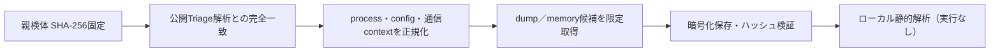

# Triage公開解析・後段取得証跡

## 完全ハッシュ一致

- [260801-3rz69ahq9w](https://tria.ge/260801-3rz69ahq9w): ファミリー候補 `nanocore`、評価score `10`
- [260728-d1gc3axyax](https://tria.ge/260728-d1gc3axyax): ファミリー候補 `nanocore`、評価score `10`

## プロセス・通信

- 観測process: `1a5e935a2545bde844f7aa04d6bce296.exe, dhcphost.exe, dhcpss.exe, dosmon.exe, netkata.io.exe, schtasks.exe`
- raw commandは保存せず、command SHA-256と処理patternだけをJSONへ保持しています。
- sandbox background trafficは`context_only`であり、C2へ自動昇格しません。

- `netkata.io:443`（sandbox config候補）
- `www.netkata.io:443`（sandbox config候補）

## 二段目成果物

- 取得できませんでした。

## 判定境界

Triage由来のfamily、process、config、通信は外部sandbox証跡です。config extractorが返したendpointはC2候補として扱えますが、
静的設定復元またはprocess帰属とprotocol応答が揃うまでは確認済みC2とはしません。取得成果物と検体は実行していません。
