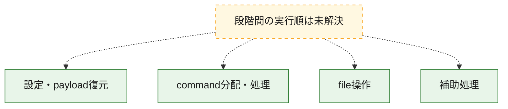
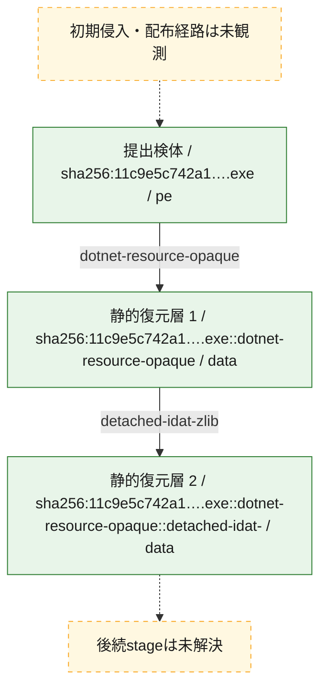
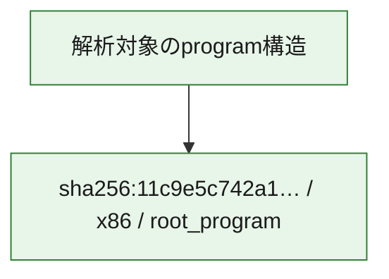

# 全体ロジック：11c9e5c742a1fa523440642d8a0288422ce0e0f97316a0666a9115c5cd66460d

代表関数の静的証跡から、設定・payload復元、command分配・処理、file操作の処理群を確認しました。

## 読み方

- phaseの掲載順は解析上の整理順です。observed_call_edgesがない段階間の実行順を断定しません。
- 図の実線は静的に観測した関係、点線と黄色のノードは未観測・未解決の関係を示します。
- 図は静的な要約であり、動的実行を再現するものではありません。
- 詳細な関数解説とfingerprintは[STATIC-LOGIC.md](STATIC-LOGIC.md)を参照してください。

## 静的可視化

### 実行フロー

### 感染チェーン

### モジュール関係

## 処理段階

### 1. 設定・payload復元

設定、resource、payload、暗号化データの復元・変換を確認します。
確度: `confirmed_static_function_evidence`

- `11c9e5c742a1fa523440642d8a0288422ce0e0f97316a0666a9115c5cd66460d:cil:0x06000006` — 暗号、hash、encoding、または復号処理に関係する関数です。 状態: `succeeded`、選定理由: `large_function:instructions=93`, `reviewed_call_centrality:20`, `role:cryptographic_transform`
- `11c9e5c742a1fa523440642d8a0288422ce0e0f97316a0666a9115c5cd66460d:cil:0x0600000c` — 暗号、hash、encoding、または復号処理に関係する関数です。 状態: `succeeded`、選定理由: `large_function:instructions=130`, `reviewed_call_centrality:10`, `role:cryptographic_transform`
- `11c9e5c742a1fa523440642d8a0288422ce0e0f97316a0666a9115c5cd66460d:cil:0x0600000e` — 暗号、hash、encoding、または復号処理に関係する関数です。 状態: `succeeded`、選定理由: `large_function:instructions=142`, `reviewed_call_centrality:14`, `role:cryptographic_transform`
- `11c9e5c742a1fa523440642d8a0288422ce0e0f97316a0666a9115c5cd66460d:cil:0x0600001c` — 暗号、hash、encoding、または復号処理に関係する関数です。 状態: `succeeded`、選定理由: `role:cryptographic_transform`

### 2. command分配・処理

受信commandやtaskの解釈、分配、個別handlerへの移行を確認します。
確度: `confirmed_static_function_evidence`

- `11c9e5c742a1fa523440642d8a0288422ce0e0f97316a0666a9115c5cd66460d:cil:0x06000005` — commandの解釈、分配、または個別処理を担当する関数です。 状態: `succeeded`、選定理由: `large_function:instructions=472`, `reviewed_call_centrality:76`, `role:command_dispatch_or_handler`
- `11c9e5c742a1fa523440642d8a0288422ce0e0f97316a0666a9115c5cd66460d:cil:0x06000009` — commandの解釈、分配、または個別処理を担当する関数です。 状態: `succeeded`、選定理由: `reviewed_call_centrality:12`, `role:command_dispatch_or_handler`
- `11c9e5c742a1fa523440642d8a0288422ce0e0f97316a0666a9115c5cd66460d:cil:0x0600000a` — commandの解釈、分配、または個別処理を担当する関数です。 状態: `succeeded`、選定理由: `large_function:instructions=96`, `reviewed_call_centrality:12`, `role:command_dispatch_or_handler`
- `11c9e5c742a1fa523440642d8a0288422ce0e0f97316a0666a9115c5cd66460d:cil:0x06000020` — commandの解釈、分配、または個別処理を担当する関数です。 状態: `succeeded`、選定理由: `large_function:instructions=121`, `reviewed_call_centrality:42`, `role:command_dispatch_or_handler`

### 3. file操作

fileやdirectoryの作成、読書き、削除を確認します。
確度: `confirmed_static_function_evidence`

- `11c9e5c742a1fa523440642d8a0288422ce0e0f97316a0666a9115c5cd66460d:cil:0x0600000f` — fileまたはdirectoryの読書き・管理に関係する関数です。 状態: `succeeded`、選定理由: `large_function:instructions=176`, `reviewed_call_centrality:30`, `role:file_operation`

### 4. 補助処理

主要処理を支える一般内部関数またはlibrary処理を確認します。
確度: `confirmed_static_function_evidence`

- `11c9e5c742a1fa523440642d8a0288422ce0e0f97316a0666a9115c5cd66460d:cil:0x06000001` — 検体内部の一般処理を実装する関数です。 状態: `succeeded`、選定理由: `reviewed_call_centrality:2`
- `11c9e5c742a1fa523440642d8a0288422ce0e0f97316a0666a9115c5cd66460d:cil:0x06000003` — 検体内部の一般処理を実装する関数です。 状態: `succeeded`、選定理由: `reviewed_call_centrality:4`
- `11c9e5c742a1fa523440642d8a0288422ce0e0f97316a0666a9115c5cd66460d:cil:0x06000004` — 検体内部の一般処理を実装する関数です。 状態: `succeeded`、選定理由: `reviewed_call_centrality:4`
- `11c9e5c742a1fa523440642d8a0288422ce0e0f97316a0666a9115c5cd66460d:cil:0x06000007` — 検体内部の一般処理を実装する関数です。 状態: `succeeded`、選定理由: `reviewed_call_centrality:6`
- `11c9e5c742a1fa523440642d8a0288422ce0e0f97316a0666a9115c5cd66460d:cil:0x06000008` — 検体内部の一般処理を実装する関数です。 状態: `succeeded`、選定理由: `reviewed_call_centrality:2`
- `11c9e5c742a1fa523440642d8a0288422ce0e0f97316a0666a9115c5cd66460d:cil:0x0600000b` — 検体内部の一般処理を実装する関数です。 状態: `succeeded`、選定理由: `reviewed_call_centrality:10`
- `11c9e5c742a1fa523440642d8a0288422ce0e0f97316a0666a9115c5cd66460d:cil:0x0600000d` — 検体内部の一般処理を実装する関数です。 状態: `succeeded`、選定理由: `large_function:instructions=178`, `reviewed_call_centrality:10`
- `11c9e5c742a1fa523440642d8a0288422ce0e0f97316a0666a9115c5cd66460d:cil:0x06000010` — 検体内部の一般処理を実装する関数です。 状態: `succeeded`、選定理由: `reviewed_call_centrality:8`
- `11c9e5c742a1fa523440642d8a0288422ce0e0f97316a0666a9115c5cd66460d:cil:0x06000011` — 検体内部の一般処理を実装する関数です。 状態: `succeeded`、選定理由: `reviewed_call_centrality:8`
- `11c9e5c742a1fa523440642d8a0288422ce0e0f97316a0666a9115c5cd66460d:cil:0x06000012` — 検体内部の一般処理を実装する関数です。 状態: `succeeded`、選定理由: `reviewed_call_centrality:8`
- `11c9e5c742a1fa523440642d8a0288422ce0e0f97316a0666a9115c5cd66460d:cil:0x06000013` — 検体内部の一般処理を実装する関数です。 状態: `succeeded`、選定理由: `reviewed_call_centrality:8`
- `11c9e5c742a1fa523440642d8a0288422ce0e0f97316a0666a9115c5cd66460d:cil:0x06000014` — 検体内部の一般処理を実装する関数です。 状態: `succeeded`、選定理由: `large_function:instructions=74`, `reviewed_call_centrality:8`
- `11c9e5c742a1fa523440642d8a0288422ce0e0f97316a0666a9115c5cd66460d:cil:0x06000015` — 検体内部の一般処理を実装する関数です。 状態: `succeeded`、選定理由: `large_function:instructions=117`, `reviewed_call_centrality:24`
- `11c9e5c742a1fa523440642d8a0288422ce0e0f97316a0666a9115c5cd66460d:cil:0x06000016` — 検体内部の一般処理を実装する関数です。 状態: `succeeded`、選定理由: `reviewed_call_centrality:2`
- `11c9e5c742a1fa523440642d8a0288422ce0e0f97316a0666a9115c5cd66460d:cil:0x06000017` — 検体内部の一般処理を実装する関数です。 状態: `succeeded`、選定理由: `reviewed_call_centrality:8`
- `11c9e5c742a1fa523440642d8a0288422ce0e0f97316a0666a9115c5cd66460d:cil:0x06000018` — 検体内部の一般処理を実装する関数です。 状態: `succeeded`、選定理由: `reviewed_call_centrality:8`
- `11c9e5c742a1fa523440642d8a0288422ce0e0f97316a0666a9115c5cd66460d:cil:0x06000019` — 検体内部の一般処理を実装する関数です。 状態: `succeeded`、選定理由: `reviewed_call_centrality:8`
- `11c9e5c742a1fa523440642d8a0288422ce0e0f97316a0666a9115c5cd66460d:cil:0x0600001a` — 検体内部の一般処理を実装する関数です。 状態: `succeeded`、選定理由: `reviewed_call_centrality:8`
- `11c9e5c742a1fa523440642d8a0288422ce0e0f97316a0666a9115c5cd66460d:cil:0x0600001b` — 検体内部の一般処理を実装する関数です。 状態: `succeeded`、選定理由: `reviewed_call_centrality:8`
- `11c9e5c742a1fa523440642d8a0288422ce0e0f97316a0666a9115c5cd66460d:cil:0x0600001e` — 検体内部の一般処理を実装する関数です。 状態: `succeeded`、選定理由: `large_function:instructions=93`, `reviewed_call_centrality:16`
- `11c9e5c742a1fa523440642d8a0288422ce0e0f97316a0666a9115c5cd66460d:cil:0x0600001f` — 検体内部の一般処理を実装する関数です。 状態: `succeeded`、選定理由: `reviewed_call_centrality:4`
- `11c9e5c742a1fa523440642d8a0288422ce0e0f97316a0666a9115c5cd66460d:cil:0x06000021` — 検体内部の一般処理を実装する関数です。 状態: `succeeded`、選定理由: `reviewed_call_centrality:2`
- `11c9e5c742a1fa523440642d8a0288422ce0e0f97316a0666a9115c5cd66460d:cil:0x06000022` — 検体内部の一般処理を実装する関数です。 状態: `succeeded`、選定理由: `reviewed_call_centrality:16`

## 観測したcall関係

- 代表関数間で直接解決できた呼出関係はありません。

## 解析範囲と制約

- 選定外関数は全体inventoryへ残しますが、関数本体の個別解説対象にはしていません。
- indirect call、難読化、packer、VM、壊れたcontrol flowによりcall関係が欠落する場合があります。
- 文書は静的解析に基づき、検体実行や外部通信による動的確認は行っていません。
