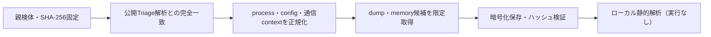

# Triage公開解析・後段取得証跡

## 完全ハッシュ一致

- [260923-xnv58sac44](https://tria.ge/260923-xnv58sac44): ファミリー候補 `nanocore`、評価score `10`

## プロセス・通信

- 観測process: `46503057C7771C93752C04DDE07282A3.exe`
- raw commandは保存せず、command SHA-256と処理patternだけをJSONへ保持します。
- sandbox background trafficは`context_only`であり、C2へ自動昇格しません。

- `alpharush.ai:443`（sandbox config候補）
- `compute.in.net:443`（sandbox config候補）

## 後段取得物

- `6f30550bab8250a771c605dfb336a4b7c11d3e775037ca010fd975e74d968939` / `memory_image` / 65536 bytes / 親と同一: `false` / 静的解析: `partial`

## 判定境界

Triage由来のfamily、process、config、通信は外部sandbox証跡です。Config extractorが返したendpointはC2候補として扱いますが、静的設定復元またはprocess帰属とprotocol応答が揃うまでは確認済みC2とはしません。取得成果物と検体は実行していません。
