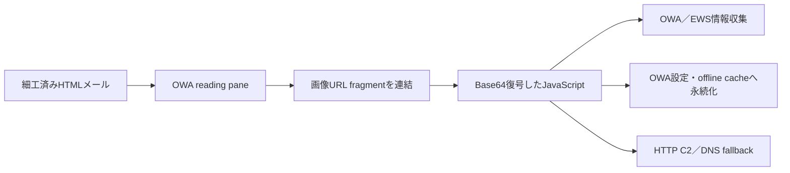

# OWAReaperの概要

OWAReaperは、Microsoft Exchange Outlook Web App（OWA）のreading pane内で動作するJavaScript backdoorです。HTMLメール内の画像URL fragmentから本体を復元し、OWAのoffline cacheやuser settingsを悪用して永続化します。

## 帰属と位置付け

- 開発主体: 公開情報だけでは個人・組織として確定できません。
- 利用アクター: Proofpointが`TA488`として追跡し、Microsoftの`Laundry Bear`／`Void Blizzard`との重複を報告しています。
- コモディティ性: 公開販売される一般的なcommodity malwareではなく、標的型活動向けの専用implantと評価します。
- 観測活動: CVE-2026-42897を利用するhalf-click型メール攻撃で配布され、Proofpointは過去のZimReaperから発展した系統として説明しています。

## 主要機能

- 画像URL fragmentの連結とBase64復号によるJavaScript本体の復元
- P-256 ECDH、SHA-256、AES-CTRを使うsession暗号
- `acocdn.com`を使うHTTP C2／exfiltrationと`asecdns.com`を使うDNS fallback
- OWA user settings、IndexedDB offline cache、folder permission変更による永続化
- EWS token、session情報、browser autofill認証情報の収集
- IndexedDBとGitHub commit検索を使うcommand取得

## 実行・感染チェーン

## 解析資料

- [2026-07-31 threat analysis](../../research/daily-news-malware/2026-07-31/THREAT-ANALYSIS.md)
