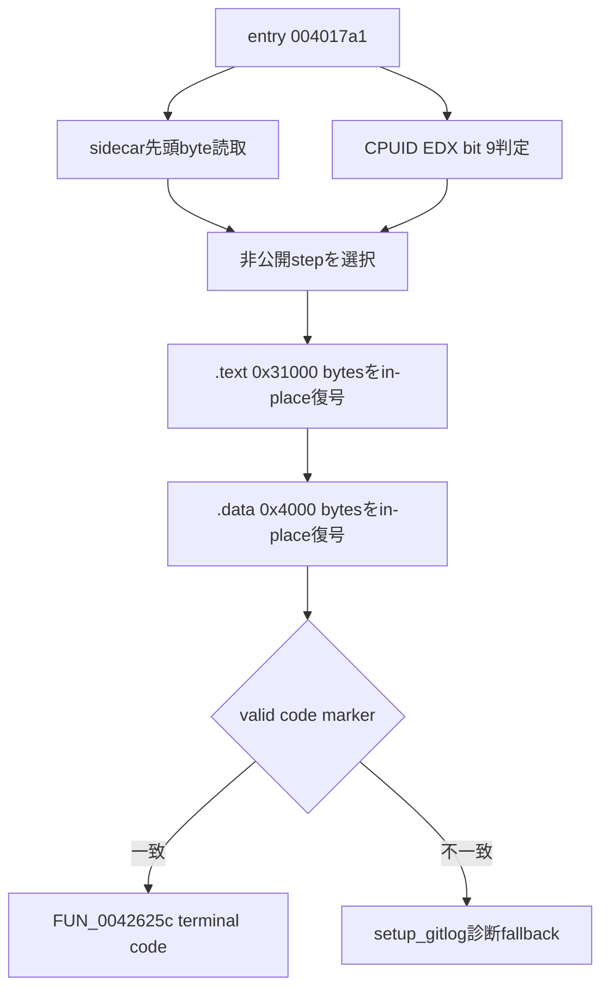
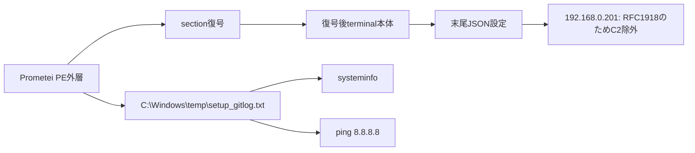
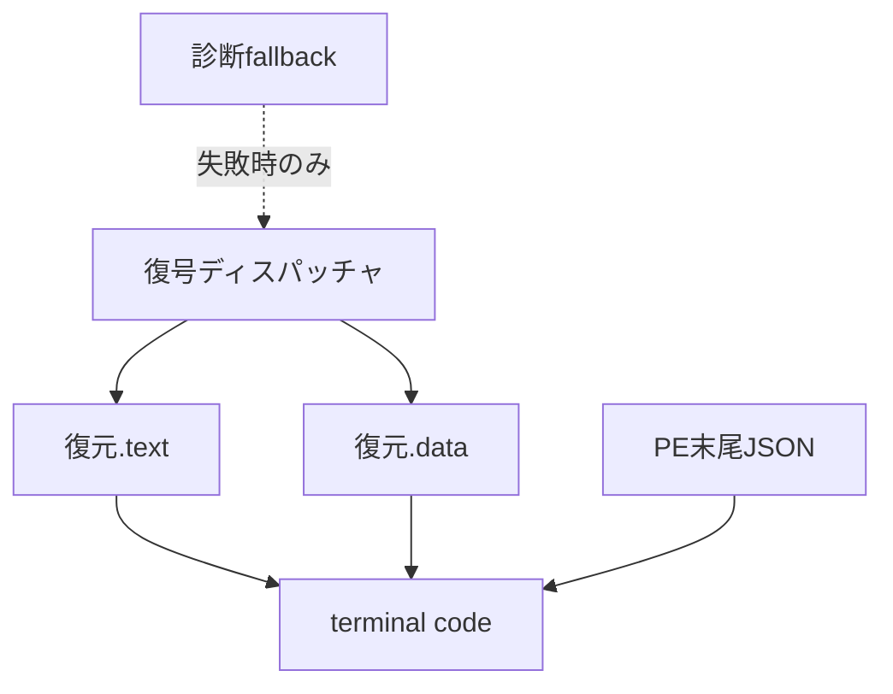

# 全体ロジック：10505f035b1e6569cb22d42614829e85fd432e014418f457e2e1dfc31dcd505c

## 実行フロー

## 感染・診断チェーン

## モジュール関係

## 判定

終端payloadは別ファイルとしてdropされるのではなく、同一PE内の暗号化sectionがin-place復号される構成です。このため復元済みsectionと再構成imageのSHA-256をコード類似性比較へ使用します。RFC 1918 controllerは検証環境情報の可能性が高く、運用C2とは扱いません。
