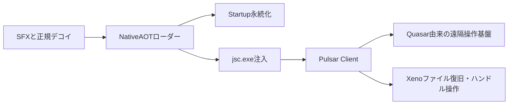

# 全体ロジックとQuasarとの差分

| 比較軸 | 本ケース | Quasar v1.3.0.0 2ケース |
|---|---|---|
| 最終ファミリー | PulsarRAT | QuasarRAT |
| 固有コード | `FileHandlerXeno` とハンドル乗っ取り | Quasar `Settings` と認証付き設定 |
| C2復元 | 未復元 | `stopman[.]ooguy[.]com:2002` |
| 配布ローダー | 巨大NativeAOT | 巨大NativeAOT |
| 永続化 | ローダーのStartup自己コピー | 最終設定側の起動名 |

同じ配布ローダー様式はキャンペーン関連の候補になるが、最終ファミリーが異なるため、ローダー提供者とRAT運用者を自動的に同一視しない。