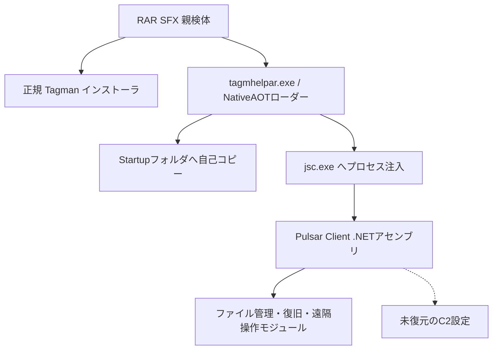

# PulsarRAT ケース bf93b157…

## 結論

本検体は従来の QuasarRAT 分類から `PulsarRAT` へ修正した。最終 .NET アセンブリは Quasar 由来の一般的な型だけでなく、`Pulsar.Client.Recovery.Utilities.Xeno` に対応する `FileHandlerXeno`、ファイルハンドル乗っ取り、複製処理を備える。公開サンドボックスの完全な注入ペイロードとメモリ再構築像の双方で同じコード構造を確認した。

- 親検体: `bf93b1578a876f6bbd0368b9d91e78a5b57b499e906b7ceb8e534c1c55626153`（`tagmansetup.exe`、34,776,289 bytes）
- 正規デコイ: `tagmansetup.exe` / `f930b5bd95b477a424267388b54de9820f02c7e1a5f4a5b111ccd0d17b7d5d69`
- NativeAOTローダー: `tagmhelpar.exe` / `87a7e4c34bf44d3b7978d8a178bc4b5e2cdb2aaf1f4661cdcb47ab4266df667c`
- パディング除去後ローダー: `605cddb6fcef81186c48a8b99cdaf87a75904951dc0368f6b3ad18038e673448`
- 公開サンドボックスの最終ペイロード: `cb8187f6133cf73208820b4e45eedbaa2b744149b35406b73022aac9a86bf9d9`（978,432 bytes）
- メモリ再構築像: `7739d0bd57ca528b146fa4a796dd5c115259c2464392de72e1ff9fbc7d45429b`（977,920 bytes）
- C2: 復元できず、正規Tagman通信はC2から除外
- 実行・外部通信: ローカルでは実施していない

## 感染・実行チェーン

## 最終ペイロードの静的特徴

- Assembly名は `Client`、464型、2,080メソッド。
- `FileHandlerXeno`、`GetPathFromHandle`、`HijackFileHandle`、`CloneFileByHandleHijacking` を確認。
- `DarkModeForms` を含む管理UI・ファイル管理系の大きなコードトポロジを持つ。
- ローダーは `%APPDATA%\Microsoft\Windows\Start Menu\Programs\Startup\tagmhelpar.exe` へ自己コピーする。
- 公開サンドボックスでは `tagmhelpar.exe -> jsc.exe` の注入が観測される。

## 未解決点

最終ファミリーと実行コードまでは復元済みであるが、Pulsar設定の難読化層をまだ解けておらずC2、Mutex、ビルド版は未復元である。正規インストーラが接続するTagman関連ホストは悪性C2として扱わない。