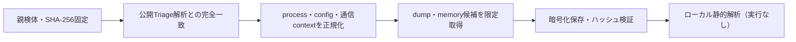

# Triage公開解析・後段取得証跡

## 完全ハッシュ一致

- [260924-g7edtszenb](https://tria.ge/260924-g7edtszenb): ファミリー候補 `未確定`、評価score `7`
- [260924-dn8xjscf89](https://tria.ge/260924-dn8xjscf89): ファミリー候補 `未確定`、評価score `7`
- [260814-wm6pxayyes](https://tria.ge/260814-wm6pxayyes): ファミリー候補 `未確定`、評価score `7`

## プロセス・通信

- 観測process: `5f1a3507e06e5c238cec9070f5e408e76ad4c8b0d485d445cd40e46f563b73ff.exe, Crpihqyx.exe, svchost.exe`
- raw commandは保存せず、command SHA-256と処理patternだけをJSONへ保持します。
- sandbox background trafficは`context_only`であり、C2へ自動昇格しません。

- 取得できませんでした。

## 後段取得物

- `2047ab0388e7aedba7c9765cda60018313231c31bc378f328b7cdb7f20f49f24` / `memory_image` / 8110080 bytes / 親と同一: `false` / 静的解析: `未実施`

## 判定境界

Triage由来のfamily、process、config、通信は外部sandbox証跡です。Config extractorが返したendpointはC2候補として扱いますが、静的設定復元またはprocess帰属とprotocol応答が揃うまでは確認済みC2とはしません。取得成果物と検体は実行していません。
