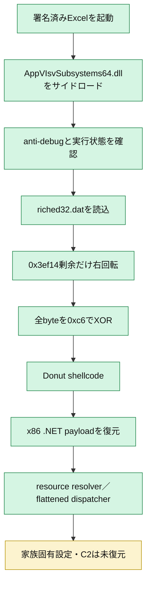
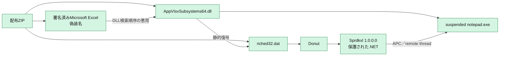
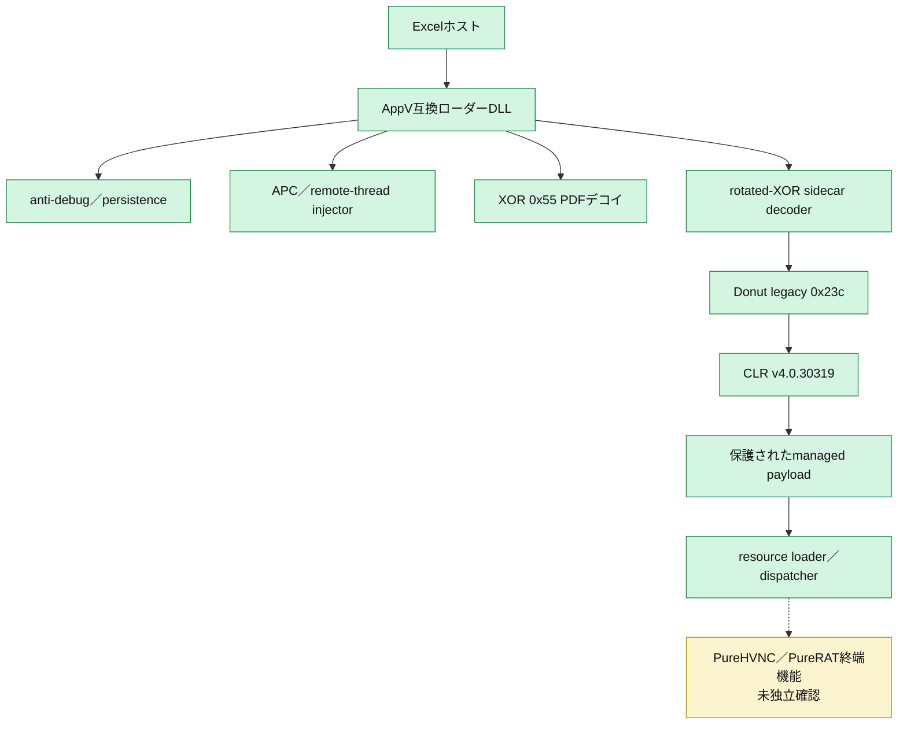

# 全体ロジック

緑は静的・provider証拠で確認済み、黄は未復元または系統帰属の推定である。

## 静的可視化

### 実行フロー

### 感染チェーン

### モジュール関係

## 比較

### 比較プロファイル

- 共通phase ID: `loader_execution`、`defense_evasion`、`payload_decoding`、`persistence`、`process_memory`
- 復元層: ZIP → AppV DLL＋data → rotated-XOR Donut → .NET PE
- module: 署名済みhost、native loader、Donut CLR loader、managed terminal
- 機能: DLLサイドロード、anti-debug、Run key、APC／remote-thread injection、resource unpack
- code fingerprint: native／managed代表8関数を正規化済み。builderや共通runtimeの影響を別途レビューする。

### 他ケースとの比較

| 比較対象 | 共通点 | 差分 | 判断 |
|---|---|---|---|
| PureHVNC v4.4.1 `e5541255...` | AppVサイドロード、暗号化sidecar、Donut、managed終端 | sidecar形式、終端ハッシュ、設定復元可否 | 同じ配布設計。今回の版は断定不可 |
| 2026-07-09 PureRAT配布群 | 署名済みExcel SHA-256完全一致、同名AppV DLL | DLL／sidecar／C2は別 | 同じインフラ・builder系統の可能性が高い |
| ユーザー提示のPureHVNC事例 | ExcelサイドロードとPure系の構造 | 今回終端設定が未復元 | 提示仮説と整合するが、終端家族名は保留 |
