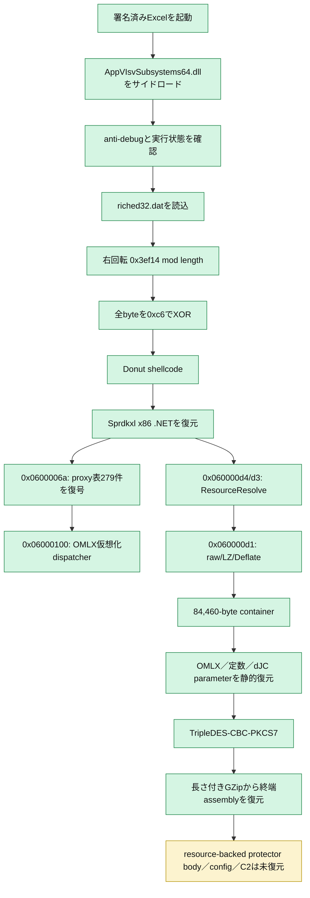
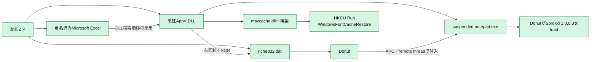
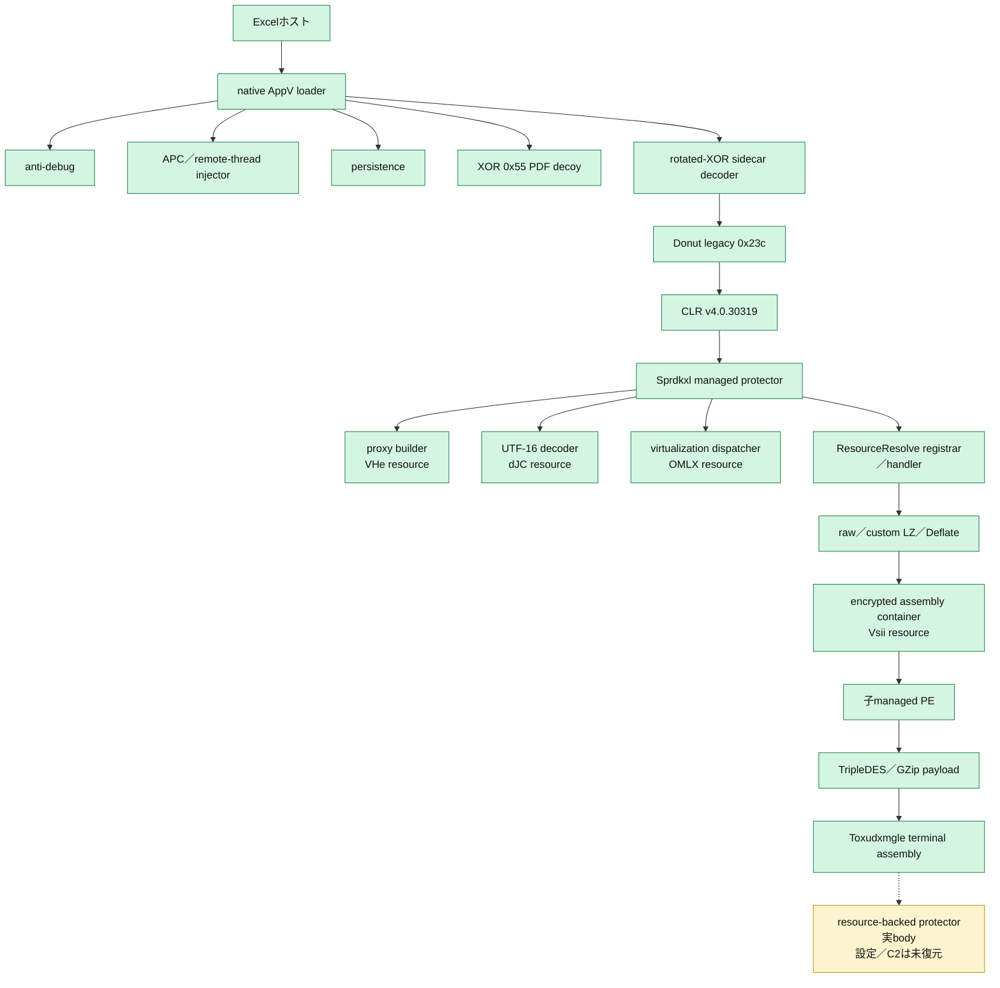

# 全体ロジック

緑は静的・provider証拠で確認済み、黄は未復元または系統帰属の推定である。

## 実行フロー

## 感染チェーン

## モジュール関係

## 比較プロファイル

- 共通phase ID: `loader_execution`、`defense_evasion`、`payload_decoding`、`persistence`、`process_memory`、`managed_protector`
- 復元層: ZIP → AppV DLL＋data → rotated-XOR Donut → .NET loader → proxy／VM／resource resolver → 子PE → TripleDES／GZip → 終端assembly
- module: 署名済みhost、native loader、Donut CLR loader、managed protector、暗号化assembly container、子managed PE、終端managed assembly
- 機能: DLLサイドロード、anti-debug、Run key、APC／remote-thread injection、resource unpack
- protector指標: DynamicMethod proxy、279件の8-byte mapping、ResourceResolve、custom LZ、Deflate、high-fanout switch

## 他ケースとの比較

| 比較対象 | 共通点 | 差分 | 判断 |
|---|---|---|---|
| PureHVNC v4.4.1 `e5541255...` | AppVサイドロード、暗号化sidecar、Donut、managed終端 | sidecar形式、終端hash、設定復元可否 | 同じ配布設計。今回の版は断定不可 |
| 2026-07-09 PureRAT配布群 | 署名済みExcel SHA-256完全一致、同名AppV DLL | DLL／sidecar／C2は別 | 同じインフラ・builder系統の可能性が高い |
| NETRESEC PureRAT報告 | Eazfuscator系loader、暗号化／圧縮managed payload | 本検体の最終config未復元 | protector構成は類似。sample固有通信の一致は未確認 |
| ユーザー提示のPureHVNC事例 | ExcelサイドロードとPure系の構造 | 今回終端設定が未復元 | 提示仮説と整合するが、終端家族名は保留 |
