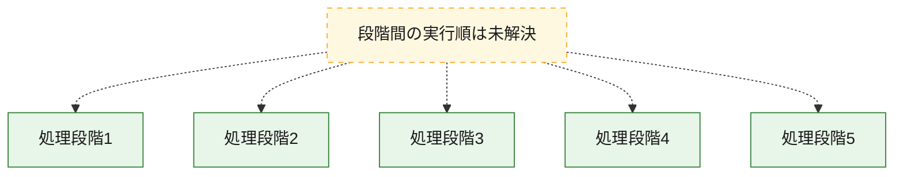
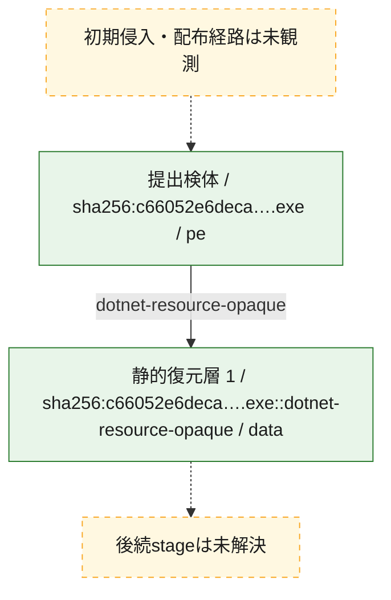
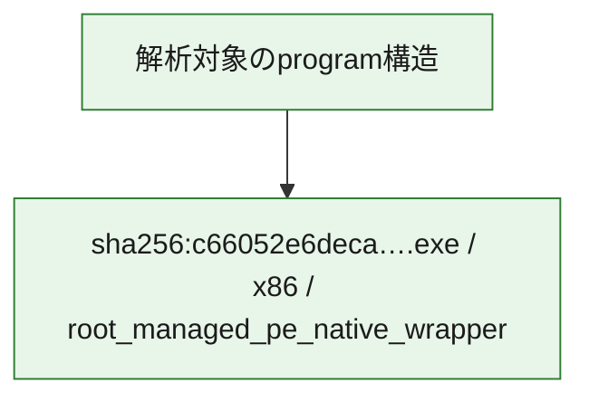

# 全体ロジック：c66052e6deca51833f260eeed639d78a7424bb244e9682ae736616d45d342e1c

全体ロジックを構成できませんでした。

## 読み方

- CLR entrypoint、resource取得、復元helper、resolver登録の静的call/resource関係
- 図の実線は静的に観測した関係、点線と黄色のノードは未観測・未解決の関係を示します。
- 図は静的な要約であり、動的実行を再現するものではありません。
- 詳細な関数解説とfingerprintは[STATIC-LOGIC.md](STATIC-LOGIC.md)を参照してください。

## 静的可視化

### 実行フロー

### 感染チェーン

### モジュール関係

## 処理段階

### 1. 処理段階1

説明未記録
確度: `unknown`

### 2. 処理段階2

説明未記録
確度: `unknown`

### 3. 処理段階3

説明未記録
確度: `unknown`

### 4. 処理段階4

説明未記録
確度: `unknown`

### 5. 処理段階5

説明未記録
確度: `unknown`

## 観測したcall関係

- 代表関数間で直接解決できた呼出関係はありません。

## 解析範囲と制約

- fingerprint一致はコード共有の手掛かりであり、同一actorや同一campaignを単独では証明しません。
