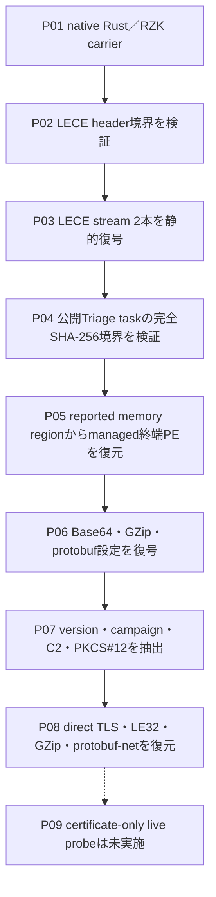
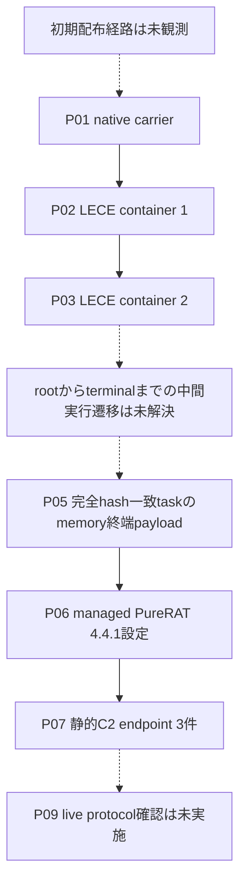
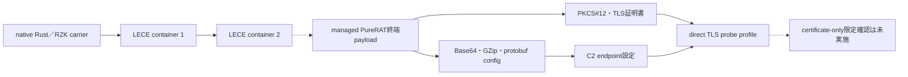

# 全体ロジック

native Rust/RZK carrierからLECE 2層を静的に復元し、完全SHA-256一致の公開Triage taskにあるmemory regionを介してmanaged PureRAT 4.4.1終端payloadへ到達しました。設定、証明書、C2 endpoint、direct TLS wire protocolは復元済みですが、rootからterminalまでの全中間命令列は未確定です。

図の実線は静的復元または完全hash境界で確認した関係、点線は未観測の配布経路、中間実行遷移、live protocol確認です。

## 実行フロー

## 感染チェーン

## モジュール関係

## 処理段階

1. native Rust/RZK carrier内からLECE headerを探索し、offset、encoded size、decoded size、terminatorを検証します。
2. LECE streamを復号し、2つの静的復元層を得ます。
3. root完全SHA-256一致の公開Triage taskから、report sample/taskのhash境界を確認します。
4. `memory/<basename>-memory.dmp`、PID、address、lengthを検証して終端managed PEを取得します。
5. managed PEのBase64・GZip・protobuf設定を復号し、version、campaign、C2、PKCS#12を抽出します。
6. 証明書と設定schemaの相関によりPureRAT/PureHVNC 4.4.1としてfail-closed分類します。
7. C2 wireをdirect TLS 1.0、LE32 length、GZip、protobuf-netとして整理し、証明書のみを確認する安全なprobe profileへ渡します。

## 比較プロファイルと他ケースとの比較

- `RZK carrierからLECE 2層を復元する構造`と`managed PureRAT設定・証明書・direct TLS protocol`の2軸が本ケースの分類を支えます。
- 単一のC2 endpoint、証明書subject、version文字列だけでは、他ケースとの同一campaignまたは同一運用者を確定しません。
- 他のPureHVNC／PureRATケースとの比較には、復元層構成、設定schema、wire framing、代表関数fingerprintを独立して照合する必要があります。

終端の設定とprotocolは独立した静的証拠で確認済みですが、root carrierからterminalへ至る全中間allocation・copy経路と代表関数の命令単位レビューは未完了です。