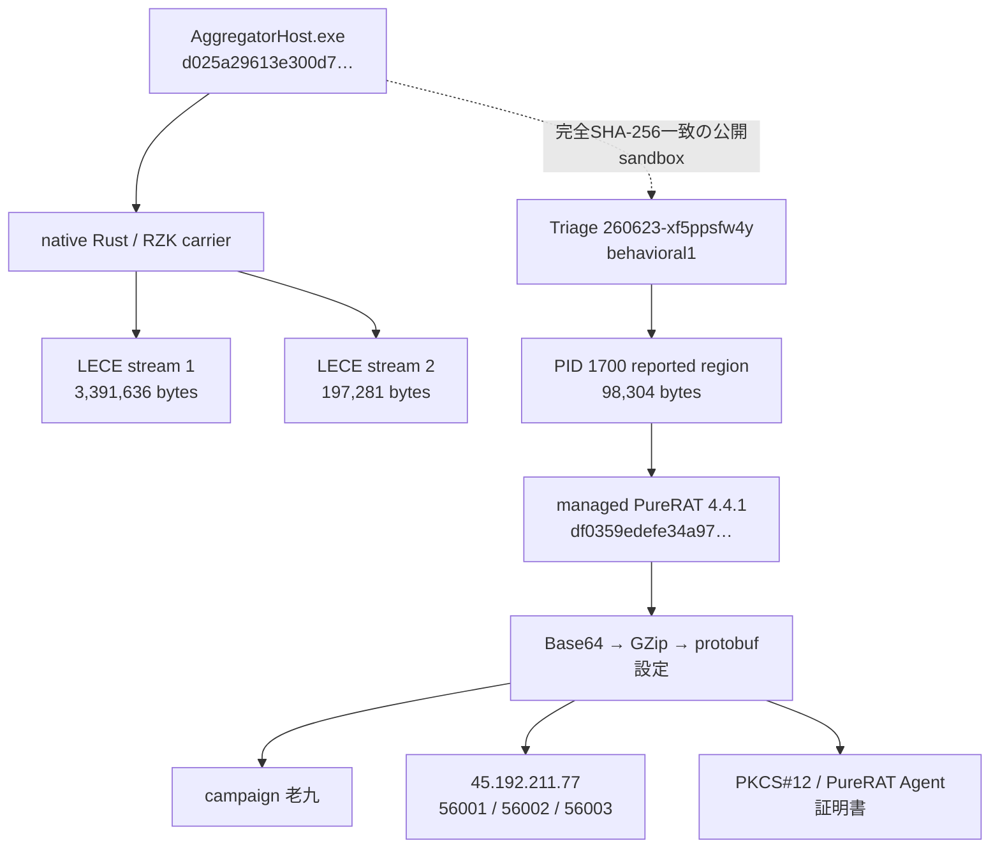
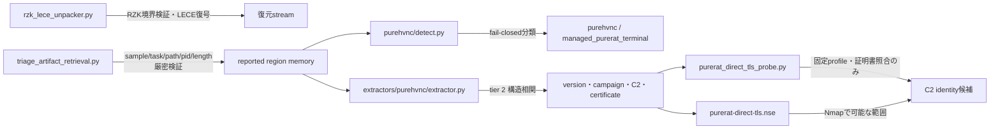
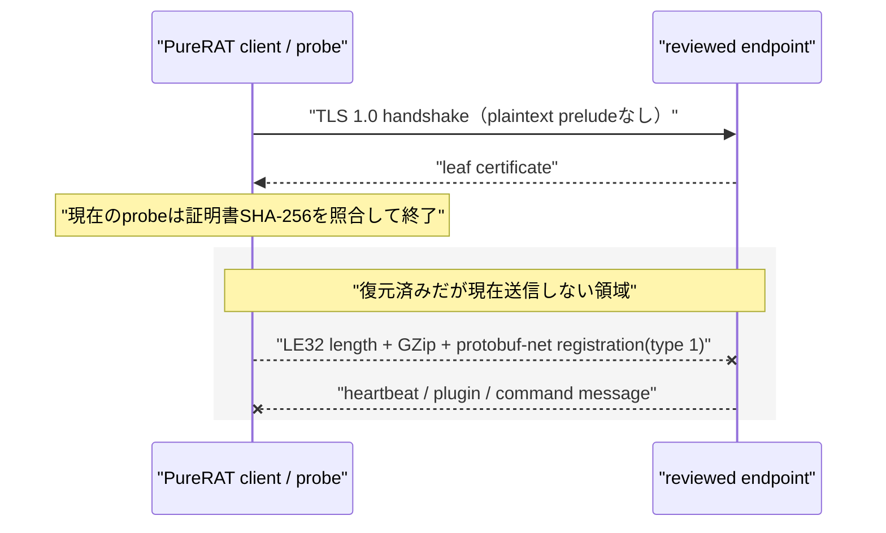

# 静的解析詳細

## 1. 復元チェーン

実線は静的に復元した関係、点線はroot完全hash一致の公開sandbox成果物によるruntime相関です。rootからmemory regionまでの全中間命令列は未確定のため、直接埋め込みと断定していません。

## 2. モジュール関係

detectorは一般的な.NET PEだけでは一致しません。protobuf設定schema、version、campaign、endpoint、PKCS#12、`CN=PureRAT Agent`証明書の相関をすべて要求します。

## 3. C2 wireと安全な調査境界

復元したdiscriminatorは`1=registration`、`2=heartbeat`、`3=status/error`、`4=plugin result`、`5=plugin request`、`35=auxiliary`、`38=config update`、`86=command`です。現在のactive profileは`56001`だけを対象にし、明示的なnetworkとlegacy TLS gateを要求します。証明書不一致は本build・endpointの不一致を示すだけで、PureRAT C2全体を否定しません。

## 自動化と再利用

- RZK/LECE復元: `unpackers/rzk_lece_unpacker.py`
- Triage memory取得: `analysis-framework/common/triage_artifact_retrieval.py`
- managed終端detector: `analysis-framework/malware/purehvnc/detect.py`
- 設定抽出: `extractors/purehvnc/extractor.py`
- direct TLS証明書probe: `analysis-framework/common/purerat_direct_tls_probe.py`
- Nmap用script: `analysis-framework/nmap/scripts/purerat-direct-tls.nse`

binary memory、PFX、private keyはリポジトリへ保存していません。補助成果物は検証済み暗号化archiveとしてS3へ保全しました。
