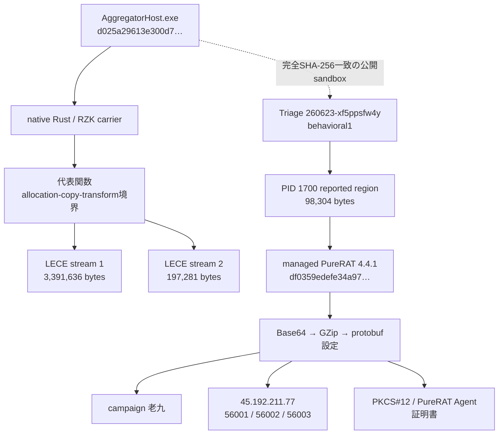
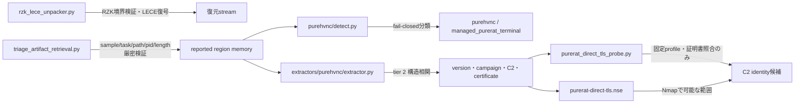
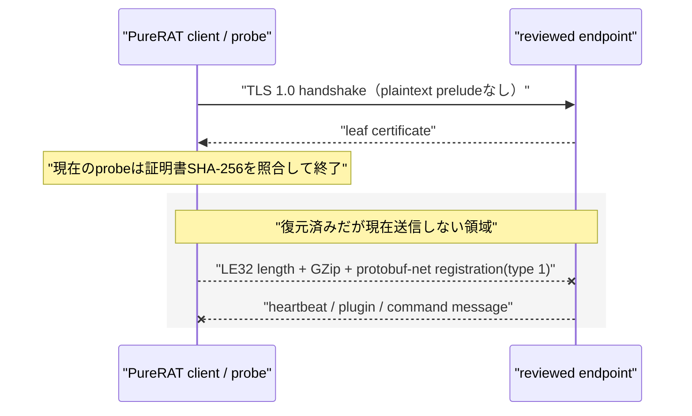

# 静的解析詳細

## 1. 復元チェーン

実線は静的に復元した関係、点線はroot完全hash一致の公開sandbox成果物によるruntime相関です。root代表関数のallocation、magic skip、copy、transform/authentication helper境界は確認済みですが、LECE後段からmemory regionまでのbyte単位導出は未確定のため、直接埋め込みと断定していません。

## 2. モジュール関係

detectorは一般的な.NET PEだけでは一致しません。protobuf設定schema、version、campaign、endpoint、PKCS#12、`CN=PureRAT Agent`証明書の相関をすべて要求します。

## 3. C2 wireと安全な調査境界

復元したdiscriminatorは`1=registration`、`2=heartbeat`、`3=status/error`、`4=plugin仲介context（terminal直送未確認）`、`5=plugin descriptor／cache-miss request`、`35=auxiliary`、`38=config update`、`86=command`です。現在のactive profileは`56001`だけを対象にし、明示的なnetworkとlegacy TLS gateを要求します。証明書不一致は本build・endpointの不一致を示すだけで、PureRAT C2全体を否定しません。

## 4. exact terminal protocol

### 一次根拠とlineage補強の区別

protocol contractの一次根拠はexact managed terminal `df0359edefe34a970af39227978dbe7f1caa09caf98a2c6db53f49187ec25dd7`のmetadata／CILです。公開repository `steadybb/purecrack-source`のexact commit `632585eeab85786b9b781bb923d6a38640bd3d0c`はREADME上v4.0.9596の再構成で、df0359のexact 4.4.1とは一致しません。公開sourceは非同一版lineageの補強に限定し、下記挙動やschemaの一次証拠として扱いません。

補助sourceはbuild／runせず、生sourceや攻撃手順を成果物へ転載していません。

### 2-analysis／4-behavioral-run PCAP／memory corroboration

公開Triage APIの正規`dump.pcap`／`dump.pcapng`を2 analysis IDのbehavioral 1／2（計4 behavioral run）について、boundedかつredirectなしでprivate取得しました。関連streamはcipher suite `0xc014`（`TLS_ECDHE_RSA_WITH_AES_256_CBC_SHA`）でした。ECDHEのforward secrecyにより、exact config PFXにprivate keyがあってもsession secretなしでは復号できません。PCAPNGにもcustom TLS application payloadの復号結果はありません。

4 behavioral runのmemory assembly inventoryはLoader、inner terminal、protobuf-net、`System.*`だけで、feature plugin assembly loadは0件でした。このためserver-delivered pluginは確認できず、operation／result未確定を維持します。exact managed CILが主要根拠で、非同一版public source commitはlineage補助だけです。

公開可能なaggregateは2 analysis ID × behavioral 1／2の4 behavioral run、capture file 8件、relevant TLS stream 4件、unique memory artifact 57件、managed PE record 9件で、feature plugin assembly loadは0件です。aggregate evidence SHA-256は`a501280d825507a2230c2a9fd883ee8ddbd9680b8855e5318826f009c6c21b83`です。過去plugin探索も2 analysis／計4 retrieval runですが、両者のartifact集合が同一か別かは断定しません。raw PCAP、victim／internal IP、PFX、private keyは公開していません。
exact CILでは次を確認しました。

- `Class2.method_0`: `GClass8` heartbeat reply、`GClass3` persist後のdisconnect／reconnect、`GClass11` cache／loadからreverse→GZip→`Class5.method_0`、`GClass10`から`Class1.smethod_0`への分岐。
- `Class1.smethod_3`: MethodSpec 1／2によるreverse、`GClass14.smethod_1`、`Assembly.Load`、first exported type、`CreateInstance`、`GetMethods()[0]`／`[1]`。method 0／1は`Boolean_0`で選択し、引数なしで`Invoke`。
- `Class7`: `HKCU\Software\<Class4.smethod_0()>`の無名Binary値をread／write。
- `GClass1`: protobuf-net serialize→GZipと、GZip→deserializeの境界。
- exact sampleの`Class5`: `powershell.exe`固有のalready-loaded-assembly経路と`AppDomain.Load` fallback。

これはplugin取得・load・method選択までの根拠です。plugin assembly未取得のため、plugin operation、operation serializer、result serializerは未確定のままであり、公開sourceから補完しません。

この節はmanaged terminal `df0359edefe34a970af39227978dbe7f1caa09caf98a2c6db53f49187ec25dd7`に限定した結果です。完全な機械可読根拠は[protocol-evidence.json](protocol-evidence.json)にあります。

### transportとframe

TLSは通信の先頭byteから始まり、`SslProtocols`のdecimal値`192`、すなわちTLS 1.0を使います。plaintext preludeとSNIはありません。server leaf certificateは埋め込みcertificateとの`Equals`で検証し、client certificateは送信しません。read／write timeoutはいずれも300,000 msです。設定内のhosts×portsを走査し、失敗後5,000 msで再試行します。socket sendは最大512,000 byteずつです。

send flowは`protobuf-netでGClass2をserialize → GZip → 圧縮長LE32 → 圧縮body`です。receive flowは`LE32全量read → body全量read → GZip展開 → GClass2 deserialize → 新規Thread経由でdispatcher`です。terminalに明示的なinbound size上限は確認できないため、防御用codecが圧縮長、展開長、展開率、field長／数、nesting、単一GZip member、trailing dataを追加で制限します。

### ProtoInclude、schema、方向

| tag | contract | 方向／役割 | ProtoMember tag:type |
|---:|---|---|---|
| 1 | `GClass4` | client→server registration | 1:String, 2:Boolean, 3:Int32, 4:String, 5:String, 6:String, 7:String, 8:String, 9:Int32, 10:String, 11:String, 12:Int32, 13:String, 14:String, 15:String, 16:String, 17:Byte[], 18:String, 19:Boolean, 20:String |
| 2 | `GClass8` | bidirectional heartbeat | 1:Int32, 2:Boolean, 3:Int32, 4:String, 5:String, 6:Byte[] |
| 3 | `GClass9` | client→server status／error | 1:String |
| 4 | `GClass7` | plugin仲介。terminal直送は未確認 | 1:GClass4, 2:GEnum0, 3:String |
| 5 | `GClass11` | server→client plugin descriptor、client→server cache-miss request | 1:String, 2:Byte[], 3:String |
| 35 | `GClass6` | exact dispatcherにhandlerなし | memberなし |
| 38 | `GClass3` | server→client configuration update | 1:List<String>, 2:List<Int32>, 3:String, 4:String, 5:Boolean, 6:Boolean, 7:String, 8:String, 9:String, 10:Boolean |
| 86 | `GClass10` | server→client command wrapper | 1:GClass11, 2:Boolean, 3:String |

`GClass4.tag17`、`GClass8.tag6`、`GClass11.tag2`はすべて`Byte[]`（CLR `SZARRAY U1`）です。tag 5は受信専用ではなく、plugin cache miss時にclientが同じ`GClass11`を送る双方向経路です。

### dispatcher挙動と安全境界

registrationはtag 1です。heartbeatは20〜59秒間隔のclient challengeに加え、incoming tag 2へも応答し、terminalではelapsed、idle、foreground、JPEG screenshotを扱います。tag 38は設定保存、切断、hosts×portsを用いた再接続へ進みます。tag 5はplugin cache、cache miss request、reverse、GZip展開、`Assembly.Load`、plugin method呼出しへ進みます。tag 86はnested `GClass11`を再利用し、Boolean値でplugin method index 0／1を選ぶwrapperです。

exact一致のpublic task 2件について計4回plugin取得を試しましたが、plugin assemblyは取得できませんでした。terminal単体にはplugin operation／result serializerもcommand result serializerもないため、tag 4の直接送信、operation意味、result wireを推測しません。

副作用なしの`purerat_441_protocol.py`はunknown raw保持と有界LE32／GZip／protobuf decodeを提供します。`purerat_441_session.py`は実端末情報を収集せず、未送信の匿名registration／heartbeat byteだけを返し、config、plugin、commandを拒否します。既存host emulatorはoffline streamまたはloopbackへ固定registrationを1回書いて無応答で終える別実装です。

## 自動化と再利用

- RZK/LECE復元: `unpackers/rzk_lece_unpacker.py`
- root代表関数検証: `analysis-framework/malware/purehvnc/rzk_function_chain.py`
- Triage memory取得: `analysis-framework/common/triage_artifact_retrieval.py`
- managed終端detector: `analysis-framework/malware/purehvnc/detect.py`
- 設定抽出: `extractors/purehvnc/extractor.py`
- direct TLS証明書probe: `analysis-framework/common/purerat_direct_tls_probe.py`
- Nmap用script: `analysis-framework/nmap/scripts/purerat-direct-tls.nse`

binary memory、PFX、private keyはリポジトリへ保存していません。補助成果物は検証済み暗号化archiveとしてS3へ保全しました。
