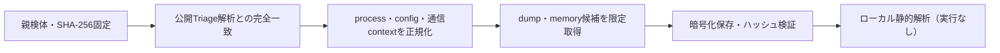

# Triage公開解析・後段取得証跡

## 完全ハッシュ一致

- [260821-jxtrwaaq6t](https://tria.ge/260821-jxtrwaaq6t): ファミリー候補 `未確定`、評価score `None`

## プロセス・通信

- 観測process: `取得できず`
- raw commandは保存せず、command SHA-256と処理patternだけをJSONへ保持します。
- sandbox background trafficは`context_only`であり、C2へ自動昇格しません。

- 取得できませんでした。

## 後段取得物

- `a5eaec82b35c5317b00f2db2bdcc00d310080070d379a757041d933c204fa0bd` / `memory_image` / 671744 bytes / 親と同一: `false` / 静的解析: `partial`
- `e6bb3a3cceedb38e0162fe67b01994787c7607a30582f469da7afa99064954b8` / `memory_image` / 65536 bytes / 親と同一: `false` / 静的解析: `partial`
- `cbb4acfc5b4cea3e300ec8158984c8d77b3ddad0a3b083f524afd98a5cb720b0` / `memory_image` / 819200 bytes / 親と同一: `false` / 静的解析: `partial`
- `1cb892e29561fb80d48baf7f1538cddd2b35ed89984f0d4cb5a0467545ad84e2` / `memory_image` / 65536 bytes / 親と同一: `false` / 静的解析: `partial`
- `5fa38c0608126a2690d1fd656ac5661f9923a6afe7203b927a0a147f1ea3396d` / `memory_image` / 65536 bytes / 親と同一: `false` / 静的解析: `partial`
- `09d2340b0ec8d0b0ba1e915d08145007fee5b967aeafd432df36bae66966526c` / `memory_image` / 65536 bytes / 親と同一: `false` / 静的解析: `partial`
- `bc0633ccd1469a6082711cb402f8f43e05869ff046931f3031871a883260a9a6` / `memory_image` / 4096 bytes / 親と同一: `false` / 静的解析: `partial`
- `b5bb0f93fc7a45b2c2e8fea288e7e5a29cd1a2b7869e2758ad674576a898ca17` / `memory_image` / 10108928 bytes / 親と同一: `false` / 静的解析: `partial`
- `9d42a91c2dfcbc6dcea3bc527423e1b1cac2783adb38068beef154a6d4c1896f` / `memory_image` / 10108928 bytes / 親と同一: `false` / 静的解析: `partial`
- `2913a381f0d820d76374c9d08355f0c735d444d76a08bf88328fe858f4691e97` / `memory_image` / 10108928 bytes / 親と同一: `false` / 静的解析: `partial`
- `ed2927a7bcc3c6f574c53d4c52c1f5f82b600a83b24c67c9d97778927221772c` / `memory_image` / 10108928 bytes / 親と同一: `false` / 静的解析: `partial`
- `b256f3656f7521d8d79a1562e9d4544aab8bba700a2236281429fca7e847b6d9` / `memory_image` / 10108928 bytes / 親と同一: `false` / 静的解析: `partial`
- `f9f27abb54aa2d8222ce557ab8bca7c876081b642ed6711bdf1b2322ab606683` / `memory_image` / 10108928 bytes / 親と同一: `false` / 静的解析: `partial`
- `c4b157888660f58c4c0069d1d32dc9fb91416589e0ce766a212393aef24827ae` / `memory_image` / 10108928 bytes / 親と同一: `false` / 静的解析: `partial`
- `17eca42cee016dc18e906be6317154d34563bf7dad17609afe411cc6162bba08` / `memory_image` / 10108928 bytes / 親と同一: `false` / 静的解析: `partial`
- `79aafc1c776b45a3142c2288ca314ebfa5a5b8ab03276ec97fdb844ebfc72019` / `memory_image` / 10108928 bytes / 親と同一: `false` / 静的解析: `partial`
- `e7ffe525db2f8c78abba7099d808201aad93a3226d57e834c0bb964a58feb791` / `memory_image` / 10108928 bytes / 親と同一: `false` / 静的解析: `partial`
- `68865fd5b353a270b30d857582eec31655476071f70d52222aecb88800868c97` / `memory_image` / 10108928 bytes / 親と同一: `false` / 静的解析: `partial`
- `756f0b8744be17b9afdc4bddbe4e12ed5bc591d8cadf51ce9dbd35c57e6fee0d` / `memory_image` / 10108928 bytes / 親と同一: `false` / 静的解析: `partial`
- `827e51ac606cad868ab28f74e7e8cd46c5305c19c9741c93d8fe89ace20c9d3e` / `memory_image` / 10108928 bytes / 親と同一: `false` / 静的解析: `partial`
- `b0f99ca96ac3fbf4af2bdc71a7451a33328cf242a16c199a3795734264d3a416` / `memory_image` / 10108928 bytes / 親と同一: `false` / 静的解析: `partial`
- `e931e935681496d5d9dda9188b9cb078ca9847b64365847bcd629ed52c157b24` / `memory_image` / 10108928 bytes / 親と同一: `false` / 静的解析: `partial`
- `c98b86042219b24abdc9a2ccf004d3922d049701e8c34b3e6808f20159dbd31f` / `memory_image` / 10108928 bytes / 親と同一: `false` / 静的解析: `partial`

## 判定境界

Triage由来のfamily、process、config、通信は外部sandbox証跡です。Config extractorが返したendpointはC2候補として扱いますが、静的設定復元またはprocess帰属とprotocol応答が揃うまでは確認済みC2とはしません。取得成果物と検体は実行していません。
