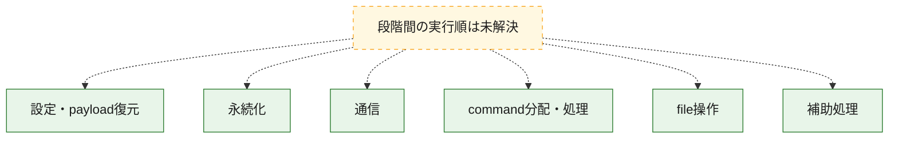
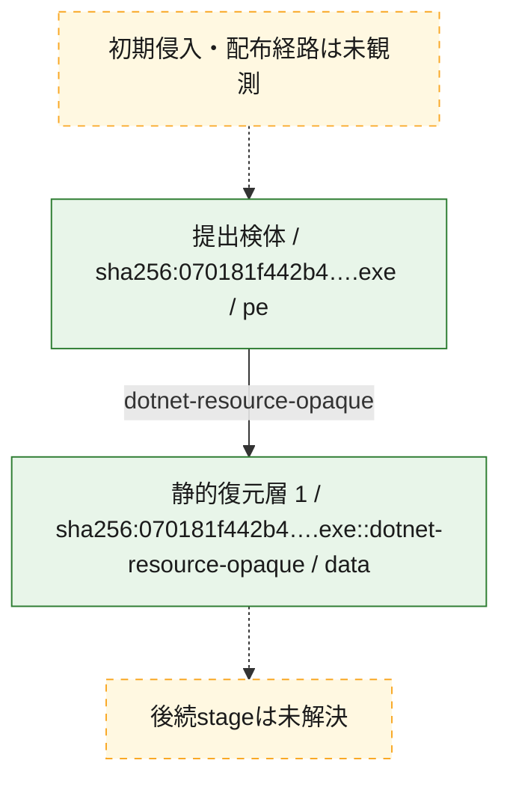
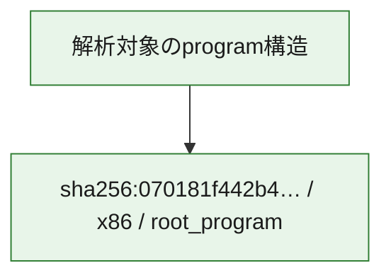

# 全体ロジック：070181f442b486e6bc3192434f99c19bff30441fdc069a2274987d742178c2ec

代表関数の静的証跡から、設定・payload復元、永続化、通信、command分配・処理、file操作の処理群を確認しました。

## 読み方

- phaseの掲載順は解析上の整理順です。observed_call_edgesがない段階間の実行順を断定しません。
- 図の実線は静的に観測した関係、点線と黄色のノードは未観測・未解決の関係を示します。
- 図は静的な要約であり、動的実行を再現するものではありません。
- 詳細な関数解説とfingerprintは[STATIC-LOGIC.md](STATIC-LOGIC.md)を参照してください。

## 静的可視化

### 実行フロー

### 感染チェーン

### モジュール関係

## 処理段階

### 1. 設定・payload復元

設定、resource、payload、暗号化データの復元・変換を確認します。
確度: `confirmed_static_function_evidence`

- `070181f442b486e6bc3192434f99c19bff30441fdc069a2274987d742178c2ec:cil:0x0600002e` — 暗号、hash、encoding、または復号処理に関係する関数です。 状態: `succeeded`、選定理由: `reviewed_call_centrality:10`, `role:cryptographic_transform`
- `070181f442b486e6bc3192434f99c19bff30441fdc069a2274987d742178c2ec:cil:0x0600002f` — 暗号、hash、encoding、または復号処理に関係する関数です。 状態: `succeeded`、選定理由: `large_function:instructions=240`, `reviewed_call_centrality:14`, `role:cryptographic_transform`
- `070181f442b486e6bc3192434f99c19bff30441fdc069a2274987d742178c2ec:cil:0x0600003b` — 暗号、hash、encoding、または復号処理に関係する関数です。 状態: `succeeded`、選定理由: `large_function:instructions=249`, `reviewed_call_centrality:8`, `role:cryptographic_transform`
- `070181f442b486e6bc3192434f99c19bff30441fdc069a2274987d742178c2ec:cil:0x06000059` — 暗号、hash、encoding、または復号処理に関係する関数です。 状態: `succeeded`、選定理由: `large_function:instructions=98`, `reviewed_call_centrality:14`, `role:cryptographic_transform`
- `070181f442b486e6bc3192434f99c19bff30441fdc069a2274987d742178c2ec:cil:0x06000063` — 暗号、hash、encoding、または復号処理に関係する関数です。 状態: `succeeded`、選定理由: `large_function:instructions=409`, `role:cryptographic_transform`
- `070181f442b486e6bc3192434f99c19bff30441fdc069a2274987d742178c2ec:cil:0x06000064` — 暗号、hash、encoding、または復号処理に関係する関数です。 状態: `succeeded`、選定理由: `reviewed_call_centrality:10`, `role:cryptographic_transform`
- `070181f442b486e6bc3192434f99c19bff30441fdc069a2274987d742178c2ec:cil:0x0600006a` — 設定、resource、payloadなどの解析・変換を行う関数です。 状態: `succeeded`、選定理由: `large_function:instructions=614`, `reviewed_call_centrality:72`, `role:config_or_data_transform`
- `070181f442b486e6bc3192434f99c19bff30441fdc069a2274987d742178c2ec:cil:0x06000076` — 暗号、hash、encoding、または復号処理に関係する関数です。 状態: `succeeded`、選定理由: `reviewed_call_centrality:14`, `role:cryptographic_transform`
- `070181f442b486e6bc3192434f99c19bff30441fdc069a2274987d742178c2ec:cil:0x06000077` — 暗号、hash、encoding、または復号処理に関係する関数です。 状態: `succeeded`、選定理由: `reviewed_call_centrality:14`, `role:cryptographic_transform`
- `070181f442b486e6bc3192434f99c19bff30441fdc069a2274987d742178c2ec:cil:0x06000078` — 暗号、hash、encoding、または復号処理に関係する関数です。 状態: `succeeded`、選定理由: `reviewed_call_centrality:14`, `role:cryptographic_transform`
- `070181f442b486e6bc3192434f99c19bff30441fdc069a2274987d742178c2ec:cil:0x06000079` — 暗号、hash、encoding、または復号処理に関係する関数です。 状態: `succeeded`、選定理由: `reviewed_call_centrality:14`, `role:cryptographic_transform`
- `070181f442b486e6bc3192434f99c19bff30441fdc069a2274987d742178c2ec:cil:0x0600007a` — 暗号、hash、encoding、または復号処理に関係する関数です。 状態: `succeeded`、選定理由: `reviewed_call_centrality:14`, `role:cryptographic_transform`
- `070181f442b486e6bc3192434f99c19bff30441fdc069a2274987d742178c2ec:cil:0x0600007b` — 暗号、hash、encoding、または復号処理に関係する関数です。 状態: `succeeded`、選定理由: `reviewed_call_centrality:14`, `role:cryptographic_transform`
- `070181f442b486e6bc3192434f99c19bff30441fdc069a2274987d742178c2ec:cil:0x060000a7` — 暗号、hash、encoding、または復号処理に関係する関数です。 状態: `succeeded`、選定理由: `reviewed_call_centrality:30`, `role:cryptographic_transform`
- `070181f442b486e6bc3192434f99c19bff30441fdc069a2274987d742178c2ec:cil:0x060000d1` — 暗号、hash、encoding、または復号処理に関係する関数です。 状態: `succeeded`、選定理由: `large_function:instructions=3506`, `reviewed_call_centrality:42`, `role:cryptographic_transform`
- `070181f442b486e6bc3192434f99c19bff30441fdc069a2274987d742178c2ec:cil:0x060000d2` — 設定、resource、payloadなどの解析・変換を行う関数です。 状態: `succeeded`、選定理由: `reviewed_call_centrality:18`, `role:config_or_data_transform`
- `070181f442b486e6bc3192434f99c19bff30441fdc069a2274987d742178c2ec:cil:0x060000ee` — 暗号、hash、encoding、または復号処理に関係する関数です。 状態: `succeeded`、選定理由: `reviewed_call_centrality:12`, `role:cryptographic_transform`
- `070181f442b486e6bc3192434f99c19bff30441fdc069a2274987d742178c2ec:cil:0x06000155` — 暗号、hash、encoding、または復号処理に関係する関数です。 状態: `succeeded`、選定理由: `large_function:instructions=73`, `reviewed_call_centrality:8`, `role:cryptographic_transform`
- `070181f442b486e6bc3192434f99c19bff30441fdc069a2274987d742178c2ec:cil:0x060001b3` — 暗号、hash、encoding、または復号処理に関係する関数です。 状態: `succeeded`、選定理由: `reviewed_call_centrality:10`, `role:cryptographic_transform`
- `070181f442b486e6bc3192434f99c19bff30441fdc069a2274987d742178c2ec:cil:0x0600021b` — 暗号、hash、encoding、または復号処理に関係する関数です。 状態: `succeeded`、選定理由: `large_function:instructions=119`, `reviewed_call_centrality:14`, `role:cryptographic_transform`
- `070181f442b486e6bc3192434f99c19bff30441fdc069a2274987d742178c2ec:cil:0x06000342` — 暗号、hash、encoding、または復号処理に関係する関数です。 状態: `succeeded`、選定理由: `large_function:instructions=115`, `reviewed_call_centrality:16`, `role:cryptographic_transform`
- `070181f442b486e6bc3192434f99c19bff30441fdc069a2274987d742178c2ec:cil:0x060003ac` — 暗号、hash、encoding、または復号処理に関係する関数です。 状態: `succeeded`、選定理由: `reviewed_call_centrality:8`, `role:cryptographic_transform`
- `070181f442b486e6bc3192434f99c19bff30441fdc069a2274987d742178c2ec:cil:0x060003b7` — 暗号、hash、encoding、または復号処理に関係する関数です。 状態: `succeeded`、選定理由: `reviewed_call_centrality:10`, `role:cryptographic_transform`

### 2. 永続化

自動起動や永続化に関係する設定変更を確認します。
確度: `confirmed_static_function_evidence`

- `070181f442b486e6bc3192434f99c19bff30441fdc069a2274987d742178c2ec:cil:0x060000ed` — 自動起動または永続化に関係する処理を含む関数です。 状態: `succeeded`、選定理由: `large_function:instructions=421`, `reviewed_call_centrality:12`, `role:persistence`

### 3. 通信

通信初期化、endpoint処理、送受信の役割を確認します。
確度: `confirmed_static_function_evidence`

- `070181f442b486e6bc3192434f99c19bff30441fdc069a2274987d742178c2ec:cil:0x0600006e` — 通信初期化、送受信、またはendpoint処理に関係する関数です。 状態: `succeeded`、選定理由: `large_function:instructions=144`, `reviewed_call_centrality:48`, `role:network_communication`
- `070181f442b486e6bc3192434f99c19bff30441fdc069a2274987d742178c2ec:cil:0x06000080` — 通信初期化、送受信、またはendpoint処理に関係する関数です。 状態: `succeeded`、選定理由: `reviewed_call_centrality:22`, `role:network_communication`
- `070181f442b486e6bc3192434f99c19bff30441fdc069a2274987d742178c2ec:cil:0x060000d4` — 通信初期化、送受信、またはendpoint処理に関係する関数です。 状態: `succeeded`、選定理由: `reviewed_call_centrality:12`, `role:network_communication`

### 4. command分配・処理

受信commandやtaskの解釈、分配、個別handlerへの移行を確認します。
確度: `confirmed_static_function_evidence`

- `070181f442b486e6bc3192434f99c19bff30441fdc069a2274987d742178c2ec:cil:0x0600004c` — commandの解釈、分配、または個別処理を担当する関数です。 状態: `succeeded`、選定理由: `reviewed_call_centrality:4`, `role:command_dispatch_or_handler`

### 5. file操作

fileやdirectoryの作成、読書き、削除を確認します。
確度: `confirmed_static_function_evidence`

- `070181f442b486e6bc3192434f99c19bff30441fdc069a2274987d742178c2ec:cil:0x0600003f` — fileまたはdirectoryの読書き・管理に関係する関数です。 状態: `succeeded`、選定理由: `large_function:instructions=248`, `reviewed_call_centrality:8`, `role:file_operation`
- `070181f442b486e6bc3192434f99c19bff30441fdc069a2274987d742178c2ec:cil:0x06000073` — fileまたはdirectoryの読書き・管理に関係する関数です。 状態: `succeeded`、選定理由: `large_function:instructions=67`, `reviewed_call_centrality:18`, `role:file_operation`
- `070181f442b486e6bc3192434f99c19bff30441fdc069a2274987d742178c2ec:cil:0x06000104` — fileまたはdirectoryの読書き・管理に関係する関数です。 状態: `succeeded`、選定理由: `large_function:instructions=261`, `reviewed_call_centrality:16`, `role:file_operation`

### 6. 補助処理

主要処理を支える一般内部関数またはlibrary処理を確認します。
確度: `confirmed_static_function_evidence`

- `070181f442b486e6bc3192434f99c19bff30441fdc069a2274987d742178c2ec:cil:0x06000362` — 検体内部の一般処理を実装する関数です。 状態: `succeeded`、選定理由: `large_function:instructions=7498`, `reviewed_call_centrality:120`

## 観測したcall関係

- 代表関数間で直接解決できた呼出関係はありません。

## 解析範囲と制約

- 選定外関数は全体inventoryへ残しますが、関数本体の個別解説対象にはしていません。
- indirect call、難読化、packer、VM、壊れたcontrol flowによりcall関係が欠落する場合があります。
- 文書は静的解析に基づき、検体実行や外部通信による動的確認は行っていません。
