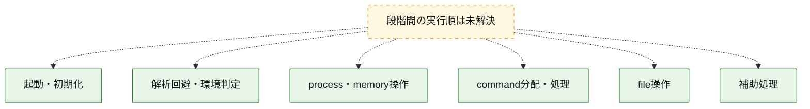
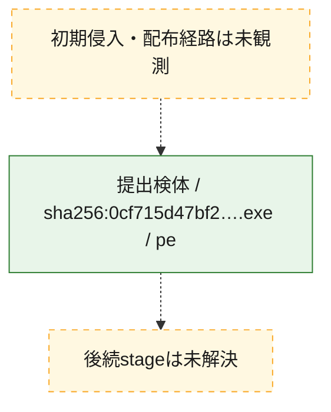
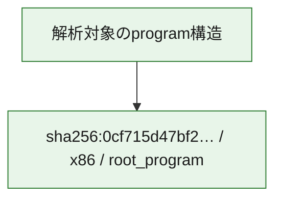

# 全体ロジック：0cf715d47bf25c5ca920110d091807c3fddb2bc14b45701fd2b36648e5463826

代表関数の静的証跡から、起動・初期化、解析回避・環境判定、process・memory操作、command分配・処理、file操作の処理群を確認しました。

## 読み方

- phaseの掲載順は解析上の整理順です。observed_call_edgesがない段階間の実行順を断定しません。
- 図の実線は静的に観測した関係、点線と黄色のノードは未観測・未解決の関係を示します。
- 図は静的な要約であり、動的実行を再現するものではありません。
- 詳細な関数解説とfingerprintは[STATIC-LOGIC.md](STATIC-LOGIC.md)を参照してください。

## 静的可視化

### 実行フロー

### 感染チェーン

### モジュール関係

## 処理段階

### 1. 起動・初期化

entry pointから初期化と後続処理への移行を確認します。
確度: `confirmed_static_function_evidence`

- `0cf715d47bf25c5ca920110d091807c3fddb2bc14b45701fd2b36648e5463826:ghidra:1400028ac` — 初期化と主要処理への分岐を行う入口関数です。 状態: `succeeded`、選定理由: `entry_point`, `meaningful_symbol_name`, `reviewed_call_centrality:22`, `role:entrypoint`

### 2. 解析回避・環境判定

debugger、sandbox、仮想環境、時間差などの判定を確認します。
確度: `confirmed_static_function_evidence`

- `0cf715d47bf25c5ca920110d091807c3fddb2bc14b45701fd2b36648e5463826:ghidra:140002d90` — debugger、仮想環境、sandbox、または時間差の確認に関係する関数です。 状態: `succeeded`、選定理由: `context_representative`, `reviewed_call_centrality:7`, `role:anti_analysis`

### 3. process・memory操作

process、thread、module、memory操作と実行移行を確認します。
確度: `confirmed_static_function_evidence`

- `0cf715d47bf25c5ca920110d091807c3fddb2bc14b45701fd2b36648e5463826:ghidra:140002b00` — process、thread、module、またはmemory操作に関係する関数です。 状態: `succeeded`、選定理由: `context_representative`, `reviewed_call_centrality:11`, `role:process_or_memory_operation`

### 4. command分配・処理

受信commandやtaskの解釈、分配、個別handlerへの移行を確認します。
確度: `confirmed_static_function_evidence`

- `0cf715d47bf25c5ca920110d091807c3fddb2bc14b45701fd2b36648e5463826:ghidra:140002730` — commandの解釈、分配、または個別処理を担当する関数です。 状態: `succeeded`、選定理由: `context_representative`, `reviewed_call_centrality:22`, `role:command_dispatch_or_handler`
- `0cf715d47bf25c5ca920110d091807c3fddb2bc14b45701fd2b36648e5463826:ghidra:140002d18` — commandの解釈、分配、または個別処理を担当する関数です。 状態: `succeeded`、選定理由: `context_representative`, `reviewed_call_centrality:2`, `role:command_dispatch_or_handler`
- `0cf715d47bf25c5ca920110d091807c3fddb2bc14b45701fd2b36648e5463826:ghidra:140002d54` — commandの解釈、分配、または個別処理を担当する関数です。 状態: `succeeded`、選定理由: `context_representative`, `reviewed_call_centrality:1`, `role:command_dispatch_or_handler`

### 5. file操作

fileやdirectoryの作成、読書き、削除を確認します。
確度: `confirmed_static_function_evidence`

- `0cf715d47bf25c5ca920110d091807c3fddb2bc14b45701fd2b36648e5463826:ghidra:1400034e8` — fileまたはdirectoryの読書き・管理に関係する関数です。 状態: `succeeded`、選定理由: `context_representative`, `reviewed_call_centrality:9`, `role:file_operation`

### 6. 補助処理

主要処理を支える一般内部関数またはlibrary処理を確認します。
確度: `confirmed_static_function_evidence`

- `0cf715d47bf25c5ca920110d091807c3fddb2bc14b45701fd2b36648e5463826:ghidra:140002580` — 検体内部の一般処理を実装する関数です。 状態: `succeeded`、選定理由: `context_representative`, `reviewed_call_centrality:7`
- `0cf715d47bf25c5ca920110d091807c3fddb2bc14b45701fd2b36648e5463826:ghidra:14000264c` — 検体内部の一般処理を実装する関数です。 状態: `succeeded`、選定理由: `context_representative`, `reviewed_call_centrality:20`
- `0cf715d47bf25c5ca920110d091807c3fddb2bc14b45701fd2b36648e5463826:ghidra:140002704` — 検体内部の一般処理を実装する関数です。 状態: `succeeded`、選定理由: `context_representative`, `reviewed_call_centrality:1`
- `0cf715d47bf25c5ca920110d091807c3fddb2bc14b45701fd2b36648e5463826:ghidra:140002714` — 検体内部の一般処理を実装する関数です。 状態: `succeeded`、選定理由: `context_representative`, `reviewed_call_centrality:6`
- `0cf715d47bf25c5ca920110d091807c3fddb2bc14b45701fd2b36648e5463826:ghidra:1400028c0` — 検体内部の一般処理を実装する関数です。 状態: `succeeded`、選定理由: `context_representative`, `reviewed_call_centrality:5`
- `0cf715d47bf25c5ca920110d091807c3fddb2bc14b45701fd2b36648e5463826:ghidra:1400028fc` — 検体内部の一般処理を実装する関数です。 状態: `succeeded`、選定理由: `context_representative`, `reviewed_call_centrality:6`
- `0cf715d47bf25c5ca920110d091807c3fddb2bc14b45701fd2b36648e5463826:ghidra:140002938` — 検体内部の一般処理を実装する関数です。 状態: `succeeded`、選定理由: `context_representative`, `reviewed_call_centrality:5`
- `0cf715d47bf25c5ca920110d091807c3fddb2bc14b45701fd2b36648e5463826:ghidra:1400029c4` — 検体内部の一般処理を実装する関数です。 状態: `succeeded`、選定理由: `context_representative`, `reviewed_call_centrality:4`
- `0cf715d47bf25c5ca920110d091807c3fddb2bc14b45701fd2b36648e5463826:ghidra:140002a5c` — 検体内部の一般処理を実装する関数です。 状態: `succeeded`、選定理由: `context_representative`, `reviewed_call_centrality:5`
- `0cf715d47bf25c5ca920110d091807c3fddb2bc14b45701fd2b36648e5463826:ghidra:140002a80` — 検体内部の一般処理を実装する関数です。 状態: `succeeded`、選定理由: `context_representative`, `reviewed_call_centrality:4`
- `0cf715d47bf25c5ca920110d091807c3fddb2bc14b45701fd2b36648e5463826:ghidra:140002aac` — 検体内部の一般処理を実装する関数です。 状態: `succeeded`、選定理由: `context_representative`, `reviewed_call_centrality:3`
- `0cf715d47bf25c5ca920110d091807c3fddb2bc14b45701fd2b36648e5463826:ghidra:140002ae8` — 検体内部の一般処理を実装する関数です。 状態: `succeeded`、選定理由: `context_representative`, `reviewed_call_centrality:2`
- `0cf715d47bf25c5ca920110d091807c3fddb2bc14b45701fd2b36648e5463826:ghidra:140002bf0` — 検体内部の一般処理を実装する関数です。 状態: `succeeded`、選定理由: `meaningful_symbol_name`, `reviewed_call_centrality:1`
- `0cf715d47bf25c5ca920110d091807c3fddb2bc14b45701fd2b36648e5463826:ghidra:140002c04` — 検体内部の一般処理を実装する関数です。 状態: `succeeded`、選定理由: `context_representative`, `reviewed_call_centrality:3`
- `0cf715d47bf25c5ca920110d091807c3fddb2bc14b45701fd2b36648e5463826:ghidra:140002c58` — 検体内部の一般処理を実装する関数です。 状態: `succeeded`、選定理由: `context_representative`, `reviewed_call_centrality:4`
- `0cf715d47bf25c5ca920110d091807c3fddb2bc14b45701fd2b36648e5463826:ghidra:140002cbc` — 検体内部の一般処理を実装する関数です。 状態: `succeeded`、選定理由: `context_representative`, `reviewed_call_centrality:4`
- `0cf715d47bf25c5ca920110d091807c3fddb2bc14b45701fd2b36648e5463826:ghidra:140003128` — 検体内部の一般処理を実装する関数です。 状態: `succeeded`、選定理由: `context_representative`, `reviewed_call_centrality:2`
- `0cf715d47bf25c5ca920110d091807c3fddb2bc14b45701fd2b36648e5463826:ghidra:1400032e4` — 検体内部の一般処理を実装する関数です。 状態: `succeeded`、選定理由: `context_representative`, `reviewed_call_centrality:1`
- `0cf715d47bf25c5ca920110d091807c3fddb2bc14b45701fd2b36648e5463826:ghidra:140003488` — 検体内部の一般処理を実装する関数です。 状態: `succeeded`、選定理由: `context_representative`, `reviewed_call_centrality:5`
- `0cf715d47bf25c5ca920110d091807c3fddb2bc14b45701fd2b36648e5463826:ghidra:140003664` — 検体内部の一般処理を実装する関数です。 状態: `succeeded`、選定理由: `context_representative`, `reviewed_call_centrality:3`
- `0cf715d47bf25c5ca920110d091807c3fddb2bc14b45701fd2b36648e5463826:ghidra:1400036d4` — 検体内部の一般処理を実装する関数です。 状態: `succeeded`、選定理由: `context_representative`, `reviewed_call_centrality:7`
- `0cf715d47bf25c5ca920110d091807c3fddb2bc14b45701fd2b36648e5463826:ghidra:1400037f4` — 検体内部の一般処理を実装する関数です。 状態: `succeeded`、選定理由: `context_representative`, `reviewed_call_centrality:4`
- `0cf715d47bf25c5ca920110d091807c3fddb2bc14b45701fd2b36648e5463826:ghidra:140003838` — 検体内部の一般処理を実装する関数です。 状態: `succeeded`、選定理由: `context_representative`, `reviewed_call_centrality:4`
- `0cf715d47bf25c5ca920110d091807c3fddb2bc14b45701fd2b36648e5463826:ghidra:1400038f4` — 検体内部の一般処理を実装する関数です。 状態: `succeeded`、選定理由: `context_representative`, `reviewed_call_centrality:1`
- `0cf715d47bf25c5ca920110d091807c3fddb2bc14b45701fd2b36648e5463826:ghidra:140003910` — 検体内部の一般処理を実装する関数です。 状態: `succeeded`、選定理由: `context_representative`, `reviewed_call_centrality:1`

## 観測したcall関係

- 代表関数間で直接解決できた呼出関係はありません。

## 解析範囲と制約

- 選定外関数は全体inventoryへ残しますが、関数本体の個別解説対象にはしていません。
- indirect call、難読化、packer、VM、壊れたcontrol flowによりcall関係が欠落する場合があります。
- 文書は静的解析に基づき、検体実行や外部通信による動的確認は行っていません。
