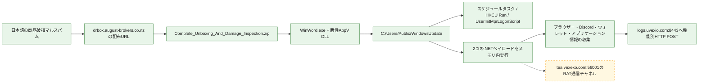
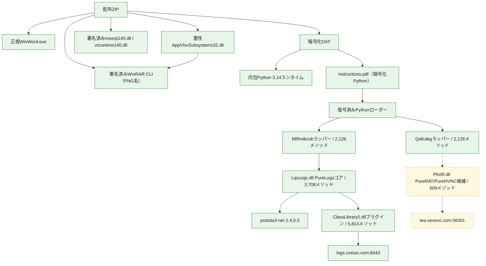

# 全体ロジック：日本語商品破損マルスパム

実線は静的証跡またはPCAPとプロセスの相関で確認した関係、点線は役割の帰属に制約が残る関係です。図は静的な要約であり、検体を動作させるものではありません。

## 静的可視化

### 実行フロー

```mermaid
flowchart TD
  user["受信者がZIP内のEXEを起動"] --> host["改名された正規WinWord.exe"]
  host --> sideload["AppVIsvSubsystems32.dllをサイドロード"]
  sideload --> cmd["cmd.exeでデコイ文書と展開コマンドを起動"]
  cmd --> decoy["`document.docx`を表示"]
  cmd --> rar["PNG名の署名済みWinRAR CLI"]
  rar --> stage["暗号化DATをPublic/WindowsUpdateへ展開"]
  stage --> py["Python 3.14 svchost.exeが`instructions.pdf`をXOR復号"]
  py --> init["ミューテックス・永続化・作業ディレクトリ隠蔽"]
  init --> worker_logs["ワーカー`KpTpQWPnqL`"]
  init --> worker_rat["ワーカー`FPuXKfGtMg`"]
  worker_logs --> clr_logs["AMSIパッチ後にPureLogsラッパーをCLRへ読み込み"]
  worker_rat --> clr_rat["AMSIパッチ後にPureRATラッパーをCLRへ読み込み"]
  clr_logs --> logs_core["PureLogsコアとプラグイン"]
  clr_rat -.-> rat_core["PureRAT/PureHVNC候補の終端"]
  classDef confirmed fill:#e8f5e9,stroke:#2e7d32,color:#1b1b1b
  classDef unresolved fill:#fff8e1,stroke:#f9a825,color:#1b1b1b,stroke-dasharray:5 5
  class user,host,sideload,cmd,decoy,rar,stage,py,init,worker_logs,worker_rat,clr_logs,clr_rat,logs_core confirmed
  class rat_core unresolved
```

### 感染チェーン



### モジュール関係



## 処理段階

1. 正規WinWord.exeのインポート解決を悪用して同じディレクトリの悪性AppV DLLへ実行を移します。
2. DLLはデコイ文書を開きつつ、署名済みWinRARで暗号化DATを`C:\Users\Public\WindowsUpdate`へ展開します。
3. 内包Pythonは命令スクリプトを復号し、多重起動防止、3経路の永続化、作業ディレクトリ隠蔽を行います。
4. 2つのワーカーが別々の.NETラッパーをXOR復号し、AMSIパッチ後のCLRへ読み込みます。
5. PureLogs側はHTTP APIでプラグイン取得・情報収集・送信を行います。RAT側は別のTLS通信チャネルを使います。

## 制約

- ネイティブDLLの巨大難読化領域はGhidraで関数境界とコールグラフを十分に復元できませんでした。
- PureLogs側のモジュール関係はプロセス、メモリモジュールの出現時刻、PCAPエンドポイントで確認しました。
- `Ptnifif.dll`のPureRAT/PureHVNC帰属は、ワーカー分岐とポート56001の相関を含む高確度判断ですが、製品版は未確定です。
