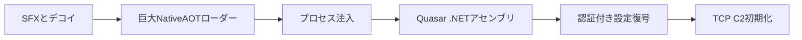

# 全体ロジックと比較

## 共通点と差分

| 比較軸 | 本ケース | 同一クラスタの別ケース |
|---|---|---|
| Quasar版 | `1.3.0.0` | `1.3.0.0` |
| C2 | `stopman[.]ooguy[.]com:2002` | 同一 |
| 暗号プロファイル | PBKDF2 50,000回 + AES-CBC + HMAC | 同一 |
| デコイ | `FilezoSetup.exe` | 別製品 |
| Tag | `Filezo 6.0.18` | 別値 |
| Mutex | `QSR_MUTEX_Pn3vK12dAfUdfWUHbL` | 別値 |

同一C2と設定暗号形式は強い関連性を示す。デコイ名だけの一致やQuasar一般機能だけではキャンペーンを統合しない。