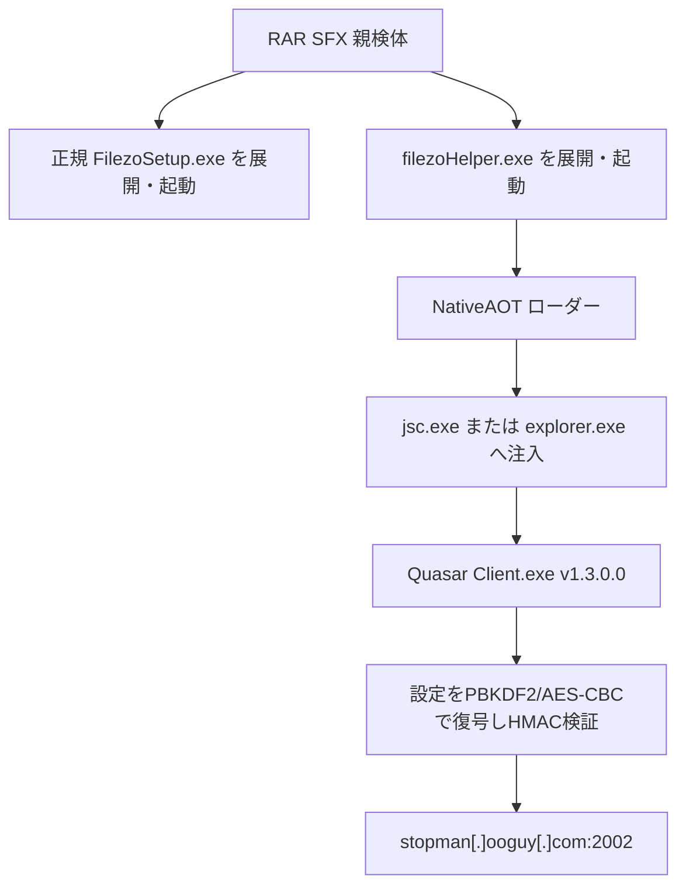

# QuasarRAT v1.3.0.0 ケース 439b73b5…

## 結論

大容量の RAR SFX は、正規インストーラと不自然にゼロ膨張された NativeAOT ローダーを順に起動する。公開サンドボックスのプロセスメモリから最終 .NET アセンブリを再構築し、QuasarRAT の `Settings` 初期化と暗号処理を静的に確認した。設定は HMAC-SHA256 の検証に成功した値だけを採用している。

- 親検体: `439b73b50c9e5c161b070a4eafa6a56ddb4ea6daf155b8dc06105028a7d04fd2`（Filezo 6.0.18 + CRACK.exe、94415039 bytes）
- 正規デコイ: `FilezoSetup.exe` / `0fe3572bf5da0edbfb08e075bdec38311d2c6c53b9b74fecc536e5db0e203ae9`
- NativeAOTローダー: `filezoHelper.exe` / `c821fb28fed309732043fdeb514a4bcc1a280cc91a69c805867b2f885d84c8f8`
- パディング除去後: `9d585a3f40e88c705fa9aaa4808596883633e28624371d4d8f56e465a1b2f37e`
- 最終アセンブリ: 公開サンドボックスの正規化SHA-256 `84d2424db9564b2c17deef74ae33ff86b07ba078e013531e1a55894d72b71972`、メモリ再構築SHA-256 `38825dd2ebe1f1942625dd3958890f9b51825aea3e65c20ca6deede1d5cda3d1`
- ファミリー／版: QuasarRAT `1.3.0.0`
- 静的C2: `stopman[.]ooguy[.]com:2002`
- 実行・C2接続: ローカルでは実施していない

## 感染・実行チェーン

## 復元設定

| 項目 | 値 |
|---|---|
| Version | `1.3.0.0` |
| Hosts | `stopman[.]ooguy[.]com:2002;` |
| SubDirectory | `SubDir` |
| InstallName | `Client.exe` |
| Mutex | `QSR_MUTEX_Pn3vK12dAfUdfWUHbL` |
| StartupName | `Quasar Client Startup` |
| Tag | `Filezo 6.0.18` |
| LogDirectoryName | `Logs` |
| KDF | PBKDF2-HMAC-SHA1、50,000回 |
| 暗号・認証 | AES-128-CBC + HMAC-SHA256 |

## キャンペーン比較

本ケースともう一方の v1.3.0.0 ケースは、C2、版、暗号salt、反復回数、インストール名、起動名、ログ名が一致する。Mutex と Tag、デコイ製品だけが異なる。このため「同一ビルダー設定または同一配布クラスタ」は高信頼度だが、運用者・攻撃者の同一性までは断定しない。

詳細な関数ロジックは [STATIC-LOGIC.md](STATIC-LOGIC.md)、比較図は [OVERALL-LOGIC.md](OVERALL-LOGIC.md) を参照すること。