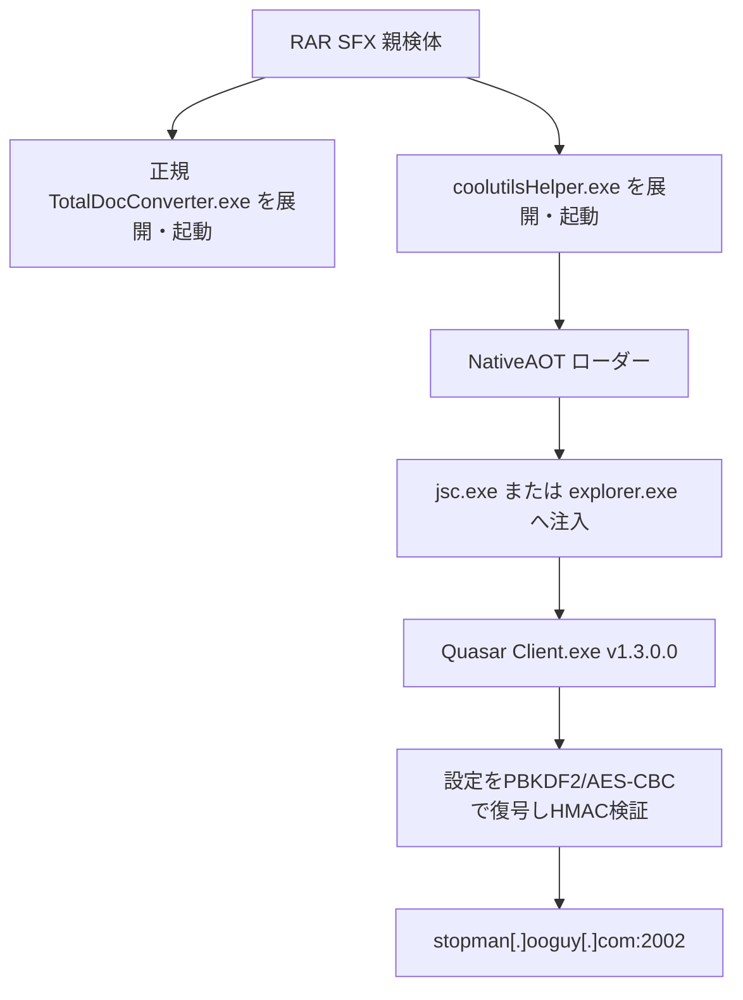

# QuasarRAT v1.3.0.0 ケース c40348ae…

## 結論

大容量の RAR SFX は、正規インストーラと不自然にゼロ膨張された NativeAOT ローダーを順に起動する。公開サンドボックスのプロセスメモリから最終 .NET アセンブリを再構築し、QuasarRAT の `Settings` 初期化と暗号処理を静的に確認した。設定は HMAC-SHA256 の検証に成功した値だけを採用している。

- 親検体: `c40348ae2d031c27d318c831189a2a9b6de0c453f756b8d94c0a3bca4b93c627`（TotalDocConverter.exe、91624879 bytes）
- 正規デコイ: `TotalDocConverter.exe` / `c91113a0dc7877aff2d5ab891e04438ee460ee240d1a9e5575ad92bf6edf6ac0`
- NativeAOTローダー: `coolutilsHelper.exe` / `cc59f17e3305c0fc802eff31cea9d02109dc1ce143f3f1ed7080c81683623059`
- パディング除去後: `10f07e2deac1c83b6295c8541e5ef6ffb41a3680d25b9f5925869d7029ef43b1`
- 最終アセンブリ: メモリ再構築SHA-256 `ebfc2e97c6a09883d511d5f52796c853349d98917d00fe05774422bc0f1e262a`（356,864 bytes）
- ファミリー／版: QuasarRAT `1.3.0.0`
- 静的C2: `stopman[.]ooguy[.]com:2002`
- 実行・C2接続: ローカルでは実施していない

## 感染・実行チェーン

## 復元設定

| 項目 | 値 |
|---|---|
| Version | `1.3.0.0` |
| Hosts | `stopman[.]ooguy[.]com:2002;` |
| SubDirectory | `SubDir` |
| InstallName | `Client.exe` |
| Mutex | `QSR_MUTEX_jhVzJYDQ78zcDQsWfc` |
| StartupName | `Quasar Client Startup` |
| Tag | `Coolutils Total Doc Converter 5.1.0.403` |
| LogDirectoryName | `Logs` |
| KDF | PBKDF2-HMAC-SHA1、50,000回 |
| 暗号・認証 | AES-128-CBC + HMAC-SHA256 |

## キャンペーン比較

本ケースともう一方の v1.3.0.0 ケースは、C2、版、暗号salt、反復回数、インストール名、起動名、ログ名が一致する。Mutex と Tag、デコイ製品だけが異なる。このため「同一ビルダー設定または同一配布クラスタ」は高信頼度だが、運用者・攻撃者の同一性までは断定しない。

詳細な関数ロジックは [STATIC-LOGIC.md](STATIC-LOGIC.md)、比較図は [OVERALL-LOGIC.md](OVERALL-LOGIC.md) を参照すること。