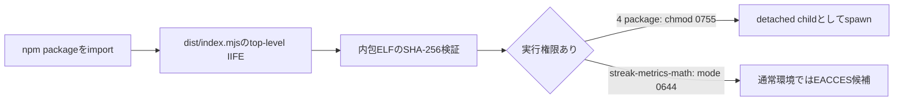
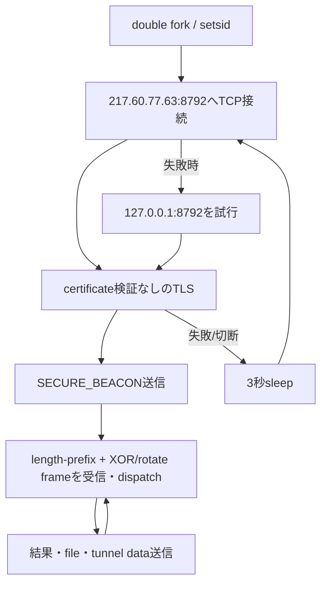
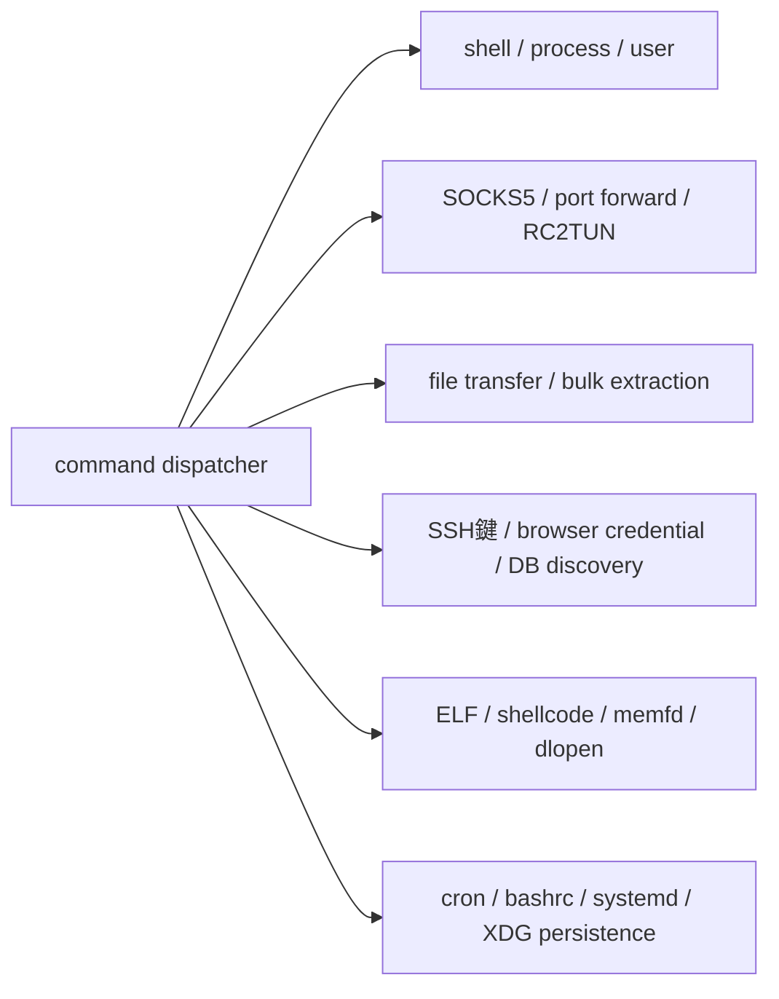

# RedC2全体ロジック

## 悪性process挙動と実command line（最重要）

```text
node → package内ELF → fork → setsid → fork → RedC2 daemon
                                         ├─ /bin/sh -c → curl／system utility／download payload
                                         ├─ fork子 → memfd ELF／RWX shellcode／対話shell
                                         └─ pthread → SOCKS5／port-forward／tunnel relay
```

operator command受信前にも、TLS sessionごとに次を起動します。

```sh
curl -s --connect-timeout 2 --max-time 3 http://api.ipify.org 2>/dev/null
```

未知inputとdispatcher生成commandの共通最終形は次です。

```text
execl("/bin/sh", "sh", "-c", "cd '<current-working-directory>' 2>/dev/null && <decoded-or-generated-command>", NULL)
```

個別の実command templateは[`PROCESS-COMMAND-ANALYSIS.md`](PROCESS-COMMAND-ANALYSIS.md)に記録しています。serverが最後に選択したcommandは固定されておらず、live C2へ接触していないため未取得です。

## 配布から起動



## C2のライフサイクル



## capability分岐



command channelはTLS/8792、remote ELF／shellcode取得はHTTP/8888、`/dataextract`は平文HTTP/8060を使用します。`/download`と`/fetch`はLitterbox HTTPS uploadも使用します。

loaderのbenign calendar関数はELFを必要とせずJavaScriptだけで動き、`_ensureEngine()`も常に`true`を返します。「native accelerator」は起動を正当化する偽装です。

process単位の挙動、全C2 commandから生成されるshell／thread／payload、`/redshell ... -inject`が実際にはstandalone実行である点は`PROCESS-COMMAND-ANALYSIS.md`を参照してください。
