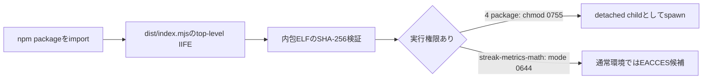
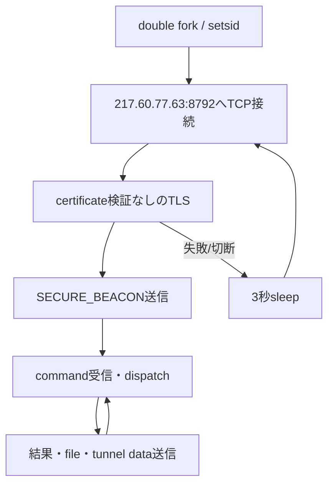
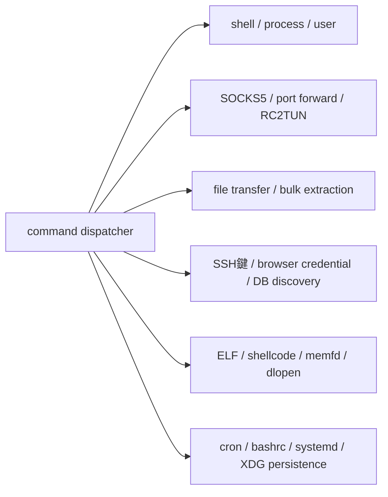

# RedC2全体ロジック

## 配布から起動

```mermaid
flowchart LR
    A["npm packageをimport"] --> B["dist/index.mjsのtop-level IIFE"]
    B --> C["内包ELFのSHA-256検証"]
    C --> D{"実行権限あり"}
    D -->|"4 package: chmod 0755"| E["detached childとしてspawn"]
    D -->|"streak-metrics-math: mode 0644"| F["通常環境ではEACCES候補"]
```

## C2のライフサイクル

```mermaid
flowchart TD
    A["double fork / setsid"] --> B["217.60.77.63:8792へTCP接続"]
    B --> C["certificate検証なしのTLS"]
    C --> D["SECURE_BEACON送信"]
    D --> E["command受信・dispatch"]
    E --> F["結果・file・tunnel data送信"]
    F --> E
    C -->|"失敗/切断"| G["3秒sleep"]
    G --> B
```

## capability分岐

```mermaid
flowchart LR
    D["command dispatcher"] --> S["shell / process / user"]
    D --> N["SOCKS5 / port forward / RC2TUN"]
    D --> F["file transfer / bulk extraction"]
    D --> C["SSH鍵 / browser credential / DB discovery"]
    D --> X["ELF / shellcode / memfd / dlopen"]
    D --> P["cron / bashrc / systemd / XDG persistence"]
```

loaderのbenign calendar関数はELFを必要とせずJavaScriptだけで動き、`_ensureEngine()`も常に`true`を返します。「native accelerator」は起動を正当化する偽装です。
